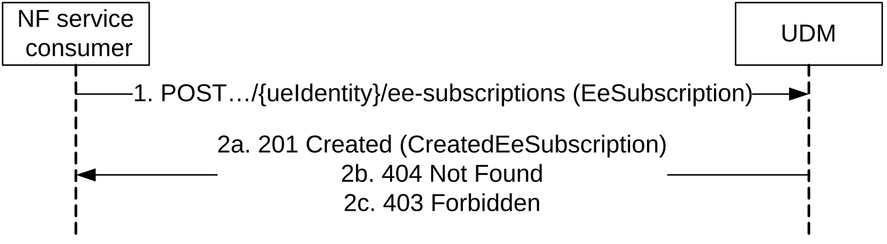
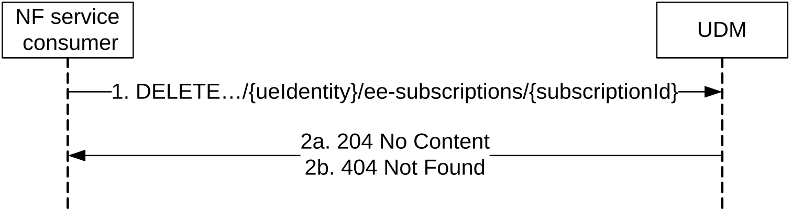
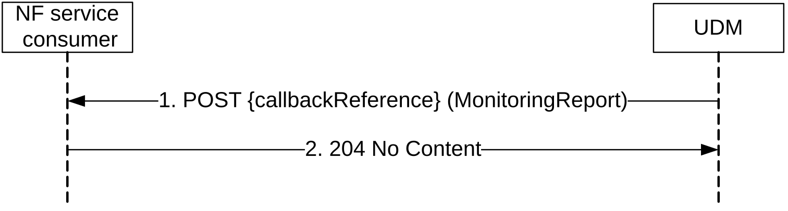
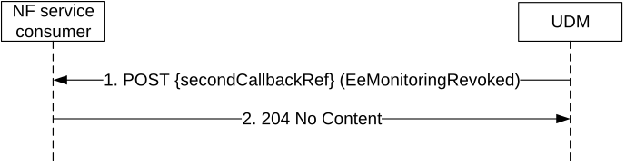
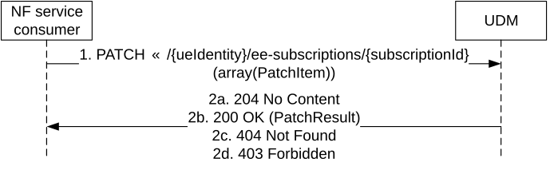
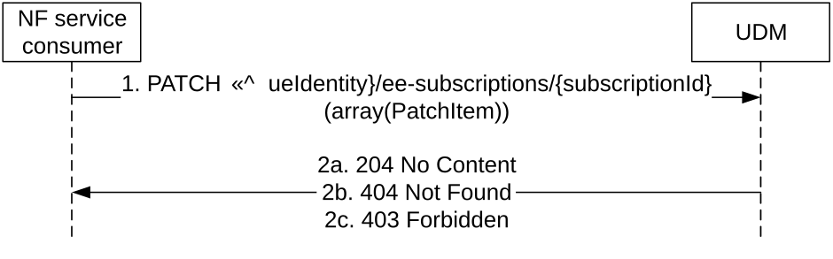

# 5.5 Nudm_EventExposure Service

## 5.5.1 Service Description

See TS 23.501 \[2\] table 7.2.5-1.

## 5.5.2 Service Operations

### 5.5.2.1 Introduction

For the Nudm_EventExposure service the following service operations are defined:

\- Subscribe

\- Unsubscribe

\- Notify

\- ModifySubscription

The Nudm_EventExposure service is used by consumer NFs (e.g. NEF) to subscribe to notifications of event occurrence by means of the Subscribe service operation. For events that can be detected by the AMF, the UDM makes use of the appropriate AMF service operation to subscribe on behalf of the consumer NF (e.g. NEF).

The Nudm_EventExposure service is also used by the consumer NFs (e.g. NEF) that have previously subscribed to notificatios, to unsubscribe by means of the Unsubscribe service operation. For events that can be detected by the AMF, the UDM makes use of the appropriate AMF service operation to unsubscribe on behalf of the consumer NF (e.g. NEF).

The Nudm_EventExposure service is also used by the subscribed consumer NFs (e.g. NEF) to get notified by the UDM when a subscribed event occurs at the UDM by means of the Notify service operation. For subscribed events that can occur at the AMF, the consumer NF (e.g. NEF) makes use of the corresponding AMF service operation to get notified by the AMF directly without UDM involvement.

The Nudm_EventExposure service is also used by the subscribed consumer NFs (e.g. NEF) to modify an existing subscription by means of the ModifySubscription service operation.

For details see TS 23.502 \[3\] clause 4.15 and TS 33.535 \[55\] clause 6.2.1.

### 5.5.2.2 Subscribe

#### 5.5.2.2.1 General

The following procedures using the Subscribe service operation are supported:

\- Subscribe to Notification of event occurrence

#### 5.5.2.2.2 Subscription to Notification of event occurrence

Figure 5.5.2.2.2-1 shows a scenario where the NF service consumer sends a request to the UDM to subscribe to notifications of event occurrence (see also TS 23.502 \[3\] figure 4.15.3.2.2-1 step 1 and TS 23.502 \[3\] Figure 4.15.3.2.3b-1 step 1). The request contains a callback URI, the type of event that is monitored and additional information e.g. event filters and reporting options.

Figure 5.5.2.2.2-1: NF service consumer subscribes to notifications

1\. The NF service consumer sends a POST request to the parent resource (collection of subscriptions) (.../{ueIdentity}/ee-subscriptions), to create a subscription as present in message body. The values ueIdentity shall take are specified in Table 6.4.3.2.2-1. The request may contain an expiry time, suggested by the NF Service Consumer, representing the time upto which the subscription is desired to be kept active and the time after which the subscribed event(s) shall stop generating notifications, the indication on whether the subscription applies also to EPC.

If MTC Provider information and/or AF ID are received in the request, the UDM shall check whether the MTC Provider and/or the AF is allowed to perform this operation for the UE or for the group of UEs or Any UE which is indicated in the Resource URI variable ueIdentity; otherwise, the UDM shall skip the MTC provider and/or AF authorization check.

2a. On success, the UDM responds with "201 Created" with the message body containing a representation of the created subscription. The Location HTTP header shall contain the URI of the created subscription.

> If the event subscription was for a group of UEs:

\- The "maxNumOfReports" in the "reportingOptions" IE shall be applicable to each UE in the group;

\- The UDM shall return the number of UEs in that group in the "numberOfUes" IE.

> The NF service consumer shall keep track of the maximum number of reports reported for each UE in the event report and when "maxNumOfReports\*numberOfUes" limit is reached, the NF service consumer shall initiate the unsubscription of the notification towards the UDM (see clause 5.5.2.3.2).
>
> If the event subscription was for a list events, the "reportingOptions" attribute (containing, e.g., "reportMode", "maxNumOfReports",…) shall be applicable to each event in the list. The NF service consumer shall keep track of the maximum number of reports reported for each event in the event report and when "maxNumOfReports\*number of events" limit is reached, the NF service consumer shall initiate the unsubscription of the notification towards the UDM (see clause 5.5.2.3.2). If the "reportMode" included in "reportingOptions" is not applicable (see clause 6.4.6.3.7) to all events in the list, the request shall be rejected with error "400 Bad Request", and with ProblemDetails containing application error set to cause value "OPTIONAL_IE_INCORRECT".
>
> The response, based on operator policy, may contain the expiry time, as determined by the UDM, after which the subscription becomes invalid. Before the subscription is going to expire, if the NF Service Consumer wants to keep receiving notifications, it shall modify the subscription in the UDM with a new expiry time. The NF Service Producer shall not provide the same expiry time for many subscriptions in order to avoid all of them expiring and recreating the subscription at the same time. If the expiry time is not included in the response, the NF Service Consumer shall not associate an expiry time for the subscription.
>
> If the indication on whether the subscription applies also to EPC is included and set to true in the request, the response shall include the indication on whether the subscription was also successful in EPC domain. If the subscription also applies to the EPC domain, the only the Event Types below shall apply to the EPC domain,

\- The event type "LOSS_OF_CONNECTIVITY", it shall be map to event type "LOSS_OF_CONNECTIVITY" on Nhss

\- The event type "UE_REACHABILITY_FOR_DATA" and the reportCfg in reachabilityForDataCfg set to "DIRECT_REPORT", it shall be mapped to event type "UE_REACHABILITY_FOR_DATA" on Nhss

\- The event type "LOCATION_REPORTING", and dddTrafficDes or Dnn is not included in the request, it shall be mapped to event type "LOCATION_REPORTING" on Nhss

\- The event type "COMMUNICATION_FAILURE", it shall be mapped to event type "COMMUNICATION_FAILURE" on Nhss

\- The event type "AVAILABILITY_AFTER_DDN_FAILURE", it shall be mapped to event type "AVAILABILITY_AFTER_DDN_FAILURE" on Nhss

\- The event type "PDN_CONNECTIVITY_STATUS", it shall be mapped to event type "PDN_CONNECTIVITY_STATUS" on Nhss

\- The event type "UE_REACHABILITY_FOR_SMS" and reachabilityForSmsCfg set to "REACHABILITY_FOR_SMS_OVER_NAS", it shall be mapped to event type "UE_REACHABILITY_FOR_SMS" on Nhss

\- The event type "UE_MEMORY_AVAILABLE_FOR_SMS", it shall be mapped to event type " UE_MEMORY_AVAILABLE_FOR_SMS " on Nhss

> If some of the requested monitoring configurations fails, the response may include the failedMonitoringConfigs to indicate the failed cause of the failed monitoring configurations.
>
> If some of the requested monitoring configurations fails in the EPC domain or the EE subscription fails in the EPC domain, the response may include the failedMoniConfigsEPC to indicate the failed cause of the failed monitoring configurations or the failed cause of the EE subscription in the EPC domain.
>
> If the NF Service Consumer has included the immediateFlag with value as "true" in the event subscription for an individual UE and the event requested for immediate reporting is reported by the UDM (e.g. "CHANGE_OF_SUPI_PEI_ASSOCIATION" or "ROAMING_STATUS"), the UDM may include the current status of the event if available in the response.
>
> If the NF Service Consumer has included the immediateFlag with value as "true" in the event subscription for an individual UE and the event requested for immediate reporting is reported by the AMF (e.g. LOCATION_REPORT) and the NF service consumer has indicated supporting of "IERSR" feature (see clause 6.4.8), the UDM shall indicate the support of "IERSR" feature when subscribing to the event on the AMF (see clause 6.2.8 of TS 29.518 \[36\]). UDM shall include the current status of the event if received from the AMF in subscription creation response.
>
> If the NF Service Consumer has included the immediateFlag with value as "true" in the event subscription for an individual UE, the indication on whether the subscription applies also to EPC is included and set to "true" in the request and the NF service consumer has indicated supporting of "IERSR" feature (see clause 6.4.8), the UDM shall indicate the support of "ERIR" feature when subscribing to the event on the HSS (see clause 6.4.8 of TS 29.563 \[62\]). UDM shall include the current status of the event in EPC if received from the HSS in subscription creation response.

NOTE: IERSR feature is not applicable to events detected by the SMF.

If the UDM supports the EneNA feature (see clause 6.2.8), the event is detected by a remote NF (e.g. AMF) and directly notified to the NF consumer (e.g. NWDAF) and the "notifFlag" attribute is included in the request by e.g. the NWDAF or DCCF, the UDM shall forward the "notifFlag" attribute to the remote NF (e.g. AMF). Additionally, if the UDM also supports the ENAPH3 feature (see clause 6.2.8) and the NF service consumer also included event muting instructions in the request, the UDM shall also forward the event muting instructions to the remote NF, if the subscription creation request is accepted by the remote NF, the UDM may also forward the following information to the NF service consumer in the response if it is received:

\- the maximum number of notifications that the remote NF expects to be able to store for the subscription;

\- an estimate of the duration for which notifications can be buffered.

2b. If the user does not exist, HTTP status code "404 Not Found" shall be returned including additional error information in the response body (in the "ProblemDetails" element).

2c. If there is no valid subscription data for the UE, i.e. based on the UE's subscription information monitoring of the requested EventType is not allowed, or the requested EventType is not supported, or when MTC Provider or AF are not allowed to perform this operation for the UE, HTTP status code "403 Forbidden" shall be returned including additional error information in the response body (in the "ProblemDetails" element).

> If the UDM supports the EneNA and ENAPH3 features (see clause 6.2.8), the NF service consumer sets the "notifFlag" attribute to "DEACTIVATE" and event muting instructions in the request, but the remote NF cannot accept the received instructions and reject the request with a 403 Forbidden response and the application error "MUTING_EXC_INSTR_NOT_ACCEPTED", the UDM shall forward the error response to the NF service consumer.

On failure, the appropriate HTTP status code indicating the error shall be returned and appropriate additional error information should be returned in the POST response body.

#### 5.5.2.2.3 Void

### 5.5.2.3 Unsubscribe

#### 5.5.2.3.1 General

The following procedures using the Unsubscribe service operation are supported:

\- Unsubscribe to Notifications of event occurrence

#### 5.5.2.3.2 Unsubscribe to notifications of event occurrence

Figure 5.5.2.3.2-1 shows a scenario where the NF service consumer sends a request to the UDM to unsubscribe from notifications of event occurrence. The request contains the URI previously received in the Location HTTP header of the response to the subscription.

Figure 5.5.2.3.2-1: NF service consumer unsubscribes to notifications

1\. The NF service consumer sends a DELETE request to the resource identified by the URI previously received during subscription creation.

2a. On success, the UDM responds with "204 No Content".

2b. If there is no valid subscription available (e.g. due to an unknown SubscriptionId value), HTTP status code "404 Not Found" shall be returned including additional error information in the response body (in the "ProblemDetails" element).

On failure, the appropriate HTTP status code indicating the error shall be returned and appropriate additional error information should be returned in the DELETE response body.

### 5.5.2.4 Notify

#### 5.5.2.4.1 General

The following procedures using the Notify service operation are supported:

\- Event Occurrence Notification

\- Monitoring Revocation Notification

\- UDR-initiated Data Restoration Notification

#### 5.5.2.4.2 Event Occurrence Notification

Figure 5.5.2.4.2-1 shows a scenario where the UDM notifies the NF service consumer (that has subscribed to receive such notification) about occurrence of an event (see also TS 23.502 \[3\] figure 4.15.3.2.2-1 step 4a), or the current status of subscribed events for immediate reporting if event reports cannot be included in the subscription response (i.e. the IERSR/ERIR features are not supported end-to-end by NEF/UDM/AMF/HSS). The request contains the Reference IDs as previously received in the EeSubscription (see clause 6.4.6.2.2).

Figure 5.5.2.4.2-1: Event Occurrence Notification

1\. The UDM sends a POST request to the callbackReference URI as provided by the NF service consumer during the subscription, the request shall include in each report the Reference ID of the associated monitoring configuration.

2\. The NF Service Consumer responds with "204 No Content".

On failure, the appropriate HTTP status code indicating the error shall be returned and appropriate additional error information should be returned in the POST response body.

#### 5.5.2.4.3 Monitoring Revocation Notification

Figure 5.5.2.4.3-1 shows a scenario where the UDM notifies the NF service consumer (that has subscribed to receive such notification) about revocation of the monitoring events due to some reasons (e.g. the revocation of the authorisation on AF or MTC Provider for certain events of the UE, or group member UE(s) are removed from a group subscription). The request contains the secondCallbackRef URI as previously received in the EeSubscription (see clause 6.4.6.2.2).

Figure 5.5.2.4.3-1: Monitoring Revocation Notification

1\. The UDM sends a POST request to the secondCallbackRef as provided by the NF service consumer during the subscription, the request shall include the revoked monitoring events due to some reasons (e.g. the revocation of the authorisation on AF or MTC Provider for certain events of the UE).

If the revocation is triggered by network initiated explicit event notification subscription cancel procedure (see clause 4.15.3.2.11 of TS 23.502 \[3\]), the request body shall contain either:

\- a list of group member UE(s) that are excluded from the group subscription and the revocation cause shall be set to "EXCLUDED_FROM_GROUP", or

\- a GPSI which is not longer associated to an individual subscription and the revocation cause shall be set to "GPSI_REMOVED".

2\. The NF Service Consumer responds with "204 No Content".

On failure, the appropriate HTTP status code indicating the error shall be returned and appropriate additional error information should be returned in the POST response body.

#### 5.5.2.4.4 UDR-initiated Data Restoration

Figure 5.5.2.4.4-1 shows a scenario where the UDM notifies the NF Service Consumer (e.g. a NEF) about the need to restore subscription-data due to a potential data-loss event occurred at the UDR. The request contains identities representing those UEs potentially affected by such event.

Figure 5.5.2.4.4-1: UDR-initiated Data Restoration

1\. The UDM (after receiving a notification from UDR about a potential data-loss event) sends a POST request to the dataRestorationCallbackUri; such callback URI may be provided by the NF service consumer during the registration, or dynamically discovered by UDM by querying the NRF for the NF Profile of the NF Service Consumer.

2a. On success, the NF Service Consumer responds with "204 No Content".

2b. On failure or redirection, one of the appropriate HTTP status codes listed in Table 6.4.5.4-3 shall be returned. For a 4xx/5xx response, the message body may contain appropriate additional error information.

### 5.5.2.5 ModifySubscription

#### 5.5.2.5.1 General

The following procedures using the ModifySubscription service operation are supported:

\- Modification of an EE-Subscription to notification of events

\- Remove or add group member UE(s) for a group subscription

#### 5.5.2.5.2 Modification of a subscription

The service operation is invoked by a NF Service Consumer, e.g. NEF, towards the UDM, when it needs to modify an existing subscription previously created by itself at the UDM.

The NF Service Consumer shall modify the subscription by using HTTP method PATCH with the URI of the individual subscription resource (see clause 6.4.3.3) to be modified.

Figure 5.5.2.5.2-1: NF service consumer updates subscription

1\. The NF service consumer (e.g. NEF) shall send a PATCH request to the resource representing a subscription. The modification may be for the events subscribed or for updating the event report options.

2a. On success, the request is accepted, and all the modification instructions in the PATCH request have been implemented, the UDM shall respond with "204 No Content".

2b. On success, the request is accepted, but some of the modification instructions in the PATCH request have been discarded, the UDM shall respond with "200 OK" including PatchResult to indicate the failed modifications.

2c. If the resource does not exist e.g. the subscriptionId cannot be found, HTTP status code "404 Not Found" should be returned including additional error information in the response body (in the "ProblemDetails" element).

2d. If the modification can't be accepted, HTTP status code "403 Forbidden" should be returned including additional error information in the response body (in the "ProblemDetails" element).

On failure, the appropriate HTTP status code indicating the error shall be returned and appropriate additional error information should be returned in the PATCH response body.

#### 5.5.2.5.3 Remove or add group member UE(s) for a group subscription

The service operation is invoked by a NF Service Consumer, e.g. NEF, towards the UDM, to remove or add group member UE(s) for the group subscription.

The NF Service Consumer shall modify the subscription by using HTTP method PATCH with the URI of the individual subscription resource (see clause 6.4.3.3) to be modified.

Figure 5.5.2.5.3-1: NF service consumer updates subscription

1\. The NF service consumer (e.g. NEF) shall send a PATCH request to the resource representing a group subscription and the request body shall contain a PatchItem with the JSON pointer to the "/excludeGpsiList" or the "/includeGpsiList" object in the subscription.

2a. On success, the request is accepted, and all the modification instructions in the PATCH request have been implemented, the UDM shall respond with "204 No Content".

2b. If the resource does not exist e.g. the subscriptionId cannot be found, HTTP status code "404 Not Found" should be returned including additional error information in the response body (in the "ProblemDetails" element).

2c. If the modification can't be accepted, HTTP status code "403 Forbidden" should be returned including additional error information in the response body (in the "ProblemDetails" element).

On failure, the appropriate HTTP status code indicating the error shall be returned and appropriate additional error information should be returned in the PATCH response body.
