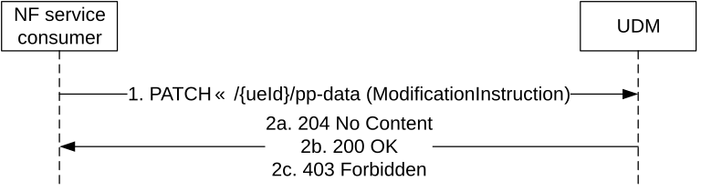
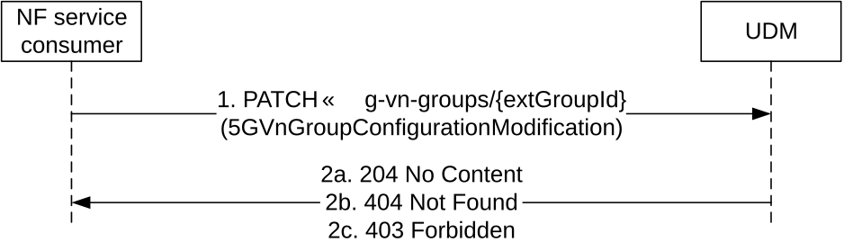
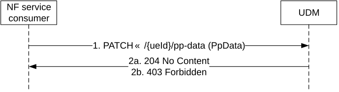
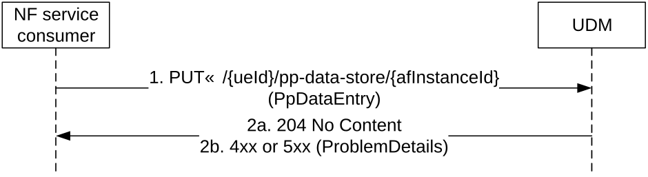
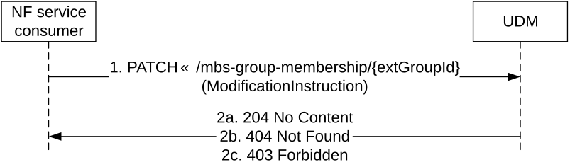

# 5.6.2.2 Update

## 5.6.2.2.1 General

The following procedures using the Update service operation are supported:

\- Subscription data update

\- SoR Information update

\- 5G VN Group modification

\- Parameter Provisioning Data Entry per AF update

\- 5G-MBS-Group modification

## 5.6.2.2.2 Subscription data update

Figure 5.6.2.2.2-1 shows a scenario where the NF service consumer (e.g. NEF, AMF) sends a request to the UDM to update a UE's subscription data (see TS 23.502 \[3\] figure 4.15.6.2-1 step 2 and also TS 23.273 \[38\] Figure 6.12.1-1 step 2). The request contains the identifier of the UE's parameter provision data ( .../{ueId}/pp-data) and the modification instructions. The values ueId shall take are specified in Table 6.5.3.2.2-1.

Figure 5.6.2.2.2-1: NF service consumer updates subscription data

1\. The NF service consumer (e.g. NEF, AMF) sends a PATCH request to the resource that represents a UE's modifiable subscription data.

The UDM shall check if the request is authorized:

\- if configured to perform AF authorization check and if AF Instance ID is received in the request, the UDM shall check whether the AF is allowed to perform this operation for the UE; otherwise, the UDM shall skip the AF authorization check;

\- if configured to perform MTC Provider authorization check and if MTC Provider information is received in the request, the UDM shall check whether the MTC Provider is allowed to perform this operation for the UE; otherwise, the UDM shall skip the MTC Provider authorization check.

2a. The UDM responds with "204 No Content".

2b. Upon partial success, UDM responds with "200 OK".

> If the request includes the "Expected UE Behaviour Data" parameters, then, based on local configuration, the UDM may determine if there are any requirements in the UDM with respect to threshold conditions that need to be met by the received parameter before the UDM stores the parameter in, e.g. the UDR. If the threshold criteria is satisfied, the UDM may continue to process the request. If the threshold criteria is not satisfied, UDM may return partial success with a related cause value e.g. "confidence level not sufficient" or "accuracy level not sufficient".

2c. If MTC Provider or AF are not allowed to perform this operation for the UE, HTTP status code "403 Forbidden" shall be returned including additional error information in the response body (in the "ProblemDetails" element).

NOTE: Upon reception of an update or removal of maximum latency, maximum response time or DL Buffering Suggested Packet Count, UDM may need to adjust the value of active time and/or periodic registration timer and/or DL Buffering Suggested Packet Count and the UDM shall notify AMF and/or SMF if the values are updated (see clause 4.15.6.3a of TS 23.502 \[3\]).

On failure, the appropriate HTTP status code indicating the error shall be returned and appropriate additional error information should be returned in the PATCH response body.

## 5.6.2.2.3 5G VN Group modification

Figure 5.6.2.2.3-1 shows a scenario where the NF service consumer sends a request to the UDM to modify an external group id's group data. The request contains the external group identifier of the group and the modification instructions.

Figure 5.6.2.2.3-1: NF service consumer modifies a 5G VN Group

1\. The NF service consumer sends a PATCH request to the resource that represents a 5G VN Group.

If MTC Provider information and/or AF ID are received in the request, the UDM shall check whether the MTC Provider and/or the AF is allowed to perform this operation for the UE; otherwise, the UDM shall skip the MTC provider and/or AF authorization check.

2a. On success, the UDM responds with "204 No Content".

2b. If the external group id does not exist in the UDM, HTTP status code "404 Not Found" shall be returned including additional error information in the response body (in the "ProblemDetails" element).

2c. If MTC Provider or AF are not allowed to perform this operation for the UE, HTTP status code "403 Forbidden" shall be returned including additional error information in the response body (in the "ProblemDetails" element).

On failure, the appropriate HTTP status code indicating the error shall be returned and appropriate additional error information should be returned in the PATCH response body.

## 5.6.2.2.4 SoR Information update

Figure 5.6.2.2.4-1 shows a scenario where the NF service consumer (e.g. SOR-AF) sends updated SoR Information for a UE to the UDM to trigger the sending of this updated SoR Information to the UE via the AMF (as per Annex C.1.1, C.1.2 and C.3 of TS 23.122 \[20\]). The request contains the identifier of the UE's parameter provision data ( .../{ueId}/pp-data), the SUPI in this case, and the modification instructions.

Figure 5.6.2.2.4-1: NF service consumer updates SoR Information for a UE

1\. The NF service consumer (e.g. SOR-AF) sends a PATCH request to the resource that represents a UE's modifiable subscription data, containing updated Steering of Roaming Information (i.e. new list of preferred PLMN/access technology combinations, the SOR-CMCI, SOR-SNPN-SI, SOR-SNPN-SI-LS, if any, and the "Store the SOR-CMCI in the ME" indicator, if any, or a secured packet for a UE).

The UDM, after contacting the AUSF to perform integrity protection and getting the related information (sorMacIausf and coutersor), shall immediately convey this updated SoR Information to the concerned UE by triggering a notification to the registered AMF (that has subscribed to receive notifications on change of AccessAndMobilitySubscriptionData) for the UE, if any, as per annex C.3 of TS 23.122 \[20\]. Once the subscribing AMF is notified (or when no AMF has subscribed), the UDM shall delete the updated SorInfo and shall not send it as part of AccessAndMobilitySubscriptionData to an NF (e.g. AMF) retrieving the AccessAndMobilitySubscriptionData.

2a. The UDM responds with "204 No Content".

2b. If the operation cannot be authorized due to e.g UE isn't registered in the network, HTTP status code "403 Forbidden" should be returned including additional error information in the response body (in "ProblemDetails" element).

On failure, the appropriate HTTP status code indicating the error shall be returned and appropriate additional error information should be returned in the PATCH response body.

## 5.6.2.2.5 Parameter Provisioning Data Entry per AF update

Figure 5.6.2.2.5-1 shows a scenario where the NF service consumer (e.g. NEF) sends a request to the UDM to update the Parameter Provisioning Data entry for a certain AF, which will influence the UE's subscription data (see TS 23.502 \[3\] figure 4.15.6.2-1 step 2 and also TS 23.273 \[38\] Figure 6.12.1-1 step 2). The NF consumer shall send a PUT request towards the resource URI of an existing Parameter Provisioning Data entry for the AF (.../{ueId}/pp-data-store/{afInstanceId}) with the new value in the request body. The URI variants ueId and afInstanceId shall take values as specified in Table 6.5.3.4.2-1.

Figure 5.6.2.2.5-1: NF service consumer updates a Parameter Provisioning Data Entry per AF

1\. The NF service consumer (e.g. NEF) sends a PUT request to the resource that represents an existing Parameter Provisioning Data entry for the AF identified by the afInstnaceId. The request body shall contain a PpDataEntry object representing the new value of the resource.
If the request is to configure slice usage control information, the query parameterue ueId shall indicate the UE (e.g. a group of UE or any UE) that the network slice can serve.

The UDM shall check whether the AF is allowed to perform this operation:

\- if MTC Provider information is received in the request, the UDM shall check whether the MTC Provider is allowed to perform this operation for the UE; otherwise, the UDM shall skip the authorization check.

\- if slice usage control information is received in the request, the UDM shall check whether AF is allowed to configure the slice usage control information; otherwise, the UDM shall skip the authorization check.

2a. The UDM responds with "204 No Content".

2b. If MTC Provider or AF are not allowed to perform this operation for the UE, HTTP status code "403 Forbidden" shall be returned including additional error information in the response body (in the "ProblemDetails" element).

NOTE: Upon reception of an update or removal of maximum latency, maximum response time or DL Buffering Suggested Packet Count, UDM may need to adjust the value of active time and/or periodic registration timer and/or DL Buffering Suggested Packet Count and the UDM shall notify AMF and/or SMF if the values are updated (see clause 4.15.6.3a of TS 23.502 \[3\]).

On failure, the appropriate HTTP status code indicating the error shall be returned and appropriate additional error information should be returned in the PUT response body as specified in table 6.5.3.4.3.1-3.

## 5.6.2.2.6 5G-MBS-Group modification

Figure 5.6.2.2.6-1 shows a scenario where the NF service consumer sends a request to the UDM to modify an external group id's group data. The request contains the external group identifier of the group and the modification instructions.

Figure 5.6.2.2.6-1: NF service consumer modifies a 5G-MBS-Group

1\. The NF service consumer sends a PATCH request to the resource that represents a 5G MBS Group.

If AF ID are received in the request, the UDM shall check whether the AF is allowed to perform this operation for the UE; otherwise, the UDM shall skip the AF authorization check.

2a. On success, the UDM responds with "204 No Content".

2b. If the external group id does not exist in the UDM, HTTP status code "404 Not Found" shall be returned including additional error information in the response body (in the "ProblemDetails" element).

2c. If AF are not allowed to perform this operation for the UE, HTTP status code "403 Forbidden" shall be returned including additional error information in the response body (in the "ProblemDetails" element).

On failure, the appropriate HTTP status code indicating the error shall be returned and appropriate additional error information should be returned in the PATCH response body.
