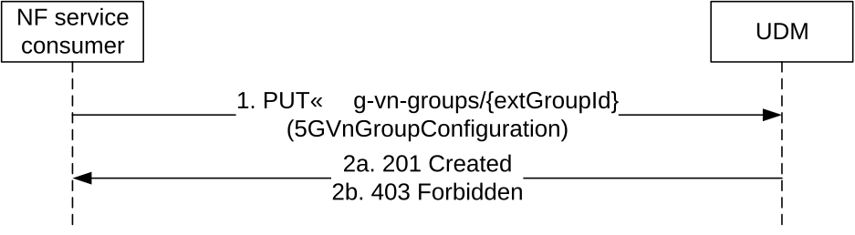
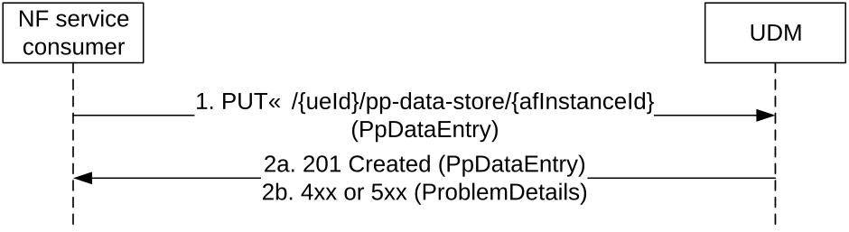
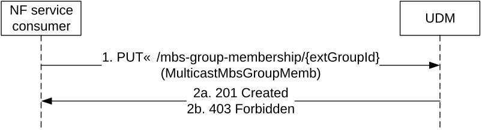

# 5.6.2.3 Create

## 5.6.2.3.1 General

The following procedures using the Create service operation are supported:

\- 5G-VN-Group creation

\- Parameter Provisioning Data Entry per AF creation

\- 5G-MBS-Group creation

## 5.6.2.3.2 5G-VN-Group creation

Figure 5.6.2.3.2-1 shows a scenario where the NF service consumer sends a request to the UDM to create a 5G VN Group. The request contains the group's external identifier and the group configuration.

Figure 5.6.2.3.2-1: NF service consumer creates a 5G-VN-Group

1\. The NF service consumer sends a PUT request to the resource .../5g-vn-groups/{extGroupId}, to create a 5G VN Group as present in the message body.

If MTC Provider information and/or AF ID are received in the request, the UDM shall check whether the MTC Provider and/or the AF is allowed to perform this operation for the UE; otherwise, the UDM shall skip the MTC provider and/or AF authorization check.

2a. On success the UDM responds with "201 Created".

2b. If the creation can't be accepted (e.g. MTC Provider or AF are not allowed to perform this operation for the UE), HTTP status code "403 Forbidden" should be returned including additional error information in the response body (in the "ProblemDetails" element).

On failure, the appropriate HTTP status code indicating the error shall be returned and appropriate additional error information should be returned in the PUT response body.

## 5.6.2.3.3 Parameter Provisioning Data Entry per AF creation

Figure 5.6.2.2.3-1 shows a scenario where the NF service consumer (e.g. NEF) sends a request to the UDM to create the Parameter Provisioning Data entry for a certain AF, which will influence the UE's subscription data (see TS 23.502 \[3\] figure 4.15.6.2-1 step 2 and also TS 23.273 \[38\] Figure 6.12.1-1 step 2). The NF consumer shall send a PUT request towards the resource URI of new Parameter Provisioning Data entry for the AF (.../{ueId}/pp-data-store/{afInstanceId}) with the new value in the request body. The URI variants ueId and afInstanceId shall take values as specified in Table 6.5.3.4.2-1.

Figure 5.6.2.3.3-1: NF service consumer creates a Parameter Provisioning Data Entry per AF

1\. The NF service consumer (e.g. NEF) sends a PUT request to the resource that represents the new Parameter Provisioning Data entry for the AF identified by the afInstnaceId. The request body shall contain a PpDataEntry object representing the value of the new resource.
If the request is to configure slice usage control information, the query parameterue ueId shall indicate the UE (e.g. a group of UE or any UE) that the network slice can serve.

The UDM shall check if the requested is authorized:

\- if configured to perform AF authorization check, the UDM shall check whether the AF is allowed to perform this operation for the UE; otherwise, the UDM shall skip the AF authorization check;

\- if configured to perform MTC Provider authorization check and if MTC Provider information is received in the request, the UDM shall check whether the MTC Provider is allowed to perform this operation for the UE; otherwise, the UDM shall skip the MTC Provider authorization check.

The UDM allocates an internal group identifier to the 5G VN Group. The UDM stores the external group identifier and the group configuration received from the NF service consumer together with the allocated internal group identifier (e.g. in UDR).

2a. The UDM responds with "201 Created" and the response body shall contain a PpDataEntry object representing the new created resource.

2b. If MTC Provider or AF are not allowed to perform this operation for the UE, HTTP status code "403 Forbidden" shall be returned including additional error information in the response body (in the "ProblemDetails" element).

NOTE: Upon reception of creation of maximum latency, maximum response time or DL Buffering Suggested Packet Count, UDM may need to adjust the value of active time and/or periodic registration timer and/or DL Buffering Suggested Packet Count and the UDM shall notify AMF and/or SMF if the values are updated (see clause 4.15.6.3a of TS 23.502 \[3\]).

On failure, the appropriate HTTP status code indicating the error shall be returned and appropriate additional error information should be returned in the PUT response body as specified in table 6.5.3.4.3.1-3.

## 5.6.2.3.4 5G-MBS-Group creation

Figure 5.6.2.3.4-1 shows a scenario where the NF service consumer sends a request to the UDM to create a 5G MBS Group. The request contains the group's external identifier and the group configuration.

Figure 5.6.2.3.4-1: NF service consumer creates a 5G-MBS-Group

1\. The NF service consumer sends a PUT request to the resource .../mbs-group-membership/{extGroupId}, to create a 5G MBS Group as present in the message body.

If AF ID are received in the request, the UDM shall check whether the AF is allowed to perform this operation for the UE; otherwise, the UDM shall skip the AF authorization check.

2a. On success the UDM responds with "201 Created".

2b. If the creation can't be accepted (e.g. AF are not allowed to perform this operation for the UE), HTTP status code "403 Forbidden" should be returned including additional error information in the response body (in the "ProblemDetails" element).

On failure, the appropriate HTTP status code indicating the error shall be returned and appropriate additional error information should be returned in the PUT response body.
