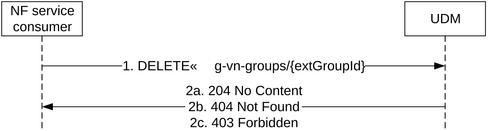
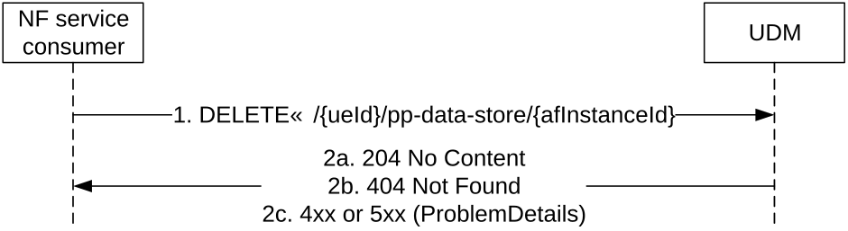
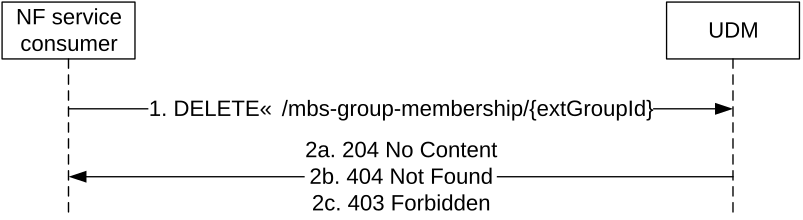

# 5.6.2.4 Delete

## 5.6.2.4.1 General

The following procedures using the Delete service operation are supported:

\- 5G-VN-Group deletion

\- Parameter Provisioning Data Entry per AF deletion

\- 5G-MBS-Group deletion

## 5.6.2.4.2 5G-VN-Group deletion

Figure 5.6.2.4.2-1 shows a scenario where the NF service consumer sends a request to the UDM to delete a 5G VN Group. The request contains the group's external identifier.

Figure 5.6.2.4.2-1: NF service consumer deletes a 5G-VN-Group

1\. The NF service consumer sends a DELETE request to the resource .../5g-vn-groups/{extGroupId}, to delete the 5G VN Group identified by the external group id.

If MTC Provider information and/or AF ID are received in the request, the UDM shall check whether the MTC Provider and/or the AF is allowed to perform this operation for the UE; otherwise, the UDM shall skip the MTC provider and/or AF authorization check.

2a. On success, the UDM responds with "204 No Content".

2b. If the external group id does not exist in the UDM, HTTP status code "404 Not Found" shall be returned including additional error information in the response body (in the "ProblemDetails" element).

2c. If MTC Provider or AF are not allowed to perform this operation for the UE, HTTP status code "403 Forbidden" shall be returned including additional error information in the response body (in the "ProblemDetails" element).

On failure, the appropriate HTTP status code indicating the error shall be returned and appropriate additional error information should be returned in the DELETE response body.

## 5.6.2.4.3 Parameter Provisioning Data Entry per AF deletion

Figure 5.6.2.4.3-1 shows a scenario where the NF service consumer (e.g. NEF) sends a request to the UDM to delete a Parameter Provisioning Data Entry for a certain AF. The NF consumer shall send a DELETE request towards the resource URI of an existing Parameter Provisioning Data entry for the AF (.../{ueId}/pp-data-store/{afInstanceId}). The URI variants ueId and afInstanceId shall take values as specified in Table 6.5.3.4.2-1.

Figure 5.6.2.4.3-1: NF service consumer deletes a Parameter Provisioning Data Entry per AF

1\. The NF service consumer sends a DELETE request to the resource ... /{ueId}/pp-data-store/{afInstanceId}, to delete the Parameter Provisioning Data Entry for the AF identified by afInstanceId.
If the request is to configure slice usage control information, the query parameterue ueId shall indicate the UE (e.g. a group of UE or any UE) that the network slice can serve.

The UDM shall check if the request is authorized:

\- if configured to perform AF authorization check, the UDM shall check whether the AF is allowed to perform this operation for the UE; otherwise, the UDM shall skip the AF authorization check;

\- if configured to perform MTC Provider authorization check and if MTC Provider information is received in the request, the UDM shall check whether the MTC Provider is allowed to perform this operation for the UE; otherwise, the UDM shall skip the MTC Provider authorization check.

2a. On success, the UDM responds with "204 No Content".

2b. If the Parameter Provisioning Data Entry for the AF does not exist in the UDM, HTTP status code "404 Not Found" shall be returned including additional error information in the response body (in the "ProblemDetails" element).

2c. If MTC Provider or AF are not allowed to perform this operation for the UE, HTTP status code "403 Forbidden" shall be returned including additional error information in the response body (in the "ProblemDetails" element).

On failure, the appropriate HTTP status code indicating the error shall be returned and appropriate additional error information should be returned in the DELETE response body as specified in table 6.5.3.4.3.2-3.

## 5.6.2.4.4 5G-MBS-Group deletion

Figure 5.6.2.4.4-1 shows a scenario where the NF service consumer sends a request to the UDM to delete a 5G MBS Group. The request contains the group's external identifier.

Figure 5.6.2.4.4-1: NF service consumer deletes a 5G-MBS-Group

1\. The NF service consumer sends a DELETE request to the resource .../mbs-group-membership/{extGroupId}, to delete the 5G MBS Group identified by the external group id.

If AF ID are received in the request, the UDM shall check whether the AF is allowed to perform this operation for the UE; otherwise, the UDM shall skip the AF authorization check.

2a. On success, the UDM responds with "204 No Content".

2b. If the external group id does not exist in the UDM, HTTP status code "404 Not Found" shall be returned including additional error information in the response body (in the "ProblemDetails" element).

2c. If AF are not allowed to perform this operation for the UE, HTTP status code "403 Forbidden" shall be returned including additional error information in the response body (in the "ProblemDetails" element).

On failure, the appropriate HTTP status code indicating the error shall be returned and appropriate additional error information should be returned in the DELETE response body.
