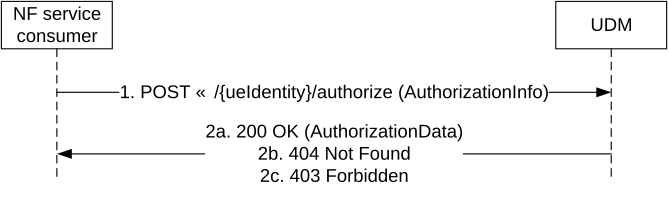
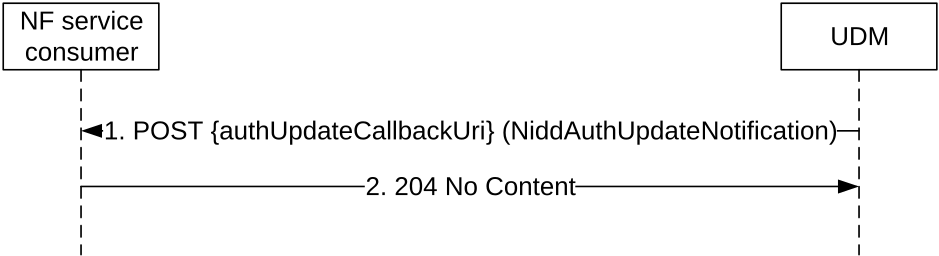

# 5.7 Nudm_NIDDAuthorization Service

## 5.7.1 Service Description

See TS 23.501 \[2\] table 7.2.5-1.

## 5.7.2 Service Operations

### 5.7.2.1 Introduction

For the Nudm_NIDDAuthorization service the following service operations are defined:

\- Get

\- Notification

The Nudm_NIDDAuthorization Service is used by Consumer NFs (NEF) to retrieve the UE's authorization for NIDD Configuration relevant to the consumer NF from the UDM by means of the Get service operation.

It is also used by the Consumer NFs (NEF) that have previously subscribed, to get notified by means of the Notification service operation when UDM decides to modify the subscribed data.

### 5.7.2.2 Get

#### 5.7.2.2.1 General

The following procedures using the Get service operation are supported:

\- NIDD Authorization Data Retrieval

#### 5.7.2.2.2 NIDD Authorization Data Retrieval

Figure 5.7.2.2.2-1 shows a scenario where the NF service consumer (e.g. NEF) sends a request to the UDM to authorize the NIDD configuration request (see also TS 23.502 \[3\] figure 4.25.3-1 step 4). The request contains the UE's identity (/{ueIdentity}), and information used for NIDD authorization (AuthorizationInfo).

Figure 5.7.2.2.2-1: Requesting a UE's NIDD Authorization Data

1\. The NF service consumer (e.g. NEF) sends a POST request to invoke "authorize" custom method on the resource representing the UE's subscribed NIDD authorization information. The content of the request shall be an object of "AuthorizationInfo" which shall contain NSSAI, DNN, MTC Provider Information, callback URI.

If MTC Provider information and/or AF ID are received in the request, the UDM shall check whether the MTC Provider and/or the AF is allowed to perform this operation for the UE; otherwise, the UDM shall skip the MTC provider and/or AF authorization check.

2a. On success, the UDM responds with "200 OK" with the message body containing the single value or list of AuthorizationData (SUPI and GPSI) as relevant for the requesting NF service consumer.

2b. If there is no valid AuthorizationData for the UE Identity, HTTP status code "404 Not Found" shall be returned including additional error information in the response body (in the "ProblemDetails" element).

2c. If SNSSAI and/or DNN are not authorized for this UE, or MTC Provider or AF are not allowed to perform this operation for the UE, HTTP status code "403 Forbidden" shall be returned including additional error information in the response body (in the "ProblemDetails" element).

On failure, the appropriate HTTP status code indicating the error shall be returned and appropriate additional error information should be returned in the GET response body.

Editor's Note: On success if the response exceeds the maximum length of a message segmentation need to be introduced, how this is done is FFS.

### 5.7.2.3 Notification

#### 5.7.2.3.1 General

The following procedures using the Notification service operation are supported:

\- NIDD Authorization Data Update Notification

#### 5.7.2.3.2 NIDD Authorization Data Update Notification

Figure 5.7.2.3.2-1 shows a scenario where the UDM notifies the NF service consumer (that has subscribed to receive such notification) about subscription data change (see also TS 23.502 \[3\] figure 4.25.6-1 step 1 and 2). The request contains the authUpdateCallbackUri URI as previously received by the UDM during NIDD Authorization Data Retrieval.

Figure 5.7.2.3.2-1: Requesting a UE's NIDD Authorization Data

1\. The UDM sends a POST request to the authUpdateCallbackUri as provided by the NF service consumer during NIDD Authorization Data Retrieval.

2\. The NF service consumer responds with "204 No Content".

On failure, the appropriate HTTP status code indicating the error shall be returned and appropriate additional error information should be returned in the POST response body.
