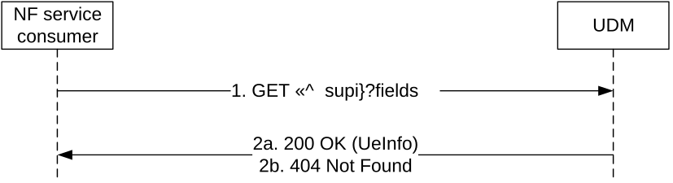
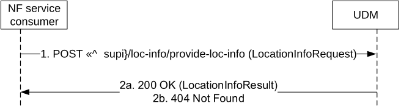

# 5.8 Nudm_MT Service

## 5.8.1 Service Description

See TS 23.632 \[32\].

## 5.8.2 Service Operations

### 5.8.2.1 Introduction

For the Nudm_MT service the following service operations are defined:

\- ProvideUeInfo

\- ProvideLocationInfo

The Nudm_MT service is used by the HSS to request the UDM to provide terminating access domain selection information and/or user state and/or 5GSRVCCInfo by means of the ProvideUeInfo service operation.

Note: The stage 2 service operations Nudm_MT_ProvideDomainSelectionInfo, Nudm_MT_ProvideUserState and Nudm_MT_Provide5GSRVCCInfo as defined in TS 23.632 \[32\] clause 6.2.3 are all covered by the single stage 3 service operation ProvideUeInfo. This allows retrieval of TADS info, user state and/or 5GSRVCCInfo with a single GET request.

It is also used by the HSS to request the UE's Location Information in 5GC by means of the ProvideLocationInfo service operation.

### 5.8.2.2 ProvideUeInfo

#### 5.8.2.2.1 General

The following procedure using the ProvideUeInfo service operation is supported:

\- UE Information Retrieval

#### 5.8.2.2.2 UE Information Retrieval

Figure 5.8.2.2.2-1 shows a scenario where the NF service consumer (HSS) retrieves domain selection information and/or user state and/or 5GSRVCCInfo for a UE from the UDM. The request contains the UE's identity (supi).

Figure 5.8.2.2.2-1: NF service consumer requesting domain selection information

1\. The NF service consumer sends a GET request to the UDM to query the UeInfo. Query parameters indicate that TadsInfo and/or UserState and/or 5GSRVCCInfo is requested.

2a. The UDM responds with "200 OK" with the message body containing the requested information.

2b. If there is no valid subscription data for the UE, HTTP status code "404 Not Found" shall be returned and additional error information should be included in the response body (in the "ProblemDetails" element).

On failure, the appropriate HTTP status code indicating the error shall be returned and appropriate additional error information should be returned in the GET response body.

### 5.8.2.3 ProvideLocationInfo

#### 5.8.2.3.1 General

The following procedure using the ProvideLocationInfo service operation is supported:

\- Network Provided Location Information Request

#### 5.8.2.3.2 Network Provided Location Information Request

Figure 5.8.2.3.2-1 shows a scenario where the NF service consumer (HSS) request UE's location information from UDM. The request contains the UE's identity (supi), and requested information (current location, local time zone, RAT type, or serving node identity)

Figure 5.8.2.3.2-1: NF service consumer requesting domain selection information

1\. The NF service consumer sends a POST request (custom method: provide-loc-info) to the resource representing UE's location information in 5GC.

2a. The UDM responds with "200 OK" with the message body containing the requested information.

2b. If there is no valid subscription data for the UE, or the requested information is not available, HTTP status code "404 Not Found" shall be returned and additional error information should be included in the response body (in the "ProblemDetails" element).

On failure, the appropriate HTTP status code indicating the error shall be returned and appropriate additional error information should be returned in the POST response body.
