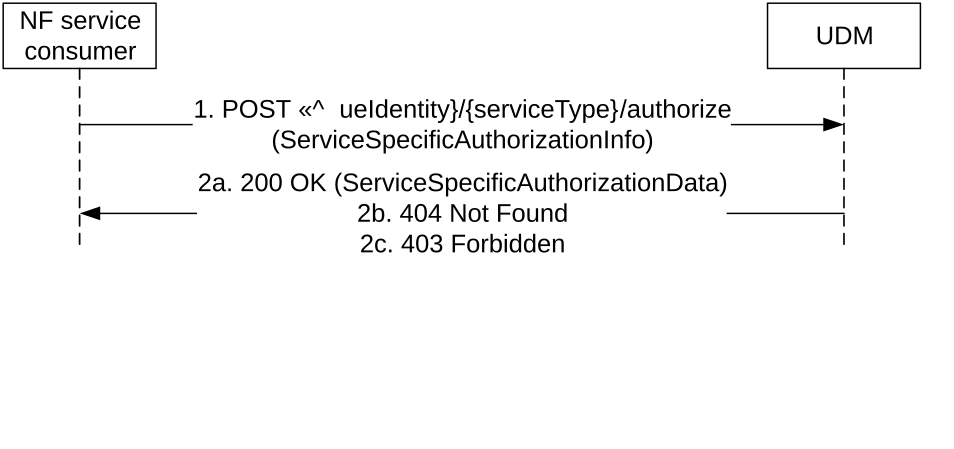
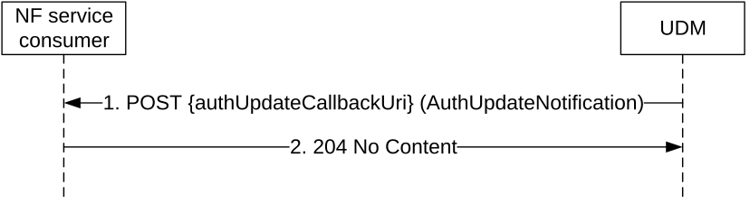
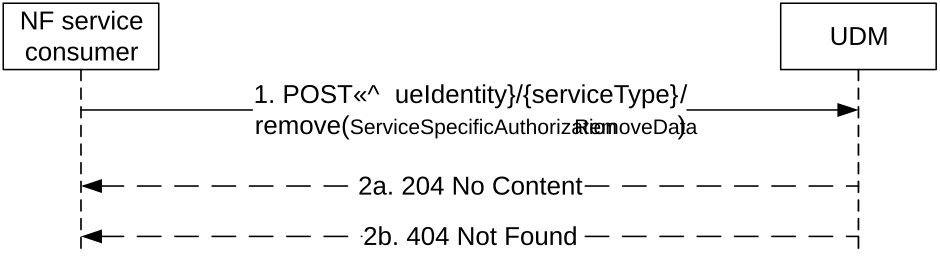

# 5.9 Nudm_ServiceSpecificAuthorization Service

## 5.9.1 Service Description

See TS 23.501 \[2\] table 7.2.5-1.

## 5.9.2 Service Operations

### 5.9.2.1 Introduction

For the Nudm_ServiceSpecificAuthorization service the following service operations are defined:

\- Create

\- UpdateNotify

> \- Remove

The Nudm_ServiceSpecificAuthorization Service is used by Consumer NFs (e.g. NEF) to retrieve the UE's authorization for a specific service relevant to the consumer NF from the UDM by means of the Create service operation.

It is also used by the Consumer NFs (e.g. NEF) that have previously received the service specific authorization result, to get notified by means of the UpdateNotify service operation when the authorization for a specific service is revoked.

It is also used by the Consumer NFs (NEF) that have previously received the service specific authorization result, to request UDM to remove the UE's authorization for a specific service relevant to the consumer NF in the UDM by means of the Remove service operation.

### 5.9.2.2 Create

#### 5.9.2.2.1 General

The following procedures using the Create service operation are supported:

\- Service Specific Authorization Data Retrieval

#### 5.9.2.2.2 Service Specific Authorization Data Retrieval

Figure 5.9.2.2.2-1 shows a scenario where the NF service consumer (e.g. NEF) sends a request to the UDM to receive the service specific authorization for the service parameters for an individual UE or a group of UEs (see also TS 23.502 \[3\] figure 4.15.6.7a-1). The request contains the UE's identity (/{ueIdentity}), service type, and service parameters (ServiceSpecificAuthorizationInfo) associated with the UE's identity. The response from UDM may contain the authorization result (AuthorizationData).

Figure 5.9.2.2.2-1: Requesting a UE's Authorization Data for a specific service

1\. The NF service consumer (e.g. NEF) sends a POST request to invoke "authorize" custom method on the resource representing the subscribed information for service identified by the service type of a UE or a group of UEs. The content of the request shall be an object of "ServiceSpecificAuthorizationInfo" which should contain the callback URI and may contain S-NSSAI, DNN, MTC Provider Information, AF ID.

If MTC Provider information and/or AF ID are received in the request, the UDM shall check whether the MTC Provider and/or the AF is allowed to perform this operation for the UE; otherwise, the UDM shall skip the MTC provider and/or AF authorization check.

2a. If S-NSSAI, DNN and service type received in the request are allowed or is part of the UE's subscription data or group data (for a request targeting a group), UDM shall respond successfully with "200 OK" HTTP response. The message body shall include the ServiceSpecificAuthorizationData object containing the SUPI of the UE (or the Internal Group Identifier mapped from External Group ID if the request is targeting a group) and the Service Specific Authorization Id.

2b. If there is no valid AuthorizationData for the UE Identity or unknown UE Identity, HTTP status code "404 Not Found" shall be returned including additional error information in the response body (in the "ProblemDetails" element).

2c. If S-NSSAI and/or DNN are not authorized for the service type according to the UE's subscription (including group data associated to the UE), or MTC Provider or AF are not allowed to perform this operation for the UE, HTTP status code "403 Forbidden" shall be returned including additional error information in the response body (in the "ProblemDetails" element).

On failure, the appropriate HTTP status code indicating the error shall be returned and appropriate additional error information should be returned in the POST response body.

### 5.9.2.3 UpdateNotify

#### 5.9.2.3.1 General

The following procedures using the UpdateNotify service operation are supported:

\- Service Specific Authorization Data Update Notification

#### 5.9.2.3.2 Service Specific Authorization Data Update Notification

Figure 5.9.2.3.2-1 shows a scenario where the UDM notifies the NF service consumer (that has subscribed during Service Specific Authorization Data Retrieval to receive such notification) about authorization revoke or update of subscription data associated to the UE or group of UE (see also TS 23.502 \[3\] figure 4.15.6.7a-2). The request contains the authUpdateCallbackUri URI as previously received by the UDM during Service Specific Authorization Data Retrieval.

Figure 5.9.2.3.2-1: Update UE's service specific authorization data

1\. The UDM sends a POST request to the updNotifyCallbackUri (as provided by the NF service consumer during Service Specific Authorization Result Retrieval) when the UEs subscription data (or group data associated to the UE) is modified so that the authorization of UEs association with the service type (and S-NSSAI, DNN if requested) is changed. When the authorization becomes invalid, the request body may include the cause indicating the reason why the authorization is invalid. The request body may also contain the MTC provider Information and the AF ID.

2\. The NF service consumer responds with "204 No Content".

On failure, the appropriate HTTP status code indicating the error shall be returned and appropriate additional error information should be returned in the POST response body.

5.9.2.3 Remove

5.9.2.3.1 General

The following procedures using the Remove service operation are supported:

> \- Service Specific Authorization Data Removal.

5.9.2.3.2 Service Specific Authorization Data Removal

Figure 5.9.2.3.2-1 shows a scenario where the NF service consumer (e.g. NEF) sends a request to the UDM to remove the service specific authorization for the service parameters for an individual UE or a group of UEs (see also TS 23.502 \[3\] clause 4.15.6.7). The request contains the UE's identity (/{ueIdentity}), service type, and service parameters (ServiceSpecificAuthorizationRemoveData).

Figure 5.9.2.3.2-1: Service Specific Authorization Data Removal

> 1\. The NF service consumer (e.g. NEF) sends a POST request to invoke "remove" custom method on the resource representing the UE's subscribed information for service identified by the service type. The content of the request shall be an object of "ServiceSpecificAuthorizationRemoveData" which contains the Service Specific Authorization Id previously received from UDM via Create Operation (see clause 5.9.2.2.2).
>
> 2a. On success, the UDM shall respond with "204 No Content".
>
> 2b. If the indicated authorization to be removed cannot be found at UDM, the UDM shall return "404 Not Found" with cause IE set to the application error "AUTHORIZATION_NOT_FOUND".

On other failures, the appropriate HTTP status code indicating the error shall be returned and appropriate additional error information should be returned in the response body.
