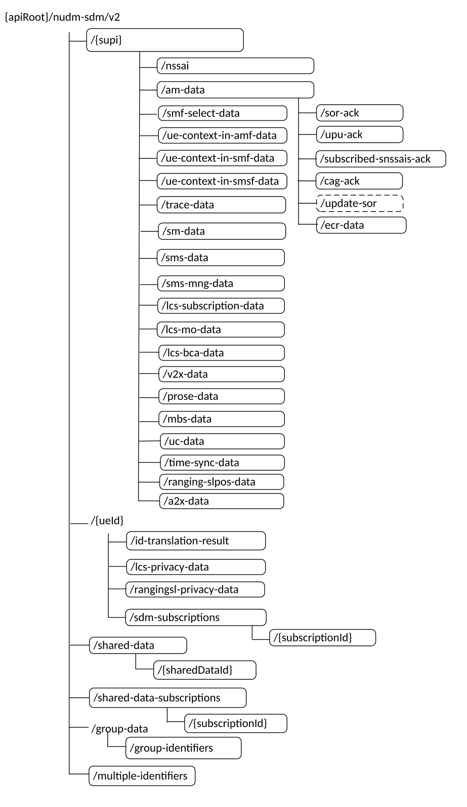

# 6.1.3.1 Overview

This clause describes the structure for the Resource URIs and the resources and methods used for the service.

Figure 6.1.3.1-1 depicts the resource URIs structure for the Nudm-SDM API.

Figure 6.1.3.1-1: Resource URI structure of the Nudm-SDM API

Table 6.1.3.1-1 provides an overview of the resources and applicable HTTP methods.

Table 6.1.3.1-1: Resources and methods overview

<table>
<colgroup>
<col style="width: 27%" />
<col style="width: 29%" />
<col style="width: 10%" />
<col style="width: 32%" />
</colgroup>
<thead>
<tr class="header">
<th>Resource name 
(Archetype)</th>
<th>Resource URI</th>
<th>HTTP method or custom operation</th>
<th>Description</th>
</tr>
</thead>
<tbody>
<tr class="odd">
<td>Supi 
(Document)</td>
<td>/{supi}</td>
<td>GET</td>
<td>Retrieve multiple data sets from UE's subscription data</td>
</tr>
<tr class="even">
<td>Nssai 
(Document)</td>
<td>/{supi}/nssai</td>
<td>GET</td>
<td>Retrieve the UE's subscribed Network Slice Selection Assistance Information</td>
</tr>
<tr class="odd">
<td>UeContextInAmfData 
(Document)</td>
<td>/{supi}/ue-context-in-amf-data</td>
<td>GET</td>
<td>Retrieve the UE's Context in AMF Data</td>
</tr>
<tr class="even">
<td rowspan="2">AccessAndMobilitySubscriptionData 
(Document)</td>
<td>/{supi}/am-data</td>
<td>GET</td>
<td>Retrieve the UE's subscribed Access and Mobility Data</td>
</tr>
<tr class="odd">
<td>/{supi}/am-data/update-sor</td>
<td>update-sor 
(POST)</td>
<td>Trigger the update of Steering of Roaming Information at the UE</td>
</tr>
<tr class="even">
<td>SorAck 
(Document)</td>
<td>/{supi}/am-data/sor-ack</td>
<td>PUT</td>
<td>Providing acknowledgement of Steering of Roaming</td>
</tr>
<tr class="odd">
<td>UpuAck 
(Document)</td>
<td>/{supi}/am-data/upu-ack</td>
<td>PUT</td>
<td>Providing acknowledgement of UE parameters update</td>
</tr>
<tr class="even">
<td>CagAck 
(Document)</td>
<td>/{supi}/am-data/cag-ack</td>
<td>PUT</td>
<td>Providing acknowledgement of UE CAG configuration update</td>
</tr>
<tr class="odd">
<td>EnhancedCoverageRestrictionData</td>
<td>/{supi}/am-data/ecr-data</td>
<td>GET</td>
<td>Retrieve the UE's subscribed Enhance Coverage Restriction Data</td>
</tr>
<tr class="even">
<td>SmfSelectionSubscriptionData 
(Document)</td>
<td>/{supi}/smf-select-data</td>
<td>GET</td>
<td>Retrieve the UE's subscribed SMF Selection Data</td>
</tr>
<tr class="odd">
<td>UeContextInSmfData 
(Document)</td>
<td>/{supi}/ue-context-in-smf-data</td>
<td>GET</td>
<td>Retrieve the UE's Context in SMF Data</td>
</tr>
<tr class="even">
<td>SessionManagementSubscriptionData 
(Document)</td>
<td>/{supi}/sm-data</td>
<td>GET</td>
<td>Retrieve the UE's session management subscription data</td>
</tr>
<tr class="odd">
<td>SMSSubscriptionData 
(Document)</td>
<td>/{supi}/sms-data</td>
<td>GET</td>
<td>Retrieve the UE's SMS subscription data</td>
</tr>
<tr class="even">
<td>SMSManagementSubscriptionData 
(Document)</td>
<td>/{supi}/sms-mng-data</td>
<td>GET</td>
<td>Retrieve the UE's SMS management subscription data</td>
</tr>
<tr class="odd">
<td>LcsPrivacySubscriptionData 
(Document)</td>
<td>/{ueId}/lcs-privacy-data</td>
<td>GET</td>
<td>Retrieve the UE's LCS privacy subscription data</td>
</tr>
<tr class="even">
<td>LcsSubscriptionData 
(Document)</td>
<td>/{supi}/lcs-subscription-data</td>
<td>GET</td>
<td>Retrieve the UE's LCS subscription data</td>
</tr>
<tr class="odd">
<td>LcsMobileOriginatedSubscriptionData 
(Document)</td>
<td>/{supi}/lcs-mo-data</td>
<td>GET</td>
<td>Retrieve the UE's LCS Mobile Originated subscription data</td>
</tr>
<tr class="even">
<td>LcsBroadcastAssistanceSubscriptionData 
(Document)</td>
<td>/{supi}/lcs-bca-data</td>
<td>GET</td>
<td>Retrieve the UE's LCS Broadcast Assistance subscription data</td>
</tr>
<tr class="odd">
<td>ProseSubscriptionData 
(Document)</td>
<td>/{supi}/prose-data</td>
<td>GET</td>
<td>Retrieve the UE's ProSe subscription data</td>
</tr>
<tr class="even">
<td>V2xSubscriptionData 
(Document)</td>
<td>/{supi}/v2x-data</td>
<td>GET</td>
<td>Retrieve the UE's V2X subscription data</td>
</tr>
<tr class="odd">
<td>MbsSubscriptionData 
(Document)</td>
<td>/{supi}/mbs-data</td>
<td>GET</td>
<td>Retrieve the UE's 5MBS subscription data</td>
</tr>
<tr class="even">
<td>UcSubscriptionData 
(Document)</td>
<td>/{supi}/uc-data</td>
<td>GET</td>
<td>Retrieve the UE's User Consent subscription data</td>
</tr>
<tr class="odd">
<td>SdmSubscriptions 
(Collection)</td>
<td>/{ueId}/sdm-subscriptions</td>
<td>POST</td>
<td>Create a subscription</td>
</tr>
<tr class="even">
<td rowspan="2">Individual subscription 
(Document)</td>
<td rowspan="2">/{ueId}/sdm-subscriptions/{subscriptionId}</td>
<td>DELETE</td>
<td>Delete the subscription identified by {subscriptionId}, i.e. unsubscribe</td>
</tr>
<tr class="odd">
<td>PATCH</td>
<td>Modify the sdm-subscription identified by {subscriptionId}</td>
</tr>
<tr class="even">
<td>IdTranslationResult 
(Document)</td>
<td>/{ueId}/id-translation-result</td>
<td>GET</td>
<td>Retrieve a UE's SUPI or GPSI</td>
</tr>
<tr class="odd">
<td>UeContextInSmsfData 
(Document)</td>
<td>/{supi}/ue-context-in-smsf-data</td>
<td>GET</td>
<td>Retrieve the UE's Context in SMSF Data</td>
</tr>
<tr class="even">
<td>
TraceData

(Document)
</td>
<td>/{supi}/trace-data</td>
<td>GET</td>
<td>Retrieve Trace Configuration Data</td>
</tr>
<tr class="odd">
<td>SharedData 
(Collection)</td>
<td>/shared-data</td>
<td>GET</td>
<td>Retrieve shared data</td>
</tr>
<tr class="even">
<td>IndividualSharedData 
(Document)</td>
<td>/shared-data/{sharedDataId}</td>
<td>GET</td>
<td>Retrieve the individual Shared Data</td>
</tr>
<tr class="odd">
<td>SharedDataSubscriptions 
(Collection)</td>
<td>/shared-data-subscriptions</td>
<td>POST</td>
<td>Create a subscription</td>
</tr>
<tr class="even">
<td rowspan="2">SharedDataIndividual subscription 
(Document)</td>
<td rowspan="2">/shared-data-subscriptions/{subscriptionId}</td>
<td>DELETE</td>
<td>Delete the subscription identified by {subscriptionId}, i.e. unsubscribe</td>
</tr>
<tr class="odd">
<td>PATCH</td>
<td>Modify the shared data subscription identified by {subscriptionId}</td>
</tr>
<tr class="even">
<td>
GroupIdentifiers

(Document)
</td>
<td>/group-data/group-identifiers</td>
<td>GET</td>
<td>Retrieve group identifiers and the UE identifiers belong to the group identifiers.</td>
</tr>
<tr class="odd">
<td>SnssaisAck 
(Document)</td>
<td>/{supi}/am-data/subscribed-snssais-ack</td>
<td>PUT</td>
<td>Providing acknowledgement of UE for subscribed S-NSSAIs</td>
</tr>
<tr class="even">
<td>
MultipleIdentifiers

(Document)
</td>
<td>/multiple-identifiers</td>
<td>GET</td>
<td>Retrieve SUPIs belong to the GPSIs.</td>
</tr>
<tr class="odd">
<td>TimeSyncSubscriptionData (Document)</td>
<td>/{supi}/time-sync-data</td>
<td>GET</td>
<td>Retrieve the UE’s Time Synchronization Subscription Data</td>
</tr>
<tr class="even">
<td>RangingSlPosSubscriptionData 
(Document)</td>
<td>/{supi}/ranging-slpos-data</td>
<td>GET</td>
<td>Retrieve the UE's Ranging and Sidelink Positioning subscription data</td>
</tr>
<tr class="odd">
<td>A2xSubscriptionData 
(Document)</td>
<td>/{supi}/a2x-data</td>
<td>GET</td>
<td>Retrieve the UE's A2X subscription data</td>
</tr>
<tr class="even">
<td>RangingSlPrivacySubscriptionData 
(Document)</td>
<td>/{ueId}/rangingsl-privacy-data</td>
<td>GET</td>
<td>Retrieve the UE's Ranging and Sidelink Positioning privacy subscription data</td>
</tr>
</tbody>
</table>
