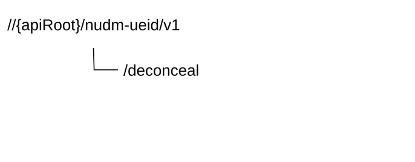

# 6.10 Nudm_UEIdentifier Service API

## 6.10.1 API URI

The Nudm_UEIdentifier service shall use the Nudm_UEID API.

The API URI of the Nudm_UEID API shall be:

**{apiRoot}/\<apiName\>/\<apiVersion\>**

The request URI used in HTTP request from the NF service consumer towards the NF service producer shall have the structure defined in clause 4.4.1 of TS 29.501 \[5\], i.e.:

**{apiRoot}/\<apiName\>/\<apiVersion\>/\<apiSpecificResourceUriPart\>**

with the following components:

\- The {apiRoot} shall be set as described in TS 29.501 \[5\].

\- The \<apiName\> shall be "nudm-ueid".

\- The \<apiVersion\> shall be "v1".

\- The \<apiSpecificResourceUriPart\> shall be set as described in clause 6.8.3.

## 6.10.2 Usage of HTTP

### 6.10.2.1 General

HTTP/2, as defined in IETF RFC 9113 \[13\], shall be used as specified in clause 5 of TS 29.500 \[4\].

HTTP/2 shall be transported as specified in clause 5.3 of TS 29.500 \[4\].

HTTP messages and bodies for the Nudm_UEIdentifier service shall comply with the OpenAPI \[14\] specification contained in Annex A.11.

### 6.10.2.2 HTTP standard headers

#### 6.10.2.2.1 General

The usage of HTTP standard headers shall be supported as specified in clause 5.2.2 of TS 29.500 \[4\].

#### 6.10.2.2.2 Content type

The following content types shall be supported:

JSON, as defined in IETF RFC 8259 \[15\], signalled by the content type "application/json".

The Problem Details JSON Object (IETF RFC 9457 \[16\] signalled by the content type "application/problem+json"

### 6.10.2.3 HTTP custom headers

#### 6.10.2.3.1 General

The usage of HTTP custom headers shall be supported as specified in clause 5.2.3 of TS 29.500 \[4\].

## 6.10.3 Resources

### 6.10.3.1 Overview

This clause describes the structure for the Resource URIs and the resources and methods used for the service.

Figure 6.10.3.1-1 depicts the resource URIs structure for the Nudm_UEID API.

Figure 6.10.3.1-1: Resource URI structure of the nudm-ueid API

Table 6.10.3.1-1 provides an overview of the resources and applicable HTTP methods.

Table 6.10.3.1-1: Resources and methods overview

<table>
<colgroup>
<col style="width: 26%" />
<col style="width: 31%" />
<col style="width: 11%" />
<col style="width: 30%" />
</colgroup>
<thead>
<tr class="header">
<th>Resource name 
(Archetype)</th>
<th>Resource URI</th>
<th>HTTP method or custom operation</th>
<th>Description</th>
</tr>
</thead>
<tbody>
<tr class="odd">
<td></td>
<td></td>
<td></td>
<td></td>
</tr>
</tbody>
</table>

There is no resource defined for the Nudm_UEIdentifier Service.

## 6.10.4 Custom Operations without associated resources

### 6.10.4.1 Overview

Table 6.10.4.1-1: Custom operations without associated resources

| Operation Name | Custom operation URI | Mapped HTTP method | Description            |
|----------------|----------------------|--------------------|------------------------|
| Deconceal      | /deconceal           | POST               | Deconceal SUCI to SUPI |

### 6.10.4.2 Operation: Deconceal

#### 6.10.4.2.1 Description

This custom operation is used by the NF service consumer (i.e. 5G PKMF) to deconceal the SUCI of the 5G ProSe Remote UE to the SUPI.

#### 6.10.4.2.2 Operation Definition

This operation shall support the data structures and response codes specified in tables 6.10.4.2.2-1 and 6.10.4.2.2-2.

Table 6.10.4.2.2-1: Data structures supported by the Request Body

|                  |     |             |                                                                         |
|------------------|-----|-------------|-------------------------------------------------------------------------|
| Data type        | P   | Cardinality | Description                                                             |
| DeconcealReqData | M   | 1           | Deconceal request data, including the SUCI of the UE to be deconcealed. |

Table 6.10.4.2.2-2: Data structures supported by the POST Response Body

<table>
<colgroup>
<col style="width: 16%" />
<col style="width: 4%" />
<col style="width: 12%" />
<col style="width: 11%" />
<col style="width: 54%" />
</colgroup>
<tbody>
<tr class="odd">
<td>Data type</td>
<td>P</td>
<td>Cardinality</td>
<td>
Response

codes
</td>
<td>Description</td>
</tr>
<tr class="even">
<td>DeconcealRspData</td>
<td>M</td>
<td>1</td>
<td>200 OK</td>
<td>Upon success, the response data contain the SUPI of the UE that deconealed from the input SUCI.</td>
</tr>
<tr class="odd">
<td>ProblemDetails</td>
<td>O</td>
<td>0..1</td>
<td>403 Forbidden</td>
<td>
The "cause" attribute may be used to indicate one of the following application errors:

- INVALID_HN_PUBLIC_KEY_IDENTIFIER

- INVALID_SCHEME_OUTPUT
</td>
</tr>
<tr class="even">
<td>ProblemDetails</td>
<td>O</td>
<td>0..1</td>
<td>404 Not Found</td>
<td>
The "cause" attribute may be used to indicate one of the following application errors:

- USER_NOT_FOUND
</td>
</tr>
<tr class="odd">
<td>ProblemDetails</td>
<td>O</td>
<td>0..1</td>
<td>501 Not implemented</td>
<td>
The "cause" attribute may be used to indicate one of the following application errors:

- UNSUPPORTED_PROTECTION_SCHEME
</td>
</tr>
</tbody>
</table>

## 6.10.5 Notifications

In this release of this specification, no notifications are defined for the Nudm_UEIdentifier Service.

## 6.10.6 Data Model

### 6.10.6.1 General

This clause specifies the application data model supported by the API.

Table 6.10.6.1-1 specifies the structured data types defined for the Nudm_UEID service API. For simple data types defined for the Nudm_UEID service API see table 6.10.6.3.2-1.

Table 6.10.6.1-1: Nudm_UEID specific Data Types

| Data type        | Clause defined | Description             |
|------------------|----------------|-------------------------|
| DeconcealReqData | 6.10.6.2.2     | Deconceal Request Data  |
| DeconcealRspData | 6.10.6.2.3     | Deconceal Response Data |

Table 6.10.6.1-2 specifies data types re-used by the Nudm_UEID service API from other specifications, including a reference to their respective specifications and when needed, a short description of their use within the Nudm_UEID service API.

Table 6.10.6.1-2: Nudm_UEID re-used Data Types

| Data type | Reference        | Comments                          |
|-----------|------------------|-----------------------------------|
| Suci      | TS 29.509 \[24\] | Subscription Concealed Identifier |
| Supi      | TS 29.571 \[7\]  | Subscription Permanent Identifier |

### 6.10.6.2 Structured data types

#### 6.10.6.2.1 Introduction

This clause defines the structures to be used in resource representations.

#### 6.10.6.2.2 Type: DeconcealReqData

Table 6.10.6.2.2-1: Definition of type DeconcealReqData

| Attribute name | Data type | P   | Cardinality | Description                                      |
|----------------|-----------|-----|-------------|--------------------------------------------------|
| suci           | Suci      | M   | 1           | This IE shall contain the SUCI to be deconcealed |

#### 6.10.6.2.3 Type: DeconcealRspData

Table 6.10.6.2.2-1: Definition of type DeconcealRspData

| Attribute name | Data type | P   | Cardinality | Description                                                             |
|----------------|-----------|-----|-------------|-------------------------------------------------------------------------|
| supi           | Supi      | M   | 1           | This IE shall contain the SUPI that is deconcealed from the input SUCI. |

### 6.10.6.3 Simple data types and enumerations

#### 6.10.6.3.1 Introduction

This clause defines simple data types and enumerations that can be referenced from data structures defined in the previous clauses.

## 6.10.7 Error Handling

### 6.10.7.1 General

HTTP error handling shall be supported as specified in clause 5.2.4 of TS 29.500 \[4\].

### 6.10.7.2 Protocol Errors

Protocol errors handling shall be supported as specified in clause 5.2.7 of TS 29.500 \[4\].

### 6.10.7.3 Application Errors

The common application errors defined in the Table 5.2.7.2-1 in TS 29.500 \[4\] may also be used for the Nudm_UEIdentifier service. The following application errors listed in Table 6.8.7.3-1 are specific for the Nudm_UEIdentifier service.

Table 6.10.7.3-1: Application errors

| Application Error                | HTTP status code    | Description                                              |
|----------------------------------|---------------------|----------------------------------------------------------|
| INVALID_HN_PUBLIC_KEY_IDENTIFIER | 403 Forbidden       | Invalid HN public key identifier received                |
| INVALID_SCHEME_OUTPUT            | 403 Forbidden       | SUCI cannot be decrypted with received data              |
| USER_NOT_FOUND                   | 404 Not Found       | The user does not exist in the HPLMN                     |
| UNSUPPORTED_PROTECTION_SCHEME    | 501 Not implemented | The received protection scheme is not supported by HPLMN |

## 6.10.8 Feature Negotiation

The optional features in table 6.10.8-1 are defined for the Nudm_UEID API. They shall be negotiated using the extensibility mechanism defined in clause 6.6 of TS 29.500 \[4\].

Table 6.10.8-1: Supported Features

| Feature number | Feature Name | Description |
|----------------|--------------|-------------|
|                |              |             |

## 6.10.9 Security

As indicated in TS 33.501 \[6\] and TS 29.500 \[4\], the access to the Nudm_UEID API may be authorized by means of the OAuth2 protocol (see IETF RFC 6749 \[18\]), based on local configuration, using the "Client Credentials" authorization grant, where the NRF (see TS 29.510 \[19\]) plays the role of the authorization server.

If OAuth2 is used, an NF Service Consumer, prior to consuming services offered by the Nudm_UEID API, shall obtain a "token" from the authorization server, by invoking the Access Token Request service, as described in TS 29.510 \[19\], clause 5.4.2.2.

NOTE: When multiple NRFs are deployed in a network, the NRF used as authorization server is the same NRF that the NF Service Consumer used for discovering the Nudm_UEID service.

The Nudm_UEID API defines a single scope "nudm-ueid" for OAuth2 authorization (as specified in TS 33.501 \[6\]) for the entire API, and it does not define any additional scopes at resource or operation level.
