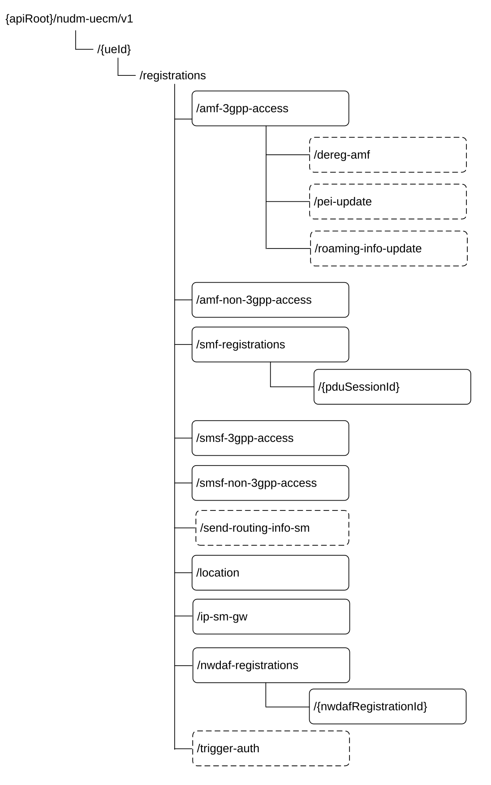

# 6.2.3.1 Overview

This clause describes the structure for the Resource URIs and the resources and methods used for the service.

Figure 6.2.3.1-1 depicts the resource URIs structure for the Nudm_UECM API.

Figure 6.2.3.1-1: Resource URI structure of the Nudm_UECM API

Table 6.2.3.1-1 provides an overview of the resources and applicable HTTP methods.

Table 6.2.3.1-1: Resources and methods overview

<table>
<colgroup>
<col style="width: 30%" />
<col style="width: 30%" />
<col style="width: 12%" />
<col style="width: 27%" />
</colgroup>
<thead>
<tr class="header">
<th>Resource name 
(Archetype)</th>
<th>Resource URI</th>
<th>HTTP method or custom operation</th>
<th>Description</th>
</tr>
</thead>
<tbody>
<tr class="odd">
<td rowspan="2">
Registrations

(Document)
</td>
<td>/{ueId}/registrations</td>
<td>GET</td>
<td>Retrieve UE's registration data sets</td>
</tr>
<tr class="even">
<td>/{ueId}/registrations/send-routing-info-sm</td>
<td>
send-routing-info-sm

(POST)
</td>
<td>Retrieve addressing information for SMS delivery</td>
</tr>
<tr class="odd">
<td rowspan="6">Amf3GppAccessRegistration 
(Document)</td>
<td rowspan="3">/{ueId}/registrations/amf-3gpp-access</td>
<td>PUT</td>
<td>Update the AMF registration for 3GPP access</td>
</tr>
<tr class="even">
<td>PATCH</td>
<td>Modify the AMF registration for 3GPP access</td>
</tr>
<tr class="odd">
<td>GET</td>
<td>Retrieve the AMF registration information for 3GPP access</td>
</tr>
<tr class="even">
<td>/{ueId}/registrations/amf-3gpp-access/dereg-amf</td>
<td>dereg-amf (POST)</td>
<td>Trigger AMF deregistration due to mobility from 5GC to EPC</td>
</tr>
<tr class="odd">
<td>/{ueId}/registrations/amf-3gpp-access/pei-update</td>
<td>
pei-update

(POST)
</td>
<td>Updates the PEI in the 3GPP Access Registration context</td>
</tr>
<tr class="even">
<td>/{ueId}/registrations/amf-3gpp-access/roaming-info-update</td>
<td>
roaming-info-update

(POST)
</td>
<td>Updates the Roaming Information in the AMF 3GPP Registration context</td>
</tr>
<tr class="odd">
<td rowspan="3">AmfNon3GppAccessRegistration 
(Document)</td>
<td rowspan="3">/{ueId}/registrations/amf-non-3gpp-access</td>
<td>PUT</td>
<td>Update the AMF registration for non 3GPP access</td>
</tr>
<tr class="even">
<td>PATCH</td>
<td>Modify the AMF registration for non 3GPP access</td>
</tr>
<tr class="odd">
<td>GET</td>
<td>Retrieve the AMF registration information for non 3GPP access</td>
</tr>
<tr class="even">
<td>SmfRegistrations 
(Store)</td>
<td>/{ueId}/registrations/smf-registrations</td>
<td>GET</td>
<td>Retrieve the SMF registration information</td>
</tr>
<tr class="odd">
<td rowspan="4">IndividualSmfRegistration 
(Document)</td>
<td rowspan="4">/{ueId}/registrations/smf-registrations/{pduSessionId}</td>
<td>PUT</td>
<td>Create an SMF registration identified by PDU Session Id</td>
</tr>
<tr class="even">
<td>DELETE</td>
<td>Delete an individual SMF registration</td>
</tr>
<tr class="odd">
<td>GET</td>
<td>Retrieve the SMF registration information identified by PDU Session Id.</td>
</tr>
<tr class="even">
<td>PATCH</td>
<td>Modify the SMF registration</td>
</tr>
<tr class="odd">
<td rowspan="4">Smsf3GppAccessRegistration 
(Document)</td>
<td rowspan="4">/{ueId}/registrations/smsf-3gpp-access</td>
<td>PUT</td>
<td>Create or Update the SMSF registration</td>
</tr>
<tr class="even">
<td>DELETE</td>
<td>Delete the SMSF registration for 3GPP access</td>
</tr>
<tr class="odd">
<td>GET</td>
<td>Retrieve the SMSF registration information</td>
</tr>
<tr class="even">
<td>PATCH</td>
<td>Modify the SMSF registration for 3GPP access</td>
</tr>
<tr class="odd">
<td rowspan="4">SmsfNon3GppAccessRegistration 
(Document)</td>
<td rowspan="4">/{ueId}/registrations/smsf-non-3gpp-access</td>
<td>PUT</td>
<td>Create or Update the SMSF registration for non 3GPP access</td>
</tr>
<tr class="even">
<td>DELETE</td>
<td>Delete the SMSF registration for non 3GPP access</td>
</tr>
<tr class="odd">
<td>GET</td>
<td>Retrieve the SMSF registration information for non 3GPP access</td>
</tr>
<tr class="even">
<td>PATCH</td>
<td>Modify the SMSF registration for non-3GPP access</td>
</tr>
<tr class="odd">
<td>Location(Document)</td>
<td>/{ueId}/registrations/location</td>
<td>GET</td>
<td>Retrieve the UE's location information by GMLC or NEF</td>
</tr>
<tr class="even">
<td rowspan="3">IpSmGwRegistration 
(Document)</td>
<td rowspan="3">/{ueId}/registrations/ip-sm-gw</td>
<td>PUT</td>
<td>Create or Update the IP-SM-GW registration</td>
</tr>
<tr class="odd">
<td>DELETE</td>
<td>Delete the IP-SM-GW registration</td>
</tr>
<tr class="even">
<td>GET</td>
<td>Retrieve the IP-SM-GW registration information</td>
</tr>
<tr class="odd">
<td rowspan="3">NwdafRegistration 
(Document)</td>
<td rowspan="3">/{ueId}/registrations/nwdaf-registrations/{nwdafRegistrationId}</td>
<td>PUT</td>
<td>Create an NWDAF registration</td>
</tr>
<tr class="even">
<td>DELETE</td>
<td>Delete an individual NWDAF registration</td>
</tr>
<tr class="odd">
<td>PATCH</td>
<td>Modify the NWDAF registration</td>
</tr>
<tr class="even">
<td>NwdafRegistrations 
(Store)</td>
<td>/{ueId}/registrations/nwdaf-registrations</td>
<td>GET</td>
<td>Retrieve the NWDAF registration(s) information</td>
</tr>
<tr class="odd">
<td>AuthTrigger</td>
<td>/{ueId}/registrations/trigger-auth</td>
<td>
trigger-auth

(POST)
</td>
<td>Trigger the primary (re-)authentication</td>
</tr>
</tbody>
</table>

NOTE: The Custom operation URI above are deviating from the URI Path Segment Naming Conventions defined in clause 5.1.3.2 of TS 29.501 \[5\], but they are not changed to maintain backwards compatibility.
