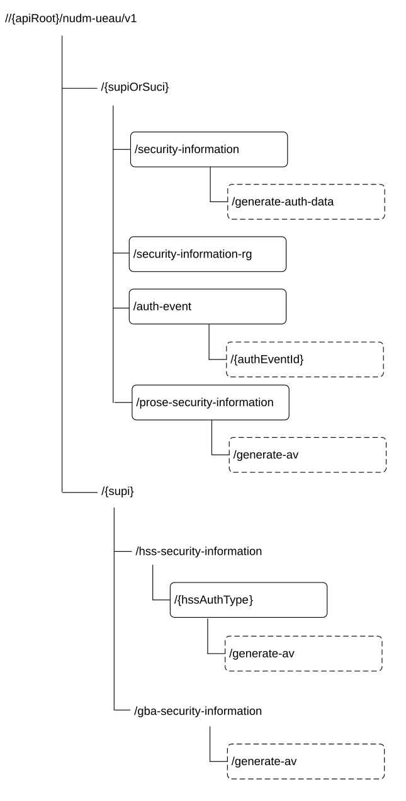

# 6.3.3 Resources

## 6.3.3.1 Overview

This clause describes the structure for the Resource URIs and the resources and methods used for the service.

Figure 6.3.3.1-1 depicts the resource URIs structure for the Nudm_UEAU API.

Figure 6.3.3.1-1: Resource URI structure of the Nudm_UEAU API

Table 6.3.3.1-1 provides an overview of the resources and applicable HTTP methods.

Table 6.3.3.1-1: Resources and methods overview

<table>
<colgroup>
<col style="width: 25%" />
<col style="width: 32%" />
<col style="width: 10%" />
<col style="width: 32%" />
</colgroup>
<thead>
<tr class="header">
<th>Resource name 
(Archetype)</th>
<th>Resource URI</th>
<th>HTTP method or custom operation</th>
<th>Description</th>
</tr>
</thead>
<tbody>
<tr class="odd">
<td>SecurityInformation 
(Custom operation)</td>
<td>/{supiOrSuci}/security-information/generate-auth-data</td>
<td>generate-auth-data (POST)</td>
<td>
If the variable {supiOrSuci} takes the value of a SUCI, the UDM calculates the corresponding SUPI.

If the variable {supiOrSuci} takes the value of an anonymous SUCI, the UDM calculates the corresponding anonymous SUPI.

The UDM calculates a fresh authentication vector based on the received information and the stored security information for the SUPI if 5G-AKA or EAP-AKA' is selected. Otherwise, UDM provides corresponding authentication information.
</td>
</tr>
<tr class="even">
<td>SecurityInformationForRg</td>
<td>/{supiOrSuci}/security-information-rg</td>
<td>GET</td>
<td>If the variable {supiOrSuci} takes the value of a SUCI, the UDM calculates the corresponding SUPI. The UDM decides, based on the received information and the stored authentication profile of the SUPI, that authentication by the home network is not required for the FN-RG.</td>
</tr>
<tr class="odd">
<td>AuthEvents 
(Collection)</td>
<td>/{supi}/auth-events</td>
<td>POST</td>
<td>Create an Authentication Event</td>
</tr>
<tr class="even">
<td>Individual AuthEvent 
(Document)</td>
<td>/{supi}/auth-events/{authEventId}</td>
<td>PUT</td>
<td>Update an Authentication Event</td>
</tr>
<tr class="odd">
<td>
HssSecurityInformation

(Custom operation)
</td>
<td>/{supi}/hss-security-information/{hssAuthType}/generate-av</td>
<td>generate-av (POST)</td>
<td>The UDM generates the authentication vector(s) of the requested type based on stored security information for the SUPI.</td>
</tr>
<tr class="even">
<td>
GbaSecurityInformation

(Custom operation)
</td>
<td>/{supi}/gba-security-information/generate-av</td>
<td>generate-av (POST)</td>
<td>The UDM generates the authentication vector(s) of the requested type based on stored security information for the SUPI.</td>
</tr>
<tr class="odd">
<td>
ProSeSecurityInformation

(Custom operation)
</td>
<td>/{supiOrSuci}/prose-security-information/generate-av</td>
<td>generate-av (POST)</td>
<td>If the variable {supiOrSuci} takes the value of a SUCI, the UDM calculates the corresponding SUPI. The UDM decides, based on the received information and the stored authentication profile of the SUPI.</td>
</tr>
</tbody>
</table>

## 6.3.3.2 Resource: SecurityInformation (Custom operation)

### 6.3.3.2.1 Description

This resource represents the information that is needed together with the serving network name and the access type to calculate a fresh authentication vector. See TS 33.501 \[6\].

### 6.3.3.2.2 Resource Definition

Resource URI: {apiRoot}/nudm-ueau/v1/{supiOrSuci}/security-information

This resource shall support the resource URI variables defined in table 6.3.3.2.2-1.

Table 6.3.3.2.2-1: Resource URI variables for this resource

<table>
<colgroup>
<col style="width: 10%" />
<col style="width: 10%" />
<col style="width: 78%" />
</colgroup>
<thead>
<tr class="header">
<th>Name</th>
<th>Data type</th>
<th>Definition</th>
</tr>
</thead>
<tbody>
<tr class="odd">
<td>apiRoot</td>
<td>string</td>
<td>See clause 6.3.1</td>
</tr>
<tr class="even">
<td>supiOrSuci</td>
<td>string</td>
<td>
Represents the Subscription Permanent Identifier (see TS 23.501 [2] clause 5.9.2), or Subscription Concealed Identifier (see TS 23.003 [8]).

Pattern: See pattern of type SupiOrSuci in TS 29.571 [7]

(See NOTE 1, NOTE 2, NOTE 3).
</td>
</tr>
<tr class="odd">
<td colspan="3">
NOTE 1: The format for SUCI, when the corresponding SUPI is NAI-based, contains a realm that may include a "minus" character ("-"), which is also used as field separator. Given that the NAI and its realm shall conform to IETF RFC 7542 [29], the regular expression defined here allows for non-ambiguous matching of the different fields of the SUCI, even when the realm contains the "minus" character.

NOTE 2: When the SUCI corresponds to a SUPI of type IMSI, and the Null protection scheme is used, the MSIN of the IMSI (which is formatted by the UE and sent over the NAS protocol as Binary Coded Decimal, BCD) shall be formatted in the SUCI as an UTF-8 string containing all decimal digits of the MSIN; see Annex C for SUCI encoding examples.

NOTE 3: If the anonymous SUCI contain the realm part, the UDM calculates the corresponding anonymous SUPI.
</td>
</tr>
</tbody>
</table>

### 6.3.3.2.3 Resource Standard Methods

No Standard Methods are supported for this resource.

### 6.3.3.2.4 Resource Custom Operations

#### 6.3.3.2.4.1 Overview

Table 6.3.3.2.4.1-1: Custom operations

| Operation Name     | Custom operation URI | Mapped HTTP method | Description                                                                                                                                       |
|--------------------|----------------------|--------------------|---------------------------------------------------------------------------------------------------------------------------------------------------|
| generate-auth-data | /generate-auth-data  | POST               | Select the authentication method and calculate a fresh AV if 5G-AKA or EAP-AKA' is selected or provides corresponding authentication information. |

#### 6.3.3.2.4.2 Operation: generate-auth-data

#### 6.3.3.2.4.2.1 Description

This custom operation is used by the NF service consumer (AUSF) to request authentication information data for the SUPI/SUCI from the UDM. If SUCI is provided, the UDM calculates the SUPI from the SUCI (see TS 33.501 \[6\]). The UDM calculates an authentication vector taking into account the information received from the NF service consumer (AUSF) and the current representation of this resource if 5G AKA or EAP-AKA' is selected. For details see TS 33.501 \[6\].

#### 6.3.3.2.4.2.2 Operation Definition

This operation shall support the request data structures specified in table 6.3.3.2.4.2.2-1 and the response data structure and response codes specified in table 6.3.3.2.4.2.2-2.

Table 6.3.3.2.4.2.2-1: Data structures supported by the POST Request Body on this resource

|                           |     |             |                                                                     |
|---------------------------|-----|-------------|---------------------------------------------------------------------|
| Data type                 | P   | Cardinality | Description                                                         |
| AuthenticationInfoRequest | M   | 1           | Contains the serving network name and Resynchronization Information |

Table 6.3.3.2.4.2.2-2: Data structures supported by the POST Response Body on this resource

<table>
<colgroup>
<col style="width: 16%" />
<col style="width: 4%" />
<col style="width: 12%" />
<col style="width: 11%" />
<col style="width: 54%" />
</colgroup>
<tbody>
<tr class="odd">
<td>Data type</td>
<td>P</td>
<td>Cardinality</td>
<td>
Response

codes
</td>
<td>Description</td>
</tr>
<tr class="even">
<td>AuthenticationInfoResult</td>
<td>M</td>
<td>1</td>
<td>200 OK</td>
<td>Upon success, a response body containing the selected authentication method and an authentication vector if 5G AKA or EAP-AKA' has been selected shall be returned</td>
</tr>
<tr class="odd">
<td>ProblemDetails</td>
<td>O</td>
<td>0..1</td>
<td>404 Not Found</td>
<td>
The "cause" attribute may be used to indicate one of the following application errors:

- USER_NOT_FOUND
</td>
</tr>
<tr class="even">
<td>ProblemDetails</td>
<td>O</td>
<td>0..1</td>
<td>403 Forbidden</td>
<td>
The "cause" attribute may be used to indicate one of the following application errors:

- AUTHENTICATION_REJECTED

- INVALID_HN_PUBLIC_KEY_IDENTIFIER

- INVALID_SCHEME_OUTPUT
</td>
</tr>
<tr class="odd">
<td>ProblemDetails</td>
<td>O</td>
<td>0..1</td>
<td>501 Not Implemented</td>
<td>
The "cause" attribute may be used to indicate one of the following application errors:

- UNSUPPORTED_PROTECTION_SCHEME

This response shall not be cached.
</td>
</tr>
<tr class="even">
<td colspan="5">NOTE: In addition common data structures as listed in table 5.2.7.1-1 of TS 29.500 [4] are supported.</td>
</tr>
</tbody>
</table>

## 6.3.3.3 Resource: AuthEvents (Collection)

### 6.3.3.3.1 Description

This resource represents the collection of UE authentication events.

### 6.3.3.3.2 Resource Definition

Resource URI: {apiRoot}/nudm-ueau/v1/{supi}/auth-events

This resource shall support the resource URI variables defined in table 6.3.3.3.2-1.

Table 6.3.3.3.2-1: Resource URI variables for this resource

<table>
<colgroup>
<col style="width: 11%" />
<col style="width: 11%" />
<col style="width: 77%" />
</colgroup>
<thead>
<tr class="header">
<th>Name</th>
<th>Data type</th>
<th>Definition</th>
</tr>
</thead>
<tbody>
<tr class="odd">
<td>apiRoot</td>
<td>string</td>
<td>See clause 6.3.1</td>
</tr>
<tr class="even">
<td>supi</td>
<td>Supi</td>
<td>Represents the Subscription Permanent Identifier (see TS 23.501 [2] clause 5.9.2) 
pattern: See pattern of type Supi in TS 29.571 [7]</td>
</tr>
</tbody>
</table>

### 6.3.3.3.3 Resource Standard Methods

#### 6.3.3.3.3.1 POST

This method shall support the URI query parameters specified in table 6.3.3.3.3.1-1.

Table 6.3.3.3.3.1-1: URI query parameters supported by the POST method on this resource

|      |           |     |             |             |
|------|-----------|-----|-------------|-------------|
| Name | Data type | P   | Cardinality | Description |
| n/a  |           |     |             |             |

This method shall support the request data structures specified in table 6.3.3.3.3.1-2 and the response data structures and response codes specified in table 6.3.3.3.3.1-3.

Table 6.3.3.3.3.1-2: Data structures supported by the POST Request Body on this resource

|           |     |             |                             |
|-----------|-----|-------------|-----------------------------|
| Data type | P   | Cardinality | Description                 |
| AuthEvent | M   | 1           | The UE Authentication Event |

Table 6.3.3.3.3.1-3: Data structures supported by the POST Response Body on this resource

<table>
<colgroup>
<col style="width: 16%" />
<col style="width: 4%" />
<col style="width: 12%" />
<col style="width: 11%" />
<col style="width: 54%" />
</colgroup>
<tbody>
<tr class="odd">
<td>Data type</td>
<td>P</td>
<td>Cardinality</td>
<td>
Response

codes
</td>
<td>Description</td>
</tr>
<tr class="even">
<td>AuthEvent</td>
<td>O</td>
<td>0..1</td>
<td>201 Created</td>
<td>
Upon success, a response body containing a representation of the created Authentication Event may be returned.

The HTTP response shall include a "Location" HTTP header that contains the resource URI of the created resource.
</td>
</tr>
<tr class="odd">
<td>ProblemDetails</td>
<td>O</td>
<td>0..1</td>
<td>404 Not Found</td>
<td>
The "cause" attribute may be used to indicate one of the following application errors:

- USER_NOT_FOUND
</td>
</tr>
<tr class="even">
<td colspan="5">NOTE: In addition common data structures as listed in table 5.2.7.1-1 of TS 29.500 [4] are supported.</td>
</tr>
</tbody>
</table>

Table 6.3.3.3.3.1-4: Headers supported by the 201 Response Code on this resource

|          |           |     |             |                                                                                                                                     |
|----------|-----------|-----|-------------|-------------------------------------------------------------------------------------------------------------------------------------|
| Name     | Data type | P   | Cardinality | Description                                                                                                                         |
| Location | string    | M   | 1           | Contains the URI of the newly created resource, according to the structure: {apiRoot}/nudm-ueau/v1/{supi}/auth-events/{authEventId} |

## 6.3.3.4 Resource: SecurityInformationForRg

### 6.3.3.4.1 Description

This resource represents the security information of FN-RG, see TS 33.501 \[6\].

### 6.3.3.4.2 Resource Definition

Resource URI: {apiRoot}/nudm-ueau/v1/{supiOrSuci}/security-information-rg

This resource shall support the resource URI variables defined in table 6.3.3.4.2-1.

Table 6.3.3.4.2-1: Resource URI variables for this resource

<table>
<colgroup>
<col style="width: 10%" />
<col style="width: 11%" />
<col style="width: 77%" />
</colgroup>
<thead>
<tr class="header">
<th>Name</th>
<th>Data type</th>
<th>Definition</th>
</tr>
</thead>
<tbody>
<tr class="odd">
<td>apiRoot</td>
<td>string</td>
<td>See clause 6.3.1</td>
</tr>
<tr class="even">
<td>supiOrSuci</td>
<td>string</td>
<td>
Represents the Subscription Permanent Identifier (see TS 23.501 [2] clause 5.9.2), or Subscription Concealed Identifier (see TS 23.003 [8]).

Pattern: See pattern of type SupiOrSuci in TS 29.571 [7].

(See NOTE 1, NOTE 2).
</td>
</tr>
<tr class="odd">
<td colspan="3">
NOTE 1: The format for SUCI, when the corresponding SUPI is NAI-based, contains a realm that may include a "minus" character ("-"), which is also used as field separator. Given that the NAI and its realm shall conform to IETF RFC 7542 [29], the regular expression defined here allows for non-ambiguous matching of the different fields of the SUCI, even when the realm contains the "minus" character.

NOTE 2: When the SUCI corresponds to a SUPI of type IMSI, and the Null protection scheme is used, the MSIN of the IMSI (which is formatted by the UE and sent over the NAS protocol as Binary Coded Decimal, BCD) shall be formatted in the SUCI as an UTF-8 string containing all decimal digits of the MSIN; see Annex C for SUCI encoding examples.
</td>
</tr>
</tbody>
</table>

### 6.3.3.4.3 Resource Standard Methods

#### 6.3.3.4.3.1 GET

This method shall support the URI query parameters specified in table 6.3.3.4.3.1-1.

Table 6.3.3.4.3.1-1: URI query parameters supported by the GET method on this resource

|                    |                   |     |             |                                                      |
|--------------------|-------------------|-----|-------------|------------------------------------------------------|
| Name               | Data type         | P   | Cardinality | Description                                          |
| authenticated-ind  | AuthenticatedInd  | M   | 1           | Indicates whether authenticated by the W-AGF or not: |
| supported-features | SupportedFeatures | O   | 0..1        | see TS 29.500 \[4\] clause 6.6                       |
| plmn-id            | PlmnId            | O   | 0..1        | PLMN identity of the PLMN serving the UE             |

If "plmn-id" is included, UDM shall return the authentication data of FN-RG in the PLMN identified by "plmn-id".

If "plmn-id" is not included, UDM shall return the authentication data of FN-RG for HPLMN.

This method shall support the request data structures specified in table 6.3.3.4.3.1-2 and the response data structures and response codes specified in table 6.3.3.4.3.1-3.

Table 6.3.3.4.3.1-2: Data structures supported by the GET Request Body on this resource

|           |     |             |             |
|-----------|-----|-------------|-------------|
| Data type | P   | Cardinality | Description |
| n/a       |     |             |             |

Table 6.3.3.4.3.1-3: Data structures supported by the GET Response Body on this resource

<table>
<colgroup>
<col style="width: 16%" />
<col style="width: 4%" />
<col style="width: 12%" />
<col style="width: 11%" />
<col style="width: 54%" />
</colgroup>
<tbody>
<tr class="odd">
<td>Data type</td>
<td>P</td>
<td>Cardinality</td>
<td>
Response

codes
</td>
<td>Description</td>
</tr>
<tr class="even">
<td>RgAuthCtx</td>
<td>M</td>
<td>1</td>
<td>200 OK</td>
<td>Upon success, a response body containing the authentication indication.</td>
</tr>
<tr class="odd">
<td>ProblemDetails</td>
<td>O</td>
<td>0..1</td>
<td>404 Not Found</td>
<td>
The "cause" attribute may be used to indicate the following application error:

- USER_NOT_FOUND
</td>
</tr>
<tr class="even">
<td>ProblemDetails</td>
<td>O</td>
<td>0..1</td>
<td>403 Forbidden</td>
<td>
The "cause" attribute may be used to indicate one of the following application errors:

- AUTHENTICATION_REJECTED

- INVALID_SCHEME_OUTPUT
</td>
</tr>
<tr class="odd">
<td colspan="5">NOTE: In addition common data structures as listed in table 5.2.7.1-1 of TS 29.500 [4] are supported.</td>
</tr>
</tbody>
</table>

## 6.3.3.5 Resource: HssSecurityInformation (Custom operation)

### 6.3.3.5.1 Description

This resource represents the information that is needed together with the serving network id and requested authentication method to calculate authentication vector(s) for PS/EPS or IMS domain. See TS 23.632 \[32\].

### 6.3.3.5.2 Resource Definition

Resource URI: {apiRoot}/nudm-ueau/v1/{supi}/hss-security-information/{hssAuthType}

This resource shall support the resource URI variables defined in table 6.3.3.5.2-1.

Table 6.3.3.5.2-1: Resource URI variables for this resource

<table>
<colgroup>
<col style="width: 12%" />
<col style="width: 11%" />
<col style="width: 76%" />
</colgroup>
<thead>
<tr class="header">
<th>Name</th>
<th>Data type</th>
<th>Definition</th>
</tr>
</thead>
<tbody>
<tr class="odd">
<td>apiRoot</td>
<td>string</td>
<td>See clause 6.3.1</td>
</tr>
<tr class="even">
<td>supi</td>
<td>Supi</td>
<td>Represents the mobile subscription identity (see TS 23.003 [8]). 
On this resource, only the IMSI format of SUPI is used.</td>
</tr>
<tr class="odd">
<td>hssAuthType</td>
<td></td>
<td>
Represents the type of AVs requested by the HSS.

It is defined as an enumeration of type "HssAuthTypeInUri".
</td>
</tr>
</tbody>
</table>

### 6.3.3.5.3 Resource Standard Methods

No Standard Methods are supported for this resource.

### 6.3.3.5.4 Resource Custom Operations

#### 6.3.3.5.4.1 Overview

Table 6.3.3.5.4.1-1: Custom operations

| Operation Name | Custom operation URI | Mapped HTTP method | CaDescription                                                                                                                          |
|----------------|----------------------|--------------------|----------------------------------------------------------------------------------------------------------------------------------------|
| generate-av    | /generate-av         | POST               | Calculate the authentication vector(s) according to the requested information (authentication method, serving network id, resync info) |

#### 6.3.3.5.4.2 Operation: generate-av

#### 6.3.3.5.4.2.1 Description

This custom operation is used by the NF service consumer (HSS) to request calculation of authentication vector(s) for the provided SUPI and the requested authentication method.

#### 6.3.3.5.4.2.2 Operation Definition

This operation shall support the request data structures specified in table 6.3.3.5.4.2.2-1 and the response data structure and response codes specified in table 6.3.3.5.4.2.2-2.

Table 6.3.3.5.4.2.2-1: Data structures supported by the POST Request Body on this resource

|                              |     |             |                                                                                                                       |
|------------------------------|-----|-------------|-----------------------------------------------------------------------------------------------------------------------|
| Data type                    | P   | Cardinality | Description                                                                                                           |
| HssAuthenticationInfoRequest | M   | 1           | Contains the authentication method, number of requested vectors, serving network id and resynchronization information |

Table 6.3.3.5.4.2.2-2: Data structures supported by the POST Response Body on this resource

<table>
<colgroup>
<col style="width: 16%" />
<col style="width: 4%" />
<col style="width: 12%" />
<col style="width: 11%" />
<col style="width: 54%" />
</colgroup>
<tbody>
<tr class="odd">
<td>Data type</td>
<td>P</td>
<td>Cardinality</td>
<td>
Response

codes
</td>
<td>Description</td>
</tr>
<tr class="even">
<td>HssAuthenticationInfoResult</td>
<td>M</td>
<td>1</td>
<td>200 OK</td>
<td>Upon success, a response body containing authentication vector(s) shall be returned.</td>
</tr>
<tr class="odd">
<td>ProblemDetails</td>
<td>O</td>
<td>0..1</td>
<td>404 Not Found</td>
<td>
The "cause" attribute may be used to indicate the following application error:

- USER_NOT_FOUND
</td>
</tr>
<tr class="even">
<td>ProblemDetails</td>
<td>O</td>
<td>0..1</td>
<td>403 Forbidden</td>
<td>
The "cause" attribute may be used to indicate one of the following application errors:

- AUTHENTICATION_REJECTED
</td>
</tr>
<tr class="odd">
<td>ProblemDetails</td>
<td>O</td>
<td>0..1</td>
<td>501 Not Implemented</td>
<td>
The "cause" attribute may be used to indicate the following application error:

- UNSUPPORTED_AUTHENTICATION_METHOD

This response shall not be cached.
</td>
</tr>
<tr class="even">
<td colspan="5">NOTE: In addition, common data structures as listed in table 5.2.7.1-1 of TS 29.500 [4] are supported.</td>
</tr>
</tbody>
</table>

## 6.3.3.6 Resource: Individual AuthEvent

### 6.3.3.6.1 Resource Definition

Resource URI: {apiRoot}/nudm-ueau/v1/{supi}/auth-events/{authEventId}

This resource shall support the resource URI variables defined in table 6.3.3.6.1-1.

Table 6.3.3.6.1-1: Resource URI variables for this resource

<table>
<colgroup>
<col style="width: 11%" />
<col style="width: 11%" />
<col style="width: 77%" />
</colgroup>
<thead>
<tr class="header">
<th>Name</th>
<th>Data type</th>
<th>Definition</th>
</tr>
</thead>
<tbody>
<tr class="odd">
<td>apiRoot</td>
<td>string</td>
<td>See clause 6.3.1</td>
</tr>
<tr class="even">
<td>supi</td>
<td>Supi</td>
<td>Represents the Subscription Permanent Identifier (see TS 23.501 [2] clause 5.9.2) 
pattern: See pattern of type Supi in TS 29.571 [7]</td>
</tr>
<tr class="odd">
<td>authEventId</td>
<td>string</td>
<td>Represents the authEvent Id per UE per serving network assigned by the UDM during ResultConfirmation service operation.</td>
</tr>
</tbody>
</table>

### 6.3.3.6.2 Resource Standard Methods

#### 6.3.3.6.2.1 PUT

This method shall support the URI query parameters specified in table 6.3.3.6.2.1-1.

Table 6.3.3.6.2.1-1: URI query parameters supported by the PUT method on this resource

|      |           |     |             |             |
|------|-----------|-----|-------------|-------------|
| Name | Data type | P   | Cardinality | Description |
| n/a  |           |     |             |             |

This method shall support the request data structures specified in table 6.3.3.6.2.1-2 and the response data structures and response codes specified in table 6.3.3.6.2.1-3.

Table 6.3.3.6.2.1-2: Data structures supported by the PUT Request Body on this resource

|           |     |             |                             |
|-----------|-----|-------------|-----------------------------|
| Data type | P   | Cardinality | Description                 |
| AuthEvent | M   | 1           | The UE Authentication Event |

Table 6.3.3.6.2.1-3: Data structures supported by the PUT Response Body on this resource

<table>
<colgroup>
<col style="width: 0%" />
<col style="width: 16%" />
<col style="width: 0%" />
<col style="width: 4%" />
<col style="width: 12%" />
<col style="width: 0%" />
<col style="width: 11%" />
<col style="width: 0%" />
<col style="width: 53%" />
<col style="width: 1%" />
</colgroup>
<tbody>
<tr class="odd">
<td colspan="2">Data type</td>
<td colspan="2">P</td>
<td colspan="2">Cardinality</td>
<td colspan="2">
Response

codes
</td>
<td colspan="2">Description</td>
</tr>
<tr class="even">
<td colspan="2">n/a</td>
<td colspan="2"></td>
<td colspan="2"></td>
<td colspan="2">204 No Content</td>
<td colspan="2">Upon success, an empty response body shall be returned.</td>
</tr>
<tr class="odd">
<td colspan="2">ProblemDetails</td>
<td>O</td>
<td>0..1</td>
<td colspan="2">404 Not Found</td>
<td colspan="2">
If the resource corresponding to the authEventId does not exist, a response code of 404 Not Found shall be returned.

The "cause" attribute may be set to:

- DATA_NOT_FOUND
</td>
<td></td>
<td></td>
</tr>
<tr class="even">
<td colspan="10">NOTE: In addition common data structures as listed in table 5.2.7.1-1 of TS 29.500 [4] are supported.</td>
</tr>
</tbody>
</table>

## 6.3.3.7 Resource: GbaSecurityInformation (Custom operation)

### 6.3.3.7.1 Description

This resource represents the information that is needed to calculate authentication vector(s) for GBA's BSF. See TS 33.220 \[61\].

### 6.3.3.7.2 Resource Definition

Resource URI: {apiRoot}/nudm-ueau/v1/{supi}/gba-security-information

This resource shall support the resource URI variables defined in table 6.3.3.7.2-1.

Table 6.3.3.7.2-1: Resource URI variables for this resource

| Name    | Data type | Definition                                                         |
|---------|-----------|--------------------------------------------------------------------|
| apiRoot | string    | See clause 6.3.1                                                   |
| supi    | Supi      | Represents the mobile subscription identity (see TS 23.003 \[8\]). |

### 6.3.3.7.3 Resource Standard Methods

No Standard Methods are supported for this resource.

### 6.3.3.7.4 Resource Custom Operations

#### 6.3.3.7.4.1 Overview

Table 6.3.3.7.4.1-1: Custom operations

| Operation Name | Custom operation URI | Mapped HTTP method | CaDescription                          |
|----------------|----------------------|--------------------|----------------------------------------|
| generate-av    | /generate-av         | POST               | Calculate the authentication vector(s) |

#### 6.3.3.7.4.2 Operation: generate-av

#### 6.3.3.7.4.2.1 Description

This custom operation is used by the NF service consumer (GBA's BSF) to request calculation of authentication vector(s) for the provided SUPI.

#### 6.3.3.7.4.2.2 Operation Definition

This operation shall support the request data structures specified in table 6.3.3.7.4.2.2-1 and the response data structure and response codes specified in table 6.3.3.7.4.2.2-2.

Table 6.3.3.7.4.2.2-1: Data structures supported by the POST Request Body on this resource

|                              |     |             |                                                                                        |
|------------------------------|-----|-------------|----------------------------------------------------------------------------------------|
| Data type                    | P   | Cardinality | Description                                                                            |
| GbaAuthenticationInfoRequest | M   | 1           | It contains the requested authentication type and, optionally, resynchronization info. |

Table 6.3.3.7.4.2.2-2: Data structures supported by the POST Response Body on this resource

<table>
<colgroup>
<col style="width: 19%" />
<col style="width: 4%" />
<col style="width: 11%" />
<col style="width: 13%" />
<col style="width: 51%" />
</colgroup>
<tbody>
<tr class="odd">
<td>Data type</td>
<td>P</td>
<td>Cardinality</td>
<td>
Response

codes
</td>
<td>Description</td>
</tr>
<tr class="even">
<td>GbaAuthenticationInfoResult</td>
<td>M</td>
<td>1</td>
<td>200 OK</td>
<td>Upon success, a response body containing an authentication vector of the requested type shall be returned.</td>
</tr>
<tr class="odd">
<td>ProblemDetails</td>
<td>O</td>
<td>0..1</td>
<td>404 Not Found</td>
<td>
The "cause" attribute may be used to indicate the following application error:

- USER_NOT_FOUND
</td>
</tr>
<tr class="even">
<td>ProblemDetails</td>
<td>O</td>
<td>0..1</td>
<td>403 Forbidden</td>
<td>
The "cause" attribute may be used to indicate one of the following application errors:

- AUTHENTICATION_REJECTED
</td>
</tr>
<tr class="odd">
<td>ProblemDetails</td>
<td>O</td>
<td>0..1</td>
<td>501 Not Implemented</td>
<td>
The "cause" attribute may be used to indicate the following application error:

- UNSUPPORTED_AUTHENTICATION_METHOD

This response shall not be cached.
</td>
</tr>
<tr class="even">
<td colspan="5">NOTE: In addition, common data structures as listed in table 5.2.7.1-1 of TS 29.500 [4] are supported.</td>
</tr>
</tbody>
</table>

## 6.3.3.8 Resource: ProSeSecurityInformation (Custom operation)

### 6.3.3.8.1 Description

This resource represents the 5G ProSe security information, see TS 33.503 \[64\].

### 6.3.3.8.2 Resource Definition

Resource URI: {apiRoot}/nudm-ueau/v1/{supiOrSuci}/prose-security-information

This resource shall support the resource URI variables defined in table 6.3.3.8.2-1.

Table 6.3.3.8.2-1: Resource URI variables for this resource

<table>
<colgroup>
<col style="width: 10%" />
<col style="width: 10%" />
<col style="width: 78%" />
</colgroup>
<thead>
<tr class="header">
<th>Name</th>
<th>Data type</th>
<th>Definition</th>
</tr>
</thead>
<tbody>
<tr class="odd">
<td>apiRoot</td>
<td>string</td>
<td>See clause 6.3.1</td>
</tr>
<tr class="even">
<td>supiOrSuci</td>
<td>string</td>
<td>
Represents the Subscription Permanent Identifier (see TS 23.501 [2] clause 5.9.2), or Subscription Concealed Identifier (see TS 23.003 [8]).

Pattern: See pattern of type SupiOrSuci in TS 29.571 [7]

(See NOTE 1, NOTE 2).
</td>
</tr>
<tr class="odd">
<td colspan="3">
NOTE 1: The format for SUCI, when the corresponding SUPI is NAI-based, contains a realm that may include a "minus" character ("-"), which is also used as field separator. Given that the NAI and its realm shall conform to IETF RFC 7542 [29], the regular expression defined here allows for non-ambiguous matching of the different fields of the SUCI, even when the realm contains the "minus" character.

NOTE 2: When the SUCI corresponds to a SUPI of type IMSI, and the Null protection scheme is used, the MSIN of the IMSI (which is formatted by the UE and sent over the NAS protocol as Binary Coded Decimal, BCD) shall be formatted in the SUCI as an UTF-8 string containing all decimal digits of the MSIN; see Annex C for SUCI encoding examples.
</td>
</tr>
</tbody>
</table>

### 6.3.3.8.3 Resource Standard Methods

No Standard Methods are supported for this resource.

### 6.3.3.8.4 Resource Custom Operations

#### 6.3.3.8.4.1 Overview

Table 6.3.3.8.4.1-1: Custom operations

| Operation Name | Custom operation URI | Mapped HTTP method | Description                                 |
|----------------|----------------------|--------------------|---------------------------------------------|
| generate-av    | /generate-av         | POST               | Generates the 5G ProSe authentication data. |

#### 6.3.3.8.4.2 Operation: generate-av

#### 6.3.3.8.4.2.1 Description

This custom operation is used by the NF service consumer (AUSF) to request ProSe authentication vector(s) for the 5G ProSe Remote UE or for the 5G ProSe End UE from the UDM. If SUCI is provided, the UDM calculates the SUPI from the SUCI (see TS 33.501 \[6\]). The UDM calculates an authentication vector taking into account the information received from the NF service consumer (AUSF) and the current representation of this resource if EAP-AKA' is selected. For details see TS 33.501 \[6\].

#### 6.3.3.8.4.2.2 Operation Definition

This operation shall support the request data structures specified in table 6.3.3.8.4.2.2-1 and the response data structure and response codes specified in table 6.3.3.8.4.2.2-2.

Table 6.3.3.8.4.2.2-1: Data structures supported by the POST Request Body on this resource

| Data type                      | P   | Cardinality | Description                                                              |
|--------------------------------|-----|-------------|--------------------------------------------------------------------------|
| ProSeAuthenticationInfoRequest | M   | 1           | Contains the relay service code and, optionally, resynchronization info. |

Table 6.3.3.8.4.2.2-2: Data structures supported by the POST Response Body on this resource

<table>
<colgroup>
<col style="width: 27%" />
<col style="width: 3%" />
<col style="width: 11%" />
<col style="width: 12%" />
<col style="width: 44%" />
</colgroup>
<thead>
<tr class="header">
<th>Data type</th>
<th>P</th>
<th>Cardinality</th>
<th>
Response

codes
</th>
<th>Description</th>
</tr>
</thead>
<tbody>
<tr class="odd">
<td>ProSeAuthenticationInfoResult</td>
<td>M</td>
<td>1</td>
<td>200 OK</td>
<td>Upon success, a response body containing authentication vector(s) shall be returned.</td>
</tr>
<tr class="even">
<td>ProblemDetails</td>
<td>O</td>
<td>0..1</td>
<td>404 Not Found</td>
<td>
The "cause" attribute may be used to indicate the following application error:

- USER_NOT_FOUND
</td>
</tr>
<tr class="odd">
<td>ProblemDetails</td>
<td>O</td>
<td>0..1</td>
<td>403 Forbidden</td>
<td>
The "cause" attribute may be used to indicate one of the following application errors:

- AUTHENTICATION_REJECTED
</td>
</tr>
<tr class="even">
<td>ProblemDetails</td>
<td>O</td>
<td>0..1</td>
<td>501 Not Implemented</td>
<td>
The "cause" attribute may be used to indicate the following application error:

- UNSUPPORTED_AUTHENTICATION_METHOD

This response shall not be cached.
</td>
</tr>
<tr class="odd">
<td colspan="5">NOTE: In addition, common data structures as listed in table 5.2.7.1-1 of TS 29.500 [4] are supported.</td>
</tr>
</tbody>
</table>
