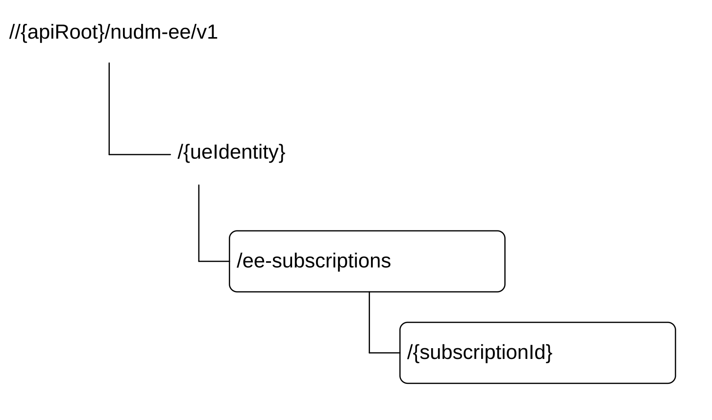

# 6.4.3 Resources

## 6.4.3.1 Overview

This clause describes the structure for the Resource URIs and the resources and methods used for the service.

Figure 6.4.3.1-1 depicts the resource URIs structure for the Nudm_EE API.

Figure 6.4.3.1-1: Resource URI structure of the Nudm_EE API

Table 6.4.3.1-1 provides an overview of the resources and applicable HTTP methods.

Table 6.4.3.1-1: Resources and methods overview

<table>
<colgroup>
<col style="width: 26%" />
<col style="width: 29%" />
<col style="width: 10%" />
<col style="width: 33%" />
</colgroup>
<thead>
<tr class="header">
<th>Resource name 
(Archetype)</th>
<th>Resource URI</th>
<th>HTTP method or custom operation</th>
<th>Description</th>
</tr>
</thead>
<tbody>
<tr class="odd">
<td>EeSubscriptions 
(Collection)</td>
<td>/{ueIdentity}/ee-subscriptions</td>
<td>POST</td>
<td>Create a subscription</td>
</tr>
<tr class="even">
<td rowspan="2">Individual subscription 
(Document)</td>
<td rowspan="2">/{ueIdentity}/ee-subscriptions/{subscriptionId}</td>
<td>PATCH</td>
<td>Update the subscription identified by {subscriptionId}</td>
</tr>
<tr class="odd">
<td>DELETE</td>
<td>Delete the subscription identified by {subscriptionId}, i.e. unsubscribe</td>
</tr>
</tbody>
</table>

## 6.4.3.2 Resource: EeSubscriptions (Collection)

### 6.4.3.2.1 Description

This resource is used to represent subscriptions to notifications.

### 6.4.3.2.2 Resource Definition

Resource URI: {apiRoot}/nudm-ee/v1/{ueIdentity}/ee-subscriptions

This resource shall support the resource URI variables defined in table 6.4.3.2.2-1.

Table 6.4.3.2.2-1: Resource URI variables for this resource

<table>
<colgroup>
<col style="width: 11%" />
<col style="width: 12%" />
<col style="width: 76%" />
</colgroup>
<thead>
<tr class="header">
<th>Name</th>
<th>Data type</th>
<th>Definition</th>
</tr>
</thead>
<tbody>
<tr class="odd">
<td>apiRoot</td>
<td>string</td>
<td>See clause 6.4.1</td>
</tr>
<tr class="even">
<td>ueIdentity</td>
<td>string</td>
<td>
Represents a single UE or a group of UEs or any UE.

- If representing a single UE, this parameter shall contain the Generic Public Subscription Identifier (see TS 23.501 [2] clause 5.9.8) or Subscription Permanent Identifier (see TS 33.535 [55] clause 6.2.1 for the usage of SUPI in this procedure). 
pattern: "^(msisdn-[0-9]{5,15}|extid-[^@]+@[^@]+|.+|imsi-[0-9]{5,15}|nai-.+|gci-.+|gli-.+)$"

- If representing a group of UEs, this parameter shall contain the External GroupId.

pattern: "^extgroupid-[^@]+@[^@]+$"

- If representing any UE, this parameter shall contain "anyUE".

pattern: "^anyUE$"
</td>
</tr>
</tbody>
</table>

### 6.4.3.2.3 Resource Standard Methods

#### 6.4.3.2.3.1 POST

This method shall support the URI query parameters specified in table 6.4.3.2.3.1-1.

Table 6.4.3.2.3.1-1: URI query parameters supported by the POST method on this resource

|      |           |     |             |             |
|------|-----------|-----|-------------|-------------|
| Name | Data type | P   | Cardinality | Description |
| n/a  |           |     |             |             |

This method shall support the request data structures specified in table 6.4.3.2.3.1-2 and the response data structures and response codes specified in table 6.4.3.2.3.1-3.

Table 6.4.3.2.3.1-2: Data structures supported by the POST Request Body on this resource

|                |     |             |                                        |
|----------------|-----|-------------|----------------------------------------|
| Data type      | P   | Cardinality | Description                            |
| EeSubscription | M   | 1           | The subscription that is to be created |

Table 6.4.3.2.3.1-3: Data structures supported by the POST Response Body on this resource

<table>
<colgroup>
<col style="width: 16%" />
<col style="width: 4%" />
<col style="width: 12%" />
<col style="width: 11%" />
<col style="width: 54%" />
</colgroup>
<tbody>
<tr class="odd">
<td>Data type</td>
<td>P</td>
<td>Cardinality</td>
<td>
Response

codes
</td>
<td>Description</td>
</tr>
<tr class="even">
<td>CreatedEeSubscription</td>
<td>M</td>
<td>1</td>
<td>201 Created</td>
<td>
Upon success, a response body containing a representation of the created Individual subscription resource shall be returned.

The HTTP response shall include a "Location" HTTP header that contains the resource URI of the created resource. When stateless UDM is deployed, the stateless UDM may use an FQDN identifying the UDM group to which the UDM belongs as the host part of the resource URI.
</td>
</tr>
<tr class="odd">
<td>EeSubscriptionError</td>
<td>O</td>
<td>0..1</td>
<td>403 Forbidden</td>
<td>
The "cause" attribute may be used to indicate one of the following application errors:

- MONITORING_NOT_ALLOWED

- AF_NOT_ALLOWED

- MTC_PROVIDER_NOT_ALLOWED

- MUTING_EXC_INSTR_NOT_ACCEPTED
</td>
</tr>
<tr class="even">
<td>EeSubscriptionError</td>
<td>O</td>
<td>0..1</td>
<td>404 Not Found</td>
<td>
The "cause" attribute may be used to indicate one of the following application errors:

- USER_NOT_FOUND
</td>
</tr>
<tr class="odd">
<td>EeSubscriptionError</td>
<td>O</td>
<td>0..1</td>
<td>501 Not Implemented</td>
<td>
The "cause" attribute may be used to indicate one of the following application errors:

- UNSUPPORTED_MONITORING_EVENT_TYPE

- UNSUPPORTED_MONITORING_REPORT_OPTIONS

This response shall not be cached.
</td>
</tr>
<tr class="even">
<td colspan="5">NOTE: In addition common data structures as listed in table 5.2.7.1-1 of TS 29.500 [4] are supported.</td>
</tr>
</tbody>
</table>

NOTE: In the scenario of stateless UDM deployment, it is assumed that stateless UDMs are organized into several UDM groups, and for each UDM group an FQDN can be allocated.

Table 6.4.3.2.3.1-4: Headers supported by the 201 Response Code on this resource

| Name     | Data type | P   | Cardinality | Description                                                                                                                                                 |
|----------|-----------|-----|-------------|-------------------------------------------------------------------------------------------------------------------------------------------------------------|
| Location | string    | M   | 1           | Contains the URI of the newly created resource, according to the structure: {apiRoot}/nudm-ee/\<apiVersion\>/{ueIdentity}/ee-subscriptions/{subscriptionId} |

## 6.4.3.3 Resource: Individual subscription (Document)

### 6.4.3.3.1 Resource Definition

Resource URI: {apiRoot}/nudm-ee/v1/{ueIdentity}/ee-subscriptions/{subscriptionId}

This resource shall support the resource URI variables defined in table 6.4.3.3.1-1.

Table 6.4.3.3.1-1: Resource URI variables for this resource

<table>
<colgroup>
<col style="width: 12%" />
<col style="width: 9%" />
<col style="width: 77%" />
</colgroup>
<thead>
<tr class="header">
<th>Name</th>
<th>Data type</th>
<th>Definition</th>
</tr>
</thead>
<tbody>
<tr class="odd">
<td>apiRoot</td>
<td>string</td>
<td>See clause 6.1.1</td>
</tr>
<tr class="even">
<td>ueIdentity</td>
<td>string</td>
<td>
Represents a single UE or a group of UEs or any UE.

- If representing a single UE, this parameter shall contain the Generic Public Subscription Identifier (see TS 23.501 [2] clause 5.9.8) or Subscription Permanent Identifier (see TS 33.535 [55] clause 6.2.1 for the usage of SUPI in this procedure) 
pattern: "^(msisdn-[0-9]{5,15}|extid-[^@]+@[^@]+|.+|imsi-[0-9]{5,15}|nai-.+|gci-.+|gli-.+)$"

- If representing a group of UEs, this parameter shall contain the External GroupId.

pattern: "^extgroupid-[^@]+@[^@]+$"

- If representing any UE, this parameter shall contain "anyUE".

pattern: "^anyUE$"
</td>
</tr>
<tr class="odd">
<td>subscriptionId</td>
<td>string</td>
<td>The subscriptionId identifies an individual subscription to notifications.</td>
</tr>
</tbody>
</table>

### 6.4.3.3.2 Resource Standard Methods

#### 6.4.3.3.2.1 DELETE

This method shall support the URI query parameters specified in table 6.4.3.3.2.1-1.

Table 6.4.3.3.1.1-1: URI query parameters supported by the DELETE method on this resource

|      |           |     |             |             |
|------|-----------|-----|-------------|-------------|
| Name | Data type | P   | Cardinality | Description |
| n/a  |           |     |             |             |

This method shall support the request data structures specified in table 6.4.3.3.2.1-2 and the response data structures and response codes specified in table 6.4.3.3.2.1-3.

Table 6.4.3.3.2.1-2: Data structures supported by the Delete Request Body on this resource

|           |     |             |                                  |
|-----------|-----|-------------|----------------------------------|
| Data type | P   | Cardinality | Description                      |
| n/a       |     |             | The request body shall be empty. |

Table 6.4.3.3.2.1-3: Data structures supported by the DELETE Response Body on this resource

<table>
<colgroup>
<col style="width: 16%" />
<col style="width: 4%" />
<col style="width: 12%" />
<col style="width: 11%" />
<col style="width: 54%" />
</colgroup>
<tbody>
<tr class="odd">
<td>Data type</td>
<td>P</td>
<td>Cardinality</td>
<td>
Response

codes
</td>
<td>Description</td>
</tr>
<tr class="even">
<td>n/a</td>
<td></td>
<td></td>
<td>204 No Content</td>
<td>Upon success, an empty response body shall be returned.</td>
</tr>
<tr class="odd">
<td>ProblemDetails</td>
<td>O</td>
<td>0..1</td>
<td>404 Not Found</td>
<td>
The "cause" attribute may be used to indicate one of the following application errors:

- USER_NOT_FOUND

- SUBSCRIPTION_NOT_FOUND, see TS 29.500 [4] table 5.2.7.2-1.
</td>
</tr>
<tr class="even">
<td colspan="5">NOTE: In addition common data structures as listed in table 5.2.7.1-1 of TS 29.500 [4] are supported.</td>
</tr>
</tbody>
</table>

#### 6.4.3.3.2.2 PATCH

This method shall support the URI query parameters specified in table 6.4.3.3.2.2-1.

Table 6.4.3.3.2.2-1: URI query parameters supported by the PATCH method on this resource

|                    |                   |     |             |                                |
|--------------------|-------------------|-----|-------------|--------------------------------|
| Name               | Data type         | P   | Cardinality | Description                    |
| supported-features | SupportedFeatures | O   | 0..1        | see TS 29.500 \[4\] clause 6.6 |

This method shall support the request data structures specified in table 6.4.3.3.2.2-2 and the response data structures and response codes specified in table 6.4.3.3.2.2-3.

Table 6.4.3.3.2.2-2: Data structures supported by the PATCH Request Body on this resource

|                  |     |             |                                                            |
|------------------|-----|-------------|------------------------------------------------------------|
| Data type        | P   | Cardinality | Description                                                |
| array(PatchItem) | M   | 1..N        | Items describe the modifications to the Event Subscription |

Table 6.4.3.3.2.2-3: Data structures supported by the PATCH Response Body on this resource

<table style="width:100%;">
<colgroup>
<col style="width: 0%" />
<col style="width: 16%" />
<col style="width: 0%" />
<col style="width: 4%" />
<col style="width: 12%" />
<col style="width: 0%" />
<col style="width: 11%" />
<col style="width: 0%" />
<col style="width: 53%" />
<col style="width: 1%" />
</colgroup>
<tbody>
<tr class="odd">
<td colspan="2">Data type</td>
<td>P</td>
<td>Cardinality</td>
<td colspan="2">
Response

codes
</td>
<td colspan="2">Description</td>
<td></td>
<td></td>
</tr>
<tr class="even">
<td colspan="2">n/a</td>
<td></td>
<td></td>
<td colspan="2">204 No Content</td>
<td colspan="2">Upon success, an empty response body shall be returned. (NOTE 2)</td>
<td></td>
<td></td>
</tr>
<tr class="odd">
<td colspan="2">PatchResult</td>
<td colspan="2">M</td>
<td colspan="2">1</td>
<td colspan="2">200 OK</td>
<td colspan="2">Upon success, the execution report is returned. (NOTE 2)</td>
</tr>
<tr class="even">
<td colspan="2" rowspan="2">ProblemDetails</td>
<td>O</td>
<td>0..1</td>
<td colspan="2">404 Not Found</td>
<td colspan="2">
The "cause" attribute may be used to indicate one of the following application errors:

- USER_NOT_FOUND

- SUBSCRIPTION_NOT_FOUND, see TS 29.500 [4] table 5.2.7.2-1.
</td>
<td></td>
<td></td>
</tr>
<tr class="odd">
<td>O</td>
<td>0..1</td>
<td colspan="2">403 Forbidden</td>
<td colspan="2">
One or more attributes are not allowed to be modified.

The "cause" attribute may be used to indicate one of the following application errors:

- MODIFICATION_NOT_ALLOWED, see TS 29.500 [4] table 5.2.7.2-1.

- MUTING_EXC_INSTR_NOT_ACCEPTED
</td>
<td></td>
<td></td>
</tr>
<tr class="even">
<td colspan="8">
NOTE 1: In addition common data structures as listed in table 5.2.7.1-1 of TS 29.500 [4] are supported.

NOTE 2: If all the modification instructions in the PATCH request have been implemented, the UDM shall respond with 204 No Content response; if some of the modification instructions in the PATCH request have been discarded, and the NF service consumer has included in the supported-feature query parameter the "PatchReport" feature number, the UDM shall respond with PatchResult.
</td>
<td></td>
<td></td>
</tr>
</tbody>
</table>
