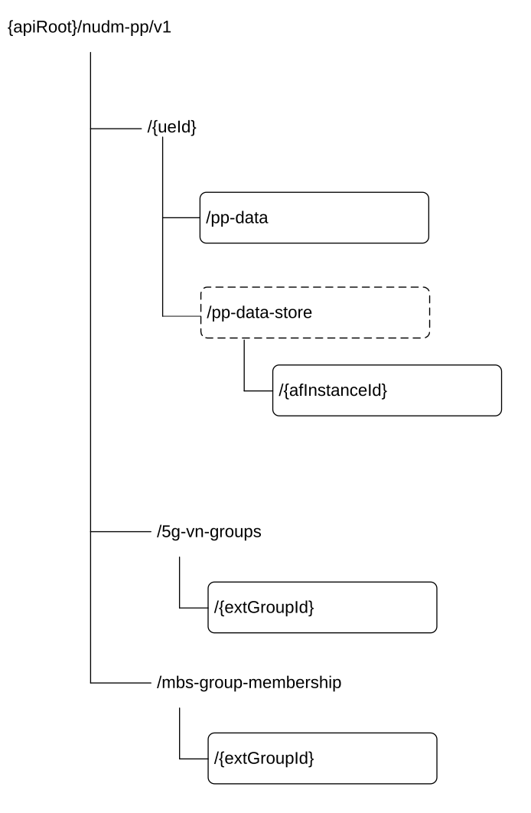

# 6.5.3 Resources

## 6.5.3.1 Overview

This clause describes the structure for the Resource URIs and the resources and methods used for the service.

Figure 6.5.3.1-1 depicts the resource URIs structure for the Nudm_PP API.

Figure 6.5.3.1-1: Resource URI structure of the Nudm_PP API

Table 6.5.3.1-1 provides an overview of the resources and applicable HTTP methods.

Table 6.5.3.1-1: Resources and methods overview

<table>
<colgroup>
<col style="width: 29%" />
<col style="width: 29%" />
<col style="width: 10%" />
<col style="width: 31%" />
</colgroup>
<thead>
<tr class="header">
<th>Resource name</th>
<th>Resource URI</th>
<th>HTTP method or custom operation</th>
<th>Description</th>
</tr>
</thead>
<tbody>
<tr class="odd">
<td>PpData</td>
<td>/{ueId}/pp-data</td>
<td>PATCH</td>
<td>
Modify the UE's modifiable subscription data

Send updated SoR Information for a UE to the UDM
</td>
</tr>
<tr class="even">
<td rowspan="4">5GVnGroupConfiguration</td>
<td rowspan="4">/5g-vn-groups/{extGroupId}</td>
<td>PUT</td>
<td>Create a 5G VN Group</td>
</tr>
<tr class="odd">
<td>DELETE</td>
<td>Delete a 5G VN Group</td>
</tr>
<tr class="even">
<td>PATCH</td>
<td>Modify a 5G VN Group</td>
</tr>
<tr class="odd">
<td>GET</td>
<td>Retrieve a 5G VN Group</td>
</tr>
<tr class="even">
<td rowspan="3">ParameterProvisioningDataEntry</td>
<td rowspan="3">/{ueId}/pp-data-store/{afInstanceId}</td>
<td>PUT</td>
<td>Create or update a Parameter Provisioning Data entry per AF</td>
</tr>
<tr class="odd">
<td>DELETE</td>
<td>Delete a Parameter Provisioning Data entry per AF</td>
</tr>
<tr class="even">
<td>GET</td>
<td>Retrieve a Parameter Provisioning Data entry per AF</td>
</tr>
<tr class="odd">
<td rowspan="4">MulticastMbsGroupMemb</td>
<td rowspan="4">/mbs-group-membership/{extGroupId}</td>
<td>PUT</td>
<td>Create a 5G MBS Group</td>
</tr>
<tr class="even">
<td>DELETE</td>
<td>Delete a 5G MBS Group</td>
</tr>
<tr class="odd">
<td>PATCH</td>
<td>Delete a 5G MBS Group</td>
</tr>
<tr class="even">
<td>GET</td>
<td>Retrieve a 5G MBS Group</td>
</tr>
</tbody>
</table>

## 6.5.3.2 Resource: PpData

### 6.5.3.2.1 Description

This resource is used to represent Parameter Provisioning Data.

### 6.5.3.2.2 Resource Definition

Resource URI: {apiRoot}/nudm-pp/v1/{ueId}/pp-data

This resource shall support the resource URI variables defined in table 6.5.3.2.2-1.

Table 6.5.3.2.2-1: Resource URI variables for this resource

<table>
<colgroup>
<col style="width: 11%" />
<col style="width: 11%" />
<col style="width: 77%" />
</colgroup>
<thead>
<tr class="header">
<th>Name</th>
<th>Data type</th>
<th>Definition</th>
</tr>
</thead>
<tbody>
<tr class="odd">
<td>apiRoot</td>
<td>string</td>
<td>See clause 6.5.1</td>
</tr>
<tr class="even">
<td>ueId</td>
<td>string</td>
<td>
Represents a single UE or a group of UEs.

- If representing a single UE, this parameter shall contain the Generic Public Subscription Identifier (see TS 23.501 [2] clause 5.9.8) or SUPI. 
pattern: See pattern of data type VarUeId in TS 29.571 [7]

- If representing a group of UEs, this parameter shall contain the External GroupId.

pattern: "^extgroupid-[^@]+@[^@]+$"
</td>
</tr>
</tbody>
</table>

### 6.5.3.2.3 Resource Standard Methods

#### 6.5.3.2.3.1 PATCH

This method shall support the URI query parameters specified in table 6.5.3.2.3.1-1.

Table 6.5.3.2.3.1-1: URI query parameters supported by the PATCH method on this resource

|                          |                        |     |             |                                                                                                  |
|--------------------------|------------------------|-----|-------------|--------------------------------------------------------------------------------------------------|
| Name                     | Data type              | P   | Cardinality | Description                                                                                      |
| af-instance-id           | string                 | O   | 0..1        | Identifies the originating AF, for Parameter Provisioning authorization.                         |
| mtc-provider-information | MtcProviderInformation | O   | 0..1        | Identifies the MTC provider originating the operation, for Parameter Provisioning authorization. |
| supported-features       | SupportedFeatures      | O   | 0..1        | see TS 29.500 \[4\] clause 6.6                                                                   |

This method shall support the request data structures specified in table 6.5.3.2.3.1-2 and the response data structures and response codes specified in table 6.5.3.2.3.1-3.

Table 6.5.3.2.3.1-2: Data structures supported by the PATCH Request Body on this resource

|           |     |             |                                                                                            |
|-----------|-----|-------------|--------------------------------------------------------------------------------------------|
| Data type | P   | Cardinality | Description                                                                                |
| PpData    | M   | 1           | Contains the data to be provisioned or the updated SoR Information to be conveyed to a UE. |

Table 6.5.3.2.3.1-3: Data structures supported by the PATCH Response Body on this resource

<table>
<colgroup>
<col style="width: 16%" />
<col style="width: 4%" />
<col style="width: 12%" />
<col style="width: 11%" />
<col style="width: 54%" />
</colgroup>
<tbody>
<tr class="odd">
<td>Data type</td>
<td>P</td>
<td>Cardinality</td>
<td>
Response

codes
</td>
<td>Description</td>
</tr>
<tr class="even">
<td>n/a</td>
<td></td>
<td></td>
<td>204 No Content</td>
<td>Upon success, an empty response body shall be returned. (NOTE 2)</td>
</tr>
<tr class="odd">
<td>PatchResult</td>
<td>M</td>
<td>1</td>
<td>200 OK</td>
<td>
Upon success, the execution report is returned.

If some modification instructions were not accepted, the "reason" attribute in ReportItem may be used to indicate one of the following application errors:

- CONFIDENCE_LEVEL_NOT_SUFFICIENT

- ACCURACY_LEVEL_NOT_SUFFICIENT

(NOTE 2)
</td>
</tr>
<tr class="even">
<td>ProblemDetails</td>
<td>O</td>
<td>0..1</td>
<td>400 Bad Request</td>
<td>
If the Confidence or Accuracy level contained within the patch request is out of range, the "cause" attribute may be used to indicate one of the following application errors:

- CONFIDENCE_LEVEL_OUT_OF_RANGE

- ACCURACY_LEVEL_OUT_OF_RANGE
</td>
</tr>
<tr class="odd">
<td>ProblemDetails</td>
<td>O</td>
<td>0..1</td>
<td>404 Not Found</td>
<td>
The "cause" attribute may be used to indicate one of the following application errors:

- USER_NOT_FOUND
</td>
</tr>
<tr class="even">
<td>ProblemDetails</td>
<td>O</td>
<td>0..1</td>
<td>403 Forbidden</td>
<td>
The "cause" attribute may be used to indicate one of the following application errors:

- MODIFICATION_NOT_ALLOWED

- DETACHED_USER

- AF_NOT_ALLOWED

- MTC_PROVIDER_NOT_ALLOWED
</td>
</tr>
<tr class="odd">
<td colspan="5">
NOTE 1: In addition common data structures as listed in table 5.2.7.1-1 of TS 29.500 [4] are supported.

NOTE 2: If all the modification instructions in the PATCH request have been implemented, the UDM shall respond with 204 No Content response; if some of the modification instructions in the PATCH request have been discarded, and the NF service consumer has included in the supported-feature query parameter the "PatchReport" feature number, the UDM shall respond with a 200 OK including PatchResult.
</td>
</tr>
</tbody>
</table>

## 6.5.3.3 Resource: 5GVnGroupConfiguration

### 6.5.3.3.1 Description

This resource is used to represent 5G VN Group Configuration.

### 6.5.3.3.2 Resource Definition

Resource URI: {apiRoot}/nudm-pp/\<apiVersion\>/5g-vn-groups/{extGroupId}

This resource shall support the resource URI variables defined in table 6.5.3.3.2-1.

Table 6.5.3.3.2-1: Resource URI variables for this resource

<table>
<colgroup>
<col style="width: 11%" />
<col style="width: 12%" />
<col style="width: 76%" />
</colgroup>
<thead>
<tr class="header">
<th>Name</th>
<th>Data type</th>
<th>Definition</th>
</tr>
</thead>
<tbody>
<tr class="odd">
<td>apiRoot</td>
<td>string</td>
<td>See clause 6.5.1</td>
</tr>
<tr class="even">
<td>extGroupId</td>
<td>ExtGroupId</td>
<td>Represents the external Identifier of the 5G VN group 
pattern: "^extgroupid-[^@]+@[^@]+$"</td>
</tr>
</tbody>
</table>

### 6.5.3.3.3 Resource Standard Methods

#### 6.5.3.3.3.1 PUT

This method shall support the URI query parameters specified in table 6.5.3.3.3.1-1.

Table 6.5.3.3.3.1-1: URI query parameters supported by the PUT method on this resource

|      |           |     |             |             |
|------|-----------|-----|-------------|-------------|
| Name | Data type | P   | Cardinality | Description |
| n/a  |           |     |             |             |

This method shall support the request data structures specified in table 6.5.3.3.3.1-2 and the response data structures and response codes specified in table 6.5.3.3.3.1-3.

Table 6.5.3.3.3.1-2: Data structures supported by the PUT Request Body on this resource

|                        |     |             |                                               |
|------------------------|-----|-------------|-----------------------------------------------|
| Data type              | P   | Cardinality | Description                                   |
| 5GVnGroupConfiguration | M   | 1           | Contains the configuration of the 5G VN Group |

Table 6.5.3.3.3.1-3: Data structures supported by the PUT Response Body on this resource

<table>
<colgroup>
<col style="width: 16%" />
<col style="width: 4%" />
<col style="width: 12%" />
<col style="width: 11%" />
<col style="width: 54%" />
</colgroup>
<tbody>
<tr class="odd">
<td>Data type</td>
<td>P</td>
<td>Cardinality</td>
<td>
Response

codes
</td>
<td>Description</td>
</tr>
<tr class="even">
<td>n/a</td>
<td></td>
<td></td>
<td>201 Created</td>
<td>Upon success, an empty response shall be returned.</td>
</tr>
<tr class="odd">
<td>ProblemDetails</td>
<td>O</td>
<td>0..1</td>
<td>403 Forbidden</td>
<td>
The "cause" attribute may be used to indicate one of the following application errors:

- CREATION_NOT_ALLOWED

- AF_NOT_ALLOWED

- MTC_PROVIDER_NOT_ALLOWED
</td>
</tr>
<tr class="even">
<td colspan="5">NOTE: In addition common data structures as listed in table 5.2.7.1-1 of TS 29.500 [4] are supported.</td>
</tr>
</tbody>
</table>

#### 6.5.3.3.3.2 DELETE

This method shall support the URI query parameters specified in table 6.5.3.3.3.1-1.

Table 6.5.3.3.3.2-1: URI query parameters supported by the DELETE method on this resource

<table>
<colgroup>
<col style="width: 16%" />
<col style="width: 14%" />
<col style="width: 4%" />
<col style="width: 11%" />
<col style="width: 52%" />
</colgroup>
<tbody>
<tr class="odd">
<td>Name</td>
<td>Data type</td>
<td>P</td>
<td>Cardinality</td>
<td>Description</td>
</tr>
<tr class="even">
<td>mtc-provider-info</td>
<td>MtcProviderInformation</td>
<td>O</td>
<td>0..1</td>
<td>The mtc-provider-info contains the MTC Provider information that originates 5G-VN-Group deletion, it is used by the UDM to check whether the MTC Provider is allowed to perform this operation for the UE if the MTC provider authorization is required.</td>
</tr>
<tr class="odd">
<td>af-id</td>
<td>string</td>
<td>O</td>
<td>0..1</td>
<td>
The af-Id contains the AF ID that originates 5G-VN-Group deletion, it is used by the UDM to check whether the AF is allowed to perform this operation for the UE if the AF authorization is required.

It is formatted as described in the definition of type MonitoringConfiguration.
</td>
</tr>
</tbody>
</table>

This method shall support the request data structures specified in table 6.5.3.3.3.1-2 and the response data structures and response codes specified in table 6.5.3.3.3.1-3.

Table 6.5.3.3.3.2-2: Data structures supported by the DELETE Request Body on this resource

|           |     |             |             |
|-----------|-----|-------------|-------------|
| Data type | P   | Cardinality | Description |
| n/a       |     |             |             |

Table 6.5.3.3.3.2-3: Data structures supported by the DELETE Response Body on this resource

<table>
<colgroup>
<col style="width: 16%" />
<col style="width: 4%" />
<col style="width: 12%" />
<col style="width: 11%" />
<col style="width: 54%" />
</colgroup>
<tbody>
<tr class="odd">
<td>Data type</td>
<td>P</td>
<td>Cardinality</td>
<td>
Response

codes
</td>
<td>Description</td>
</tr>
<tr class="even">
<td>n/a</td>
<td></td>
<td></td>
<td>204 No Content</td>
<td>Upon success, an empty response body shall be returned</td>
</tr>
<tr class="odd">
<td>ProblemDetails</td>
<td>O</td>
<td>0..1</td>
<td>404 Not Found</td>
<td>
The "cause" attribute may be used to indicate one of the following application errors:

- GROUP_IDENTIFIER_NOT_FOUND
</td>
</tr>
<tr class="even">
<td>ProblemDetails</td>
<td>O</td>
<td>0..1</td>
<td>403 Forbidden</td>
<td>
The "cause" attribute may be used to indicate one of the following application errors:

- AF_NOT_ALLOWED

- MTC_PROVIDER_NOT_ALLOWED
</td>
</tr>
<tr class="odd">
<td colspan="5">NOTE: In addition common data structures as listed in table 5.2.7.1-1 of TS 29.500 [4] are supported.</td>
</tr>
</tbody>
</table>

#### 6.5.3.3.3.3 PATCH

This method shall support the URI query parameters specified in table 6.5.3.3.3.3-1.

Table 6.5.3.3.3.3-1: URI query parameters supported by the PATCH method on this resource

|                    |                   |     |             |                                |
|--------------------|-------------------|-----|-------------|--------------------------------|
| Name               | Data type         | P   | Cardinality | Description                    |
| supported-features | SupportedFeatures | O   | 0..1        | see TS 29.500 \[4\] clause 6.6 |

This method shall support the request data structures specified in table 6.5.3.3.3.3-2 and the response data structures and response codes specified in table 6.5.3.3.3.3-3.

Table 6.5.3.3.3.3-2: Data structures supported by the PATCH Request Body on this resource

|                                    |     |             |                                       |
|------------------------------------|-----|-------------|---------------------------------------|
| Data type                          | P   | Cardinality | Description                           |
| 5GVnGroupConfigurationModification | M   | 1           | Contains the modification instruction |

Table 6.5.3.3.3.3-3: Data structures supported by the PATCH Response Body on this resource

<table>
<colgroup>
<col style="width: 16%" />
<col style="width: 4%" />
<col style="width: 12%" />
<col style="width: 11%" />
<col style="width: 54%" />
</colgroup>
<tbody>
<tr class="odd">
<td>Data type</td>
<td>P</td>
<td>Cardinality</td>
<td>
Response

codes
</td>
<td>Description</td>
</tr>
<tr class="even">
<td>n/a</td>
<td></td>
<td></td>
<td>204 No Content</td>
<td>Upon success, an empty response body shall be returned. (NOTE 2)</td>
</tr>
<tr class="odd">
<td>PatchResult</td>
<td>M</td>
<td>1</td>
<td>200 OK</td>
<td>Upon success, the execution report is returned. (NOTE 2)</td>
</tr>
<tr class="even">
<td>ProblemDetails</td>
<td>O</td>
<td>0..1</td>
<td>404 Not Found</td>
<td>
The "cause" attribute may be used to indicate one of the following application errors:

- GROUP_IDENTIFIER_NOT_FOUND
</td>
</tr>
<tr class="odd">
<td>ProblemDetails</td>
<td>O</td>
<td>0..1</td>
<td>403 Forbidden</td>
<td>
The "cause" attribute may be used to indicate one of the following application errors:

- MODIFICATION_NOT_ALLOWED

- AF_NOT_ALLOWED

- MTC_PROVIDER_NOT_ALLOWED
</td>
</tr>
<tr class="even">
<td colspan="5">
NOTE 1: In addition common data structures as listed in table 5.2.7.1-1 of TS 29.500 [4] are supported.

NOTE 2: If all the modification instructions in the PATCH request have been implemented, the UDM shall respond with 204 No Content response; if some of the modification instructions in the PATCH request have been discarded, and the NF service consumer has included in the supported-feature query parameter the "PatchReport" feature number, the UDR shall respond with PatchResult.
</td>
</tr>
</tbody>
</table>

#### 6.5.3.3.3.4 GET

This method shall support the URI query parameters specified in table 6.5.3.3.3.4-1.

Table 6.5.3.3.3.4-1: URI query parameters supported by the GET method on this resource

|      |           |     |             |             |
|------|-----------|-----|-------------|-------------|
| Name | Data type | P   | Cardinality | Description |
| N/A  |           |     |             |             |

This method shall support the response data structures and response codes specified in table 6.5.3.3.3.4-2.

Table 6.5.3.3.3.4-2: Data structures supported by the GET Request Body on this resource

|           |     |             |             |
|-----------|-----|-------------|-------------|
| Data type | P   | Cardinality | Description |
| N/A       |     |             |             |

Table 6.5.3.3.3.4-3: Data structures supported by the GET Response Body on this resource

<table>
<colgroup>
<col style="width: 16%" />
<col style="width: 4%" />
<col style="width: 12%" />
<col style="width: 11%" />
<col style="width: 54%" />
</colgroup>
<tbody>
<tr class="odd">
<td>Data type</td>
<td>P</td>
<td>Cardinality</td>
<td>
Response

codes
</td>
<td>Description</td>
</tr>
<tr class="even">
<td>5GVnGroupConfiguration</td>
<td></td>
<td></td>
<td>200 OK</td>
<td></td>
</tr>
<tr class="odd">
<td>ProblemDetails</td>
<td>O</td>
<td>0..1</td>
<td>404 Not Found</td>
<td>
The "cause" attribute may be used to indicate one of the following application errors:

- GROUP_IDENTIFIER_NOT_FOUND
</td>
</tr>
<tr class="even">
<td>ProblemDetails</td>
<td>O</td>
<td>0..1</td>
<td>403 Forbidden</td>
<td>
The "cause" attribute may be used to indicate one of the following application errors:

- AF_NOT_ALLOWED
</td>
</tr>
</tbody>
</table>

## 6.5.3.4 Resource: ParameterProvisioningDataEntry

### 6.5.3.4.1 Description

This resource is used to allow the storage of different Parameter Provisioning entries for different Application Functions.

This resource is modelled with the Document resource archetype (see clause C.1 of TS 29.501 \[5\]).

### 6.5.3.4.2 Resource Definition

Resource URI: {apiRoot}/nudm-pp/\<apiVersion\>/{ueId}/pp-data-store/{afInstanceId}

This resource shall support the resource URI variables defined in table 6.5.3.4.2-1.

Table 6.5.3.4.2-1: Resource URI variables for this resource

<table>
<colgroup>
<col style="width: 11%" />
<col style="width: 12%" />
<col style="width: 75%" />
</colgroup>
<thead>
<tr class="header">
<th>Name</th>
<th>Data type</th>
<th>Definition</th>
</tr>
</thead>
<tbody>
<tr class="odd">
<td>apiRoot</td>
<td>string</td>
<td>See clause 6.5.1</td>
</tr>
<tr class="even">
<td>ueId</td>
<td>string</td>
<td>
Represents the Subscription Identifier SUPI, GPSI, Group Id or anyUE (see TS 23.501 [4] clause 5.9.2)

- If representing a single UE, this parameter shall contain the GPSI or SUPI. 
pattern: See pattern of type VarUeId TS 29.571 [7]

- If representing a group of UEs, this parameter shall contain the External GroupId.

pattern: "^extgroupid-[^@]+@[^@]+$"

- If representing any UE, this parameter shall contain "anyUE".

pattern: "^anyUE$"
</td>
</tr>
<tr class="odd">
<td>afInstanceId</td>
<td>string</td>
<td>The string identifying the originating AF. (NOTE)</td>
</tr>
<tr class="even">
<td colspan="3">NOTE: When the service operation is originated by external AF via T8/N33 interface, information carried in {scsAsId} URI variable in resource URIs on T8/N33 interface (see clause 5 of TS 29.122 [45]) or in {afId} URI variable in resource URIs on N33 interface (see clause 5 of TS 29.522 [54]) can be used as the value for this IE.</td>
</tr>
</tbody>
</table>

### 6.5.3.4.3 Resource Standard Methods

#### 6.5.3.4.3.1 PUT

This method shall support the URI query parameters specified in table 6.5.3.4.3.1-1.

Table 6.5.3.4.3.1-1: URI query parameters supported by the PUT method on this resource

|      |           |     |             |             |
|------|-----------|-----|-------------|-------------|
| Name | Data type | P   | Cardinality | Description |
| n/a  |           |     |             |             |

This method shall support the request data structures specified in table 6.5.3.4.3.1-2 and the response data structures and response codes specified in table 6.5.3.4.3.1-3.

Table 6.5.3.4.3.1-2: Data structures supported by the PUT Request Body on this resource

|             |     |             |                                              |
|-------------|-----|-------------|----------------------------------------------|
| Data type   | P   | Cardinality | Description                                  |
| PpDataEntry | M   | 1           | Contains a Parameter Provisioning Data entry |

Table 6.5.3.4.3.1-3: Data structures supported by the PUT Response Body on this resource

<table>
<colgroup>
<col style="width: 16%" />
<col style="width: 4%" />
<col style="width: 12%" />
<col style="width: 11%" />
<col style="width: 54%" />
</colgroup>
<tbody>
<tr class="odd">
<td>Data type</td>
<td>P</td>
<td>Cardinality</td>
<td>
Response

codes
</td>
<td>Description</td>
</tr>
<tr class="even">
<td>PpDataEntry</td>
<td>M</td>
<td>1</td>
<td>201 Created</td>
<td>Indicates a successful creation of the resource.</td>
</tr>
<tr class="odd">
<td>n/a</td>
<td></td>
<td></td>
<td>204 No Content</td>
<td>Indicates a successful update of the resource. An empty response shall be returned.</td>
</tr>
<tr class="even">
<td>ProblemDetails</td>
<td>O</td>
<td>0..1</td>
<td>403 Forbidden</td>
<td>
The "cause" attribute may be used to indicate one of the following application errors:

- CREATION_NOT_ALLOWED

- AF_NOT_ALLOWED

- MTC_PROVIDER_NOT_ALLOWED
</td>
</tr>
<tr class="odd">
<td>ProblemDetails</td>
<td>O</td>
<td>0..1</td>
<td>404 Not Found</td>
<td>
The "cause" attribute may be used to indicate one of the following application errors:

- USER_NOT_FOUND
</td>
</tr>
<tr class="even">
<td colspan="5">NOTE: In addition, common data structures as listed in table 5.2.7.1-1 of TS 29.500 [4] are supported.</td>
</tr>
</tbody>
</table>

#### 6.5.3.4.3.2 DELETE

This method shall support the URI query parameters specified in table 6.5.3.4.3.2-1.

Table 6.5.3.4.3.2-1: URI query parameters supported by the DELETE method on this resource

|                          |                        |     |             |                                                                                                  |
|--------------------------|------------------------|-----|-------------|--------------------------------------------------------------------------------------------------|
| Name                     | Data type              | P   | Cardinality | Description                                                                                      |
| mtc-provider-information | MtcProviderInformation | O   | 0..1        | Identifies the MTC provider originating the operation, for Parameter Provisioning authorization. |

This method shall support the request data structures specified in table 6.5.3.4.3.2-2 and the response data structures and response codes specified in table 6.5.3.4.3.2-3.

Table 6.5.3.4.3.2-2: Data structures supported by the DELETE Request Body on this resource

|           |     |             |             |
|-----------|-----|-------------|-------------|
| Data type | P   | Cardinality | Description |
| n/a       |     |             |             |

Table 6.5.3.4.3.2-3: Data structures supported by the DELETE Response Body on this resource

<table>
<colgroup>
<col style="width: 16%" />
<col style="width: 4%" />
<col style="width: 12%" />
<col style="width: 11%" />
<col style="width: 54%" />
</colgroup>
<tbody>
<tr class="odd">
<td>Data type</td>
<td>P</td>
<td>Cardinality</td>
<td>
Response

codes
</td>
<td>Description</td>
</tr>
<tr class="even">
<td>n/a</td>
<td></td>
<td></td>
<td>204 No Content</td>
<td>Upon success, an empty response body shall be returned</td>
</tr>
<tr class="odd">
<td>ProblemDetails</td>
<td>O</td>
<td>0..1</td>
<td>403 Forbidden</td>
<td>
The "cause" attribute may be used to indicate one of the following application errors:

- AF_NOT_ALLOWED

- MTC_PROVIDER_NOT_ALLOWED
</td>
</tr>
<tr class="even">
<td>ProblemDetails</td>
<td>O</td>
<td>0..1</td>
<td>404 Not Found</td>
<td>
The "cause" attribute may be used to indicate one of the following application errors:

- CONTEXT_NOT_FOUND
</td>
</tr>
<tr class="odd">
<td colspan="5">NOTE: In addition, common data structures as listed in table 5.2.7.1-1 of TS 29.500 [4] are supported.</td>
</tr>
</tbody>
</table>

#### 6.5.3.4.3.3 GET

This method shall support the URI query parameters specified in table 6.5.3.4.3.3-1.

Table 6.5.3.4.3.3-1: URI query parameters supported by the GET method on this resource

|                          |                        |     |             |                                                                                                  |
|--------------------------|------------------------|-----|-------------|--------------------------------------------------------------------------------------------------|
| Name                     | Data type              | P   | Cardinality | Description                                                                                      |
| mtc-provider-information | MtcProviderInformation | O   | 0..1        | Identifies the MTC provider originating the operation, for Parameter Provisioning authorization. |
| supported-features       | SupportedFeatures      | O   | 0..1        | see TS 29.500 \[4\] clause 6.6                                                                   |

This method shall support the response data structures and response codes specified in table 6.5.3.4.3.3-3.

Table 6.5.3.4.3.3-2: Data structures supported by the GET Request Body on this resource

|           |     |             |             |
|-----------|-----|-------------|-------------|
| Data type | P   | Cardinality | Description |
| n/a       |     |             |             |

Table 6.5.3.4.3.3-3: Data structures supported by the GET Response Body on this resource

<table>
<colgroup>
<col style="width: 16%" />
<col style="width: 4%" />
<col style="width: 12%" />
<col style="width: 11%" />
<col style="width: 54%" />
</colgroup>
<tbody>
<tr class="odd">
<td>Data type</td>
<td>P</td>
<td>Cardinality</td>
<td>
Response

codes
</td>
<td>Description</td>
</tr>
<tr class="even">
<td>PpDataEntry</td>
<td>M</td>
<td>1</td>
<td>200 OK</td>
<td>Upon success, the request body contain the target PPDataEntry.</td>
</tr>
<tr class="odd">
<td>ProblemDetails</td>
<td>O</td>
<td>0..1</td>
<td>403 Forbidden</td>
<td>
The "cause" attribute may be used to indicate one of the following application errors:

- AF_NOT_ALLOWED

- MTC_PROVIDER_NOT_ALLOWED
</td>
</tr>
<tr class="even">
<td>ProblemDetails</td>
<td>O</td>
<td>0..1</td>
<td>404 Not Found</td>
<td>
The "cause" attribute may be used to indicate one of the following application errors:

- CONTEXT_NOT_FOUND
</td>
</tr>
</tbody>
</table>

## 6.5.3.5 Resource: MulticastMbsGroupMemb

### 6.5.3.5.1 Description

This resource is used to represent Multicast MBS Group Membership.

### 6.5.3.5.2 Resource Definition

Resource URI: {apiRoot}/nudm-pp/\<apiVersion\>/mbs-group-membership/{ExtGroupId}

This resource shall support the resource URI variables defined in table 6.5.3.5.2-1.

Table 6.5.3.5.2-1: Resource URI variables for this resource

<table>
<colgroup>
<col style="width: 11%" />
<col style="width: 12%" />
<col style="width: 76%" />
</colgroup>
<thead>
<tr class="header">
<th>Name</th>
<th>Data type</th>
<th>Definition</th>
</tr>
</thead>
<tbody>
<tr class="odd">
<td>apiRoot</td>
<td>string</td>
<td>See clause 6.5.1</td>
</tr>
<tr class="even">
<td>extGroupId</td>
<td>ExtGroupId</td>
<td>Represents the external Identifier of the 5G MBS group 
pattern: "^extgroupid-[^@]+@[^@]+$"</td>
</tr>
</tbody>
</table>

### 6.5.3.5.3 Resource Standard Methods

#### 6.5.3.5.3.1 PUT

This method shall support the URI query parameters specified in table 6.5.3.5.3.1-1.

Table 6.5.3.5.3.1-1: URI query parameters supported by the PUT method on this resource

| Name | Data type | P   | Cardinality | Description |
|------|-----------|-----|-------------|-------------|
| n/a  |           |     |             |             |

This method shall support the request data structures specified in table 6.5.3.5.3.1-2 and the response data structures and response codes specified in table 6.5.3.5.3.1-3.

Table 6.5.3.5.3.1-2: Data structures supported by the PUT Request Body on this resource

| Data type             | P   | Cardinality | Description               |
|-----------------------|-----|-------------|---------------------------|
| MulticastMbsGroupMemb | M   | 1           | Contains the 5G MBS Group |

Table 6.5.3.5.3.1-3: Data structures supported by the PUT Response Body on this resource

<table>
<colgroup>
<col style="width: 16%" />
<col style="width: 4%" />
<col style="width: 12%" />
<col style="width: 11%" />
<col style="width: 54%" />
</colgroup>
<thead>
<tr class="header">
<th>Data type</th>
<th>P</th>
<th>Cardinality</th>
<th>
Response

codes
</th>
<th>Description</th>
</tr>
</thead>
<tbody>
<tr class="odd">
<td>n/a</td>
<td></td>
<td></td>
<td>201 Created</td>
<td>Upon success, an empty response shall be returned.</td>
</tr>
<tr class="even">
<td>ProblemDetails</td>
<td>O</td>
<td>0..1</td>
<td>403 Forbidden</td>
<td>
The "cause" attribute may be used to indicate one of the following application errors:

- CREATION_NOT_ALLOWED

- AF_NOT_ALLOWED
</td>
</tr>
<tr class="odd">
<td colspan="5">NOTE: In addition common data structures as listed in table 5.2.7.1-1 of TS 29.500 [4] are supported.</td>
</tr>
</tbody>
</table>

#### 6.5.3.5.3.2 DELETE

This method shall support the URI query parameters specified in table 6.5.3.5.3.1-1.

Table 6.5.3.5.3.2-1: URI query parameters supported by the DELETE method on this resource

<table>
<colgroup>
<col style="width: 14%" />
<col style="width: 20%" />
<col style="width: 2%" />
<col style="width: 11%" />
<col style="width: 50%" />
</colgroup>
<thead>
<tr class="header">
<th>Name</th>
<th>Data type</th>
<th>P</th>
<th>Cardinality</th>
<th>Description</th>
</tr>
</thead>
<tbody>
<tr class="odd">
<td>af-id</td>
<td>string</td>
<td>O</td>
<td>0..1</td>
<td>
The af-Id contains the AF ID that originates 5G-MBS-Group deletion, it is used by the UDM to check whether the AF is allowed to perform this operation for the UE if the AF authorization is required.

It is formatted as described in the definition of type MonitoringConfiguration.
</td>
</tr>
</tbody>
</table>

This method shall support the request data structures specified in table 6.5.3.5.3.1-2 and the response data structures and response codes specified in table 6.5.3.5.3.1-3.

Table 6.5.3.5.3.2-2: Data structures supported by the DELETE Request Body on this resource

| Data type | P   | Cardinality | Description |
|-----------|-----|-------------|-------------|
| n/a       |     |             |             |

Table 6.5.3.5.3.2-3: Data structures supported by the DELETE Response Body on this resource

<table>
<colgroup>
<col style="width: 16%" />
<col style="width: 4%" />
<col style="width: 12%" />
<col style="width: 11%" />
<col style="width: 54%" />
</colgroup>
<thead>
<tr class="header">
<th>Data type</th>
<th>P</th>
<th>Cardinality</th>
<th>
Response

codes
</th>
<th>Description</th>
</tr>
</thead>
<tbody>
<tr class="odd">
<td>n/a</td>
<td></td>
<td></td>
<td>204 No Content</td>
<td>Upon success, an empty response body shall be returned</td>
</tr>
<tr class="even">
<td>ProblemDetails</td>
<td>O</td>
<td>0..1</td>
<td>404 Not Found</td>
<td>
The "cause" attribute may be used to indicate one of the following application errors:

- GROUP_IDENTIFIER_NOT_FOUND
</td>
</tr>
<tr class="odd">
<td>ProblemDetails</td>
<td>O</td>
<td>0..1</td>
<td>403 Forbidden</td>
<td>
The "cause" attribute may be used to indicate one of the following application errors:

- AF_NOT_ALLOWED
</td>
</tr>
<tr class="even">
<td colspan="5">NOTE: In addition common data structures as listed in table 5.2.7.1-1 of TS 29.500 [4] are supported.</td>
</tr>
</tbody>
</table>

#### 6.5.3.5.3.3 PATCH

This method shall support the URI query parameters specified in table 6.5.3.5.3.3-1.

Table 6.5.3.5.3.3-1: URI query parameters supported by the PATCH method on this resource

| Name               | Data type         | P   | Cardinality | Description                    |
|--------------------|-------------------|-----|-------------|--------------------------------|
| supported-features | SupportedFeatures | O   | 0..1        | see TS 29.500 \[4\] clause 6.6 |

This method shall support the request data structures specified in table 6.5.3.5.3.3-2 and the response data structures and response codes specified in table 6.5.3.5.3.3-3.

Table 6.5.3.5.3.3-2: Data structures supported by the PATCH Request Body on this resource

| Data type             | P   | Cardinality | Description                           |
|-----------------------|-----|-------------|---------------------------------------|
| MulticastMbsGroupMemb | M   | 1           | Contains the modification instruction |

Table 6.5.3.5.3.3-3: Data structures supported by the PATCH Response Body on this resource

<table>
<colgroup>
<col style="width: 16%" />
<col style="width: 4%" />
<col style="width: 12%" />
<col style="width: 11%" />
<col style="width: 54%" />
</colgroup>
<thead>
<tr class="header">
<th>Data type</th>
<th>P</th>
<th>Cardinality</th>
<th>
Response

codes
</th>
<th>Description</th>
</tr>
</thead>
<tbody>
<tr class="odd">
<td>n/a</td>
<td></td>
<td></td>
<td>204 No Content</td>
<td>Upon success, an empty response body shall be returned. (NOTE 2)</td>
</tr>
<tr class="even">
<td>PatchResult</td>
<td>M</td>
<td>1</td>
<td>200 OK</td>
<td>Upon success, the execution report is returned. (NOTE 2)</td>
</tr>
<tr class="odd">
<td>ProblemDetails</td>
<td>O</td>
<td>0..1</td>
<td>404 Not Found</td>
<td>
The "cause" attribute may be used to indicate one of the following application errors:

- GROUP_IDENTIFIER_NOT_FOUND
</td>
</tr>
<tr class="even">
<td>ProblemDetails</td>
<td>O</td>
<td>0..1</td>
<td>403 Forbidden</td>
<td>
The "cause" attribute may be used to indicate one of the following application errors:

- MODIFICATION_NOT_ALLOWED

- AF_NOT_ALLOWED
</td>
</tr>
<tr class="odd">
<td colspan="5">
NOTE 1: In addition common data structures as listed in table 5.2.7.1-1 of TS 29.500 [4] are supported.

NOTE 2: If all the modification instructions in the PATCH request have been implemented, the UDM shall respond with 204 No Content response; if some of the modification instructions in the PATCH request have been discarded, and the NF service consumer has included in the supported-feature query parameter the "PatchReport" feature number, the UDR shall respond with PatchResult.
</td>
</tr>
</tbody>
</table>

#### 6.5.3.5.3.4 GET

This method shall support the URI query parameters specified in table 6.5.3.5.3.4-1.

Table 6.5.3.5.3.4-1: URI query parameters supported by the GET method on this resource

| Name | Data type | P   | Cardinality | Description |
|------|-----------|-----|-------------|-------------|
| N/A  |           |     |             |             |

This method shall support the response data structures and response codes specified in table 6.5.3.5.3.4-2.

Table 6.5.3.5.3.4-2: Data structures supported by the GET Request Body on this resource

| Data type | P   | Cardinality | Description |
|-----------|-----|-------------|-------------|
| N/A       |     |             |             |

Table 6.5.3.5.3.4-3: Data structures supported by the GET Response Body on this resource

<table>
<colgroup>
<col style="width: 22%" />
<col style="width: 2%" />
<col style="width: 11%" />
<col style="width: 10%" />
<col style="width: 52%" />
</colgroup>
<thead>
<tr class="header">
<th>Data type</th>
<th>P</th>
<th>Cardinality</th>
<th>
Response

codes
</th>
<th>Description</th>
</tr>
</thead>
<tbody>
<tr class="odd">
<td>MulticastMbsGroupMemb</td>
<td></td>
<td></td>
<td>200 OK</td>
<td></td>
</tr>
<tr class="even">
<td>ProblemDetails</td>
<td>O</td>
<td>0..1</td>
<td>404 Not Found</td>
<td>
The "cause" attribute may be used to indicate one of the following application errors:

- GROUP_IDENTIFIER_NOT_FOUND
</td>
</tr>
<tr class="odd">
<td>ProblemDetails</td>
<td>O</td>
<td>0..1</td>
<td>403 Forbidden</td>
<td>
The "cause" attribute may be used to indicate one of the following application errors:

- AF_NOT_ALLOWED
</td>
</tr>
</tbody>
</table>
