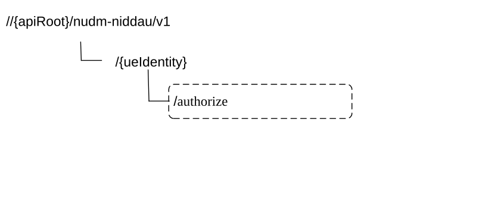

# 6.6 Nudm_NIDDAuthorization Service API

## 6.6.1 API URI

The Nudm_NIDDAuthorization service shall use the Nudm_NIDDAU API.

The API URI of the Nudm_NIDDAU API shall be:

**{apiRoot}/\<apiName\>/\<apiVersion\>**

The request URI used in HTTP request from the NF service consumer towards the NF service producer shall have the structure defined in clause 4.4.1 of TS 29.501 \[5\], i.e.:

**{apiRoot}/\<apiName\>/\<apiVersion\>/\<apiSpecificResourceUriPart\>**

with the following components:

\- The {apiRoot} shall be set as described in TS 29.501 \[5\].

\- The \<apiName\> shall be "nudm-niddau".

\- The \<apiVersion\> shall be "v1".

\- The \<apiSpecificResourceUriPart\> shall be set as described in clause 6.6.3.

## 6.6.2 Usage of HTTP

### 6.6.2.1 General

HTTP/2, as defined in IETF RFC 9113 \[13\], shall be used as specified in clause 5 of TS 29.500 \[4\].

HTTP/2 shall be transported as specified in clause 5.3 of TS 29.500 \[4\].

HTTP messages and bodies for the Nudm_NIDDAuthorization service shall comply with the OpenAPI \[14\] specification contained in Annex A.7.

### 6.6.2.2 HTTP standard headers

#### 6.6.2.2.1 General

The usage of HTTP standard headers shall be supported as specified in clause 5.2.2 of TS 29.500 \[4\].

#### 6.6.2.2.2 Content type

The following content types shall be supported:

JSON, as defined in IETF RFC 8259 \[15\], signalled by the content type "application/json".

The Problem Details JSON Object (IETF RFC 9457 \[16\] signalled by the content type "application/problem+json"

### 6.6.2.3 HTTP custom headers

#### 6.6.2.3.1 General

The usage of HTTP custom headers shall be supported as specified in clause 5.2.3 of TS 29.500 \[4\].

## 6.6.3 Resources

### 6.6.3.1 Overview

This clause describes the structure for the Resource URIs and the resources and methods used for the service.

Figure 6.6.3.1-1 depicts the resource URIs structure for the Nudm_NIDDAU API.

Figure 6.6.3.1-1: Resource URI structure of the Nudm-NIDDAU API

Table 6.6.3.1-1 provides an overview of the resources and applicable HTTP methods.

Table 6.6.3.1-1: Resources and methods overview

<table>
<colgroup>
<col style="width: 27%" />
<col style="width: 29%" />
<col style="width: 10%" />
<col style="width: 32%" />
</colgroup>
<thead>
<tr class="header">
<th>Resource name 
(Archetype)</th>
<th>Resource URI</th>
<th>HTTP method or custom operation</th>
<th>Description</th>
</tr>
</thead>
<tbody>
<tr class="odd">
<td>ueIdentity 
(Document)</td>
<td>/{ueIdentity}/authorize</td>
<td>authorize (POST)</td>
<td>Authorize the NIDD configuration request.</td>
</tr>
</tbody>
</table>

### 6.6.3.2 Resource: ueIdentity (Document)

#### 6.6.3.2.1 Description

This resource represents the UE's subscribed NIDD authorization information for a GPSI or External Group Identifier.

#### 6.6.3.2.2 Resource Definition

Resource URI: {apiRoot}/nudm-niddau/\<apiVersion\>/{ueIdentity}

This resource shall support the resource URI variables defined in table 6.6.3.2.2-1.

Table 6.6.3.2.2-1: Resource URI variables for this resource

<table>
<colgroup>
<col style="width: 10%" />
<col style="width: 11%" />
<col style="width: 77%" />
</colgroup>
<thead>
<tr class="header">
<th>Name</th>
<th>Data type</th>
<th>Definition</th>
</tr>
</thead>
<tbody>
<tr class="odd">
<td>apiRoot</td>
<td>string</td>
<td>See clause 6.6.1</td>
</tr>
<tr class="even">
<td>ueIdentity</td>
<td>string</td>
<td>Represents the GPSI or External Group Identifier (see TS 23.501 [2] clause 7.2.5) 
pattern: "^ (msisdn-[0-9]{5,15}|extid-[^@]+@[^@]+|extgroupid-[^@]+@[^@]+|.+)$"</td>
</tr>
</tbody>
</table>

#### 6.6.3.2.3 Resource Standard Methods

No Standard Methods are supported for this resource.

#### 6.6.3.2.4 Resource Custom Operations

##### 6.6.3.2.4.1 Overview

Table 6.6.3.2.4.1-1: Custom operations

| Operation Name | Custom operation URI | Mapped HTTP method | Description                               |
|----------------|----------------------|--------------------|-------------------------------------------|
| authorize      | /authorize           | POST               | Authorize the NIDD configuration request. |

##### 6.6.3.2.4.2 Operation: authorize

##### 6.6.3.2.4.2.1 Description

This custom operation is used by the NF service consumer (NEF) to request UDM to authorize the NIDD configuration request for the GPSI/External Group Identifier.

##### 6.6.3.2.4.2.2 Operation Definition

This operation shall support the request data structures specified in table 6.6.3.2.4.2.2-1 and the response data structure and response codes specified in table 6.6.3.2.4.2.2-2.

Table 6.6.3.2.4.2.2-1: Data structures supported by the POST Request Body on this resource

|                   |     |             |                                                                |
|-------------------|-----|-------------|----------------------------------------------------------------|
| Data type         | P   | Cardinality | Description                                                    |
| AuthorizationInfo | M   | 1           | Contains S-NSSAI, DNN, MTC Provider Information, callback URI. |

Table 6.6.3.2.4.2.2-2: Data structures supported by the POST Response Body on this resource

<table>
<colgroup>
<col style="width: 16%" />
<col style="width: 4%" />
<col style="width: 13%" />
<col style="width: 11%" />
<col style="width: 54%" />
</colgroup>
<tbody>
<tr class="odd">
<td>Data type</td>
<td>P</td>
<td>Cardinality</td>
<td>
Response

codes
</td>
<td>Description</td>
</tr>
<tr class="even">
<td>AuthorizationData</td>
<td>M</td>
<td>1</td>
<td>200 OK</td>
<td>Upon success, a response body containing the SUPI(s) and GPSI shall be returned.</td>
</tr>
<tr class="odd">
<td>ProblemDetails</td>
<td>O</td>
<td>1</td>
<td>404 Not Found</td>
<td>
The "cause" attribute may be used to indicate one of the following application errors:

- USER_NOT_FOUND
</td>
</tr>
<tr class="even">
<td>ProblemDetails</td>
<td>O</td>
<td>0..1</td>
<td>403 Forbidden</td>
<td>
The "cause" attribute may be used to indicate one of the following application errors:

- DNN_NOT_ALLOWED

- MTC_PROVIDER_NOT_ALLOWED

- AF_INSTANCE_NOT_ALLOWED

- SNSSAI_NOT_ALLOWED
</td>
</tr>
<tr class="odd">
<td colspan="5">NOTE: In addition common data structures as listed in table 5.2.7.1-1 of TS 29.500 [4] are supported.</td>
</tr>
</tbody>
</table>

## 6.6.4 Custom Operations without associated resources

In this release of this specification, no custom operations without associated resources are defined for the Nudm_SubscriberDataManagement Service.

## 6.6.5 Notifications

### 6.6.5.1 General

This clause will specify the use of notifications and corresponding protocol details if required for the specific service. When notifications are supported by the API, it will include a reference to the general description of notifications support over the 5G SBIs specified in TS 29.500 \[4\] / TS 29.501 \[5\].

Table 6.6.5.1-1: Notifications overview

<table>
<colgroup>
<col style="width: 14%" />
<col style="width: 57%" />
<col style="width: 10%" />
<col style="width: 18%" />
</colgroup>
<thead>
<tr class="header">
<th>Notification</th>
<th>Resource URI</th>
<th>HTTP method or custom operation</th>
<th>
Description

(service operation)
</th>
</tr>
</thead>
<tbody>
<tr class="odd">
<td>Authorization Data Update Notification</td>
<td>{authUpdateCallbackUri}</td>
<td>POST</td>
<td></td>
</tr>
</tbody>
</table>

### 6.6.5.2 Nidd Authorization Data Update Notification

The POST method shall be used for Nidd Authorization Data Update Notifications and the Call-back URI shall be provided during the NIDD Authorization Data Retrieval procedure. UDM should continuously generate NIDD authorization Data Update Notifications to service consumer (NEF) for UE for the event until validity time related to the UE expires, and if validity time expires, it indicates unsubscription to notification for the UE.

Resource URI: {authUpdateCallbackUri}

Support of URI query parameters is specified in table 6.6.5.2-1.

Table 6.6.5.2-1: URI query parameters supported by the POST method

|      |           |     |             |             |
|------|-----------|-----|-------------|-------------|
| Name | Data type | P   | Cardinality | Description |
| n/a  |           |     |             |             |

Support of request data structures is specified in table 6.6.5.2-2 and of response data structures and response codes is specified in table 6.6.5.2-3.

Table 6.1.5.2-2: Data structures supported by the POST Request Body

|                            |     |             |             |
|----------------------------|-----|-------------|-------------|
| Data type                  | P   | Cardinality | Description |
| NiddAuthUpdateNotification | M   | 1           |             |

Table 6.6.5.2-3: Data structures supported by the POST Response Body

<table>
<colgroup>
<col style="width: 16%" />
<col style="width: 4%" />
<col style="width: 12%" />
<col style="width: 11%" />
<col style="width: 54%" />
</colgroup>
<tbody>
<tr class="odd">
<td>Data type</td>
<td>P</td>
<td>Cardinality</td>
<td>
Response

codes
</td>
<td>Description</td>
</tr>
<tr class="even">
<td>n/a</td>
<td></td>
<td></td>
<td>204 No Content</td>
<td>Upon success, an empty response body shall be returned.</td>
</tr>
<tr class="odd">
<td colspan="5">NOTE: In addition common data structures as listed in table 6.6.7-1 are supported.</td>
</tr>
</tbody>
</table>

## 6.6.6 Data Model

### 6.6.6.1 General

This clause specifies the application data model supported by the API.

Table 6.6.6.1-1 specifies the structured data types defined for the Nudm_NIDDAU service API. For simple data types defined for the Nudm_NIDDAU service API see table 6.6.6.3.2-1.

Table 6.6.6.1-1: Nudm_NIDDAU specific Data Types

| Data type                  | Clause defined | Description |
|----------------------------|----------------|-------------|
| AuthorizationData          | 6.6.6.2.2      |             |
| UserIdentifier             | 6.6.6.2.3      |             |
| NiddAuthUpdateInfo         | 6.6.6.2.4      |             |
| NiddAuthUpdateNotification | 6.6.6.2.5      |             |
| AuthorizationInfo          | 6.6.6.2.6      |             |
| NiddCause                  | 6.6.6.3.3      |             |

Table 6.6.6.1-2 specifies data types re-used by the Nudm_NIDDAU service API from other specifications and from other service APIs in current specification, including a reference to the respective specifications and when needed, a short description of their use within the Nudm_NIDDAU service API.

Table 6.6.6.1-2: Nudm_NIDDAU re-used Data Types

<table>
<colgroup>
<col style="width: 22%" />
<col style="width: 20%" />
<col style="width: 56%" />
</colgroup>
<thead>
<tr class="header">
<th>Data type</th>
<th>Reference</th>
<th>Comments</th>
</tr>
</thead>
<tbody>
<tr class="odd">
<td>Nssai</td>
<td>6.1.6.2.2</td>
<td>
Defined in the Nudm_SDM API.

Network Slice Selection Assistance Information
</td>
</tr>
<tr class="even">
<td>Gpsi</td>
<td>TS 29.571 [7]</td>
<td>Generic Public Subscription Identifier</td>
</tr>
<tr class="odd">
<td>Supi</td>
<td>TS 29.571 [7]</td>
<td></td>
</tr>
<tr class="even">
<td>Dnn</td>
<td>TS 29.571 [7]</td>
<td>Data Network Name with Network Identifier only.</td>
</tr>
<tr class="odd">
<td>MtcProviderInformation</td>
<td>TS 29.571 [7]</td>
<td></td>
</tr>
<tr class="even">
<td>DateTime</td>
<td>TS 29.571 [7]</td>
<td></td>
</tr>
<tr class="odd">
<td>Snssai</td>
<td>TS 29.571 [7]</td>
<td></td>
</tr>
<tr class="even">
<td>Uri</td>
<td>TS 29.571 [7]</td>
<td></td>
</tr>
<tr class="odd">
<td>NefId</td>
<td>TS 29.510 [19]</td>
<td>NEF ID</td>
</tr>
</tbody>
</table>

### 6.6.6.2 Structured data types

#### 6.6.6.2.1 Introduction

This clause defines the structures to be used in resource representations.

#### 6.6.6.2.2 Type: AuthorizationData

Table 6.6.6.2.2-1: Definition of type AuthorizationData

<table>
<colgroup>
<col style="width: 21%" />
<col style="width: 19%" />
<col style="width: 5%" />
<col style="width: 11%" />
<col style="width: 41%" />
</colgroup>
<thead>
<tr class="header">
<th>Attribute name</th>
<th>Data type</th>
<th>P</th>
<th>Cardinality</th>
<th>Description</th>
</tr>
</thead>
<tbody>
<tr class="odd">
<td>authorizationData</td>
<td>array(UserIdentifier)</td>
<td>M</td>
<td>1..N</td>
<td>May contain a single value or list of (SUPI and GPSI). Contains unique items.</td>
</tr>
<tr class="even">
<td>validityTime</td>
<td>DateTime</td>
<td>O</td>
<td>0..1</td>
<td>
Indicates the granted validity time of the authorisation result.

If absent, it indicates the authorisation result is valid permanently
</td>
</tr>
</tbody>
</table>

#### 6.6.6.2.3 Type: UserIdentifier

Table 6.6.6.2.3-1: Definition of type UserIdentifier

<table>
<colgroup>
<col style="width: 21%" />
<col style="width: 19%" />
<col style="width: 5%" />
<col style="width: 11%" />
<col style="width: 41%" />
</colgroup>
<thead>
<tr class="header">
<th>Attribute name</th>
<th>Data type</th>
<th>P</th>
<th>Cardinality</th>
<th>Description</th>
</tr>
</thead>
<tbody>
<tr class="odd">
<td>supi</td>
<td>Supi</td>
<td>M</td>
<td>1</td>
<td></td>
</tr>
<tr class="even">
<td>gpsi</td>
<td>Gpsi</td>
<td>O</td>
<td>0..1</td>
<td></td>
</tr>
<tr class="odd">
<td>validityTime</td>
<td>DateTime</td>
<td>O</td>
<td>0..1</td>
<td>
Indicates the granted validity time of the authorisation result for this user.

If absent, the value of the validity time in the AuthorizationData is used for this user if it is present in AuthorizationData.

If present, this value has higher priority than the value in the AuthorizationData.
</td>
</tr>
</tbody>
</table>

#### 6.6.6.2.4 Type: NiddAuthUpdateInfo

Table 6.6.6.2.4-1: Definition of type NiddAuthUpdateInfo

<table>
<colgroup>
<col style="width: 21%" />
<col style="width: 19%" />
<col style="width: 5%" />
<col style="width: 11%" />
<col style="width: 41%" />
</colgroup>
<thead>
<tr class="header">
<th>Attribute name</th>
<th>Data type</th>
<th>P</th>
<th>Cardinality</th>
<th>Description</th>
</tr>
</thead>
<tbody>
<tr class="odd">
<td>authorizationData</td>
<td>AuthorizationData</td>
<td>M</td>
<td>1</td>
<td>This IE shall include the Authorization data.</td>
</tr>
<tr class="even">
<td>invalidityInd</td>
<td>boolean</td>
<td>O</td>
<td>0..1</td>
<td>
Indicates whether the authorized NIDD authoration data is still valid or not.

true: the authorized NIDD authoration data is not valid.

false or absent: the authorized NIDD authoration data is valid.
</td>
</tr>
<tr class="odd">
<td>snssai</td>
<td>Snssai</td>
<td>O</td>
<td>0..1</td>
<td>
Indicates Single Network Slice Selection Assistance Information for NIDD authorization.

When absent it indicates authorization for all subscribed S-NSSAIs.
</td>
</tr>
<tr class="even">
<td>dnn</td>
<td>Dnn</td>
<td>O</td>
<td>0..1</td>
<td>
Indicates DNN for NIDD authorization, shall contain the Network Identifier only.

When absent it indicates authorization for all subscribed DNNs.
</td>
</tr>
<tr class="odd">
<td>niddCause</td>
<td>NiddCause</td>
<td>O</td>
<td>0..1</td>
<td>NIDD Cause</td>
</tr>
</tbody>
</table>

#### 6.6.6.2.5 Type: NiddAuthUpdateNotification

Table 6.6.6.2.5-1: Definition of type NiddAuthUpdateNotification

| Attribute name         | Data type                 | P   | Cardinality | Description                 |
|------------------------|---------------------------|-----|-------------|-----------------------------|
| niddAuthUpdateInfoList | array(NiddAuthUpdateInfo) | M   | 1..N        | List of NiddAuthUpdateInfo. |

#### 6.6.6.2.6 Type: AuthorizationInfo

Table 6.6.6.2.6-1: Definition of type AuthorizationInfo

<table>
<colgroup>
<col style="width: 21%" />
<col style="width: 19%" />
<col style="width: 5%" />
<col style="width: 11%" />
<col style="width: 41%" />
</colgroup>
<thead>
<tr class="header">
<th>Attribute name</th>
<th>Data type</th>
<th>P</th>
<th>Cardinality</th>
<th>Description</th>
</tr>
</thead>
<tbody>
<tr class="odd">
<td>snssai</td>
<td>Snssai</td>
<td>M</td>
<td>1</td>
<td>Indicates Single Network Slice Selection Assistance Information for NIDD authorization.</td>
</tr>
<tr class="even">
<td>dnn</td>
<td>Dnn</td>
<td>M</td>
<td>1</td>
<td>Indicates DNN for NIDD authorization, shall contain the Network Identifier only.</td>
</tr>
<tr class="odd">
<td>mtcProviderInformation</td>
<td>MtcProviderInformation</td>
<td>M</td>
<td>1</td>
<td>Indicates MTC provider information for NIDD authorization. (NOTE)</td>
</tr>
<tr class="even">
<td>authUpdateCallbackUri</td>
<td>Uri</td>
<td>M</td>
<td>1</td>
<td>
A URI provided by NEF to receive (implicitly subscribed) notifications on authorization data update.

The authUpdateCallbackUri URI shall have unique information within NEF to identify the authorized result.
</td>
</tr>
<tr class="odd">
<td>afId</td>
<td>string</td>
<td>O</td>
<td>0..1</td>
<td>When present, indicates the string identifying the originating AF, which is carried in {scsAsId} URI variable in resource URIs on T8/N33 interface (see clause 5 of TS 29.122 [45]) or in {afId} URI variable in resource URIs on N33 interface (see clause 5 of TS 29.522 [54]).</td>
</tr>
<tr class="even">
<td>nefId</td>
<td>NefId</td>
<td>O</td>
<td>0..1</td>
<td>
When present, this IE shall contain the ID of the requesting NEF.

The UDM shall update the NIDD NEF ID for the DNN and Slice in corresponding subscription data after successful NIDD authorization, as specified in clause 4.25.3 of TS 23.502 [3].
</td>
</tr>
<tr class="odd">
<td>validityTime</td>
<td>DateTime</td>
<td>O</td>
<td>0..1</td>
<td>
Indicates the requested validity time of the authorization request.

If absent, it indicates that permanent authorization is requested.
</td>
</tr>
<tr class="even">
<td>contextInfo</td>
<td>ContextInfo</td>
<td>O</td>
<td>0..1</td>
<td>
This IE if present may contain e.g. the headers received by the UDM along with the Authorization Data Retrieval request.

Shall be absent on Nudm and may be present on Nudr.
</td>
</tr>
<tr class="odd">
<td colspan="5">NOTE: When the service operation is originated by external AF via T8/N33 interface, information carried in mtcProviderId attribute in NiddConfiguration structured data type (see clause 5.6.2.1.2 of TS 29.122 [45]) can be used as the value for this IE. If the value is not received via T8/N33, the value for the mtcProviderInformation attribute shall be the empty string.</td>
</tr>
</tbody>
</table>

### 6.6.6.3 Simple data types and enumerations

#### 6.6.6.3.1 Introduction

This clause defines simple data types and enumerations that can be referenced from data structures defined in the previous clauses.

#### 6.6.6.3.2 Simple data types

The simple data types defined in table 6.6.6.3.2-1 shall be supported.

Table 6.6.6.3.2-1: Simple data types

|           |                 |             |
|-----------|-----------------|-------------|
| Type Name | Type Definition | Description |
|           |                 |             |

#### 6.6.6.3.3 Enumeration: NiddCause

Table 6.6.6.3.3-1: Enumeration NiddCause

| Enumeration value         | Description                                                   |
|---------------------------|---------------------------------------------------------------|
| "SUBSCRIPTION_WITHDRAWAL" | Subscription Withdrawal                                       |
| "DNN_REMOVED"             | DNN used for NIDD service is removed from the UE subscription |

## 6.6.7 Error Handling

### 6.6.7.1 General

HTTP error handling shall be supported as specified in clause 5.2.4 of TS 29.500 \[4\].

### 6.6.7.2 Protocol Errors

Protocol errors handling shall be supported as specified in clause 5.2.7 of TS 29.500 \[4\].

### 6.6.7.3 Application Errors

The common application errors defined in the Table 5.2.7.2-1 in TS 29.500 \[4\] may also be used for the Nudm_NIDD Authorization service. The following application errors listed in Table 6.6.7.3-1 are specific for the Nudm_NIDD Authorization service.

Table 6.6.7.3-1: Application errors

| Application Error        | HTTP status code | Description                                     |
|--------------------------|------------------|-------------------------------------------------|
| USER_NOT_FOUND           | 404 Not Found    | The user does not exist in the HPLMN            |
| DNN_NOT_ALLOWED          | 403 Forbidden    | DNN not authorized for the user                 |
| MTC_PROVIDER_NOT_ALLOWED | 403 Forbidden    | MTC Provider not authorized                     |
| AF_INSTANCE_NOT_ALLOWED  | 403 Forbidden    | This AF instance is not authorized              |
| SNSSAI_NOT_ALLOWED       | 403 Forbidden    | This SNSSAI is not authorized to this user      |
| DATA_NOT_FOUND           | 404 Not Found    | There is no valid authorization data for the UE |

## 6.6.8 Feature Negotiation

The optional features in table 6.6.8-1 are defined for the Nudm_NIDDAU API. They shall be negotiated using the extensibility mechanism defined in clause 6.6 of TS 29.500 \[4\].

Table 6.6.8-1: Supported Features

| Feature number | Feature Name | Description |
|----------------|--------------|-------------|
|                |              |             |

## 6.6.9 Security

As indicated in TS 33.501 \[6\] and TS 29.500 \[4\], the access to the Nudm_NIDDAU API may be authorized by means of the OAuth2 protocol (see IETF RFC 6749 \[18\]), based on local configuration, using the "Client Credentials" authorization grant, where the NRF (see TS 29.510 \[19\]) plays the role of the authorization server.

If OAuth2 is used, an NF Service Consumer, prior to consuming services offered by the Nudm_NIDDAU API, shall obtain a "token" from the authorization server, by invoking the Access Token Request service, as described in TS 29.510 \[19\], clause 5.4.2.2.

NOTE: When multiple NRFs are deployed in a network, the NRF used as authorization server is the same NRF that the NF Service Consumer used for discovering the Nudm_NIDDAU service.

The Nudm_NIDDAU API defines a single scope "nudm-niddau" for OAuth2 authorization (as specified in TS 33.501 \[6\]) for the entire API, and it does not define any additional scopes at resource or operation level.

## 6.6.10 HTTP redirection

An HTTP request may be redirected to a different UDM service instance when using direct or indirect communications (see TS 29.500 \[4\]).

An SCP that reselects a different UDM producer instance will return the NF Instance ID of the new UDM producer instance in the 3gpp-Sbi-Producer-Id header, as specified in clause 6.10.3.4 of TS 29.500 \[4\].

If an UDM redirects a service request to a different UDM using an 307 Temporary Redirect or 308 Permanent Redirect status code, the identity of the new UDM towards which the service request is redirected shall be indicated in the 3gpp-Sbi-Target-Nf-Id header of the 307 Temporary Redirect or 308 Permanent Redirect response as specified in clause 6.10.9.1 of TS 29.500 \[4\].
