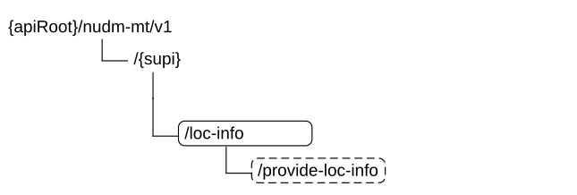

# 6.7 Nudm_MT Service API

## 6.7.1 API URI

URIs of this API shall have the following root:

{apiRoot}/{apiName}/\<apiVersion\>

The request URI used in HTTP request from the NF service consumer towards the NF service producer shall have the structure defined in clause 4.4.1 of TS 29.501 \[5\], i.e.:

**{apiRoot}/\<apiName\>/\<apiVersion\>/\<apiSpecificResourceUriPart\>**

with the following components:

\- The {apiRoot} shall be set as described in TS 29.501 \[5\].

\- The \<apiName\> shall be "nudm-mt".

\- The \<apiVersion\> shall be "v1".

\- The \<apiSpecificResourceUriPart\> shall be set as described in clause 6.7.3.

## 6.7.2 Usage of HTTP

### 6.7.2.1 General

HTTP/2, as defined in IETF RFC 9113 \[13\], shall be used as specified in clause 5 of TS 29.500 \[4\].

HTTP/2 shall be transported as specified in clause 5.3 of TS 29.500 \[4\].

HTTP messages and bodies for the Nudm_MT service shall comply with the OpenAPI \[14\] specification contained in Annex A4.

### 6.7.2.2 HTTP standard headers

#### 6.7.2.2.1 General

The usage of HTTP standard headers shall be supported as specified in clause 5.2.2 of TS 29.500 \[4\].

#### 6.7.2.2.2 Content type

The following content types shall be supported:

JSON, as defined in IETF RFC 8259 \[15\], signalled by the content type "application/json".

The Problem Details JSON Object (IETF RFC 9457 \[16\] signalled by the content type "application/problem+json"

### 6.7.2.3 HTTP custom headers

#### 6.7.2.3.1 General

The usage of HTTP custom headers shall be supported as specified in clause 5.2.3 of TS 29.500 \[4\].

## 6.7.3 Resources

### 6.7.3.1 Overview

This clause describes the structure for the Resource URIs and the resources and methods used for the service.

Figure 6.7.3.1-1 depicts the resource URIs structure for the Nudm_MT API.

Figure 6.7.3.1-1: Resource URI structure of the Nudm-MT API

Table 6.7.3.1-1 provides an overview of the resources and applicable HTTP methods.

Table 6.7.3.1-1: Resources and methods overview

<table>
<colgroup>
<col style="width: 27%" />
<col style="width: 29%" />
<col style="width: 10%" />
<col style="width: 32%" />
</colgroup>
<thead>
<tr class="header">
<th>Resource name 
(Archetype)</th>
<th>Resource URI</th>
<th>HTTP method or custom operation</th>
<th>Description</th>
</tr>
</thead>
<tbody>
<tr class="odd">
<td>UeInfo 
(Document)</td>
<td>/{supi}</td>
<td>GET</td>
<td>Retrieve UE's TADS Info and/or User State and/or 5GSRVCCInfo</td>
</tr>
<tr class="even">
<td>
LocationInfo

(Custom Operation)
</td>
<td>/{supi}/loc-info/provide-loc-info</td>
<td>
provide-loc-info

(POST)
</td>
<td>Request UE's location</td>
</tr>
</tbody>
</table>

### 6.7.3.2 Resource: UeInfo

#### 6.7.3.2.1 Description

This resource represents the 5GC TADS Info and/or User State and/or 5GSRVCCInfo for a SUPI. It is queried by the HSS (see TS 23.632 \[32\] clause 5.4.1.

#### 6.7.3.2.2 Resource Definition

Resource URI: {apiRoot}/nudm-mt/\<apiVersion\>/{supi}

This resource shall support the resource URI variables defined in table 6.7.3.2.2-1.

Table 6.7.3.2.2-1: Resource URI variables for this resource

<table>
<colgroup>
<col style="width: 11%" />
<col style="width: 11%" />
<col style="width: 77%" />
</colgroup>
<thead>
<tr class="header">
<th>Name</th>
<th>Data type</th>
<th>Definition</th>
</tr>
</thead>
<tbody>
<tr class="odd">
<td>apiRoot</td>
<td>string</td>
<td>See clause 6.7.1</td>
</tr>
<tr class="even">
<td>supi</td>
<td>Supi</td>
<td>Represents the Subscription Permanent Identifier (see TS 23.501 [2] clause 5.9.2) 
pattern: See pattern of type Supi in TS 29.571 [7]</td>
</tr>
</tbody>
</table>

#### 6.7.3.2.3 Resource Standard Methods

##### 6.7.3.2.3.1 GET

This method shall support the URI query parameters specified in table 6.7.3.2.3.1-1.

Table 6.7.3.2.3.1-1: URI query parameters supported by the GET method on this resource

|                    |               |                   |     |     |      |             |                                                                                                                               |                                |     |
|--------------------|---------------|-------------------|-----|-----|------|-------------|-------------------------------------------------------------------------------------------------------------------------------|--------------------------------|-----|
| Name               |               | Data type         |     | P   |      | Cardinality |                                                                                                                               | Description                    |     |
| fields             | array(string) |                   | M   |     | 1..N |             | The " fields " query parameter contains the pointers of the attribute(s) to be retrieved. See attribute names of type UeInfo. |                                |     |
| supported-features |               | SupportedFeatures |     | O   |      | 0..1        |                                                                                                                               | see TS 29.500 \[4\] clause 6.6 |     |

This method shall support the request data structures specified in table 6.7.3.2.3.1-2 and the response data structures and response codes specified in table 6.7.3.2.3.1-3.

Table 6.7.3.2.3.1-2: Data structures supported by the GET Request Body on this resource

|           |     |             |             |
|-----------|-----|-------------|-------------|
| Data type | P   | Cardinality | Description |
| n/a       |     |             |             |

Table 6.7.3.2.3.1-3: Data structures supported by the GET Response Body on this resource

<table>
<colgroup>
<col style="width: 16%" />
<col style="width: 4%" />
<col style="width: 12%" />
<col style="width: 11%" />
<col style="width: 54%" />
</colgroup>
<tbody>
<tr class="odd">
<td>Data type</td>
<td>P</td>
<td>Cardinality</td>
<td>
Response

codes
</td>
<td>Description</td>
</tr>
<tr class="even">
<td>UeInfo</td>
<td>M</td>
<td>1</td>
<td>200 OK</td>
<td>Upon success, a response body containing the UeInfo shall be returned.</td>
</tr>
<tr class="odd">
<td>ProblemDetails</td>
<td>O</td>
<td>0..1</td>
<td>404 Not Found</td>
<td>
The "cause" attribute may be used to convey the following application errors:

- USER_NOT_FOUND

- DATA_NOT_FOUND
</td>
</tr>
<tr class="even">
<td colspan="5">NOTE: In addition common data structures as listed in table 5.2.7.1-1 of TS 29.500 [4] are supported.</td>
</tr>
</tbody>
</table>

### 6.7.3.3 Resource: LocationInfo

#### 6.7.3.3.1 Description

This resource represents the UE's location information in 5GC. See TS 23.632 \[32\] clause 5.4.3.

#### 6.7.3.3.2 Resource Definition

Resource URI: {apiRoot}/nudm-mt/\<apiVersion\>/{supi}/loc-info

This resource shall support the resource URI variables defined in table 6.7.3.3.2-1.

Table 6.7.3.3.2-1: Resource URI variables for this resource

<table>
<colgroup>
<col style="width: 11%" />
<col style="width: 11%" />
<col style="width: 77%" />
</colgroup>
<thead>
<tr class="header">
<th>Name</th>
<th>Data type</th>
<th>Definition</th>
</tr>
</thead>
<tbody>
<tr class="odd">
<td>apiRoot</td>
<td>string</td>
<td>See clause 6.7.1</td>
</tr>
<tr class="even">
<td>supi</td>
<td>Supi</td>
<td>Represents the Subscription Permanent Identifier (see TS 23.501 [2] clause 5.9.2) 
pattern: "(imsi-[0-9]{5,15}|nai-.+|.+)"</td>
</tr>
</tbody>
</table>

#### 6.7.3.3.3 Resource Standard Methods

No Standard Methods are supported for this resource.

#### 6.7.3.3.4 Resource Custom Operations

##### 6.7.3.3.4.1 Overview

Table 6.7.3.3.4.1-1: Custom operations

| Operation Name   | Custom operation URI | Mapped HTTP method | Description                             |
|------------------|----------------------|--------------------|-----------------------------------------|
| provide-loc-info | /provide-loc-info    | POST               | Request UE location information in 5GC. |

##### 6.7.3.3.4.2 Operation: provide-loc-info

##### 6.7.3.3.4.2.1 Description

This custom operation is used by the NF service consumer (HSS) to request the UE location information in 5GC.

##### 6.7.3.3.4.2.2 Operation Definition

This operation shall support the request data structures specified in table 6.7.3.3.4.2.2-1 and the response data structure and response codes specified in table 6.7.3.3.4.2.2-2.

Table 6.7.3.3.4.2.2-1: Data structures supported by the POST Request Body on this resource

|                     |     |             |                                                                                                                |
|---------------------|-----|-------------|----------------------------------------------------------------------------------------------------------------|
| Data type           | P   | Cardinality | Description                                                                                                    |
| LocationInfoRequest | M   | 1           | Contains the requested information: current location, local time zone, RAT type, or serving node identity only |

Table 6.7.3.3.4.2.2-2: Data structures supported by the POST Response Body on this resource

<table>
<colgroup>
<col style="width: 16%" />
<col style="width: 4%" />
<col style="width: 12%" />
<col style="width: 11%" />
<col style="width: 54%" />
</colgroup>
<tbody>
<tr class="odd">
<td>Data type</td>
<td>P</td>
<td>Cardinality</td>
<td>
Response

codes
</td>
<td>Description</td>
</tr>
<tr class="even">
<td>LocationInfoResult</td>
<td>M</td>
<td>1</td>
<td>200 OK</td>
<td>Upon success, a response body containing requested information shall be returned.</td>
</tr>
<tr class="odd">
<td>ProblemDetails</td>
<td>O</td>
<td>0..1</td>
<td>404 Not Found</td>
<td>
The "cause" attribute may be used to indicate the following application error:

- USER_NOT_FOUND

- DATA_NOT_FOUND
</td>
</tr>
<tr class="even">
<td colspan="5">NOTE: In addition, common data structures as listed in table 5.2.7.1-1 of TS 29.500 [4] are supported.</td>
</tr>
</tbody>
</table>

## 6.7.4 Custom Operations without associated resources

In this release of this specification, no custom operations without associated resources are defined for the Nudm_MT Service.

## 6.7.5 Notifications

In this release of this specification, no notifications are defined for the Nudm_MT Service.

## 6.7.6 Data Model

### 6.7.6.1 General

This clause specifies the application data model supported by the API.

Table 6.7.6.1-1 specifies the structured data types defined for the Nudm_MT service API. For simple data types defined for the Nudm_MT service API see table 6.7.6.3.2-1.

Table 6.7.6.1-1: Nudm_MT specific Data Types

| Data type           |     | Clause defined |     | Description |     |
|---------------------|-----|----------------|-----|-------------|-----|
| UeInfo              |     | 6.7.6.2.2      |     |             |     |
| LocationInfoRequest |     | 6.7.6.2.3      |     |             |     |
| LocationInfoResult  |     | 6.7.6.2.4      |     |             |     |
| 5GSrvccInfo         |     | 6.7.6.2.5      |     |             |     |

Table 6.7.6.1-2 specifies data types re-used by the Nudm_MT service API from other specifications, including a reference to their respective specifications and when needed, a short description of their use within the Nudm_MT service API.

Table 6.7.6.1-2: Nudm_MT re-used Data Types

| Data type             | Reference        | Comments                             |
|-----------------------|------------------|--------------------------------------|
| UeContextInfo         | TS 29.518 \[36\] |                                      |
| Supi                  | TS 29.571 \[7\]  |                                      |
| 5GsUserState          | TS 29.518 \[36\] |                                      |
| NfInstanceId          | TS 29.571 \[7\]  | Network Function Instance Identifier |
| PlmnId                | TS 29.571 \[7\]  | PLMN Identity                        |
| Ecgi                  | TS 29.571 \[7\]  | EUTRAN cell identity                 |
| Ncgi                  | TS 29.571 \[7\]  | NR cell identity                     |
| Tai                   | TS 29.571 \[7\]  | Tracking area identity               |
| GeographicArea        | TS 29.572 \[34\] | Estimate of the location of the UE   |
| AgeOfLocationEstimate | TS 29.572 \[34\] | Age Of Location Estimate             |
| RatType               | TS 29.571 \[7\]  | RAT type                             |
| TimeZone              | TS 29.571 \[7\]  | Time Zone                            |
| SupportedFeatures     | TS 29.571 \[7\]  |                                      |
| ProblemDetails        | TS 29.571 \[7\]  |                                      |
| StnSr                 | TS 29.571 \[7\]  | Session Transfer Number for 5G-SRVCC |
| CMsisdn               | TS 29.571 \[7\]  | Correlation MSISDN                   |

### 6.7.6.2 Structured data types

#### 6.7.6.2.1 Introduction

This clause defines the structures to be used in resource representations.

#### 6.7.6.2.2 Type: UeInfo

Table 6.7.6.2.2-1: Definition of type UeInfo

| Attribute name | Data type     | P   | Cardinality | Description          |
|----------------|---------------|-----|-------------|----------------------|
| tadsInfo       | UeContextInfo | O   | 0..1        | See TS 29.518 \[36\] |
| userState      | 5GsUserState  | O   | 0..1        | See TS 29.518 \[36\] |
| 5gSrvccInfo    | 5GSrvccInfo   | O   | 0..1        |                      |

#### 6.7.6.2.3 Type: LocationInfoRequest

Table 6.7.6.2.3-1: Definition of type LocationInfoRequest

<table>
<colgroup>
<col style="width: 21%" />
<col style="width: 19%" />
<col style="width: 5%" />
<col style="width: 11%" />
<col style="width: 41%" />
</colgroup>
<thead>
<tr class="header">
<th>Attribute name</th>
<th>Data type</th>
<th>P</th>
<th>Cardinality</th>
<th>Description</th>
</tr>
</thead>
<tbody>
<tr class="odd">
<td>req5gsLoc</td>
<td>boolean</td>
<td>C</td>
<td>0..1</td>
<td>
This IE shall be present and set to "true", if 5GS location information is requested.

When present, the IE shall be set as following:

<blockquote>

- true: the location of the UE is requested

- false (default): the location of the UE is not requested

</blockquote></td>
</tr>
<tr class="even">
<td>reqCurrentLoc</td>
<td>boolean</td>
<td>C</td>
<td>0..1</td>
<td>
This IE may be present if location information is requested.

When present, the IE shall be set as following:

<blockquote>

- true: the current location of the UE is requested

- false (default): the current location of the UE is not requested

</blockquote></td>
</tr>
<tr class="odd">
<td>reqRatType</td>
<td>boolean</td>
<td>C</td>
<td>0..1</td>
<td>
This IE shall be present and set to "true", if the RAT Type of the UE is requested.

When present, the IE shall be set as following:

<blockquote>

- true: the RAT type of the UE is requested

- false (default): the RAT type of the UE is not requested

</blockquote></td>
</tr>
<tr class="even">
<td>reqTimeZone</td>
<td>boolean</td>
<td>C</td>
<td>0..1</td>
<td>
This IE shall be present and set to "true", if the local timezone of the UE is requested.

When present, the IE shall be set as following:

<blockquote>

- true: the local timezone of the UE is requested

- false (default): the local timezone of the UE is not requested.

</blockquote></td>
</tr>
<tr class="odd">
<td>reqServingNode</td>
<td>boolean</td>
<td>C</td>
<td>0..1</td>
<td>
This IE shall be present and set to "true", if only serving node(s) address/identity is requested as location information.

When present, the IE shall be set as following:

<blockquote>

- true: only serving node(s) identity is requested

- false(default)

</blockquote></td>
</tr>
<tr class="even">
<td>supportedFeatures</td>
<td>SupportedFeatures</td>
<td>O</td>
<td>0..1</td>
<td>See clause 6.7.8</td>
</tr>
</tbody>
</table>

#### 6.7.6.2.4 Type: LocationInfoResult

Table 6.7.6.2.4-1: Definition of type LocationInfoResult

<table>
<colgroup>
<col style="width: 21%" />
<col style="width: 19%" />
<col style="width: 5%" />
<col style="width: 11%" />
<col style="width: 41%" />
</colgroup>
<thead>
<tr class="header">
<th>Attribute name</th>
<th>Data type</th>
<th>P</th>
<th>Cardinality</th>
<th>Description</th>
</tr>
</thead>
<tbody>
<tr class="odd">
<td>vPlmnId</td>
<td>PlmnId</td>
<td>M</td>
<td>1</td>
<td>Visiting PLMN Identity</td>
</tr>
<tr class="even">
<td>amfInstanceId</td>
<td>NfInstanceId</td>
<td>O</td>
<td>0..1</td>
<td>NF instance ID of the serving AMF for 3GPP access</td>
</tr>
<tr class="odd">
<td>smsfInstanceId</td>
<td>NfInstanceId</td>
<td>O</td>
<td>0..1</td>
<td>NF instance ID of the serving SMSF</td>
</tr>
<tr class="even">
<td>ecgi</td>
<td>Ecgi</td>
<td>O</td>
<td>0..1</td>
<td>E-UTRA Cell Identity</td>
</tr>
<tr class="odd">
<td>ncgi</td>
<td>Ncgi</td>
<td>O</td>
<td>0..1</td>
<td>NR Cell Identity</td>
</tr>
<tr class="even">
<td>tai</td>
<td>Tai</td>
<td>O</td>
<td>0..1</td>
<td>Tracking Area Identity</td>
</tr>
<tr class="odd">
<td>currentLoc</td>
<td>boolean</td>
<td>O</td>
<td>0..1</td>
<td>
When present, this IE shall be set as following:

<blockquote>

- true: the current location of the UE is returned

- false: the last known location of the UE is returned.

</blockquote></td>
</tr>
<tr class="even">
<td>geoInfo</td>
<td>GeographicArea</td>
<td>O</td>
<td>0..1</td>
<td>If present, this IE shall contain the geographical information of the UE.</td>
</tr>
<tr class="odd">
<td>locationAge</td>
<td>AgeOfLocationEstimate</td>
<td>O</td>
<td>0..1</td>
<td>If present, this IE shall contain the age of the location information.</td>
</tr>
<tr class="even">
<td>ratType</td>
<td>RatType</td>
<td>O</td>
<td>0..1</td>
<td>If present, this IE shall contain the current RAT type of the UE.</td>
</tr>
<tr class="odd">
<td>timezone</td>
<td>TimeZone</td>
<td>O</td>
<td>0..1</td>
<td>If present, this IE shall contain the local time zone of the UE.</td>
</tr>
<tr class="even">
<td>supportedFeatures</td>
<td>SupportedFeatures</td>
<td>O</td>
<td>0..1</td>
<td>See clause 6.7.8</td>
</tr>
<tr class="odd">
<td colspan="5">NOTE: Either the "ecgi" attribute or the "ncgi" attribute may be included.</td>
</tr>
</tbody>
</table>

#### 6.7.6.2.5 Type: 5GSrvccInfo

Table 6.7.6.2.5-1: Definition of type 5GSrvccInfo

<table>
<colgroup>
<col style="width: 21%" />
<col style="width: 19%" />
<col style="width: 5%" />
<col style="width: 11%" />
<col style="width: 41%" />
</colgroup>
<thead>
<tr class="header">
<th>Attribute name</th>
<th>Data type</th>
<th>P</th>
<th>Cardinality</th>
<th>Description</th>
</tr>
</thead>
<tbody>
<tr class="odd">
<td>ue5GSrvccCapability</td>
<td>boolean</td>
<td>M</td>
<td>1</td>
<td>
This IE indicates whether the UE supports 5G SRVCC:

- true: 5G SRVCC is supported by the UE

- false: 5G SRVCC is not supported.
</td>
</tr>
<tr class="even">
<td>stnSr</td>
<td>StnSr</td>
<td>O</td>
<td>0..1</td>
<td>Session Transfer Number for 5G-SRVCC</td>
</tr>
<tr class="odd">
<td>cMsisdn</td>
<td>CMsisdn</td>
<td>O</td>
<td>0..1</td>
<td>Correlation MSISDN of the UE.</td>
</tr>
</tbody>
</table>

### 6.7.6.3 Simple data types and enumerations

In this release of this specification, no simple data types and enumerations are defined for the Nudm_MT Service.

## 6.7.7 Error Handling

### 6.7.7.1 General

HTTP error handling shall be supported as specified in clause 5.2.4 of TS 29.500 \[4\].

### 6.7.7.2 Protocol Errors

Protocol errors handling shall be supported as specified in clause 5.2.7 of TS 29.500 \[4\].

### 6.7.7.3 Application Errors

The common application errors defined in the Table 5.2.7.2-1 in TS 29.500 \[4\] may also be used for the Nudm_MT service. The following application errors listed in Table 6.7.7.3-1 are specific for the Nudm\_ MT service.

Table 6.7.7.3-1: Application errors

| Application Error | HTTP status code | Description                                        |
|-------------------|------------------|----------------------------------------------------|
| USER_NOT_FOUND    | 404 Not Found    | The user does not exist                            |
| DATA_NOT_FOUND    | 404 Not Found    | The requested UE data is not found/does not exist. |

## 6.7.8 Feature Negotiation

The optional features in table 6.7.8-1 are defined for the Nudm_MT API. They shall be negotiated using the extensibility mechanism defined in clause 6.6 of TS 29.500 \[4\].

Table 6.7.8-1: Supported Features

| Feature number | Feature Name | Description |
|----------------|--------------|-------------|
|                |              |             |

## 6.7.9 Security

As indicated in TS 33.501 \[6\] and TS 29.500 \[4\], the access to the Nudm_MT API may be authorized by means of the OAuth2 protocol (see IETF RFC 6749 \[18\]), based on local configuration, using the "Client Credentials" authorization grant, where the NRF (see TS 29.510 \[19\]) plays the role of the authorization server.

If OAuth2 is used, an NF Service Consumer, prior to consuming services offered by the Nudm_MT API, shall obtain a "token" from the authorization server, by invoking the Access Token Request service, as described in TS 29.510 \[19\], clause 5.4.2.2.

NOTE: When multiple NRFs are deployed in a network, the NRF used as authorization server is the same NRF that the NF Service Consumer used for discovering the Nudm_MT service.

The Nudm_MT API defines a single scope "nudm-mt" for OAuth2 authorization (as specified in TS 33.501 \[6\]) for the entire API, and it does not define any additional scopes at resource or operation level.

## 6.7.10 HTTP redirection

An HTTP request may be redirected to a different UDM service instance when using direct or indirect communications (see TS 29.500 \[4\]).

An SCP that reselects a different UDM producer instance will return the NF Instance ID of the new UDM producer instance in the 3gpp-Sbi-Producer-Id header, as specified in clause 6.10.3.4 of TS 29.500 \[4\].

If an UDM redirects a service request to a different UDM using an 307 Temporary Redirect or 308 Permanent Redirect status code, the identity of the new UDM towards which the service request is redirected shall be indicated in the 3gpp-Sbi-Target-Nf-Id header of the 307 Temporary Redirect or 308 Permanent Redirect response as specified in clause 6.10.9.1 of TS 29.500 \[4\].
