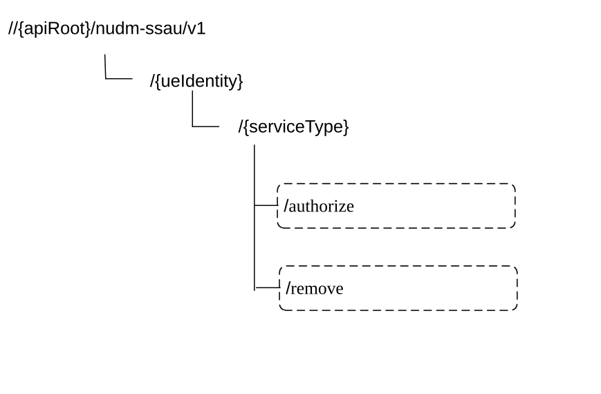

# 6.8 Nudm_ServiceSpecificAuthorization Service API

## 6.8.1 API URI

The Nudm_ServiceSpecificAuthorization service shall use the Nudm_SSAU API.

The API URI of the Nudm_SSAU API shall be:

**{apiRoot}/\<apiName\>/\<apiVersion\>**

The request URI used in HTTP request from the NF service consumer towards the NF service producer shall have the structure defined in clause 4.4.1 of TS 29.501 \[5\], i.e.:

**{apiRoot}/\<apiName\>/\<apiVersion\>/\<apiSpecificResourceUriPart\>**

with the following components:

\- The {apiRoot} shall be set as described in TS 29.501 \[5\].

\- The \<apiName\> shall be "nudm-ssau".

\- The \<apiVersion\> shall be "v1".

\- The \<apiSpecificResourceUriPart\> shall be set as described in clause 6.8.3.

## 6.8.2 Usage of HTTP

### 6.8.2.1 General

HTTP/2, as defined in IETF RFC 9113 \[13\], shall be used as specified in clause 5 of TS 29.500 \[4\].

HTTP/2 shall be transported as specified in clause 5.3 of TS 29.500 \[4\].

HTTP messages and bodies for the Nudm_ServiceSpecificAuthorization service shall comply with the OpenAPI \[14\] specification contained in Annex A.9.

### 6.8.2.2 HTTP standard headers

#### 6.8.2.2.1 General

The usage of HTTP standard headers shall be supported as specified in clause 5.2.2 of TS 29.500 \[4\].

#### 6.8.2.2.2 Content type

The following content types shall be supported:

JSON, as defined in IETF RFC 8259 \[15\], signalled by the content type "application/json".

The Problem Details JSON Object (IETF RFC 9457 \[16\] signalled by the content type "application/problem+json"

### 6.8.2.3 HTTP custom headers

#### 6.8.2.3.1 General

The usage of HTTP custom headers shall be supported as specified in clause 5.2.3 of TS 29.500 \[4\].

## 6.8.3 Resources

### 6.8.3.1 Overview

This clause describes the structure for the Resource URIs and the resources and methods used for the service.

Figure 6.8.3.1-1 depicts the resource URIs structure for the Nudm_SSAU API.

Figure 6.8.3.1-1: Resource URI structure of the Nudm-SSAU API

Table 6.8.3.1-1 provides an overview of the resources and applicable HTTP methods.

Table 6.8.3.1-1: Resources and methods overview

<table>
<colgroup>
<col style="width: 27%" />
<col style="width: 29%" />
<col style="width: 10%" />
<col style="width: 32%" />
</colgroup>
<thead>
<tr class="header">
<th>Resource name 
(Archetype)</th>
<th>Resource URI</th>
<th>HTTP method or custom operation</th>
<th>Description</th>
</tr>
</thead>
<tbody>
<tr class="odd">
<td rowspan="2">ServiceType 
(Document)</td>
<td>/{ueIdentity}/{serviceType}/authorize</td>
<td>authorize (POST)</td>
<td>Authorize the configuration request for the specific service identified by the serviceType.</td>
</tr>
<tr class="even">
<td>/{ueIdentity}/{serviceType}/remove</td>
<td>
remove

(POST)
</td>
<td>Remove the authorization of configuration request for the specific service identified by the serviceType.</td>
</tr>
</tbody>
</table>

### 6.8.3.2 Resource: ServiceType (Document)

#### 6.8.3.2.1 Description

This resource represents the subscribed authorization information of a specific service for a GPSI or External Group Identifier.

#### 6.8.3.2.2 Resource Definition

Resource URI: {apiRoot}/nudm-ssau/\<apiVersion\>/{ueIdentity}/{serviceType}

This resource shall support the resource URI variables defined in table 6.8.3.2.2-1.

Table 6.8.3.2.2-1: Resource URI variables for this resource

<table>
<colgroup>
<col style="width: 11%" />
<col style="width: 11%" />
<col style="width: 76%" />
</colgroup>
<thead>
<tr class="header">
<th>Name</th>
<th>Data type</th>
<th>Definition</th>
</tr>
</thead>
<tbody>
<tr class="odd">
<td>apiRoot</td>
<td>string</td>
<td>See clause 6.8.1</td>
</tr>
<tr class="even">
<td>ueIdentity</td>
<td>string</td>
<td>Represents the GPSI or External Group Identifier (see TS 23.501 [2] clause 7.2.5) 
pattern: "^ (msisdn-[0-9]{5,15}|extid-[^@]+@[^@]+|extgroupid-[^@]+@[^@]+|.+)$"</td>
</tr>
<tr class="odd">
<td>serviceType</td>
<td>ServiceType</td>
<td>In this release the only defined Service Types are "AF GUIDANCE_FOR_URSP" and "AF_REQUESTED_QOS"</td>
</tr>
</tbody>
</table>

#### 6.8.3.2.3 Resource Standard Methods

No Standard Methods are supported for this resource.

#### 6.8.3.2.4 Resource Custom Operations

##### 6.8.3.2.4.1 Overview

Table 6.8.3.2.4.1-1: Custom operations

| Operation Name | Custom operation URI                  | Mapped HTTP method | Description                                        |
|----------------|---------------------------------------|--------------------|----------------------------------------------------|
| authorize      | /{ueIdentity}/{serviceType}/authorize | POST               | Authorize the configuration request.               |
| remove         | /{ueIdentity}/{serviceType}/remove    | POST               | Remove the authorization of configuration request. |

##### 6.8.3.2.4.2 Operation: authorize

##### 6.8.3.2.4.2.1 Description

This custom operation is used by the NF service consumer (NEF) to request UDM to authorize a specific service's configuration for the GPSI/External Group Identifier.

##### 6.8.3.2.4.2.2 Operation Definition

This operation shall support the request data structures specified in table 6.8.3.2.4.2.2-1 and the response data structure and response codes specified in table 6.8.3.2.4.2.2-2.

Table 6.8.3.2.4.2.2-1: Data structures supported by the POST Request Body on this resource

|                                  |     |             |                                                                                                                                                                                 |
|----------------------------------|-----|-------------|---------------------------------------------------------------------------------------------------------------------------------------------------------------------------------|
| Data type                        | P   | Cardinality | Description                                                                                                                                                                     |
| ServiceSpecificAuthorizationInfo | M   | 1           | This IE shall indicate the information for service specific authorization, which should contain the callback URI and may contain S-NSSAI, DNN, MTC Provider Information, AF-ID. |

Table 6.8.3.2.4.2.2-2: Data structures supported by the POST Response Body on this resource

<table>
<colgroup>
<col style="width: 16%" />
<col style="width: 4%" />
<col style="width: 13%" />
<col style="width: 11%" />
<col style="width: 54%" />
</colgroup>
<tbody>
<tr class="odd">
<td>Data type</td>
<td>P</td>
<td>Cardinality</td>
<td>
Response

codes
</td>
<td>Description</td>
</tr>
<tr class="even">
<td>ServiceSpecificAuthorizationData</td>
<td>M</td>
<td>1</td>
<td>200 OK</td>
<td>Upon success, a response body containing the GPSI and SUPI or Internal Group Identifier mapped from External Group ID, and Service Specific Authorization Id shall be returned.</td>
</tr>
<tr class="odd">
<td>ProblemDetails</td>
<td>O</td>
<td>1</td>
<td>404 Not Found</td>
<td>
The "cause" attribute may be used to indicate one of the following application errors:

- USER_NOT_FOUND
</td>
</tr>
<tr class="even">
<td>ProblemDetails</td>
<td>O</td>
<td>0..1</td>
<td>403 Forbidden</td>
<td>
The "cause" attribute may be used to indicate one of the following application errors:

- DNN_NOT_ALLOWED

- MTC_PROVIDER_NOT_ALLOWED

- AF_INSTANCE_NOT_ALLOWED

- SNSSAI_NOT_ALLOWED

- SERVICE_TYPE_NOT_ALLOWED
</td>
</tr>
<tr class="odd">
<td colspan="5">NOTE: In addition, common data structures as listed in table 5.2.7.1-1 of TS 29.500 [4] are supported.</td>
</tr>
</tbody>
</table>

##### 6.8.3.2.4.3 Operation: remove

##### 6.8.3.2.4.3.1 Description

This custom operation is used by the NF service consumer (NEF) to request UDM to remove the authorization of a specific service's configuration for the GPSI/External Group Identifier.

##### 6.8.3.2.4.3.2 Operation Definition

This operation shall support the request data structures specified in table 6.8.3.2.4.3.2-1 and the response data structure and response codes specified in table 6.8.3.2.4.3.2-2.

Table 6.8.3.2.4.3.2-1: Data structures supported by the POST Request Body on this resource

|                                        |     |             |                                                                                                         |
|----------------------------------------|-----|-------------|---------------------------------------------------------------------------------------------------------|
| Data type                              | P   | Cardinality | Description                                                                                             |
| ServiceSpecificAuthorizationRemoveData | M   | 1           | This IE shall indicate the information to remove the authorization of specific service's configuration. |

Table 6.8.3.2.4.3.2-2: Data structures supported by the POST Response Body on this resource

<table>
<colgroup>
<col style="width: 16%" />
<col style="width: 4%" />
<col style="width: 13%" />
<col style="width: 11%" />
<col style="width: 54%" />
</colgroup>
<tbody>
<tr class="odd">
<td>Data type</td>
<td>P</td>
<td>Cardinality</td>
<td>
Response

codes
</td>
<td>Description</td>
</tr>
<tr class="even">
<td>n/a</td>
<td></td>
<td></td>
<td>204 No Content</td>
<td>Successfully removed the authorization of specific service's configuration.</td>
</tr>
<tr class="odd">
<td>ProblemDetails</td>
<td>O</td>
<td>0..1</td>
<td>404 Not Found</td>
<td>
The "cause" attribute may be used to indicate one of the following application errors:

- AUTHORIZATION_NOT_FOUND
</td>
</tr>
<tr class="even">
<td colspan="5">NOTE: In addition, common data structures as listed in table 5.2.7.1-1 of TS 29.500 [4] are supported.</td>
</tr>
</tbody>
</table>

## 6.8.4 Custom Operations without associated resources

In this release of this specification, no custom operations without associated resources are defined for the Nudm_ServiceSpecificAuthorization Service.

## 6.8.5 Notifications

### 6.8.5.1 General

This clause will specify the use of notifications and corresponding protocol details if required for the specific service. When notifications are supported by the API, it will include a reference to the general description of notifications support over the 5G SBIs specified in TS 29.500 \[4\] / TS 29.501 \[5\].

Table 6.8.5.1-1: Notifications overview

<table>
<colgroup>
<col style="width: 14%" />
<col style="width: 57%" />
<col style="width: 10%" />
<col style="width: 18%" />
</colgroup>
<thead>
<tr class="header">
<th>Notification</th>
<th>Resource URI</th>
<th>HTTP method or custom operation</th>
<th>
Description

(service operation)
</th>
</tr>
</thead>
<tbody>
<tr class="odd">
<td>Service Specific Data Update Notification</td>
<td>{authUpdateCallbackUri}</td>
<td>POST</td>
<td></td>
</tr>
</tbody>
</table>

### 6.8.5.2 Service Specific Data Update Notification

The POST method shall be used for Service Specific Data Update Notifications and the Call-back URI shall be provided during the Service Specific Authorization Data Retrieval procedure.

Resource URI: {authUpdateCallbackUri}

Support of URI query parameters are specified in table 6.8.5.2-1.

Table 6.8.5.2-1: URI query parameters supported by the POST method

|      |           |     |             |             |
|------|-----------|-----|-------------|-------------|
| Name | Data type | P   | Cardinality | Description |
| n/a  |           |     |             |             |

Support of request data structures is specified in table 6.8.5.2-2 and of response data structures and response codes is specified in table 6.8.5.2-3.

Table 6.8.5.2-2: Data structures supported by the POST Request Body

|                        |     |             |             |
|------------------------|-----|-------------|-------------|
| Data type              | P   | Cardinality | Description |
| AuthUpdateNotification | M   | 1           |             |

Table 6.8.5.2-3: Data structures supported by the POST Response Body

<table>
<colgroup>
<col style="width: 16%" />
<col style="width: 4%" />
<col style="width: 12%" />
<col style="width: 11%" />
<col style="width: 54%" />
</colgroup>
<tbody>
<tr class="odd">
<td>Data type</td>
<td>P</td>
<td>Cardinality</td>
<td>
Response

codes
</td>
<td>Description</td>
</tr>
<tr class="even">
<td>n/a</td>
<td></td>
<td></td>
<td>204 No Content</td>
<td>Upon success, an empty response body shall be returned.</td>
</tr>
<tr class="odd">
<td>ProblemDetails</td>
<td>O</td>
<td>0..1</td>
<td>404 Not Found</td>
<td>
The "cause" attribute may be used to indicate one of the following application errors:

- CONTEXT_NOT_FOUND
</td>
</tr>
<tr class="even">
<td colspan="5">NOTE: In addition common data structures as listed in table 6.8.7-1 are supported.</td>
</tr>
</tbody>
</table>

## 6.8.6 Data Model

### 6.8.6.1 General

This clause specifies the application data model supported by the API.

Table 6.8.6.1-1 specifies the structured data types defined for the Nudm_SSAU service API. For simple data types defined for the Nudm_SSAU service API see table 6.8.6.3.2-1.

Table 6.8.6.1-1: Nudm_SSAU specific Data Types

| Data type                              | Clause defined | Description                                                 |
|----------------------------------------|----------------|-------------------------------------------------------------|
| AuthUpdateNotification                 | 6.8.6.2.2      |                                                             |
| AuthUpdateInfo                         | 6.8.6.2.3      |                                                             |
| ServiceSpecificAuthorizationInfo       | 6.8.6.2.4      |                                                             |
| ServiceSpecificAuthorizationData       | 6.8.6.2.5      | Authorization Response for a specific service               |
| AuthorizationUeId                      | 6.8.6.2.6      | UE Id of the Authorization Data                             |
| ServiceSpecificAuthorizationRemoveData | 6.8.6.2.7      | Information for Authorization removal of a specific service |
| ServiceType                            | 6.8.6.3.2      | Service Type of the Authorization                           |
| InvalidCause                           | 6.8.6.3.3      | Authorization Invalid Cause                                 |

Table 6.8.6.1-2 specifies data types re-used by the Nudm_SSAU service API from other specifications and from other service APIs in current specification, including a reference to the respective specifications and when needed, a short description of their use within the Nudm_SSAU service API.

Table 6.8.6.1-2: Nudm_SSAU re-used Data Types

| Data type         | Reference       | Comments                                        |
|-------------------|-----------------|-------------------------------------------------|
| AuthorizationData | 6.6.6.2.2       | Defined in the Nudm_NIDDAU API.                 |
| Dnn               | TS 29.571 \[7\] | Data Network Name with Network Identifier only. |
| Snssai            | TS 29.571 \[7\] |                                                 |
| ExternalGroupId   | TS 29.571 \[7\] |                                                 |
| GroupId           | TS 29.571 \[7\] |                                                 |

### 6.8.6.2 Structured data types

#### 6.8.6.2.1 Introduction

This clause defines the structures to be used in resource representations.

#### 6.8.6.2.2 Type: AuthUpdateNotification

Table 6.8.6.2.2-1: Definition of type AuthUpdateNotification

| Attribute name         | Data type              | P   | Cardinality | Description                                                                                               |
|------------------------|------------------------|-----|-------------|-----------------------------------------------------------------------------------------------------------|
| serviceType            | ServiceType            | M   | 1           | Specific service for which the authorization is updated                                                   |
| snssai                 | Snssai                 | C   | 0..1        | Identifies the Single Network Slice.                                                                      |
| dnn                    | Dnn                    | C   | 0..1        | Identifies the DNN, shall contain the Network Identifier only.                                            |
| authUpdateInfoList     | array(AuthUpdateInfo)  | M   | 1..N        | List of AuthUpdateInfo.                                                                                   |
| mtcProviderInformation | MtcProviderInformation | O   | 0..1        | When present, this IE shall indicate the MTC provider information for the Service Specific authorization. |
| afId                   | string                 | O   | 0..1        | When present, this IE shall indicate the string identifying the originating AF.                           |

#### 6.8.6.2.3 Type: AuthUpdateInfo

Table 6.8.6.2.4-1: Definition of type AuthUpdateInfo

<table>
<colgroup>
<col style="width: 21%" />
<col style="width: 19%" />
<col style="width: 5%" />
<col style="width: 11%" />
<col style="width: 41%" />
</colgroup>
<thead>
<tr class="header">
<th>Attribute name</th>
<th>Data type</th>
<th>P</th>
<th>Cardinality</th>
<th>Description</th>
</tr>
</thead>
<tbody>
<tr class="odd">
<td>authorizationData</td>
<td>ServicepecificAuthorizationData</td>
<td>M</td>
<td>1</td>
<td>This IE shall include the Authorization data.</td>
</tr>
<tr class="even">
<td>invalidityInd</td>
<td>boolean</td>
<td>O</td>
<td>0..1</td>
<td>
Indicates whether the authorized Service Specific authoration data is still valid or not.

true: the authorized Service Specific authoration data is not valid.

false or absent: the authorized Service Specific authoration data is valid.
</td>
</tr>
<tr class="odd">
<td>invalidCause</td>
<td>InvalidCause</td>
<td>O</td>
<td>0..1</td>
<td>
This IE may be included when invalidityInd IE is included with the value true.

When present, this IE shall indicate the cause why the authorization becomes invalid.
</td>
</tr>
</tbody>
</table>

#### 6.8.6.2.4 Type: ServiceSpecificAuthorizationInfo

Table 6.8.6.2.4-1: Definition of type ServiceSpecificAuthorizationInfo

<table>
<colgroup>
<col style="width: 21%" />
<col style="width: 19%" />
<col style="width: 5%" />
<col style="width: 11%" />
<col style="width: 41%" />
</colgroup>
<thead>
<tr class="header">
<th>Attribute name</th>
<th>Data type</th>
<th>P</th>
<th>Cardinality</th>
<th>Description</th>
</tr>
</thead>
<tbody>
<tr class="odd">
<td>snssai</td>
<td>Snssai</td>
<td>C</td>
<td>0..1</td>
<td>This IE shall be included for following service type(s): 
- AF_GUIDANCE_FOR_URSP 
- AF_REQUESTED_QOS 
When present, this IE shall indicate the Single Network Slice Selection Assistance Information for the Service Specific authorization. (NOTE 2)</td>
</tr>
<tr class="even">
<td>dnn</td>
<td>Dnn</td>
<td>C</td>
<td>0..1</td>
<td>This IE shall be included for following service type(s): 
- AF_GUIDANCE_FOR_URSP 
- AF_REQUESTED_QOS 
When present, this IE shall indicate the DNN for the Service Specific authorization, shall contain the Network Identifier only. (NOTE 2)</td>
</tr>
<tr class="odd">
<td>mtcProviderInformation</td>
<td>MtcProviderInformation</td>
<td>C</td>
<td>0..1</td>
<td>This IE shall be included if available. 
When present, this IE shall indicate the MTC provider information for the Service Specific authorization.</td>
</tr>
<tr class="even">
<td>authUpdateCallbackUri</td>
<td>Uri</td>
<td>O</td>
<td>0..1</td>
<td>
A URI provided by NEF to receive (implicitly subscribed) notifications on authorization data update.

The authUpdateCallbackUri URI shall have unique information within NEF to identify the authorized result.

(NOTE 1)
</td>
</tr>
<tr class="odd">
<td>afId</td>
<td>string</td>
<td>O</td>
<td>0..1</td>
<td>When present, indicates the string identifying the originating AF.</td>
</tr>
<tr class="even">
<td>nefId</td>
<td>NefId</td>
<td>O</td>
<td>0..1</td>
<td>When present, this IE shall contain the ID of the requesting NEF.</td>
</tr>
<tr class="odd">
<td colspan="5">
NOTE 1: The NEF should always include the authUpdateCallbackUri IE to receive the change of Service Specific Authorization Data from the UDM.

NOTE 2: The Snssai and Dnn are allocated for PIN when AF provides application guidance for URSP determination for PIN service.
</td>
</tr>
</tbody>
</table>

#### 6.8.6.2.5 Type: ServicepecificAuthorizationData

Table 6.8.6.2.5x-1: Definition of type ServiceSpecificAuthorizationData

<table>
<colgroup>
<col style="width: 21%" />
<col style="width: 19%" />
<col style="width: 5%" />
<col style="width: 11%" />
<col style="width: 41%" />
</colgroup>
<thead>
<tr class="header">
<th>Attribute name</th>
<th>Data type</th>
<th>P</th>
<th>Cardinality</th>
<th>Description</th>
</tr>
</thead>
<tbody>
<tr class="odd">
<td>authorizationUeId</td>
<td>AuthorizationUeId</td>
<td>C</td>
<td>0..1</td>
<td>This IE shall be present for the service specific authorisation of the individual UE.</td>
</tr>
<tr class="even">
<td>extGroupId</td>
<td>ExternalGroupId</td>
<td>C</td>
<td>0..1</td>
<td>This IE shall be present for the service specific authorisation of the group of UEs.</td>
</tr>
<tr class="odd">
<td>IntGroupId</td>
<td>GroupId</td>
<td>C</td>
<td>0..1</td>
<td>
This IE shall be present for the service specific authorisation of the group of UEs.

When present, this IE shall indicate the Internal Group identifier mapped from the External Group Identifier indicated by extGroupId IE.
</td>
</tr>
<tr class="even">
<td>authId</td>
<td>string</td>
<td>C</td>
<td>0..1</td>
<td>
This IE shall be included in a successful Service Specific Authorization response.

When present, this IE shall indicate the Id of the Service Specific Authorization.
</td>
</tr>
</tbody>
</table>

#### 6.8.6.2.6 Type: AuthorizationUeId

Table 6.8.6.2.6-1: Definition of type AuthorizationUeId

| Attribute name | Data type | P   | Cardinality | Description |
|----------------|-----------|-----|-------------|-------------|
| supi           | Supi      | M   | 1           |             |
| gpsi           | Gpsi      | O   | 0..1        |             |

#### 6.8.6.2.7 Type: ServicepecificAuthorizationRemoveData

Table 6.8.6.2.7-1: Definition of type ServiceSpecificAuthorizationRemoveData

| Attribute name | Data type | P   | Cardinality | Description                                                                              |
|----------------|-----------|-----|-------------|------------------------------------------------------------------------------------------|
| authId         | string    | M   | 1           | Indicates the Id of the authorization of specific service's configuration to be removed. |

### 6.8.6.3 Simple data types and enumerations

#### 6.8.6.3.1 Introduction

This clause defines simple data types and enumerations that can be referenced from data structures defined in the previous clauses.

#### 6.8.6.3.2 Enumeration: ServiceType

Table 6.8.6.3.2-1: Enumeration ServiceType

| Enumeration value      | **Description**                                   |
|------------------------|---------------------------------------------------|
| "AF_GUIDANCE_FOR_URSP" | AF guidance for URSP allowed for the subscription |
| "AF_REQUESTED_QOS"     | AF requested QoS allowed for the subscription     |

#### 6.8.6.3.3 Enumeration: InvalidCause

Table 6.8.6.3.2-1: Enumeration InvalidCause

| Enumeration value        | **Description**                                                                                                                     |
|--------------------------|-------------------------------------------------------------------------------------------------------------------------------------|
| "SUBSRIPTION_WITHDRAWAL" | Indicates that the authorization becomes invalid due to UE Subscription withdrawal.                                                 |
| "DNN_REMOVED"            | Indicates that the authorization becomes invalid because the DNN associated to the authorization is removed from UE subscription.   |
| "SLICE_REMOVED"          | Indicates that the authorization becomes invalid because the Slice associated to the authorization is removed from UE subscription. |
| "AUTHORIZATION_REVOKED"  | Indicates that the authorization is revoked at the UDM.                                                                             |

## 6.8.7 Error Handling

### 6.8.7.1 General

HTTP error handling shall be supported as specified in clause 5.2.4 of TS 29.500 \[4\].

### 6.8.7.2 Protocol Errors

Protocol errors handling shall be supported as specified in clause 5.2.7 of TS 29.500 \[4\].

### 6.8.7.3 Application Errors

The common application errors defined in the Table 5.2.7.2-1 in TS 29.500 \[4\] may also be used for the Nudm_ServiceSpecificAuthorization service. The following application errors listed in Table 6.8.7.3-1 are specific for the Nudm_ServiceSpecificAuthorization service.

Table 6.8.7.3-1: Application errors

| Application Error        | HTTP status code | Description                                                                                     |
|--------------------------|------------------|-------------------------------------------------------------------------------------------------|
| USER_NOT_FOUND           | 404 Not Found    | The user does not exist in the HPLMN                                                            |
| DNN_NOT_ALLOWED          | 403 Forbidden    | DNN not authorized for the user                                                                 |
| MTC_PROVIDER_NOT_ALLOWED | 403 Forbidden    | MTC Provider not authorized                                                                     |
| AF_INSTANCE_NOT_ALLOWED  | 403 Forbidden    | This AF instance is not authorized                                                              |
| SNSSAI_NOT_ALLOWED       | 403 Forbidden    | This SNSSAI is not authorized to this user                                                      |
| SERVICE_TYPE_NOT_ALLOWED | 403 Forbidden    | This serviceType is not authorized to this user.                                                |
| CONTEXT_NOT_FOUND        | 404 Not Found    | It is used when no corresponding context exists.                                                |
| AUTHORIZATION_NOT_FOUND  | 404 Not Found    | The authorization for specific service's configuration to be removed does not exist in the UDM. |

## 6.8.8 Feature Negotiation

The optional features in table 6.8.8-1 are defined for the Nudm_SSAU API. They shall be negotiated using the extensibility mechanism defined in clause 6.6 of TS 29.500 \[4\].

Table 6.8.8-1: Supported Features

| Feature number | Feature Name | Description |
|----------------|--------------|-------------|
|                |              |             |

## 6.8.9 Security

As indicated in TS 33.501 \[6\] and TS 29.500 \[4\], the access to the Nudm_SSAU API may be authorized by means of the OAuth2 protocol (see IETF RFC 6749 \[18\]), based on local configuration, using the "Client Credentials" authorization grant, where the NRF (see TS 29.510 \[19\]) plays the role of the authorization server.

If OAuth2 is used, an NF Service Consumer, prior to consuming services offered by the Nudm_SSAU API, shall obtain a "token" from the authorization server, by invoking the Access Token Request service, as described in TS 29.510 \[19\], clause 5.4.2.2.

NOTE: When multiple NRFs are deployed in a network, the NRF used as authorization server is the same NRF that the NF Service Consumer used for discovering the Nudm_SSAU service.

The Nudm_SSAU API defines a single scope "nudm-ssau" for OAuth2 authorization (as specified in TS 33.501 \[6\]) for the entire API, and it does not define any additional scopes at resource or operation level.

## 6.8.10 HTTP redirection

An HTTP request may be redirected to a different UDM service instance when using direct or indirect communications (see TS 29.500 \[4\]).

An SCP that reselects a different UDM producer instance will return the NF Instance ID of the new UDM producer instance in the 3gpp-Sbi-Producer-Id header, as specified in clause 6.10.3.4 of TS 29.500 \[4\].

If an UDM redirects a service request to a different UDM using an 307 Temporary Redirect or 308 Permanent Redirect status code, the identity of the new UDM towards which the service request is redirected shall be indicated in the 3gpp-Sbi-Target-Nf-Id header of the 307 Temporary Redirect or 308 Permanent Redirect response as specified in clause 6.10.9.1 of TS 29.500 \[4\].
