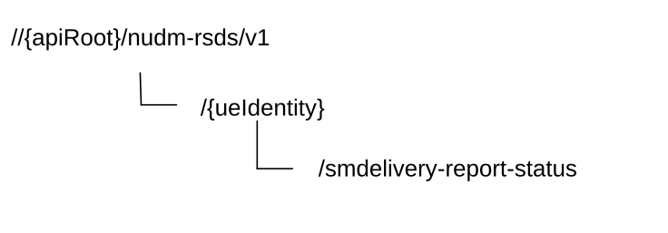

# 6.9 Nudm_ReportSMDeliveryStatus Service API

## 6.9.1 API URI

The Nudm_ReportSMDeliveryStatus service shall use the Nudm_RSDS API.

The API URI of the Nudm_RSDS API shall be:

**{apiRoot}/\<apiName\>/\<apiVersion\>**

The request URI used in HTTP request from the NF service consumer towards the NF service producer shall have the structure defined in clause 4.4.1 of TS 29.501 \[5\], i.e.:

**{apiRoot}/\<apiName\>/\<apiVersion\>/\<apiSpecificResourceUriPart\>**

with the following components:

\- The {apiRoot} shall be set as described in TS 29.501 \[5\].

\- The \<apiName\> shall be "nudm-rsds".

\- The \<apiVersion\> shall be "v1".

\- The \<apiSpecificResourceUriPart\> shall be set as described in clause 6.8.3.

## 6.9.2 Usage of HTTP

### 6.9.2.1 General

HTTP/2, as defined in IETF RFC 9113 \[13\], shall be used as specified in clause 5 of TS 29.500 \[4\].

HTTP/2 shall be transported as specified in clause 5.3 of TS 29.500 \[4\].

HTTP messages and bodies for the Nudm_ReportSMDeliveryStatus service shall comply with the OpenAPI \[14\] specification contained in Annex A.9.

### 6.9.2.2 HTTP standard headers

#### 6.9.2.2.1 General

The usage of HTTP standard headers shall be supported as specified in clause 5.2.2 of TS 29.500 \[4\].

#### 6.9.2.2.2 Content type

The following content types shall be supported:

JSON, as defined in IETF RFC 8259 \[15\], signalled by the content type "application/json".

The Problem Details JSON Object (IETF RFC 9457 \[16\] signalled by the content type "application/problem+json"

### 6.9.2.3 HTTP custom headers

#### 6.9.2.3.1 General

The usage of HTTP custom headers shall be supported as specified in clause 5.2.3 of TS 29.500 \[4\].

## 6.9.3 Resources

### 6.9.3.1 Overview

This clause describes the structure for the Resource URIs and the resources and methods used for the service.

Figure 6.9.3.1-1 depicts the resource URIs structure for the Nudm_RSDS API.

Figure 6.9.3.1-1: Resource URI structure of the nudm-rsds API

Table 6.9.3.1-1 provides an overview of the resources and applicable HTTP methods.

Table 6.9.3.1-1: Resources and methods overview

<table>
<colgroup>
<col style="width: 26%" />
<col style="width: 31%" />
<col style="width: 11%" />
<col style="width: 30%" />
</colgroup>
<thead>
<tr class="header">
<th>Resource name 
(Archetype)</th>
<th>Resource URI</th>
<th>HTTP method or custom operation</th>
<th>Description</th>
</tr>
</thead>
<tbody>
<tr class="odd">
<td>SmDeliveryStatus (Document)</td>
<td>/{ueidentity}/sm-delivery-status</td>
<td>sm-delivery-status (POST)</td>
<td>Report the SM-Delivery Status.</td>
</tr>
</tbody>
</table>

### 6.9.3.2 Resource: SmDeliveryStatus (Document)

#### 6.9.3.2.1 Description

This resource represents the SM-Delivery Status for a GPSI.

#### 6.9.3.2.2 Resource Definition

Resource URI: {apiRoot}/nudm-rsds/\<apiVersion\>/{ueIdentity}/sm-delivery-status

This resource shall support the resource URI variables defined in table 6.9.3.2.2-1.

Table 6.9.3.2.2-1: Resource URI variables for this resource

<table>
<colgroup>
<col style="width: 11%" />
<col style="width: 11%" />
<col style="width: 76%" />
</colgroup>
<thead>
<tr class="header">
<th>Name</th>
<th>Data type</th>
<th>Definition</th>
</tr>
</thead>
<tbody>
<tr class="odd">
<td>apiRoot</td>
<td>string</td>
<td>See clause 6.8.1</td>
</tr>
<tr class="even">
<td>ueIdentity</td>
<td>string</td>
<td>Represents the GPSI (see TS 23.501 [2] clause 7.2.5) 
pattern: "^ (msisdn-[0-9]{5,15}|extid-[^@]+@[^@]+|extgroupid-[^@]+@[^@]+|.+)$"</td>
</tr>
</tbody>
</table>

#### 6.9.3.2.3 Resource Standard Methods

No Standard Methods are supported for this resource.

#### 6.9.3.2.4 Resource Custom Operations

##### 6.9.3.2.4.1 Overview

Table 6.9.3.2.4.1-1: Custom operations

| Operation Name     | Custom operation URI             | Mapped HTTP method | Description                    |
|--------------------|----------------------------------|--------------------|--------------------------------|
| sm-delivery-status | /{ueIdentity}/sm-delivery-status | POST               | Report the SM-Delivery Status. |

##### 6.9.3.2.4.2 Operation: sm-delivery-status

##### 6.9.3.2.4.2.1 Description

This custom operation is used by the NF service consumer (SMS-GMSC, IP-SM-GW) to report the SM-Delivery Status to UDM for the GPSI.

##### 6.9.3.2.4.2.2 Operation Definition

This operation shall support the request data structures specified in table 6.9.3.2.4.2.2-1 and the response data structure and response codes specified in table 6.9.3.2.4.2.2-2.

Table 6.9.3.2.4.2.2-1: Data structures supported by the POST Request Body on this resource

| Data type        | P   | Cardinality | Description                                    |
|------------------|-----|-------------|------------------------------------------------|
| SmDeliveryStatus | M   | 1           | This IE shall indicate the SM-Delivery Status. |

Table 6.9.3.2.4.2.2-2: Data structures supported by the POST Response Body on this resource

<table>
<colgroup>
<col style="width: 22%" />
<col style="width: 3%" />
<col style="width: 11%" />
<col style="width: 10%" />
<col style="width: 52%" />
</colgroup>
<thead>
<tr class="header">
<th>Data type</th>
<th>P</th>
<th>Cardinality</th>
<th>
Response

codes
</th>
<th>Description</th>
</tr>
</thead>
<tbody>
<tr class="odd">
<td>n/a</td>
<td></td>
<td></td>
<td>204 No Content</td>
<td>Upon success, an empty response body shall be returned.</td>
</tr>
<tr class="even">
<td>ProblemDetails</td>
<td>O</td>
<td>1</td>
<td>404 Not Found</td>
<td>
The "cause" attribute may be used to indicate one of the following application errors:

- USER_NOT_FOUND
</td>
</tr>
<tr class="odd">
<td colspan="5">NOTE: In addition common data structures as listed in table 5.2.7.1-1 of TS 29.500 [4] are supported.</td>
</tr>
</tbody>
</table>

## 6.9.4 Custom Operations without associated resources

In this release of this specification, no custom operations without associated resources are defined for the Nudm_ReportSMDeliveryStatus Service.

## 6.9.5 Notifications

In this release of this specification, no notifications are defined for the Nudm_ReportSMDeliveryStatus Service.

## 6.9.6 Data Model

### 6.9.6.1 General

This clause specifies the application data model supported by the API.

Table 6.9.6.1-1 specifies the structured data types defined for the Nudm_RSDS service API. For simple data types defined for the Nudm_RSDS service API see table 6.9.6.3.2-1.

Table 6.9.6.1-1: Nudm_RSDS specific Data Types

| Data type        | Clause defined | Description               |
|------------------|----------------|---------------------------|
| SmDeliveryStatus | 6.9.6.2.2      | SM Delivery Status‑Report |

Table 6.9.6.1-2 specifies data types re-used by the Nudm_RSDS service API from other specifications, including a reference to their respective specifications and when needed, a short description of their use within the Nudm_RSDS service API.

Table 6.9.6.1-2: Nudm_RSDS re-used Data Types

| Data type | Reference       | Comments                               |
|-----------|-----------------|----------------------------------------|
| Gpsi      | TS 29.571 \[7\] | Generic Public Subscription Identifier |

### 6.9.6.2 Structured data types

#### 6.9.6.2.1 Introduction

This clause defines the structures to be used in resource representations.

#### 6.9.6.2.2 Type: SmDeliveryStatus

Table 6.9.6.2.2-1: Definition of type SmDeliveryStatus

| Attribute name | Data type | P   | Cardinality | Description                                                |
|----------------|-----------|-----|-------------|------------------------------------------------------------|
| gpsi           | Gpsi      | M   | 1           | Generic Public Subscription Identifier                     |
| smStatusReport | string    | M   | 1           | Indicates SMS‑STATUS‑REPORT as defined in TS 23.040 \[53\] |

### 6.9.6.3 Simple data types and enumerations

#### 6.9.6.3.1 Introduction

This clause defines simple data types and enumerations that can be referenced from data structures defined in the previous clauses.

## 6.9.7 Error Handling

### 6.9.7.1 General

HTTP error handling shall be supported as specified in clause 5.2.4 of TS 29.500 \[4\].

### 6.9.7.2 Protocol Errors

Protocol errors handling shall be supported as specified in clause 5.2.7 of TS 29.500 \[4\].

### 6.9.7.3 Application Errors

The common application errors defined in the Table 5.2.7.2-1 in TS 29.500 \[4\] may also be used for the Nudm_ReportSMDeliveryStatus service. The following application errors listed in Table 6.8.7.3-1 are specific for the Nudm_ReportSMDeliveryStatus service.

Table 6.9.7.3-1: Application errors

| Application Error | HTTP status code | Description                                      |
|-------------------|------------------|--------------------------------------------------|
| USER_NOT_FOUND    | 404 Not Found    | The provided subscriber identifier is not found. |

## 6.9.8 Feature Negotiation

The optional features in table 6.9.8-1 are defined for the Nudm_RSDS API. They shall be negotiated using the extensibility mechanism defined in clause 6.6 of TS 29.500 \[4\].

Table 6.9.8-1: Supported Features

| Feature number | Feature Name | Description |
|----------------|--------------|-------------|
|                |              |             |

## 6.9.9 Security

As indicated in TS 33.501 \[6\] and TS 29.500 \[4\], the access to the Nudm_RSDS API may be authorized by means of the OAuth2 protocol (see IETF RFC 6749 \[18\]), based on local configuration, using the "Client Credentials" authorization grant, where the NRF (see TS 29.510 \[19\]) plays the role of the authorization server.

If OAuth2 is used, an NF Service Consumer, prior to consuming services offered by the Nudm_RSDS API, shall obtain a "token" from the authorization server, by invoking the Access Token Request service, as described in TS 29.510 \[19\], clause 5.4.2.2.

NOTE: When multiple NRFs are deployed in a network, the NRF used as authorization server is the same NRF that the NF Service Consumer used for discovering the Nudm_RSDS service.

The Nudm_RSDS API defines a single scope "nudm-rsds" for OAuth2 authorization (as specified in TS 33.501 \[6\]) for the entire API, and it does not define any additional scopes at resource or operation level.

## 6.9.10 HTTP redirection

An HTTP request may be redirected to a different UDM service instance when using direct or indirect communications (see TS 29.500 \[4\]).

An SCP that reselects a different UDM producer instance will return the NF Instance ID of the new UDM producer instance in the 3gpp-Sbi-Producer-Id header, as specified in clause 6.10.3.4 of TS 29.500 \[4\].

If an UDM redirects a service request to a different UDM using an 307 Temporary Redirect or 308 Permanent Redirect status code, the identity of the new UDM towards which the service request is redirected shall be indicated in the 3gpp-Sbi-Target-Nf-Id header of the 307 Temporary Redirect or 308 Permanent Redirect response as specified in clause 6.10.9.1 of TS 29.500 \[4\].
