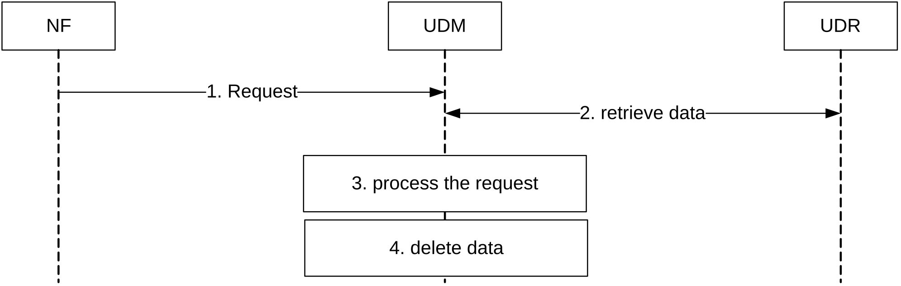
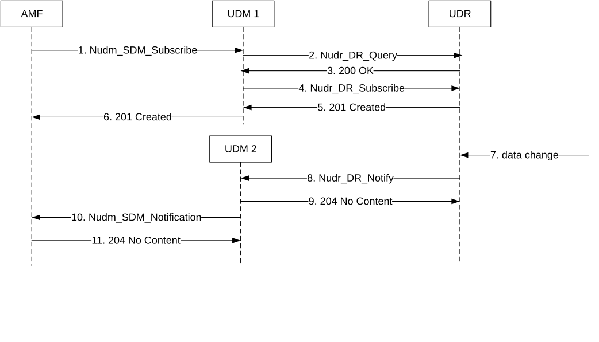
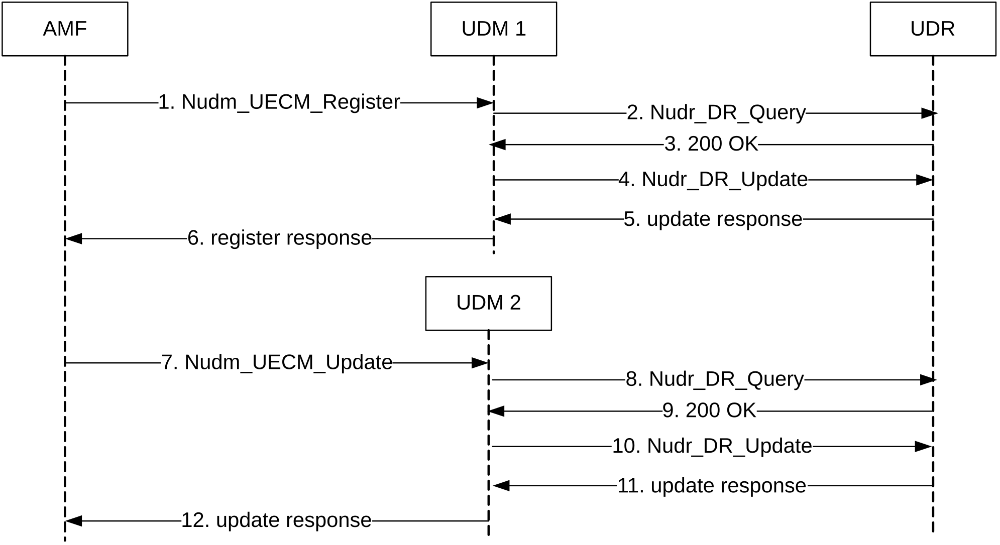
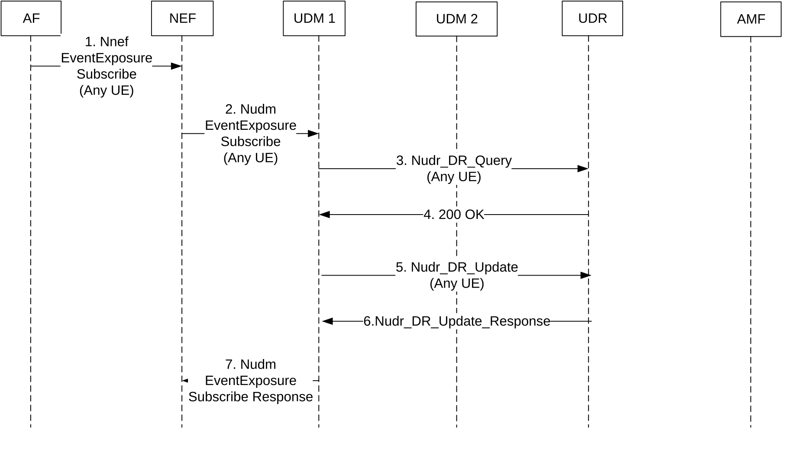

# Annex B (informative): Stateless UDMs

Figure B-1 shows a scenario where the stateless UDM receives and processes a request from an NF.

Figure B-1: Stateless UDM

1\. The stateless UDM receives a request from an NF. This can be a request to perform an Nudm service, or a Notification that the UDM has previously subscribed to at the NF by means of a service the UDM consumes from the NF. In the later case the NF can be the UDR.

2\. The UDM retrieves data from the UDR that are required to process the request. This step can be skipped if the request was a notification from the UDR and contained enough information so that the UDM can process the request.

3\. The UDM processes the received request. This can include consuming services from other NFs, consuming services from the UDR (e.g. to update data or subscribe to notifications), and sending notifications to NFs that have subscribed at the UDM to receive notifications, and includes sending the response to the NF (all not shown in the figure).

4\. The UDM locally deletes the data retrieved in step 2 and/or received in step 1.

Figure B-2 shows a scenario where an AMF subscribes to notifications of data change (permanent provisioned subscription data) at the stateless UDM. The UDM (UDM 1) stores the subscription to notification in the UE's context data at the UDR.

Figure B-2: Subscription to notification

1\. The stateless UDM 1 receives a subscribe request from an AMF; see clause 5.2.2.3.2.

2.-3 The UDM retrieves UE context data from the UDR to be able to perform required plausibility checks; see TS 29.504 \[9\] clause 5.2.2.2.2.

4\. The UDM creates a new sdm subscription at the UDR; see TS 29.504 \[9\] clause 5.2.2.6.3.

5\. The UDR sends a 201 Created response containig a subscription ID

6\. The UDM send a 201 Created response passing the subscription ID received in step 5 to the AMF.

7\. Permanent provisioned Subscription data are modified at the UDR.

8\. The UDR selects a suitable UDM and sends a Notification; see TS 29.504 \[9\] clause 5.2.2.8. In addition to the data that have changed, the Notification request message can contain enough (unchanged) information (e.g. the information that has been created in step 4) allowing the UDM to perform step 10 without the need to additionally retrieve information from the UDR.

9\. The UDM responds with 204 No Content.

10\. The UDM notifies the AMF according to the callback URI of the AMF contained in the Notification received in step 8; see clause 5.2.2.5.2.

11\. The AMF responds with 204 No Content.

Figure B-3 shows a scenario where an AMF registers at the stateless UDM. The UDM (UDM 1) stores the registration in the UE's context data at the UDR. The AMF then requests to update the registration e.g. due to change of PEI. This request is sent to UDM2, which is either:

\- an UDM instance that belongs to the same UDM group as UDM1 (if there are UDM groups defined in the PLMN), or

\- any other UDM instance in the PLMN (if there are no UDM groups defined in the PLMN).

Figure B-3: AMF Registration and Update

1\. The AMF discovers (by means of NRF query) and selects an UDM and sends the register request;

2.-3 The UDM retrieves UE context data from the UDR e.g. to be able to perform required plausibility checks;

4.-5 The UDM updates UE context data in the UDR. The UDM also performs other actions not shown in the figure, e.g deregister an old AMF or notify a subscribed NEF.

6\. The UDM acknowldeges the AMF registration. The AMF stores the UDM group ID if any, as discovered and selected in step 1. The UDM locally deletes the data retrieved in step 3.

7\. The AMF sends an update request (e.g. change of PEI) to one of the suitable UDMs (UDM2) e.g. that belongs to the same UDM group as UDM1.

8.-9. The UDM retrieves UE context data from the UDR e.g. to be able to perform required plausibility checks;

10.-11. The UDM updates UE context data in the UDR.The UDM also performs other actions not shown in the figure, e.g. notify a subscribed NEF, ...

12\. The UDM sends update response to the AMF and locally deletes the data retrieved in step 9.

NOTE: When a previously received Location Header or Callback URI is used for a subsequent UDM contact, the authority part may need to be replaced to point to the selected UDM.

Figure B-4 shows a scenario where an AF requests a subscription for all UEs ("Any UE") for a given network event. The NEF discovers all UDM NFs providing the necessary service to perform a bulk subscription. If one or several UDM Group IDs are received, NEF selects only one instance of UDM for each Group ID in order to perform the bulk subscription. If there are no UDM groups discovered, NEF selects any UDM instance from the discovered instances.

Figure B-4: Any UE Subscription

1\. An AF subscribes to a network event (e.g. SUPI-PEI association change) for "Any UE" (i.e. all UEs)

2\. The NEF discovers (by means of NRF query) all UDM instances supporting the required service (e.g. nudm-ee). The NEF selects an UDM instance (e.g. UDM 1) from each UDM Group ID discovered (UDM 1 and UDM 2 are in the same UDM Group ID) or any UDM instance in case there are no UDM groups discovered, and sends the subscribe request. The NEF also stores the UDM Group ID information, if any, to select a UDM for subsequent subscriptions.

3-4. The UDM retrieves data from the UDR for "Any UE", e.g. to be able to perform required plausibility checks

5-6. The UDM stores data for "Any UE" in the UDR.

7\. The UDM acknowldeges the NEF subscription request. The UDM locally deletes the data retrieved in step 3.

Steps 7-12 in Figure B-3 are performed. The UDM instance that detects the network event (e.g. change of PEI) for each individual UE, checks in UDR whether subscription to the network event for this individual UE or for "Any UE" exists. As result of the subscription to the detected network event for any UE, NEF is notified by the UDM instance that detects the network event for each individual UE, i.e. UDM 2 in this example.
