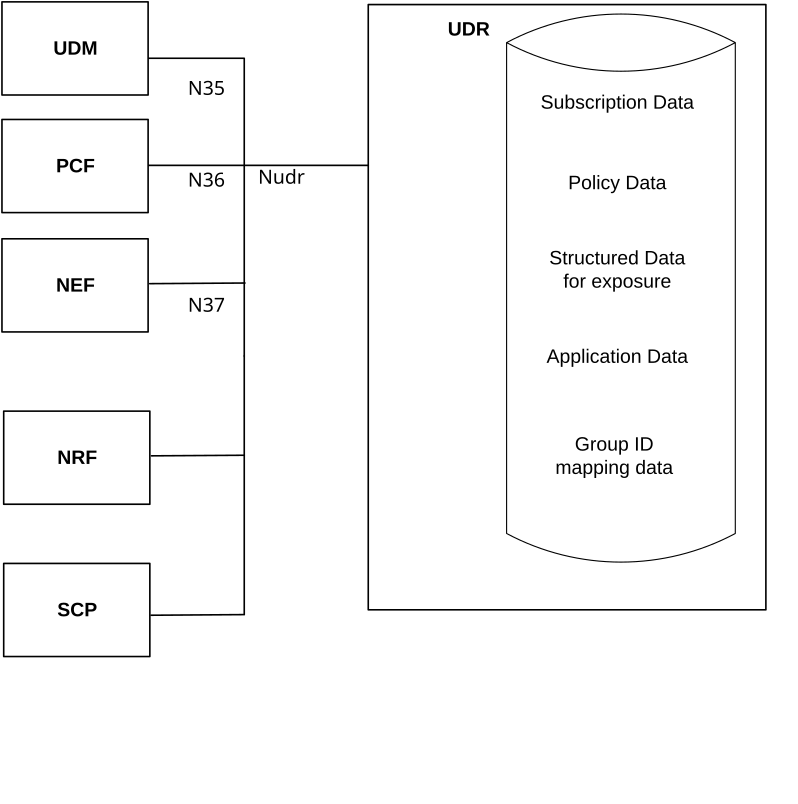

# 4 Overview

The Unified Data Repository (UDR) is the network entity in the 5G Core Network (5GC) supporting the following functionalities:

\- Storage and retrieval of subscription data as specified in TS 29.505 \[2\];

\- Storage and retrieval of policy data as specified in TS 29.519 \[3\];

\- Storage and retrieval of structured data for exposure as specified in TS 29.519 \[3\];

\- Storage and retrieval of application data (including Packet Flow Descriptions (PFDs) for application detection, application request information for multiple UEs) as specified in TS 29.519 \[3\];

\- Subscription to notification and the notification of subscribed data changes.

\- Storage and retrieval of NF-Group Id mapping data.

Figures 4-1 shows the data storage architecture for the 5GC:

Figure 4-1: Data storage architecture

The Nudr interface is used by the network functions (i.e. UDM, PCF, NEF and NRF) to access a particular set of the data stored in the UDR.

NOTE: Services offered by the UDR via the Nudr service-based interface can also be consumed by the HSS as specified in TS 23.632 clause 5.2.4.
