# 5.2 Nudr_DataRepository Service

## 5.2.1 Service Description

### 5.2.1.1 Service and operation description

The UDR is acting as NF Service Producer. It provides Unified Data Repository service to the NF service consumer. The known NF Service Consumers are the UDM, PCF and NEF.

For the Nudr_DataRepository service, the following service operations are defined:

\- Query

\- Create

\- Delete

\- Update

\- Subscribe

\- Unsubscribe

\- Notify

\- DataRestorationNotification

This service allows NF service consumers to retrieve, create, update, modify and delete data stored in the UDR.

This service allows the NF service consumers to subscribe/unsubscribe the data change notification and to be notified of the data change.

This service allows the NF service consumers to be notified upon the UDR restoration.

### 5.2.1.2 Service operation and data access authorization

UDR provides one Nudr_DataRepository service to all of the NF consumers, while different types of data may have different data access authorizations, the UDR shall be able to have the authorization management mechanism to guarantee the safety of data access.

And the information in the Nudr_DataRepository service operation should be able to identify the NF type of the consumer and the service operation type or name, and to indicate the requested data information including the data set and data subset, and the resource/data identifier. All HTTP methods for the service operation shall include the information in the appropriate place of the HTTP message.

If there is an illegal service operation or data access request initiated by a NF consumer, the service failure response should be returned through the Nudr interface with an explicit cause value.

NOTE: For allowed service operations or data access requests initiated by an NF consumer it is not expected (unless explicitly specified otherwise) that the UDR performs any consumer-specific application logic to check whether a requested service operation should be rejected.

## 5.2.2 Service Operations

### 5.2.2.1 Introduction

This clause specifies the generic Nudr_DataRepository service operations towards the different data sets as shown in Figure 4-1.

The HTTP request of the service operations contains a resource URI where the {apiSpecificResourceUriPart} (see clause 4.4.2 in TS 29.501 \[8\]) consists of a top-level segment and sub-level segment(s), followed by query parameters (optional or required).

If multiple query parameters are defined for a method on the resource, the default logical relationship between the different query parameters shall be the logical "AND", unless explicitly indicated on each specific resource and operation on the Nudr_DataRepository API.

NOTE: Not all query parameters imply necessarily a logical relationship with other parameters (e.g. "supported-features"); whether or not such logical relationship exists, is determined by the semantics of the different query parameters in each resource and operation.

For Create, Query, Update and Delete operations, the top-level segment indicates one top level resource representing one of the data sets, which are defined as "/subscription-data", "/policy-data", "/exposure-data" and "/application-data" in Figure 6.1.3.1-1. And a certain child resource is indicated by of the end URI of the sub-level segments, which are defined in TS 29.505 \[2\] for use when the top-level segment is "/subscription-data" and in TS 29.519 \[3\] for use when the top-level segment is "/policy-data", "/exposure-data" or "/application-data".

For Subscribe/Unsubscribe to data change notification operations, the resource of the subscription to the notification should be as the child resource of each of the data sets (i.e. "/subscription-data", "/policy-data", "/exposure-data" and "/application-data"), which are indicated by the top-level segment in the URI. And the resource representation of the subscription to the notification should be indicated by the sub-level segment of each data set.

The following procedures for each operation should be taken as the common procedures and applicable to corresponding detail procedures with the same service operation in TS 29.505 \[2\] and TS 29.519 \[3\].

### 5.2.2.2 Query

#### 5.2.2.2.1 General

The Query service operation is used to retrieve the data stored in the UDR. HTTP GET method shall be used for the service operation to request the certain data record(s). One piece of data records should be a data set, a data subset, a group of data in one data subset, or a specific data. If the data record(s) are the attribute(s), query parameter or the combination of query parameters should be used as the filters to control the content of result.

#### 5.2.2.2.2 Data retrieval

Figure 5.2.2.2.2-1 shows a scenario where the NF service consumer (e.g. UDM, PCF or NEF) sends a request to the UDR to retrieve data.

Query parameters may be used for data retrieval:

i\) Clause 5.2.2.2.3 specifies the query parameter used for retrieving subset of a resource;

ii\) Other query parameters are defined in TS 29.505 \[2\] and TS 29.519 \[3\].

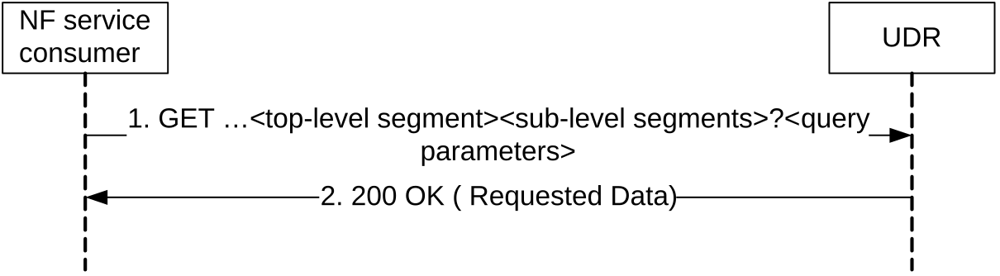

Figure 5.2.2.2.2-1: Retrieving Data

1\. The NF service consumer shall send a GET request to the resource representing the data. Query parameters may be used to restrict the response to the requested data record(s) of the resource's representation. Query parameters may also indicate the features that the NF service consumer supports as described in clause 6.6.2 of TS 29.500 \[7\].

2\. On success, the UDR shall respond with "200 OK" with the message body containing the requested data record(s) restricted to the query parameters. (and thus also to the indicated features supported by the NF service consumer).

On failure, the UDR shall return an appropriated error code with the error cause information.

The error codes of corresponding service operations in TS 29.505 \[2\] and TS 29.519 \[3\] shall align and comply with the failure response mechanism which is defined in TS 29.500 \[7\].

#### 5.2.2.2.3 Retrieval of subset of a resource

When a resource has multiple attributes, it is allowed for the NFs to retrieve a subset of the attributes. When the attribute is of type map, it is allowed for the NFs to retrieve individual member(s) of that map. For retrieval of subset of a resource, a new query parameter "fields" is defined to carry the identities of the attributes to be retrieved. The definition of "fields" query parameter is:

1\) "fields" query parameter is of type array; and

2\) each element of the array is of type string encoded as a JSON pointer as defined IETF RFC 6901 \[9\].

NOTE: identifying an individual element in the array is supported by JSON pointer, however it is not recommended to use this feature if the client is not exactly aware of the order of the members in the array.

If retrieval of subset of a particular resource is supported, then all the attributes of the corresponding data type of that resource shall be optional or conditional.

EXAMPLE 1:

Given the following representation of ExResource:

{

"lv1Attr1": "value1"

"lv1Attr2": "value2"

"lv1Attr3": {

"lv2Attr1": "value3"

"lv2Attr2": "value4"

}

}

To retrieve "lv1Attr1" and "lv2Attr2", the NF sends the following request:

GET /ExResource?fields=/lv1Attr1, /lv1Attr3/lv2Attr2

Upon success, the UDR then returns the following representation:

{

"lv1Attr1": "value1"

"lv1Attr3": {

"lv2Attr2": "value4"

}

}

EXAMPLE 2:

Given the following representation of ExResource:

{

"Attr1": "value1"

"Attr2": "value2"

"AttrMap": {

"Key1": {ExObject1}

"Key2": {ExObject2}

}

}

To retrieve "Attr1" and the second member of "AttrMap ", the NF sends the following request:

GET /ExResource?fields=/Attr1, /AttrMap/Key2

Upon success, the UDR then returns the following representation:

{

"Attr1": "value1"

"AttrMap": {

"Key2": {ExObject2}

}

}

### 5.2.2.3 Create

#### 5.2.2.3.1 General

The Create service operation is used by the NF service consumer (e.g. NEF) to create the data into the UDR.

The following procedures using the Create service operation are supported:

\- Data creation using PUT

\- Data creation using POST

#### 5.2.2.3.2 Data Creation using PUT

Figure 5.2.2.3.2-1 shows a scenario where the NF service consumer (e.g. NEF) sends a request to the UDR to create data. The parent resource of the resource identified by the resource URI shall be of archetype Store (see clause C.3 in TS 29.501 \[8\]).

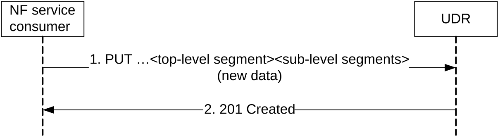

Figure 5.2.2.3.2-1: Creating Data using PUT

1\. The NF service consumer shall send a PUT request to the resource representing the data. The content of the PUT request shall contain the representation of the new data.

2\. On success, the UDR shall respond with "201 Created" with the content containing the representation of the created data, and the "Location" header shall be present and contains the URI of the created data.

On failure, the UDR shall return an appropriated error code with the error cause information.

#### 5.2.2.3.3 Data Creation using POST

Figure 5.2.2.3.3-1 shows a scenario where the NF service consumer (e.g. NEF) sends a request to the UDR to create data. The resource identified by the resource URI shall be of archetype Collection (see clause C.2 in TS 29.501 \[8\]).

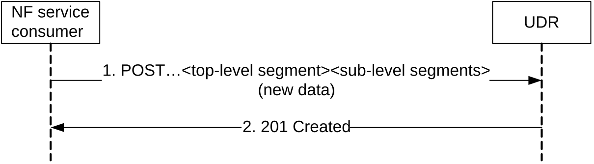

Figure 5.2.2.3.3-1: Creating Data using POST

1\. The NF service consumer shall send a POST request to create the new data record as the child resource of the parent resource in the UDR. The content of the POST request shall contain the representation of the new data.

2\. The UDR generates the data identifier and constructs the URI for the created data record by appending the data identifier to the parent resource URI received as request URI of the POST request.

On success, the UDR shall respond with "201 Created" with the content containing the representation of the created data, and the "Location" header shall be present and contains the URI of the created data.

On failure, the UDR shall return an appropriated error code with the error cause information.

### 5.2.2.4 Delete

#### 5.2.2.4.1 General

The Delete service operation is used by the NF service consumer (e.g. NEF) to remove the data from the UDR.

The following procedures using the Delete service operation are supported:

\- Data Deletion

HTTP DELETE method shall be used.

#### 5.2.2.4.2 Deleting Data

Figure 5.2.2.4.2-1 shows a scenario where the NF service consumer (e.g. NEF) sends a request to the UDR to delete a data record.

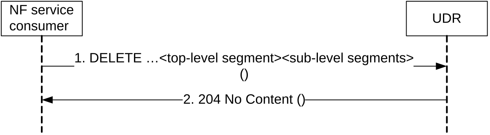

Figure 5.2.2.4.2-1: Deleting Data

1\. The NF service consumer shall send a DELETE request to the resource representing the data. The content of the request shall be empty.

2\. On success, the UDR shall respond with "204 No Content", the content of the DELETE response shall be empty.

On failure, the UDR shall return an appropriated error code with the error cause information.

### 5.2.2.5 Update

#### 5.2.2.5.1 General

The Update service operation is used by the NF service consumer (e.g. UDM, PCF or NEF) to update the data stored in the UDR.

The following procedures using the Update service operation are supported:

\- Data Update using PATCH

\- Data Update using PUT

HTTP PATCH method shall be used to add/create, delete or modify part of the value(s) in the data record (e.g. a specific data or a group of data in one data subset). HTTP PUT method shall be used to replace a complete data record.

#### 5.2.2.5.2 Data Update using PATCH

Figure 5.2.2.5.2-1 shows a scenario where the NF service consumer (e.g. UDM, PCF or NEF) sends a request to the UDR to update some parts of the data record.

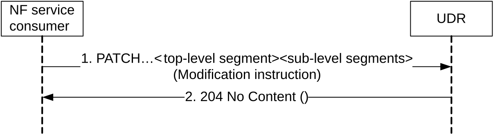

Figure 5.2.2.5.2-1: Data Updating using PATCH

1\. The NF service consumer shall send a PATCH request to the resource representing the data record. The content contains the modification instruction towards the data record.

2\. On success, the UDR shall respond with "204 No Content".

On failure, the UDR shall return an appropriated error code with the error cause information.

#### 5.2.2.5.3 Data Update using PUT

Figure 5.2.2.5.3-1 shows a scenario where the NF service consumer (e.g. UDM, PCF or NEF) sends a request to the UDR to update the whole data record.

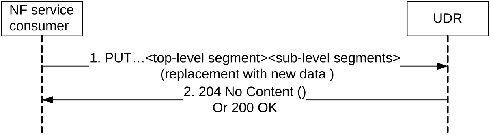

Figure 5.2.2.5.3-1: Data Updating using PUT

1\. The NF service consumer shall send a PUT request to the resource representing the data record. The content contains the new data for the resource.

2\. On success, the UDR shall respond with "204 No Content" or "200 OK".

On failure, the UDR shall return an appropriated error code with the error cause information.

### 5.2.2.6 Subscribe

#### 5.2.2.6.1 General

The Subscribe service operation is used for the NF service consumer to explicitly subscribe to the data change notification from the UDR.

Permanent Subscription Data i.e. sub-resources of the ProvisionedData resource (see TS 29.505 \[2\]) can be modified only by means of provisioning at the UDR and may be (as a deployment option) implicitly subscribed by the UDM as described in TS 29.501 \[8\] clause 4.6.2.2.1. If so and when a data modification of permanent subscription data occurs by means of provisioning and there is the need to notify at least one serving node (e.g. AMF, SMF, SMSF), the UDR shall select one of the suitable and available UDMs (as discovered via the NRF) and send a notification using the callback URI provided by the NRF during UDM discovery.

#### 5.2.2.6.2 NF service consumer subscribes to notifications to UDR

Figure 5.2.2.6.2-1 shows a scenario where the NF service consumer (e.g. UDM, PCF or NEF) sends a request to the UDR to subscribe to data change notifications.

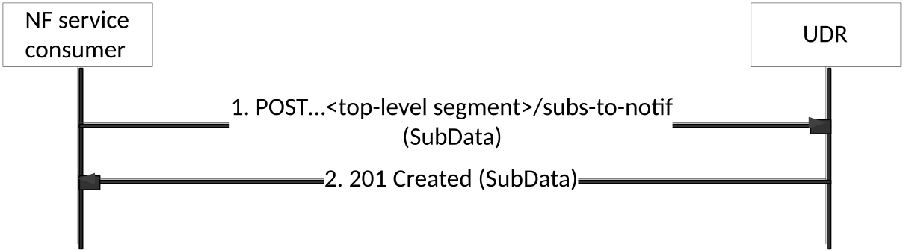

Figure 5.2.2.6.2-1: subscribing to data change notifications

1\. The NF service consumer sends a POST request to the parent resource (...\<top-level segment\>/subs-to-notif). The NF service consumer describes the notifications it wants to receive, and it also indicates the features it supports (see clause 6.6.2 of TS 29.500 \[7\]). The request may contain an expiry time, suggested by the NF Service Consumer as a hint, representing the time upto which the subscription is desired to be kept active.

2\. On success, the UDR responds with "201 Created" with the message body containing a representation of the created subscription and indicating the supported features (see clause 6.6.2 of TS 29.500 \[7\]). The Location HTTP header shall contain the URI of the created subscription. In subsequent notifications according to clause 5.2.2.8.2, the UDR only uses the indicated supported features.

The response based on operator policies and taking into account the expiry time included in the request, may contain an expiry time (i.e a future timestamp), as determined by the UDR, after which the subscription becomes invalid. If an expiry time was included in the request, then the expiry time returned in the response should be less than or equal to that value. Once the subscription expires, if the NF Service Consumer wants to keep receiving notifications, it shall create a new subscription in the UDR. The UDR shall not provide the same expiry time (i.e a future timestamp) for many subscriptions in order to avoid all of them expiring and recreating the subscription at the same time. If the expiry time is not included in the response, the NF Service Consumer shall consider the subscription to be valid without an expiry time.

On failure, the UDR returns an appropriated error code with the error cause information.

Once the subscription has been created, an NF Service Consumer may request the update of the subscription in UDR (e.g., to request an extension of the subscription lifetime before the subscription expires) by issuing a PUT or PATCH request, as described in TS 29.501 \[8\], clause 4.6.2.2.3.

#### 5.2.2.6.3 Stateless UDM subscribes to notifications to UDR

Figure 5.2.2.6.3-1 shows a scenario where the stateless UDM subscribes to notification to the UDR.

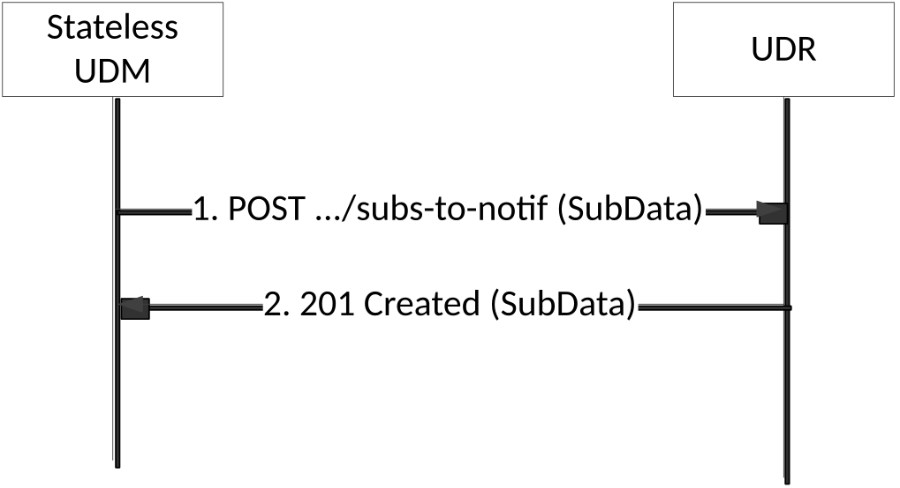

Figure 5.2.2.6.3-1: subscribing to data change notifications via stateless UDM

1\. The stateless UDM sends a POST request to the UDR to subscribe to the notifications.

The SubData in the POST request body shall indicate the same data for which a change will trigger a notification.

The SubData in the POST request body shall contain a callbackReference URI to which the notifications will be sent to. The host part of the callbackReference URI shall be set to the FQDN of the UDM set to which the stateless UDM belongs.

The SubData in the POST request body shall contain an original callbackReference URI of the NF which initially triggers the subscription.

The request may contain an expiry time, suggested by the NF Service Consumer as a hint, representing the time upto which the subscription is desired to be kept active.

2\. On success, the UDR responds with "201 Created" with the message body containing a representation of the created subscription. The Location HTTP header shall contain the URI of the created subscription and that URI shall contain the subscription ID allocated by the UDR.

The response based on operator policies and taking into account the expiry time included in the request, may contain an expiry time (i.e a future timestamp), as determined by the UDR, after which the subscription becomes invalid. If an expiry time was included in the request, then the expiry time returned in the response should be less than or equal to that value. Once the subscription expires, if the NF Service Consumer wants to keep receiving notifications, it shall create a new subscription in the UDR. The UDR shall not provide the same expiry time (i.e a future timestamp) for many subscriptions in order to avoid all of them expiring and recreating the subscription at the same time. If the expiry time is not included in the response, the NF Service Consumer shall consider the subscription to be valid without an expiry time.

On failure, the UDR returns an appropriated error code with the error cause information.

Once the subscription has been created, the stateless UDM may request the update of the subscription in UDR (e.g., to request an extension of the subscription lifetime before the subscription expires) by issuing a PUT or PATCH request, as described in TS 29.501 \[8\], clause 4.6.2.2.3.

### 5.2.2.7 Unsubscribe

#### 5.2.2.7.1 General

The Unsubscribe service operation is used for the NF service consumer to unsubscribe to the data change notification from the UDR.

#### 5.2.2.7.2 Unsubscribe service operation

Figure 5.2.2.7.2-1 shows a scenario where the NF service consumer (e.g. UDM, PCF or NEF) sends a request to the UDR to unsubscribe to data change notifications.

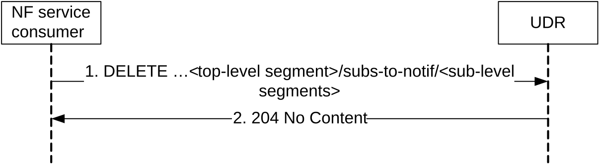

Figure 5.2.2.7.2-1: Unsubscribing to the data change notifications

1\. The NF service consumer sends a DELETE request to the resource identified by the URI previously received during subscription creation, i.e. in the Location header field of the HTTP 201 Created response.

2\. On success, the UDR responds with "204 No Content".

On failure, the UDR returns an appropriated error code with the error cause information.

### 5.2.2.8 Notify

#### 5.2.2.8.1 General

The Notify service operation is used for the UDR to notify the data change notification to the previous subscribe operation requestor.

#### 5.2.2.8.2 Notification to NF service consumer on data change

Figure 5.2.2.8.2-1 shows a scenario where the UDR notifies the NF service consumer about the subscribed data change. The request contains the CallbackReference URI as previously received in the subscribe operation (see clause 5.2.2.6).

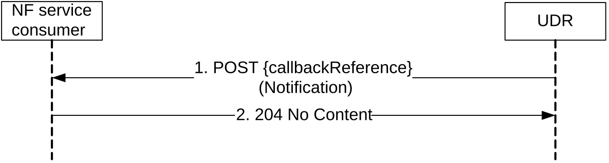

Figure 5.2.2.8.2-1: Data Change Notification

1\. The UDR sends a POST request to the callbackReference URI as provided by the NF service consumer in the subscribe operation.

2\. On success, the NF service consumer responds with "204 No Content".  
  
On failure, the NF service consumer responds an appropriated error code with the error cause information.

#### 5.2.2.8.3 Notification to stateless UDM on data change

Figure 5.2.2.8.3-1 shows a scenario where the UDR notifies the NF service consumer about the subscribed data change.

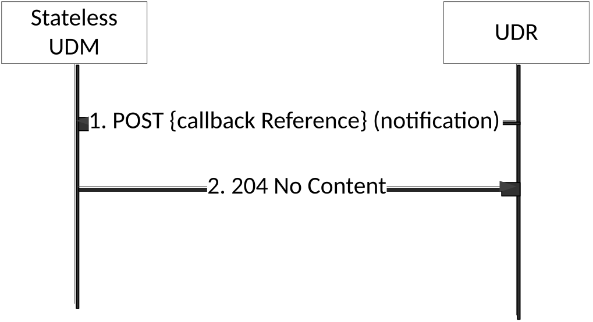

Figure 5.2.2.8.3-1: Data Change Notification to stateless UDM

1\. The UDR sends a POST request to the callbackReference URI as provided by the stateless UDM in the subscribe operation.

The notification in the POST request body shall contain the original callbackReference URI which is received in step 1 of Figure 5.2.2.6.3-1.

When the notification in the POST request body includes one or more arrays, the UDR shall use the complete replacement representation of the arrays, see TS29.501 \[4\], Annex E.

When the notification in the POST request body includes one or more arrays where all the array elements have been removed, the UDR shall include the original array representation, i.e. in the origValue attribute of the ChangeItem.

2\. On success, the stateless UDM responds with "204 No Content".

On failure, the stateless UDM responds an appropriated error code with the error cause information.

### 5.2.2.9 DataRestorationNotification

#### 5.2.2.9.1 General

The DataRestorationNotification service operation is used for the UDR to send notfications on UDR restoration event to one or a set of NFs which are subject to the data restoration procedure.

#### 5.2.2.9.2 Notification on Data Restoration

The notification on data restoration may be based on implicit subscription to data restoration event. When the NF service consumer (e.g. UDM) access UDR (i.e. to access the data stored in the UDR) for the first time, the UDR shall identify the identity of the NF service consumer via the NF instance ID contained in the 3gpp-Sbi-NF-Peer-Info header field of the request, then the UDR may create a default subscription on data restoration for that NF service consumer accordingly.

Figure 5.2.2.9.2-1 shows a scenario where the UDR notifies the NF service consumer about the need to restore data due to a potential data-loss event occurred at the UDR. The dataRestorationCallbackUri contained in the request is the default callback URI as discovered from NRF.

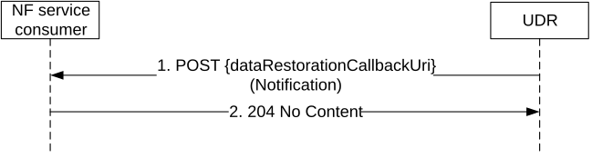

Figure 5.2.2.9.2-1: Data Restoration Notification

1\. The UDR sends a POST request to the dataRestorationCallbackUri as discovered from NRF.

2\. On success, the NF service consumer responds with "204 No Content".  
  
On failure, the NF service consumer responds an appropriated error code with the error cause information.
