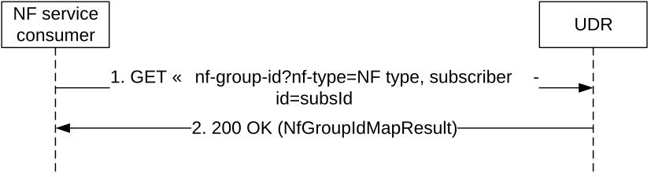
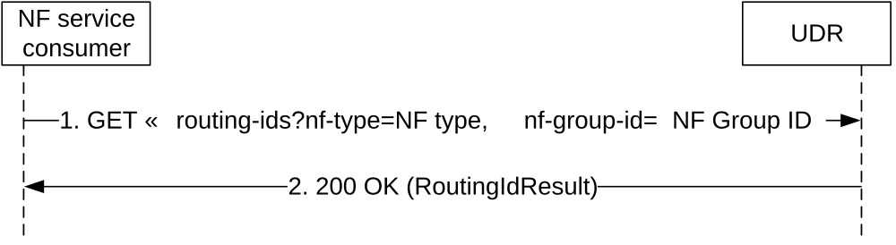
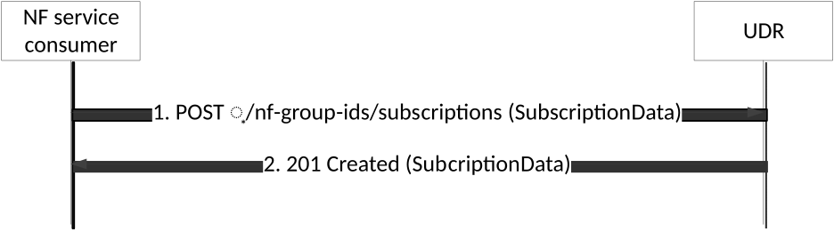
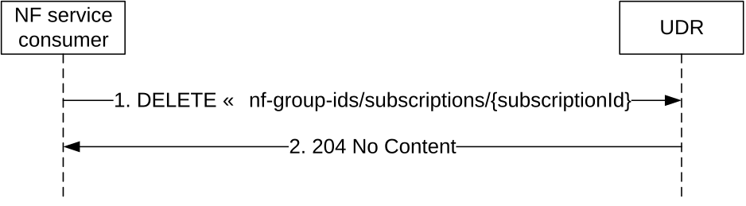
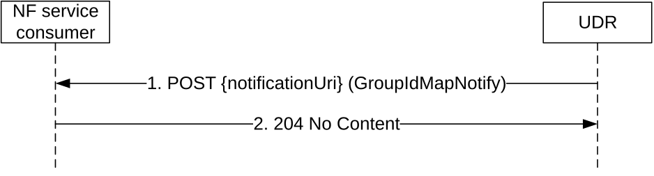

# 5.3 Nudr_GroupIDmap Service

## 5.3.1 Service Description

### 5.3.1.1 Service and operation description

The Nudr_GroupIDmap service may be used by NF service consumers (e.g. NRF or SCP) to retrieve the NF Group ID for a given NF type and subscriber identifier (or information related to a set of subscribers served by a same NF Group ID, such as the Routing Indicator); see TS 23.501 \[4\] and TS 23.502 \[5\].

It may also be used to retrieve the list of Routing Indicators served by a given NF Group.

For the Nudr_GroupIDmap service, the following service operations are defined:

\- Query

\- Subscribe

\- Unsubscribe

\- Notify

This service allows NF service consumers to retrieve, NF GroupID data stored in the UDR.

This service allows the NF service consumers to subscribe/unsubscribe to changes on user ID to NF Group ID mapping, and to be notified on changes of such mapping.

\- QueryRID

This service allows NF service consumers to retrieve Routing Indicator data stored in the UDR.

## 5.3.2 Service Operations

### 5.3.2.1 Introduction

The service operations defined for the Nudr_GroupIDmap service are as follows:

\- Query: It allows an NF consumer (e.g. NRF) to retrieve the NF Group ID for a given NF type and subscriber-related information.

### 5.3.2.2 Query

#### 5.3.2.2.1 General

The following procedure using the Query service operation is supported:

\- NF-Group ID Retrieval

#### 5.3.2.2.2 NF Group ID retrieval

Figure 5.3.2.2.2-1 shows a scenario where the NF service consumer (e.g. NRF) sends a request to the UDR to retrieve the NF Group ID.

Figure 5.3.2.2.2-1: Retrieving NF Group ID

1\. The NF service consumer shall send a GET request to the resource representing the data. Query parameters shall be used to identify the NF type (e.g. UDM) of the requested NF Group ID (e.g. UDM Group ID) and the subscriber-id, or information related to a set of subscribers.

2\. On success, the UDR shall respond with "200 OK" with the message body containing the requested data

On failure, the UDR shall return an appropriated error code with the error cause information.

### 5.3.2.3 QueryRID

#### 5.3.2.3.1 General

The following procedure using the QueryRID service operation is supported:

\- Routing IDs Retrieval

#### 5.3.2.3.2 Routing IDs retrieval

Figure 5.3.2.x.2-1 shows a scenario where the NF service consumer (e.g. NRF) sends a request to the UDR to retrieve the Routing Indicators served by a given NF Group (identified by its NF type and its NF Group ID).

Figure 5.3.2.3.2-1: Retrieving Routing Ids

1\. The NF service consumer shall send a GET request to the resource representing the data. Query parameters shall be used to identify the NF type (e.g. UDM) and the NF Group ID (e.g. UDM Group ID).

2\. On success, the UDR shall respond with "200 OK" with the message body containing the requested data.

On failure, the UDR shall return an appropriated error code with the error cause information.

### 5.3.2.4 Subscribe

#### 5.3.2.4.1 General

The Subscribe service operation is used for the NF service consumer to subscribe to notifications from the UDR when there is a change in the mapping between a subscriber ID and an NF Group ID.

#### 5.3.2.4.2 NF service consumer subscribes to notifications to UDR

Figure 5.3.2.4.2-1 shows a scenario where the NF service consumer (e.g. NRF or SCP) sends a request to the UDR to subscribe to NF Group ID mapping changes.

Figure 5.3.2.4.2-1: Subscribing to NF Group ID mapping changes

1\. The NF service consumer sends a POST request to the resource (…/nf-group-ids/subscriptions). The NF service consumer describes the notifications it wants to receive (i.e., the NF type and NF Group ID to be monitored for changes on mapping to subscriber IDs) and provides a notification URI. The request may contain an expiry time, suggested by the NF Service Consumer as a hint, representing the time upto which the subscription is desired to be kept active.

2\. On success, the UDR responds with "201 Created" with the message body containing a representation of the created subscription. The Location HTTP header shall contain the URI of the created subscription.

The response based on operator policies and taking into account the expiry time included in the request, may contain an expiry time (i.e a future timestamp), as determined by the UDR, after which the subscription becomes invalid. If an expiry time was included in the request, then the expiry time returned in the response should be less than or equal to that value. Once the subscription expires, if the NF Service Consumer wants to keep receiving notifications, it shall create a new subscription in the UDR. The UDR shall not provide the same expiry time (i.e a future timestamp) for many subscriptions in order to avoid all of them expiring and recreating the subscription at the same time. If the expiry time is not included in the response, the NF Service Consumer shall consider the subscription to be valid without an expiry time.

On failure, the UDR returns an appropriated error code with the error cause information.

Once the subscription has been created, an NF Service Consumer may request the update of the subscription in UDR (e.g., to request an extension of the subscription lifetime before the subscription expires) by issuing a PATCH request.

### 5.3.2.5 Unsubscribe

#### 5.3.2.5.1 General

The Unsubscribe service operation is used for the NF service consumer to unsubscribe to NF Group ID mapping changes from the UDR.

#### 5.3.2.5.2 Unsubscribe service operation

Figure 5.3.2.5.2-1 shows a scenario where the NF service consumer (e.g. NRF or SCP) sends a request to the UDR to unsubscribe to NF Group ID mapping changes.

Figure 5.3.2.5.2-1: Unsubscribing to NF Group ID mapping changes

1\. The NF service consumer sends a DELETE request to the resource identified by the URI previously received during subscription creation in the Location header field of the HTTP 201 Created response.

2\. On success, the UDR responds with "204 No Content".

On failure, the UDR returns an appropriated error code with the error cause information.

### 5.3.2.6 Notify

#### 5.3.2.6.1 General

The Notify service operation is used for the UDR to notify the NF Group ID mapping change to the previous subscribe operation requestor.

#### 5.3.2.6.2 Notification to NF service consumer on data change

Figure 5.3.2.6.2-1 shows a scenario where the UDR notifies the NF service consumer about the NF Group ID mapping change. The request is sent to the notificationURI as previously received in the subscribe operation (see clause 5.3.2.4.2).

Figure 5.3.2.6.2-1: NF Group ID mapping change notification

1\. The UDR sends a POST request to the notificationUri as provided by the NF service consumer in the subscribe operation. The content of the notification includes the identities whose mapping to a given NF Group ID has changed.

NOTE: For a subscriber identity that currently does not have any NF Group ID assigned, the notification is not needed, and the UDR can decide, based on implementation choice, to only send notifications when the mapping has changed from a given NF Group ID to a different one. Nonetheless, it can be reasonable to send such notifications, for example, when they are related to a large range of subscriber identities, no matter if the individual subscriber identities had, or not, a previous NF Group ID assigned.

2\. On success, the NF service consumer responds with "204 No Content".  
  
On failure, the NF service consumer responds an appropriated error code with the error cause information.
