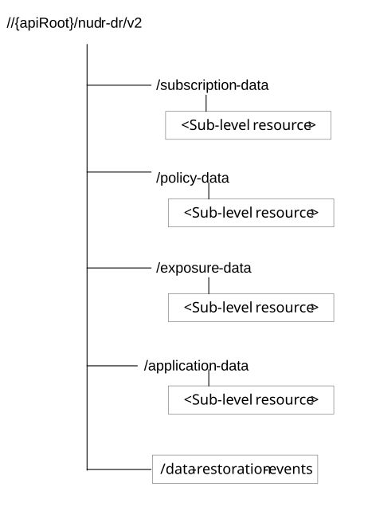

# 6.1.3 Resources

## 6.1.3.1 Overview

Figure 6.1.3.1-1: Resource URI structure of the Nudr_DataRepository API

Table 6.1.3.1-1 provides an overview of the resources and applicable HTTP methods.

Table 6.1.3.1-1: Resources and methods overview

| Resource name             | Resource URI             | HTTP method or custom operation | Description                                                                      |
|---------------------------|--------------------------|---------------------------------|----------------------------------------------------------------------------------|
| SubscriptionData          | /subscription-data       | none                            | For sub-level resource names, resource URIs and HTTP methods see TS 29.505 \[2\] |
| PolicyData                | /policy-data             | none                            | For sub-level resource names, resource URIs and HTTP methods see TS 29.519 \[3\] |
| StructuredDataForExposure | /exposure-data           | none                            | For sub-level resource names, resource URIs and HTTP methods see TS 29.519 \[3\] |
| ApplicationData           | /application-data        | none                            | For sub-level resource names, resource URIs and HTTP methods see TS 29.519 \[3\] |
| DataRestorationEvents     | /data-restoration-events | POST                            | This is a pseudo operation.                                                      |

## 6.1.3.2 SubscriptionData

See TS 29.505 \[2\].

## 6.1.3.3 PolicyData

See TS 29.519 \[3\].

## 6.1.3.4 StructuredDataForExposure

See TS 29.519 \[3\].

## 6.1.3.5 ApplicationData

See TS 29.519 \[3\].

## 6.1.3.6 Resource: DataRestorationEvents

### 6.1.3.6.1 Description

### 6.1.3.6.2 Resource Definition

Resource URI: **{apiRoot}/nudr-dr/\<apiVersion\>/data-restoration-events**

This resource shall support the resource URI variables defined in table 6.1.3.6.2-1.

Table 6.1.3.6.2-1: Resource URI variables for this resource

| Name       | Data type | Definition       |
|------------|-----------|------------------|
| apiRoot    | string    | See clause 6.1.1 |
| apiVersion | string    | See clause 6.1.1 |

### 6.1.3.6.3 Resource Standard Methods

#### 6.1.3.6.3.1 POST

This method will not be actually invoked.

This method shall support the URI query parameters specified in table 6.1.3.6.3.1-1.

Table 6.1.3.6.3.1-1: URI query parameters supported by the POST method on this resource

|      |           |     |             |             |               |
|------|-----------|-----|-------------|-------------|---------------|
| Name | Data type | P   | Cardinality | Description | Applicability |
| n/a  |           |     |             |             |               |

This method shall support the request data structures specified in table 6.1.3.6.3.1-2 and the response data structures and response codes specified in table 6.1.3.6.3.1-3.

Table 6.1.3.6.3.1-2: Data structures supported by the POST Request Body on this resource

|           |     |             |             |
|-----------|-----|-------------|-------------|
| Data type | P   | Cardinality | Description |
| Any       |     |             |             |

Table 6.1.3.6.3.1-3: Data structures supported by the POST Response Body on this resource

<table>
<colgroup>
<col style="width: 16%" />
<col style="width: 4%" />
<col style="width: 12%" />
<col style="width: 11%" />
<col style="width: 54%" />
</colgroup>
<tbody>
<tr class="odd">
<td>Data type</td>
<td>P</td>
<td>Cardinality</td>
<td>
Response

codes
</td>
<td>Description</td>
</tr>
<tr class="even">
<td>n/a</td>
<td></td>
<td></td>
<td></td>
<td></td>
</tr>
</tbody>
</table>
