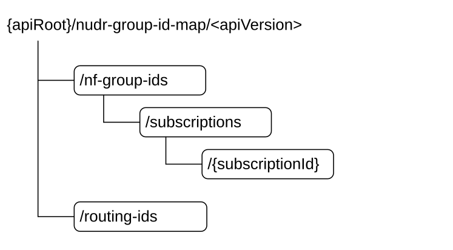

# 6.2 Nudr_GroupIDmap Service API

## 6.2.1 API URI

URIs of this API shall have the following root:

{apiRoot}/\<apiName\>/\<apiVersion\>

where "apiRoot" is defined in clause 4.4.1 of TS 29.501 \[8\], the "apiName" shall be set to "nudr-group-id-map" and the "apiVersion" shall be set to "v1" for the current version of this specification.

## 6.2.2 Usage of HTTP

### 6.2.2.1 General

HTTP/2, as defined in IETF RFC 9113 \[22\], shall be used as specified in clause 5 of TS 29.500 \[7\].

HTTP/2 shall be transported as specified in clause 5.3 of TS 29.500 \[7\].

HTTP messages and bodies for the Nudr_GroupIDmap service shall comply with the OpenAPI \[21\] specification contained in Annex A3.

### 6.2.2.2 HTTP standard headers

#### 6.2.2.2.1 General

The usage of HTTP standard headers shall be supported on Nudr interface as defined in clause 5.2.2 of TS 29.500 \[7\].

#### 6.2.2.2.2 Content type

The following content types shall be supported:

\- JSON, as defined in IETF RFC 8259 \[11\], shall be used as content type of the HTTP bodies specified in the present specification as indicated in clause 5.4 of TS 29.500 \[7\].

\- The Problem Details JSON Object (IETF RFC 9457 \[17\]). The use of the Problem Details JSON object in a HTTP response body shall be signalled by the content type "application/problem+json".

\- JSON Patch (IETF RFC 6902 \[19\]). The use of the JSON Patch format in a HTTP request body shall be signalled by the content type "application/json-patch+json".

#### 6.2.2.2.3 Cache-Control

As described in IETF RFC 9111 \[16\] clause 5.2, a "Cache-Control" header should be included in HTTP responses carrying a representation of cacheable resources. If it is included, it shall contain a "max-age" value, indicating the amount of time in seconds after which the received response is considered stale.

The "max-age" value shall be configurable by operator policy.

#### 6.2.2.2.4 ETag

As described in IETF RFC 9110 \[15\] clause 8.8.3, an "ETag" (entity-tag) header should be included in HTTP responses carrying a representation of cacheable resources to allow an NF Service Consumer performing a conditional GET request with "If-None-Match" header. If it is included, it shall contain a server-generated strong validator, that allows further matching of this value (included in subsequent client requests) with a given resource representation stored in the server or in a cache.

#### 6.2.2.2.5 If-None-Match

As described in IETF RFC 9110 \[15\] clause 13.1.2, an NF Service Consumer may issue conditional GET request towards UDR by including an "If-None-Match" header in HTTP requests containing one or several entity tags received in previous responses for the same resource.

#### 6.2.2.2.6 Last-Modified

As described in IETF RFC 9110 \[15\] clause 8.8.2, a "Last-Modified" header should be included in HTTP responses carrying a representation of cacheable resources (e.g. SmfSelectionSubscriptionData) to allow an NF Service Consumer performing a conditional request with "If-Modified-Since" header.

#### 6.2.2.2.7 If-Modified-Since

As described in IETF RFC 9110 \[15\] clause 13.1.3, an NF Service Consumer may issue conditional GET request towards UDR, by including an "If-Modified-Since" header in HTTP requests.

#### 6.2.2.2.8 When to Use Entity-Tags and Last-Modified Dates

Both "ETag" and "Last-Modified" headers should be sent in the same HTTP response as stated in IETF RFC 9110 \[15\] clause 15.3.1.

NOTE: "ETag" is a stronger validator than "Last-Modified" and is preferred.

If the UDR included an "ETag" header with the resource then a conditional GET request for this resource shall be performed with the "If-None-Match" header.

### 6.2.2.3 HTTP custom headers

#### 6.2.2.3.1 General

In this release of this specification, no custom headers specific to the Nudr_GroupIDmap service are defined. For 3GPP specific HTTP custom headers used across all service-based interfaces, see clause 5.2.3 of TS 29.500 \[7\].

## 6.2.3 Resources

### 6.2.3.1 Overview

Figure 6.2.3.1-1: Resource URI structure of the nudr-group-id-map API

Table 6.2.3.1-1 provides an overview of the resources and applicable HTTP methods.

Table 6.2.3.1-1: Resources and methods overview

| Resource name          | Resource URI                                 | HTTP method | Description                                               |
|------------------------|----------------------------------------------|-------------|-----------------------------------------------------------|
| NfGroupIds             | /nf-group-ids                                | GET         | Obtain the NF Group ID for a given subscriber ID          |
| Subscriptions          | /nf-group-ids/subscriptions                  | POST        | Create a subscription                                     |
| IndividualSubscription | /nf-group-ids/subscriptions/{subscriptionId} | GET         | Retrieve an individual subscription                       |
|                        |                                              | PATCH       | Modify an individual subscription                         |
|                        |                                              | DELETE      | Delete an individual subscription                         |
| RoutingIds             | /routing-ids                                 | GET         | Obtain the list of Routing IDs served by a given NF Group |

### 6.2.3.2 Resource NfGroupIds

#### 6.2.3.2.1 Description

This resource represents the NF Group IDs for the provided subscriber information (e.g. the subscriber identifier, or information related to a set of subscribers, such as the Routing Indicator).

#### 6.2.3.2.2 Resource Definition

Resource URI: {apiRoot}/nudr-group-id-map/\<apiVersion\>/nf-group-ids

This resource shall support the resource URI variables defined in table 6.2.3.2.2-1.

Table 6.2.3.2.2-1: Resource URI variables for this resource

| Name    | Definition       |
|---------|------------------|
| apiRoot | See clause 6.2.1 |

#### 6.2.3.2.3 Resource Standard Methods

##### 6.2.3.2.3.1 GET

This method shall support the URI query parameters specified in table 6.2.3.2.3.1-1.

Table 6.2.3.2.3.1-1: URI query parameters supported by the GET method on this resource

<table>
<colgroup>
<col style="width: 18%" />
<col style="width: 17%" />
<col style="width: 4%" />
<col style="width: 11%" />
<col style="width: 48%" />
</colgroup>
<tbody>
<tr class="odd">
<td>Name</td>
<td>Data type</td>
<td>P</td>
<td>Cardinality</td>
<td>Description</td>
</tr>
<tr class="even">
<td>nf-type</td>
<td>array(NFType)</td>
<td>M</td>
<td>1..N</td>
<td>see TS 29.510 [14]</td>
</tr>
<tr class="odd">
<td>subscriberId</td>
<td>SubscriberId</td>
<td>M</td>
<td>1</td>
<td>Represents the Subscription Identifier SUPI or GPSI or IMPI or IMPU (see TS 23.501 [4] clause 5.9.2 and clause 5.9.8) or Routing Indicator 
pattern: ^(imsi-[0-9]{5,15}|nai-.+|msisdn-[0-9]{5,15}|extid-[^@]+@[^@]+|impi-.+|impu-.+|rid-[0-9]{1,4}|.+)$</td>
</tr>
</tbody>
</table>

NOTE 1: The format of the query parameter subscriberId is in line with the yaml and thus does not follow the lower-with-hyphen format specified in TS 29.501 \[8\].

NOTE 2: If the UDR does not support a certain alternative in the regular expression pattern of the subscriberId query parameter (e.g. "rid-xxxx"), it returns an HTTP 404 error response.

This method shall support the request data structures specified in table 6.2.3.2.3.1-2 and the response data structures and response codes specified in table 6.2.3.2.3.1-3.

Table 6.2.3.2.3.1-2: Data structures supported by the GET Request Body on this resource

|           |     |             |             |
|-----------|-----|-------------|-------------|
| Data type | P   | Cardinality | Description |
| n/a       |     |             |             |

Table 6.2.3.2.3.1-3: Data structures supported by the GET Response Body on this resource

<table>
<colgroup>
<col style="width: 16%" />
<col style="width: 4%" />
<col style="width: 12%" />
<col style="width: 11%" />
<col style="width: 54%" />
</colgroup>
<tbody>
<tr class="odd">
<td>Data type</td>
<td>P</td>
<td>Cardinality</td>
<td>
Response

codes
</td>
<td>Description</td>
</tr>
<tr class="even">
<td>map(NfGroupId)</td>
<td>M</td>
<td>1..N</td>
<td>200 OK</td>
<td>
Upon success, a response body containing the NF Group IDs for the requested NF types shall be returned.

The response shall contain a map (list of key-value pairs where NFType serves as key) of NfGroupIds.
</td>
</tr>
<tr class="odd">
<td>ProblemDetails</td>
<td>O</td>
<td>0..1</td>
<td>404 Not Found</td>
<td>
The "cause" attribute may be set to one of the following application errors:

- USER_NOT_FOUND
</td>
</tr>
<tr class="even">
<td colspan="5">NOTE: In addition, common data structures as listed in table 5.2.7.1-1 of TS 29.500 are supported.</td>
</tr>
</tbody>
</table>

### 6.2.3.3 Resource RoutingIds

#### 6.2.3.3.1 Description

This resource represents the Routing Indicators served by an NF Group.

#### 6.2.3.3.2 Resource Definition

Resource URI: {apiRoot}/nudr-group-id-map/\<apiVersion\>/routing-ids

This resource shall support the resource URI variables defined in table 6.2.3.3.2-1.

Table 6.2.3.3.2-1: Resource URI variables for this resource

| Name    | Definition       |
|---------|------------------|
| apiRoot | See clause 6.2.1 |

#### 6.2.3.3.3 Resource Standard Methods

##### 6.2.3.3.3.1 GET

This method shall support the URI query parameters specified in table 6.2.3.3.3.1-1.

Table 6.2.3.3.3.1-1: URI query parameters supported by the GET method on this resource

|             |           |     |             |                                       |
|-------------|-----------|-----|-------------|---------------------------------------|
| Name        | Data type | P   | Cardinality | Description                           |
| nf-type     | NFType    | M   | 1           | see TS 29.510 \[14\]                  |
| nf-group-id | NfGroupId | M   | 1           | Contains the identity of the NF Group |

This method shall support the request data structures specified in table 6.2.3.3.3.1-2 and the response data structures and response codes specified in table 6.2.3.3.3.1-3.

Table 6.2.3.3.3.1-2: Data structures supported by the GET Request Body on this resource

|           |     |             |             |
|-----------|-----|-------------|-------------|
| Data type | P   | Cardinality | Description |
| n/a       |     |             |             |

Table 6.2.3.3.3.1-3: Data structures supported by the GET Response Body on this resource

<table>
<colgroup>
<col style="width: 16%" />
<col style="width: 4%" />
<col style="width: 12%" />
<col style="width: 11%" />
<col style="width: 54%" />
</colgroup>
<tbody>
<tr class="odd">
<td>Data type</td>
<td>P</td>
<td>Cardinality</td>
<td>
Response

codes
</td>
<td>Description</td>
</tr>
<tr class="even">
<td>RoutingIdResult</td>
<td>M</td>
<td>1</td>
<td>200 OK</td>
<td>Upon success, a response body containing the Routing IDs for the requested NF type and NF Group ID shall be returned.</td>
</tr>
<tr class="odd">
<td colspan="5">NOTE: In addition, common data structures as listed in table 5.2.7.1-1 of TS 29.500 are supported.</td>
</tr>
</tbody>
</table>

### 6.2.3.4 Resource Subscriptions

#### 6.2.3.4.1 Description

This resource represents the subscriptions to changes on the mapping between user ID and NF Group ID.

#### 6.2.3.4.2 Resource Definition

Resource URI: {apiRoot}/nudr-group-id-map/\<apiVersion\>/nf-group-ids/subscriptions

This resource shall support the resource URI variables defined in table 6.2.3.4.2-1.

Table 6.2.3.4.2-1: Resource URI variables for this resource

| Name    | Definition       |
|---------|------------------|
| apiRoot | See clause 6.2.1 |

#### 6.2.3.4.3 Resource Standard Methods

##### 6.2.3.4.3.1 POST

This method shall support the URI query parameters specified in table 6.2.3.4.3.1-1.

Table 6.2.3.4.3.1-1: URI query parameters supported by the POST method on this resource

|                    |                   |     |             |                                |
|--------------------|-------------------|-----|-------------|--------------------------------|
| Name               | Data type         | P   | Cardinality | Description                    |
| supported-features | SupportedFeatures | O   | 0..1        | see TS 29.500 \[7\] clause 6.6 |

This method shall support the request data structures specified in table 6.2.3.4.3.1-2 and the response data structures and response codes specified in table 6.2.3.4.3.1-3.

Table 6.2.3.4.3.1-2: Data structures supported by the POST Request Body on this resource

|                  |     |             |                                                     |
|------------------|-----|-------------|-----------------------------------------------------|
| Data type        | P   | Cardinality | Description                                         |
| SubscriptionData | M   | 1           | Identifies the input data to create a subscription. |

Table 6.2.3.4.3.1-3: Data structures supported by the POST Response Body on this resource

<table>
<colgroup>
<col style="width: 16%" />
<col style="width: 4%" />
<col style="width: 12%" />
<col style="width: 11%" />
<col style="width: 54%" />
</colgroup>
<tbody>
<tr class="odd">
<td>Data type</td>
<td>P</td>
<td>Cardinality</td>
<td>
Response

codes
</td>
<td>Description</td>
</tr>
<tr class="even">
<td>SubscriptionData</td>
<td>M</td>
<td>1</td>
<td>200 OK</td>
<td>Upon success, a response body containing the Routing IDs for the requested NF type and NF Group ID shall be returned.</td>
</tr>
<tr class="odd">
<td colspan="5">NOTE: In addition, common data structures as listed in table 5.2.7.1-1 of TS 29.500 [7] are supported.</td>
</tr>
</tbody>
</table>

### 6.2.3.5 Resource IndividualSubscription

#### 6.2.3.5.1 Description

This resource represents an individual subscription to changes on the mapping between user ID and NF Group ID.

#### 6.2.3.5.2 Resource Definition

Resource URI: {apiRoot}/nudr-group-id-map/\<apiVersion\>/nf-group-ids/subscriptions/{subscriptionId}

This resource shall support the resource URI variables defined in table 6.2.3.5.2-1.

Table 6.2.3.5.2-1: Resource URI variables for this resource

| Name           | Definition                                                                                                                                           |
|----------------|------------------------------------------------------------------------------------------------------------------------------------------------------|
| apiRoot        | See clause 6.2.1                                                                                                                                     |
| subscriptionId | It identifies an individual subscription to notifications. The value is allocated by the UDR during creation of the IndividualSubscription resource. |

#### 6.2.3.5.3 Resource Standard Methods

##### 6.2.3.5.3.1 GET

This method shall support the URI query parameters specified in table 6.2.3.5.3.1-1.

Table 6.2.3.5.3.1-1: URI query parameters supported by the GET method on this resource

|      |           |     |             |             |
|------|-----------|-----|-------------|-------------|
| Name | Data type | P   | Cardinality | Description |
| n/a  |           |     |             |             |

This method shall support the request data structures specified in table 6.2.3.5.3.1-2 and the response data structures and response codes specified in table 6.2.3.5.3.1-3.

Table 6.2.3.5.3.1-2: Data structures supported by the GET Request Body on this resource

|           |     |             |             |
|-----------|-----|-------------|-------------|
| Data type | P   | Cardinality | Description |
| n/a       |     |             |             |

Table 6.2.3.5.3.1-3: Data structures supported by the GET Response Body on this resource

<table>
<colgroup>
<col style="width: 16%" />
<col style="width: 4%" />
<col style="width: 12%" />
<col style="width: 11%" />
<col style="width: 54%" />
</colgroup>
<tbody>
<tr class="odd">
<td>Data type</td>
<td>P</td>
<td>Cardinality</td>
<td>
Response

codes
</td>
<td>Description</td>
</tr>
<tr class="even">
<td>SubscriptionData</td>
<td>M</td>
<td>1</td>
<td>200 OK</td>
<td>Upon success, a response body containing the data that represents an individual subscription shall be returned.</td>
</tr>
<tr class="odd">
<td colspan="5">NOTE: In addition, common data structures as listed in table 5.2.7.1-1 of TS 29.500 [7] are supported.</td>
</tr>
</tbody>
</table>

##### 6.2.3.5.3.2 PATCH

This method shall support the URI query parameters specified in table 6.2.3.5.3.2-1.

Table 6.2.3.5.3.2-1: URI query parameters supported by the PATCH method on this resource

|                    |                   |     |             |                                |
|--------------------|-------------------|-----|-------------|--------------------------------|
| Name               | Data type         | P   | Cardinality | Description                    |
| supported-features | SupportedFeatures | O   | 0..1        | see TS 29.500 \[7\] clause 6.6 |

This method shall support the request data structures specified in table 6.2.3.5.3.2-2 and the response data structures and response codes specified in table 6.2.3.5.3.2-3.

Table 6.2.3.5.3.2-2: Data structures supported by the PATCH Request Body on this resource

|                  |     |             |                                                         |
|------------------|-----|-------------|---------------------------------------------------------|
| Data type        | P   | Cardinality | Description                                             |
| array(PatchItem) | M   | 1..N        | Contains the delta data to the Individual Subscription. |

Table 6.2.3.5.3.2-3: Data structures supported by the PATCH Response Body on this resource

<table>
<colgroup>
<col style="width: 16%" />
<col style="width: 4%" />
<col style="width: 12%" />
<col style="width: 11%" />
<col style="width: 54%" />
</colgroup>
<tbody>
<tr class="odd">
<td>Data type</td>
<td>P</td>
<td>Cardinality</td>
<td>
Response

codes
</td>
<td>Description</td>
</tr>
<tr class="even">
<td>n/a</td>
<td></td>
<td></td>
<td>204 No Content</td>
<td>Upon successful modification, when all the modification instructions in the PATCH request have been implemented, there is no body in the response message.</td>
</tr>
<tr class="odd">
<td>SubscriptionData</td>
<td>C</td>
<td>1</td>
<td>200 OK</td>
<td>Upon partial success, if any of the requested modifications have not been accepted, but the server has set different values than those requested by the client, in any of the attributes of the resource, the modified individual SubscriptionData is returned with the accepted/confirmed values, e.g. the confirmed expiry time.</td>
</tr>
<tr class="even">
<td colspan="5">NOTE: In addition, common data structures as listed in table 5.2.7.1-1 of TS 29.500 [7] are supported.</td>
</tr>
</tbody>
</table>

##### 6.2.3.5.3.3 DELETE

This method shall support the URI query parameters specified in table 6.2.3.5.3.3-1.

Table 6.2.3.5.3.3-1: URI query parameters supported by the DELETE method on this resource

|      |           |     |             |             |
|------|-----------|-----|-------------|-------------|
| Name | Data type | P   | Cardinality | Description |
| n/a  |           |     |             |             |

This method shall support the request data structures specified in table 6.2.3.5.3.3-2 and the response data structures and response codes specified in table 6.2.3.5.3.3-3.

Table 6.2.3.5.3.3-2: Data structures supported by the DELETE Request Body on this resource

|           |     |             |                                  |
|-----------|-----|-------------|----------------------------------|
| Data type | P   | Cardinality | Description                      |
| n/a       |     |             | The request body shall be empty. |

Table 6.2.3.5.3.3-3: Data structures supported by the DELETE Response Body on this resource

<table>
<colgroup>
<col style="width: 16%" />
<col style="width: 4%" />
<col style="width: 12%" />
<col style="width: 11%" />
<col style="width: 54%" />
</colgroup>
<tbody>
<tr class="odd">
<td>Data type</td>
<td>P</td>
<td>Cardinality</td>
<td>
Response

codes
</td>
<td>Description</td>
</tr>
<tr class="even">
<td>n/a</td>
<td></td>
<td></td>
<td>204 No Content</td>
<td>Upon success, an empty response body shall be returned.</td>
</tr>
<tr class="odd">
<td colspan="5">NOTE: In addition, common data structures as listed in table 5.2.7.1-1 of TS 29.500 [7] are supported.</td>
</tr>
</tbody>
</table>

## 6.2.4 Custom Operations without associated resources

In this release of this specification, no custom operations without associated resources are defined for the Nudr_GroupIDmap Service.

## 6.2.5 Notifications

### 6.2.5.1 General

This clause specifies the general mechanism of notifications in the following scenarios:

\- notification of changed data of mapping between a subscriber ID and an NF Group ID

### 6.2.5.2 Data Change Notification

The POST method shall be used to inform the NF Service Consumer about a change on the mapping between a subscriber ID and an NF Group ID.

Resource URI: {notificationUri}

Support of URI query parameters is specified in table 6.2.5.2-1.

Table 6.2.5.2-1: URI query parameters supported by the POST method

|      |           |     |             |             |
|------|-----------|-----|-------------|-------------|
| Name | Data type | P   | Cardinality | Description |
| n/a  |           |     |             |             |

Support of request data structures is specified in table 6.2.5.2-2 and of response data structures and response codes is specified in table 6.2.5.2-3.

Table 6.2.5.2-2: Data structures supported by the POST Request Body

|                  |     |             |                                                                                                 |
|------------------|-----|-------------|-------------------------------------------------------------------------------------------------|
| Data type        | P   | Cardinality | Description                                                                                     |
| GroupIdMapNotify | M   | 1           | Contains the subscriber ID(s) whose mapping has changed, and the new NF Group ID (and NF type). |

Table 6.2.5.2-3: Data structures supported by the POST Response Body

<table>
<colgroup>
<col style="width: 17%" />
<col style="width: 4%" />
<col style="width: 11%" />
<col style="width: 15%" />
<col style="width: 50%" />
</colgroup>
<tbody>
<tr class="odd">
<td>Data type</td>
<td>P</td>
<td>Cardinality</td>
<td>
Response

codes
</td>
<td>Description</td>
</tr>
<tr class="even">
<td>n/a</td>
<td></td>
<td></td>
<td>204 No Content</td>
<td>Upon success, an empty response body shall be returned.</td>
</tr>
<tr class="odd">
<td colspan="5">NOTE: In addition, common data structures as listed in table 5.2.7.1-1 of TS 29.500 [7] are supported.</td>
</tr>
</tbody>
</table>

## 6.2.6 Data Model

### 6.2.6.1 General

This clause specifies the application data model supported by the API.

Table 6.2.6.1-1 specifies the structured data types defined for the Nudr_GroupIDmap service API. For simple data types defined for the Nudr_GroupIDmap service API see table 6.2.6.3.2-1.

Table 6.2.6.1-1: Nudr_GroupIDmap specific Data Types

| Data type        | Clause defined | Description                                                                                                               |
|------------------|----------------|---------------------------------------------------------------------------------------------------------------------------|
| RoutingIdResult  | 6.2.6.2.3      | Routing Indicators for the requested NF type and NF Group ID                                                              |
| SubscriptionData | 6.2.6.2.4      | Information of a subscription to notifications to UDR GroupIDmap service, included in subscription requests and responses |
| GroupIdMapNotify | 6.2.6.2.5      | Data sent in notifications from UDR to entities subscribed to UDR GroupIDmap service                                      |
| SubscriberId     | 6.2.6.3.2      | Represents the Subscription Identifier SUPI or GPSI or IMPI or IMPU or Routing Indicator                                  |

Table 6.2.6.1-2 specifies data types re-used by the Nudr_GroupIDmap service API from other specifications, including a reference to their respective specifications and when needed, a short description of their use within the Nudr_GroupIDmap service API.

Table 6.2.6.1-2: Nudr_GroupIDmap re-used Data Types

| Data type         | Reference        | Comments                                 |
|-------------------|------------------|------------------------------------------|
| ProblemDetails    | TS 29.571 \[10\] | Common data type used in response bodies |
| SupportedFeatures | TS 29.571 \[10\] |                                          |
| NFType            | TS 29.510 \[14\] |                                          |
| NfGroupId         | TS 29.571 \[10\] |                                          |
| IdentityRanges    | TS 29.571 \[10\] |                                          |

### 6.2.6.2 Structured data types

#### 6.2.6.2.1 Introduction

This clause defines the structures to be used in resource representations.

#### 6.2.6.2.2 void

#### 6.2.6.2.3 Type: RoutingIdResult

Table 6.2.6.2.3-1: Definition of type RoutingIdResult

<table>
<colgroup>
<col style="width: 23%" />
<col style="width: 23%" />
<col style="width: 2%" />
<col style="width: 13%" />
<col style="width: 36%" />
</colgroup>
<thead>
<tr class="header">
<th>Attribute name</th>
<th>Data type</th>
<th>P</th>
<th>Cardinality</th>
<th>Description</th>
</tr>
</thead>
<tbody>
<tr class="odd">
<td>routingIndicators</td>
<td>array(string)</td>
<td>M</td>
<td>1..N</td>
<td>
An array of Routing Indicators.

pattern (of each item): '^[0-9]{1,4}$'
</td>
</tr>
</tbody>
</table>

#### 6.2.6.2.4 Type: SubscriptionData

Table 6.2.6.2.4-1: Definition of type SubscriptionData

<table>
<colgroup>
<col style="width: 23%" />
<col style="width: 23%" />
<col style="width: 2%" />
<col style="width: 13%" />
<col style="width: 36%" />
</colgroup>
<thead>
<tr class="header">
<th>Attribute name</th>
<th>Data type</th>
<th>P</th>
<th>Cardinality</th>
<th>Description</th>
</tr>
</thead>
<tbody>
<tr class="odd">
<td>notificationUri</td>
<td>Uri</td>
<td>M</td>
<td>1</td>
<td>Identifies the URI of the NF Service Consumer where the notification shall be sent by UDR.</td>
</tr>
<tr class="even">
<td>nfType</td>
<td>NFType</td>
<td>M</td>
<td>1</td>
<td>NF type of the NF Group ID that shall be monitored for changes on the mapping with subscriber IDs.</td>
</tr>
<tr class="odd">
<td>nfGroupId</td>
<td>NfGroupId</td>
<td>M</td>
<td>1</td>
<td>NF Group ID that shall be monitored for changes on the mapping with subscriber IDs.</td>
</tr>
<tr class="even">
<td>subscriptionId</td>
<td>string</td>
<td>C</td>
<td>0..1</td>
<td>
Identity of the individual subscripton, as allocated by the UDR, and sent to the NF Service Consumer in the response message. It shall be absent in request messages and shall be present in response messages.

readOnly: true
</td>
</tr>
<tr class="odd">
<td>expiry</td>
<td>DateTime</td>
<td>O</td>
<td>0..1</td>
<td>
This IE shall be included in a subscription response if, based on operator policy and taking into account the expiry time included in the request, the UDR needs to include an expiry time.

This IE may be included in a subscription request. When present, this IE shall represent the time after which the subscription becomes invalid.

The absence of this attribute in the subscription response means the subscription to be valid without an expiry time.
</td>
</tr>
</tbody>
</table>

#### 6.2.6.2.5 Type: GroupIdMapNotify

Table 6.2.6.2.5-1: Definition of type GroupIdMapNotify

<table>
<colgroup>
<col style="width: 23%" />
<col style="width: 23%" />
<col style="width: 2%" />
<col style="width: 13%" />
<col style="width: 36%" />
</colgroup>
<thead>
<tr class="header">
<th>Attribute name</th>
<th>Data type</th>
<th>P</th>
<th>Cardinality</th>
<th>Description</th>
</tr>
</thead>
<tbody>
<tr class="odd">
<td>subscriberId</td>
<td>SubscriberId</td>
<td>M</td>
<td>1</td>
<td>
Identity of the subscriber whose mapping to an NF Group ID has changed.

If multiple subscriber identities are reported (by including the "identityRanges" attribute), the "subscriberId" attribute shall contain any of the identities included in those ranges.
</td>
</tr>
<tr class="even">
<td>nfType</td>
<td>NFType</td>
<td>M</td>
<td>1</td>
<td>NF type of the NF Group that starts handling the subscribers identified by this notification.</td>
</tr>
<tr class="odd">
<td>nfGroupId</td>
<td>NfGroupId</td>
<td>M</td>
<td>1</td>
<td>NF Group ID that starts handling the subscribers identified by this notification.</td>
</tr>
<tr class="even">
<td>identityRanges</td>
<td>array(IdentityRanges)</td>
<td>O</td>
<td>1..N</td>
<td>
Ranges of identities whose mapping to an NF Group ID has changed.

Absence of this attribute indicates that only the user identified by the "subscriberId" attribute is affected by the NF Group ID mapping change.

See NOTE.
</td>
</tr>
<tr class="odd">
<td colspan="5">NOTE: The type of identity shall be the same for all elements of the IdentityRanges array, and it shall be the same as the type of identity indicated by the "subscriberId" attribute.</td>
</tr>
</tbody>
</table>

EXAMPLE:

> \- If the following SUPI ranges: \[ imsi-12345600000 to imsi-12345600099 \] (100 subscribers) and \[ imsi-12345699990 to imsi-12345699999 \] (10 subscribers) have been migrated from UDM Group ID "UDM_GROUP_1" to "UDM_GROUP_2", the notification shall contain the following data:
>
> {
>
> "subscriberId": "imsi-12345600000",
>
> "nfType": "UDM",
>
> "nfGroupId": "UDM_GROUP_2",
>
> "identityRanges": \[
>
> { "start": "12345600000", "end": "12345600099" },
>
> { "start": "12345699990", "end": "12345699999" }
>
> \]
>
> }

### 6.2.6.3 Simple data types and enumerations

#### 6.2.6.3.1 Introduction

This clause defines simple data types and enumerations that can be referenced from data structures defined in the previous clauses.

#### 6.2.6.3.2 Simple data types

The simple data types defined in table 6.2.6.3.2-1 shall be supported.

Table 6.2.6.3.2-1: Simple data types

|              |                 |                                                                                                                               |
|--------------|-----------------|-------------------------------------------------------------------------------------------------------------------------------|
| Type Name    | Type Definition | Description                                                                                                                   |
| SubscriberId | string          | Pattern: ^(imsi-\[0-9\]{5,15}\|nai-.+\|msisdn-\[0-9\]{5,15}\|extid-\[^@\]+@\[^@\]+\|impi-.+\|impu-.+\|rid-\[0-9\]{1,4}\|.+)\$ |

## 6.2.7 Error Handling

### 6.2.7.1 General

HTTP error handling shall be supported as specified in clause 5.2.4 of TS 29.500 \[7\].

### 6.2.7.2 Protocol Errors

Protocol errors handling shall be supported as specified in clause 5.2.7 of TS 29.500 \[7\].

### 6.2.7.3 Application Errors

The common application errors defined in the Table 5.2.7.2-1 in TS 29.500 \[7\] may also be used for the Nudr_GroupIDmap service. The following application errors listed in Table 6.2.7.3-1 are specific for the Nudr_GroupIDmap service.

Table 6.2.7.3-1: Application errors

| Application Error | HTTP status code | Description                          |
|-------------------|------------------|--------------------------------------|
| USER_NOT_FOUND    | 404 Not Found    | The user does not exist in the HPLMN |

## 6.2.8 Security

As indicated in TS 33.501 \[12\], the access to the Nudr_GroupIDmap API may be authorized by means of the OAuth2 protocol (see IETF RFC 6749 \[13\]), using the "Client Credentials" authorization grant, where the NRF (see TS 29.510 \[14\]) plays the role of the authorization server.

If Oauth2 authorization is used, an NF Service Consumer, prior to consuming services offered by the Nudr_GroupIDmap API, shall obtain a "token" from the authorization server, by invoking the Access Token Request service, as described in TS 29.510 \[14\], clause 5.4.2.2.

NOTE: When multiple NRFs are deployed in a network, the NRF used as authorization server is the same NRF that the NF Service Consumer used for discovering the Nudr_GroupIDmap service.

The Nudr_GroupIDmap API defines scopes for OAuth2 authorization as specified in TS 33.501 \[12\]; it defines a single scope consisting on the name of the service (i.e., "nudr-group-id-map"), and it does not define any additional scopes at resource or operation level.

## 6.2.9 Feature Negotiation

The optional features in table 6.2.9-1 are defined for the Nudr_GroupIDmap API. They shall be negotiated using the extensibility mechanism defined in clause 6.6 of TS 29.500 \[7\].

Table 6.2.9-1: Supported Features

| Feature number | Feature Name | Description |
|----------------|--------------|-------------|
|                |              |             |
