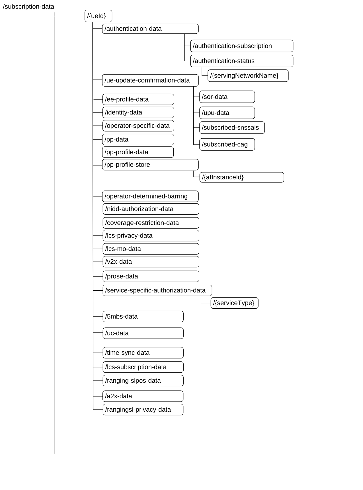
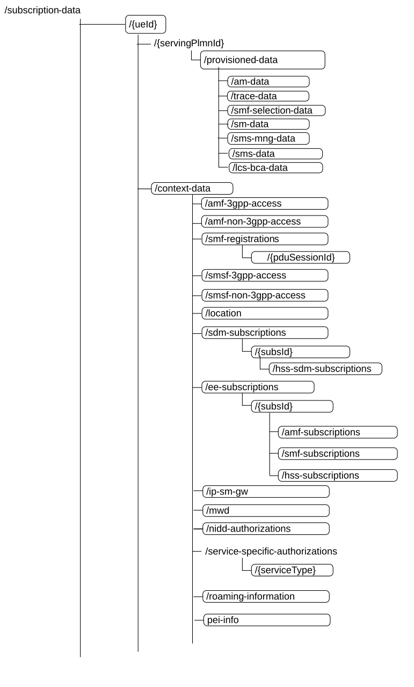
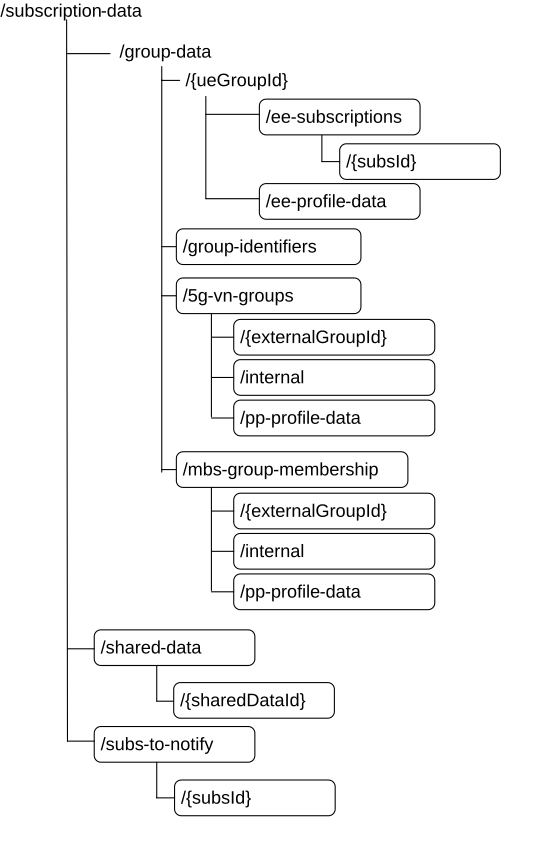

# 5.2.1 Overview

Figure 5.2.1-1: Resource URI sub-level structure for subscription data

Figure 5.2.1-2: Resource URI sub-level structure for subscription data (cont.)

Figure 5.2.1-3: Resource URI sub-level structure for subscription data (cont.)

Table 5.2.1-1 provides an overview of the resources, applicable HTTP methods and whether subscribe (implicit and explicit) to be notified about data change applies.

Table 5.2.1-1: Resources and methods overview

<table>
<colgroup>
<col style="width: 32%" />
<col style="width: 30%" />
<col style="width: 9%" />
<col style="width: 7%" />
<col style="width: 19%" />
</colgroup>
<thead>
<tr class="header">
<th>Resource name</th>
<th>Resource URI</th>
<th>Subscribe to be notified about data change supported</th>
<th>HTTP method</th>
<th>Description</th>
</tr>
</thead>
<tbody>
<tr class="odd">
<td rowspan="2">
AuthenticationSubscription

(Document)
</td>
<td rowspan="2">/subscription-data/{ueId}/authentication-data/authentication-subscription</td>
<td rowspan="2">N</td>
<td>GET</td>
<td>Retrieve a UE's authentication subscription data</td>
</tr>
<tr class="even">
<td>PATCH</td>
<td>
Update a UE's authentication subscription data

Updates shall be limited to the sequenceNumber attribute. Attempts to patch any other attribute shall be rejected by the UDR.
</td>
</tr>
<tr class="odd">
<td>UeUpdateConfirmation</td>
<td>/subscription-data/{ueId}/ue-update-confirmation-data</td>
<td>Y</td>
<td>GET</td>
<td>Retrieve the complete UE-acknowledgement info</td>
</tr>
<tr class="even">
<td rowspan="3">
AuthenticationSoR

(Document)
</td>
<td rowspan="3">/subscription-data/{ueId}/ue-update-confirmation-data/sor-data</td>
<td rowspan="3">Y</td>
<td>PUT</td>
<td>Store UE's SOR acknowledgement information (SoR-XMAC-IUE), "ME support of SOR-CMCI" "ME support of SOR-SNPN-SI" and, "ME support of SOR-SNPN-SI-LS".</td>
</tr>
<tr class="odd">
<td>GET</td>
<td>Retrieve UE's SoR acknowledgement information, "ME support of SOR-CMCI", "ME support of SOR-SNPN-SI" and, "ME support of SOR-SNPN-SI-LS".</td>
</tr>
<tr class="even">
<td>PATCH</td>
<td>Update "ME support of SOR-CMCI" and "ME support of SOR-SNPN-SI"and, "ME support of SOR-SNPN-SI-LS".</td>
</tr>
<tr class="odd">
<td rowspan="2">
AuthenticationUPU

(Document)
</td>
<td rowspan="2">/subscription-data/{ueId}/ue-update-confirmation-data/upu-data</td>
<td rowspan="2">Y</td>
<td>PUT</td>
<td>Store UE Parameter Update acknowledgement information (UPU-XMAC-IUE)</td>
</tr>
<tr class="even">
<td>GET</td>
<td>Retrieve UE Parameter Update acknowledgement information</td>
</tr>
<tr class="odd">
<td rowspan="2">
SubscribedSNSSAIs

(Document)
</td>
<td rowspan="2">/subscription-data/{ueId}/ue-update-confirmation-data/subscribed-snssais</td>
<td rowspan="2">Y</td>
<td>PUT</td>
<td>Store UE-acknowledgement info for change of subscribed S-NSSAIs</td>
</tr>
<tr class="even">
<td>GET</td>
<td>Retrieve UE-acknowledgement info for change of subscribed S-NSSAIs</td>
</tr>
<tr class="odd">
<td rowspan="2">
SubscribedCAG

(Document)
</td>
<td rowspan="2">/subscription-data/{ueId}/ue-update-confirmation-data/subscribed-cag</td>
<td rowspan="2">Y</td>
<td>PUT</td>
<td>Store UE-acknowledgement info for change of subscribed CAG</td>
</tr>
<tr class="even">
<td>GET</td>
<td>Retrieve UE-acknowledgement info for change of subscribed CAG</td>
</tr>
<tr class="odd">
<td rowspan="3">
AuthenticationStatus

(Document)
</td>
<td rowspan="3">/subscription-data/{ueId}/authentication-data/authentication-status</td>
<td rowspan="3">N</td>
<td>PUT</td>
<td>Store a UE's authentication status</td>
</tr>
<tr class="even">
<td>GET</td>
<td>Retrieve a UE's authentication status</td>
</tr>
<tr class="odd">
<td>DELETE</td>
<td>Delete a UE's authentication status</td>
</tr>
<tr class="even">
<td rowspan="3">
IndividualAuthenticationStatus

(Document)
</td>
<td rowspan="3">/subscription-data/{ueId}/authentication-data/authentication-status/{servingNetworkName}</td>
<td rowspan="3">Y</td>
<td>PUT</td>
<td>When the feature "PerUePerSnAuthStatus" is supported, store a UE's Individual authentication status</td>
</tr>
<tr class="odd">
<td>GET</td>
<td>When the feature "PerUePerSnAuthStatus" is supported, retrieve a UE's Individual authentication status</td>
</tr>
<tr class="even">
<td>DELETE</td>
<td>When the feature "PerUePerSnAuthStatus" is supported, delete a UE's Individual authentication status</td>
</tr>
<tr class="odd">
<td>
ProvisionedData

(Document)
</td>
<td>/subscription-data/{ueId}/{servingPlmnId}/provisioned-data</td>
<td>N</td>
<td>GET</td>
<td>Retrieve the UE's subscribed Provisioned Data</td>
</tr>
<tr class="even">
<td>
AccessAndMobilitySubscriptionData

(Document)
</td>
<td>/subscription-data/{ueId}/{servingPlmnId}/provisioned-data/am-data</td>
<td>Y</td>
<td>GET</td>
<td>Retrieve the UE's subscribed Access and Mobility Data</td>
</tr>
<tr class="odd">
<td>
SmfSelectionSubscriptionData

(Document)
</td>
<td>/subscription-data/{ueId}/{servingPlmnId}/provisioned-data/smf-selection-subscription-data</td>
<td>Y</td>
<td>GET</td>
<td>Retrieve the UE's subscribed SMF Selection Data</td>
</tr>
<tr class="even">
<td>
SessionManagementSubscriptionData

(Document)
</td>
<td>/subscription-data/{ueId}/{servingPlmnId}/provisioned-data/sm-data</td>
<td>Y</td>
<td>GET</td>
<td>Retrieve the UE's subscribed SM Subscription Data</td>
</tr>
<tr class="odd">
<td>
ContextData

(Document)
</td>
<td>/subscription-data/{ueId}/context-data</td>
<td>N</td>
<td>GET</td>
<td>Retrieve the UE's context Data</td>
</tr>
<tr class="even">
<td rowspan="3">
Amf3GppAccessRegistration

(Document)
</td>
<td rowspan="3">/subscription-data/{ueId}/context-data/amf-3gpp-access</td>
<td rowspan="3">Y</td>
<td>PUT</td>
<td>Create and Update the AMF registration for 3GPP access</td>
</tr>
<tr class="odd">
<td>PATCH</td>
<td>Modify the AMF registration for 3GPP access</td>
</tr>
<tr class="even">
<td>GET</td>
<td>Retrieve the AMF registration information for 3GPP access</td>
</tr>
<tr class="odd">
<td rowspan="3">
AmfNon3GppAccessRegistration

(Document)
</td>
<td rowspan="3">/subscription-data/{ueId}/context-data/amf-non-3gpp-access</td>
<td rowspan="3">Y</td>
<td>PUT</td>
<td>Update the AMF registration for non 3GPP access</td>
</tr>
<tr class="even">
<td>PATCH</td>
<td>Modify the AMF registration for non 3GPP access</td>
</tr>
<tr class="odd">
<td>GET</td>
<td>Retrieve the AMF registration information for non 3GPP access</td>
</tr>
<tr class="even">
<td>
SmfRegistrations

(Store)
</td>
<td>/subscription-data/{ueId}/context-data/smf-registrations</td>
<td>Y</td>
<td>GET</td>
<td>Retrieve the list of the SMF registrations</td>
</tr>
<tr class="odd">
<td rowspan="4">
IndividualSmfRegistration

(Document)
</td>
<td rowspan="4">/subscription-data/{ueId}/context-data /smf-registrations/{pduSessionId}</td>
<td rowspan="4">Y</td>
<td>PUT</td>
<td>Store an individual SMF registration identified by PDU Session Id</td>
</tr>
<tr class="even">
<td>DELETE</td>
<td>Delete an individual SMF registration</td>
</tr>
<tr class="odd">
<td>GET</td>
<td>Retrieve individual SMF registration</td>
</tr>
<tr class="even">
<td>PATCH</td>
<td>Modify the individual SMF registration</td>
</tr>
<tr class="odd">
<td rowspan="4">
OperatorSpecificData

(Document)
</td>
<td rowspan="4">/subscription-data/{ueId}/operator-specific-data</td>
<td rowspan="4">Y</td>
<td>GET</td>
<td>retrieve the operator specific subscription data of a UE</td>
</tr>
<tr class="even">
<td>PATCH</td>
<td>modify the operator specific subscription data of a UE</td>
</tr>
<tr class="odd">
<td>PUT</td>
<td>create/update the operator specific subscription data of a UE</td>
</tr>
<tr class="even">
<td>DELETE</td>
<td>delete the operator specific subscription data of a UE</td>
</tr>
<tr class="odd">
<td>
OperatorDeterminedBarringData

(Document)
</td>
<td>/subscription-data/{ueId}/operator-determined-barring-data</td>
<td>Y</td>
<td>GET</td>
<td>Retrieve the UE's Operator Determined Barring</td>
</tr>
<tr class="even">
<td>
SMSManagementSubscriptionData

(Document)
</td>
<td>/subscription-data/{ueId}/{servingPlmnId}/provisioned-data/sms-mng-data</td>
<td>Y</td>
<td>GET</td>
<td>Retrieve the UE's subscribed SMS management subscription data.</td>
</tr>
<tr class="odd">
<td rowspan="3">
Smsf3GppAccessRegistration

(Document)
</td>
<td rowspan="3">/subscription-data/{ueId}/context-data /smsf-3gpp-access</td>
<td rowspan="3">Y</td>
<td>PUT</td>
<td>Create or Update the SMSF registration</td>
</tr>
<tr class="even">
<td>DELETE</td>
<td>Delete the SMSF registration for 3GPP access</td>
</tr>
<tr class="odd">
<td>GET</td>
<td>Retrieve the SMSF registration information</td>
</tr>
<tr class="even">
<td rowspan="3">
SmsfNon3GppAccessRegistration

(Document)
</td>
<td rowspan="3">/subscription-data/{ueId}/context-data /smsf-non-3gpp-access</td>
<td rowspan="3">Y</td>
<td>PUT</td>
<td>Create or Update the SMSF registration for non 3GPP access</td>
</tr>
<tr class="odd">
<td>DELETE</td>
<td>Delete the SMSF registration for non 3GPP access</td>
</tr>
<tr class="even">
<td>GET</td>
<td>Retrieve the SMSF registration information for non 3GPP access</td>
</tr>
<tr class="odd">
<td rowspan="4">
IpSmGwRegistration

(Document)
</td>
<td rowspan="4">/subscription-data/{ueId}/context-data/ip-sm-gw</td>
<td rowspan="4">Y</td>
<td>PUT</td>
<td>Create or Update the IP-SM-GW registration</td>
</tr>
<tr class="even">
<td>DELETE</td>
<td>Delete the IP-SM-GW registration</td>
</tr>
<tr class="odd">
<td>PATCH</td>
<td>Modify the IP-SM-GW registration</td>
</tr>
<tr class="even">
<td>GET</td>
<td>Retrieve the IP-SM-GW registration information</td>
</tr>
<tr class="odd">
<td rowspan="4">
MessageWaitingData

(Document)
</td>
<td rowspan="4">/subscription-data/{ueId}/context-data/mwd</td>
<td rowspan="4">Y</td>
<td>PUT</td>
<td>Create or Update the SMS Message Waiting Data</td>
</tr>
<tr class="even">
<td>DELETE</td>
<td>Delete the SMS Message Waiting Data</td>
</tr>
<tr class="odd">
<td>PATCH</td>
<td>Modify the SMS Message Waiting Data</td>
</tr>
<tr class="even">
<td>GET</td>
<td>Retrieve the SMS Message Waiting Data</td>
</tr>
<tr class="odd">
<td rowspan="2">
SdmSubscriptions

(Collection)
</td>
<td rowspan="2">/subscription-data/{ueId}/context-data/sdm-subscriptions</td>
<td rowspan="2">N</td>
<td>GET</td>
<td>Retrieve SDM subscriptions</td>
</tr>
<tr class="even">
<td>POST</td>
<td>Create an individual SDM subscription</td>
</tr>
<tr class="odd">
<td rowspan="4">
IndividualSdmSubscription

(Document)
</td>
<td rowspan="4">/subscription-data/{ueId}/context-data/sdm-subscriptions/{subsId}</td>
<td rowspan="4">N</td>
<td>PUT</td>
<td>Update an individual SDM subscription</td>
</tr>
<tr class="even">
<td>DELETE</td>
<td>Delete an individual SDM subscription</td>
</tr>
<tr class="odd">
<td>PATCH</td>
<td>Update an individual SDM Subscription</td>
</tr>
<tr class="even">
<td>GET</td>
<td>Retrieve an individual SDM subscription</td>
</tr>
<tr class="odd">
<td rowspan="4">
HssSdmSubscriptionInfo

(Document)
</td>
<td rowspan="4">/subscription-data/{ueId}/context-data/sdm-subscriptions/{subsId}/hss-sdm-subscriptions</td>
<td rowspan="4">N</td>
<td>PUT</td>
<td>Store information related to the Hss-SDM-Subscriptions</td>
</tr>
<tr class="even">
<td>DELETE</td>
<td>Delete the Hss-SDM-subscriptions</td>
</tr>
<tr class="odd">
<td>GET</td>
<td>Retrieve Hss-SDM-subscriptions</td>
</tr>
<tr class="even">
<td>PATCH</td>
<td>Update Hss-SDM-subscriptions</td>
</tr>
<tr class="odd">
<td rowspan="2">
EeSubscriptions

(Collection)
</td>
<td rowspan="2">/subscription-data/{ueId}/context-data/ee-subscriptions</td>
<td rowspan="2">N</td>
<td>GET</td>
<td>Retrieve EE subscriptions</td>
</tr>
<tr class="even">
<td>POST</td>
<td>Create an EE subscription</td>
</tr>
<tr class="odd">
<td rowspan="4">
IndividualEeSubscription

(Document)
</td>
<td rowspan="4">/subscription-data/{ueId}/context-data/ee-subscriptions/{subsId}</td>
<td rowspan="4">N</td>
<td>PUT</td>
<td>Update an individual EE subscription</td>
</tr>
<tr class="even">
<td>DELETE</td>
<td>Delete an individual EE subscription</td>
</tr>
<tr class="odd">
<td>PATCH</td>
<td>Update an individual EE subscription</td>
</tr>
<tr class="even">
<td>GET</td>
<td>Retrieve an individual EE subscription</td>
</tr>
<tr class="odd">
<td rowspan="4">
AmfSubscriptionInfo

(Document)
</td>
<td rowspan="4">/subscription-data/{ueId}/context-data/ee-subscriptions/{subsId}/amf-subscriptions</td>
<td rowspan="4">N</td>
<td>PUT</td>
<td>Store information related to the Amf-EE-Subscription response</td>
</tr>
<tr class="even">
<td>DELETE</td>
<td>Delete the Amf-EE-subscriptions</td>
</tr>
<tr class="odd">
<td>GET</td>
<td>Retrieve AMF-subscriptions</td>
</tr>
<tr class="even">
<td>PATCH</td>
<td>Update AMF-subscriptions</td>
</tr>
<tr class="odd">
<td rowspan="4">
SmfSubscriptionInfo

(Document)
</td>
<td rowspan="4">/subscription-data/{ueId}/context-data/ee-subscriptions/{subsId}/smf-subscriptions</td>
<td rowspan="4">N</td>
<td>PUT</td>
<td>Store information related to the received Smf-EE-Subscription response</td>
</tr>
<tr class="even">
<td>DELETE</td>
<td>Delete the Smf-EE-subscriptions</td>
</tr>
<tr class="odd">
<td>GET</td>
<td>Retrieve SMF-subscriptions</td>
</tr>
<tr class="even">
<td>PATCH</td>
<td>Update SMF-subscriptions</td>
</tr>
<tr class="odd">
<td rowspan="4">
HssSubscriptionInfo

(Document)
</td>
<td rowspan="4">/subscription-data/{ueId}/context-data/ee-subscriptions/{subsId}/hss-subscriptions</td>
<td rowspan="4">N</td>
<td>PUT</td>
<td>Store information related to the Hss-EE-Subscriptions</td>
</tr>
<tr class="even">
<td>DELETE</td>
<td>Delete the Hss-EE-subscriptions</td>
</tr>
<tr class="odd">
<td>GET</td>
<td>Retrieve Hss-EE-subscriptions</td>
</tr>
<tr class="even">
<td>PATCH</td>
<td>Update Hss-EE-subscriptions</td>
</tr>
<tr class="odd">
<td>
EeProfileData

(Document)
</td>
<td>/subscription-data/{ueId}/ee-profile-data</td>
<td>Y</td>
<td>GET</td>
<td>Retrieve the UE's subscribed EE profile data.</td>
</tr>
<tr class="even">
<td rowspan="2">
ProvisionedParamenterData

(Document)
</td>
<td rowspan="2">/subscription-data/{ueId}/pp-data</td>
<td rowspan="2">y</td>
<td>PATCH</td>
<td>Update of provisioned parameters.</td>
</tr>
<tr class="odd">
<td>GET</td>
<td>Retrieves the UE's provisioned parameters.</td>
</tr>
<tr class="even">
<td>
PpProfileData

(Document)
</td>
<td>/subscription-data/{ueId}/pp-profile-data</td>
<td>Y</td>
<td>GET</td>
<td>Retrieve the UE's subscribed PP profile data.</td>
</tr>
<tr class="odd">
<td>
ProvisionedParameterDataEntries

(Store)
</td>
<td>/subscription-data/{ueId}/pp-data-store</td>
<td>Y</td>
<td>GET</td>
<td>Retrieve a Provisioned Parameter Data of multiple Entries</td>
</tr>
<tr class="even">
<td rowspan="3">
ProvisionedParameterDataEntry

(Document)
</td>
<td rowspan="3">/subscription-data/{ueId}/pp-data-store/{afInstanceId}</td>
<td rowspan="3">Y</td>
<td>PUT</td>
<td>Create a Provisioned Parameter Data Entry</td>
</tr>
<tr class="odd">
<td>DELETE</td>
<td>Delete a Provisioned Parameter Data Entry</td>
</tr>
<tr class="even">
<td>GET</td>
<td>Retrieve a Provisioned Parameter Data Entry</td>
</tr>
<tr class="odd">
<td>
SMSSubscriptionData

(Document)
</td>
<td>/subscription-data/{ueId}/{servingPlmnId}/provisioned-data/sms-data</td>
<td>Y</td>
<td>GET</td>
<td>Retrieve the UE's subscribed SMS subscription data.</td>
</tr>
<tr class="even">
<td rowspan="3">
SubscriptionDataSubscriptions

(Collection)
</td>
<td rowspan="3">/subscription-data/subs-to-notify</td>
<td rowspan="3">N</td>
<td>GET</td>
<td>Retrieve existing subscriptions</td>
</tr>
<tr class="odd">
<td>POST</td>
<td>Create a subscription, i.e. subscribe a node to receive notification for change of data</td>
</tr>
<tr class="even">
<td>DELETE</td>
<td>Deletes multiple subscriptions for a given UE.</td>
</tr>
<tr class="odd">
<td rowspan="3">
IndividualSubscriptionDataSubscription

(Document)
</td>
<td rowspan="3">/subscription-data/subs-to-notify/{subsId}</td>
<td rowspan="3">N</td>
<td>DELETE</td>
<td>Delete the subscription identified by {subsId}, i.e. unsubscribe a node to receive notification for change of data</td>
</tr>
<tr class="even">
<td>PATCH</td>
<td>Update an individual Subscription to notification</td>
</tr>
<tr class="odd">
<td>GET</td>
<td>Retrieve an individual Subscription to notification</td>
</tr>
<tr class="even">
<td rowspan="2">
EeGroupSubscriptions

(Collection)
</td>
<td rowspan="2">/subscription-data/group-data/{ueGroupId}/ee-subscriptions</td>
<td rowspan="2">N</td>
<td>GET</td>
<td>Retrieve EE subscriptions for groups of UEs</td>
</tr>
<tr class="odd">
<td>POST</td>
<td>Create an EE subscription for groups of UEs</td>
</tr>
<tr class="even">
<td rowspan="4">
IndividualEeGroupSubscription

(Document)
</td>
<td rowspan="4">/subscription-data/group-data/{ueGroupId}/ee-subscriptions/{subsId}</td>
<td rowspan="4">N</td>
<td>PUT</td>
<td>Update an individual EE subscription for a group of UEs</td>
</tr>
<tr class="odd">
<td>DELETE</td>
<td>Delete an individual EE subscription for a group of UEs</td>
</tr>
<tr class="even">
<td>PATCH</td>
<td>Update an individual EE subscription for a group of UEs</td>
</tr>
<tr class="odd">
<td>GET</td>
<td>Retrieve an individual EE subscription for a group of UEs</td>
</tr>
<tr class="even">
<td rowspan="4">
AmfGroupSubscriptionInfo

(Document)
</td>
<td rowspan="4">/subscription-data/group-data/{ueGroupId}/ee-subscriptions/{subsId}/amf-subscriptions</td>
<td rowspan="4">N</td>
<td>PUT</td>
<td>Store information related to the Amf-EE-Subscription response for a group of UEs</td>
</tr>
<tr class="odd">
<td>DELETE</td>
<td>Delete the Amf-EE-subscriptions for a group of UEs</td>
</tr>
<tr class="even">
<td>GET</td>
<td>Retrieve AMF-subscriptions for a group of UEs</td>
</tr>
<tr class="odd">
<td>PATCH</td>
<td>Update AMF-subscriptions for a group of UEs</td>
</tr>
<tr class="even">
<td rowspan="4">
SmfGroupSubscriptionInfo

(Document)
</td>
<td rowspan="4">/subscription-data/group-data/{ueGroupId}/ee-subscriptions/{subsId}/smf-subscriptions</td>
<td rowspan="4">N</td>
<td>PUT</td>
<td>Store information related to the received Smf-EE-Subscription response for a group of UEs</td>
</tr>
<tr class="odd">
<td>DELETE</td>
<td>Delete the Smf-EE-subscriptions for a group of UEs</td>
</tr>
<tr class="even">
<td>GET</td>
<td>Retrieve SMF-subscriptions for a group of UEs</td>
</tr>
<tr class="odd">
<td>PATCH</td>
<td>Update SMF-subscriptions for a group of UEs</td>
</tr>
<tr class="even">
<td rowspan="4">
HssGroupSubscriptionInfo

(Document)
</td>
<td rowspan="4">/subscription-data/group-data/{ueGroupId}/ee-subscriptions/{subsId}/hss-subscriptions</td>
<td rowspan="4">N</td>
<td>PUT</td>
<td>Store information related to the Hss-EE-Subscriptions for a group of UEs</td>
</tr>
<tr class="odd">
<td>DELETE</td>
<td>Delete the Hss-EE-subscriptions for a group of UEs</td>
</tr>
<tr class="even">
<td>GET</td>
<td>Retrieve Hss-EE-subscriptions for a group of UEs</td>
</tr>
<tr class="odd">
<td>PATCH</td>
<td>Update Hss-EE-subscriptions for a group of UEs</td>
</tr>
<tr class="even">
<td>
EeGroupProfileData

(Document)
</td>
<td>/subscription-data/group-data/{ueGroupId}/ee-profile-data</td>
<td>Y</td>
<td>GET</td>
<td>Retrieve the subscribed EE profile data for a group of UEs.</td>
</tr>
<tr class="odd">
<td>
TraceData

(Document)
</td>
<td>/subscription-data/{ueId}/{servingPlmnId}/provisioned-data/trace-data</td>
<td>Y</td>
<td>GET</td>
<td>Retrieve the UE's trace configuration data</td>
</tr>
<tr class="even">
<td>
IdentityData

(Document)
</td>
<td>/subscription-data/{ueId}/identity-data</td>
<td>Y</td>
<td>GET</td>
<td>Retrieve identity data that corresponds to the provided ueId</td>
</tr>
<tr class="odd">
<td>SharedData 
(Collection)</td>
<td>/subscription-data/shared-data</td>
<td>N</td>
<td>GET</td>
<td>Retrieve shared data</td>
</tr>
<tr class="even">
<td>IndividualSharedData 
(Document)</td>
<td>/subscription-data/shared-data/{sharedDataId}</td>
<td>Y</td>
<td>GET</td>
<td>Retrieve the individual Shared Data</td>
</tr>
<tr class="odd">
<td>
GroupIdentifiers

(Document)
</td>
<td>/subscription-data/group-data/group-identifiers</td>
<td>Y</td>
<td>GET</td>
<td>Retrieve group identifiers and the UE identifiers belong to the group identifiers.</td>
</tr>
<tr class="even">
<td>
5GvnGroups

(Store)
</td>
<td>/subscription-data/group-data/5g-vn-groups</td>
<td>Y</td>
<td>GET</td>
<td>Retrieve 5G VN Groups</td>
</tr>
<tr class="odd">
<td rowspan="4">
Individual5GvnGroup

(Document)
</td>
<td rowspan="4">/subscription-data/group-data/5g-vn-groups/{externalGroupId}</td>
<td rowspan="4">Y</td>
<td>PUT</td>
<td>Create a 5G VN Group</td>
</tr>
<tr class="even">
<td>PATCH</td>
<td>Update a 5G VN Group</td>
</tr>
<tr class="odd">
<td>DELETE</td>
<td>Delete a 5G VN Group</td>
</tr>
<tr class="even">
<td>GET</td>
<td>Retrieve a 5G VN Group</td>
</tr>
<tr class="odd">
<td>
5GVnGroupsInternal

(Document)
</td>
<td>/subscription-data/group-data/5g-vn-groups/internal</td>
<td>Y</td>
<td>GET</td>
<td>Retrieve 5G VN Group Data based on Internal Group Identifier(s)</td>
</tr>
<tr class="even">
<td>
Pp5gVnGroupProfileData

(Document)
</td>
<td>/subscription-data/group-data/5g-vn-groups/pp-profile-data</td>
<td>Y</td>
<td>GET</td>
<td>Retrieve the UE's subscribed PP profile data for accessing 5G VN Groups service operations.</td>
</tr>
<tr class="odd">
<td>
LcsPrivacySubscriptionData

(Document)
</td>
<td>/subscription-data/{ueId}/lcs-privacy-data</td>
<td>Y</td>
<td>GET</td>
<td>Retrieve the UE's subscribed LCS privacy Subscription Data</td>
</tr>
<tr class="even">
<td>
LcsMobileOriginatedSubscriptionData

(Document)
</td>
<td>/subscription-data/{ueId}/lcs-mo-data</td>
<td>Y</td>
<td>GET</td>
<td>Retrieve the UE's subscribed LCS Mobile Originated Subscription Data</td>
</tr>
<tr class="odd">
<td>
LcsSubscriptionData

(Document)
</td>
<td>/subscription-data/{ueId}/lcs-subscription-data</td>
<td>Y</td>
<td>GET</td>
<td>Retrieve the UE's LCS Subscription Data</td>
</tr>
<tr class="even">
<td>
NiddAuthorizationData

(Document)
</td>
<td>/subscription-data/{ueId}/nidd-authorization-data</td>
<td>Y</td>
<td>GET</td>
<td>Retrieve the UE's NIDD Authorization Data</td>
</tr>
<tr class="odd">
<td>
ServiceSpecificAuthorizationData

(Document)
</td>
<td>/subscription-data/{ueId}/service-specific-authorization-data/{serviceType}</td>
<td>Y</td>
<td>GET</td>
<td>Retrieve the UE's Authorization Data for a specific service</td>
</tr>
<tr class="even">
<td>
CoverageRestrictionData

(Document)
</td>
<td>/subscription-data/{ueId}/coverage-restriction-data</td>
<td>Y</td>
<td>GET</td>
<td>Retrieve the UE's subscribed enhanced Coverage Restriction Data</td>
</tr>
<tr class="odd">
<td>
Location

(Document)
</td>
<td>/subscription-data/{ueId}/context-data/location</td>
<td>Y</td>
<td>GET</td>
<td>Retrieve the UE's Location Information</td>
</tr>
<tr class="even">
<td>
V2xSubscriptionData

(Document)
</td>
<td>/subscription-data/{ueId}/v2x-data</td>
<td>Y</td>
<td>GET</td>
<td>Retrieve the UE's subscribed V2X Data</td>
</tr>
<tr class="odd">
<td>
ProseSubscriptionData

(Document)
</td>
<td>/subscription-data/{ueId}/prose-data</td>
<td>Y</td>
<td>GET</td>
<td>Retrieve the UE's subscribed ProSe Service Data</td>
</tr>
<tr class="even">
<td>
5MBSSubscriptionData

(Document)
</td>
<td>/subscription-data/{ueId}/5mbs-data</td>
<td>Y</td>
<td>GET</td>
<td>Retrieve the UE's 5MBS Subscription Data</td>
</tr>
<tr class="odd">
<td>
UcSubscriptionData

(Document)
</td>
<td>/subscription-data/{ueId}/uc-data</td>
<td>Y</td>
<td>GET</td>
<td>Retrieve the UE's User Consent Data</td>
</tr>
<tr class="even">
<td>
LcsBroadcastAssistanceSubscriptionData

(Document)
</td>
<td>/subscription-data/{ueId}/{servingPlmnId}/provisioned-data/lcs-bca-data</td>
<td>Y</td>
<td>GET</td>
<td>Retrieve the UE's subscribed LCS Broadcast Assistance subscription data</td>
</tr>
<tr class="odd">
<td rowspan="4">
NiddAuthorizations

(Document)
</td>
<td rowspan="4">/subscription-data/{ueId}/context-data/nidd-authorizations</td>
<td rowspan="4">Y</td>
<td>PUT</td>
<td>Store information related to the NIDD Authorization</td>
</tr>
<tr class="even">
<td>DELETE</td>
<td>Delete the NIDD Authorizations</td>
</tr>
<tr class="odd">
<td>GET</td>
<td>Retrieve NIDD Authorizations</td>
</tr>
<tr class="even">
<td>PATCH</td>
<td>Update a specific NIDD Authorization</td>
</tr>
<tr class="odd">
<td>
UeSubscriptionData

(Document)
</td>
<td>/subscription-data/{ueId}</td>
<td>N</td>
<td>GET</td>
<td>Retrieve data set(s) from the UE's subscription data</td>
</tr>
<tr class="even">
<td rowspan="4">
SpecificServiceAuthorizations

(Document)
</td>
<td rowspan="4">/subscription-data/{ueId}/context-data/service-specific-authorizations/{serviceType}</td>
<td rowspan="4">Y</td>
<td>PUT</td>
<td>Store information related to the service specific Authorization</td>
</tr>
<tr class="odd">
<td>DELETE</td>
<td>Delete the service specific Authorization</td>
</tr>
<tr class="even">
<td>GET</td>
<td>Retrieve service specific Authorizations</td>
</tr>
<tr class="odd">
<td>PATCH</td>
<td>Update a service specific Authorization</td>
</tr>
<tr class="even">
<td rowspan="2">
RoamingInfo

(Document)
</td>
<td rowspan="2">/subscription-data/{ueId}/context-data/roaming-information</td>
<td rowspan="2">Y</td>
<td>GET</td>
<td>Retrieve the last 5GC/EPC common Roaming Information in the 3GPP access</td>
</tr>
<tr class="odd">
<td>PUT</td>
<td>Update or create the last 5GC/EPC common Roaming Information in the 3GPP access</td>
</tr>
<tr class="even">
<td rowspan="2">
PeiInfo

(Document)
</td>
<td rowspan="2">/subscription-data/{ueId}/context-data/ pei-info</td>
<td rowspan="2">Y</td>
<td>GET</td>
<td>Retrieve the PEI of the 5GC/EPC domains</td>
</tr>
<tr class="odd">
<td>PUT</td>
<td>Update or create the PEI of the 5GC/EPC domains</td>
</tr>
<tr class="even">
<td>
TimeSyncSubscriptionData

(Document)
</td>
<td>/subscription-data/{ueId}/time-sync-data</td>
<td>N</td>
<td>GET</td>
<td>Retrieve the UE's Time Synchronization Subscription Data</td>
</tr>
<tr class="odd">
<td>
5GMbsGroup

(Store)
</td>
<td>/subscription-data/group-data/mbs-group-membership</td>
<td>Y</td>
<td>GET</td>
<td>Retrieve 5G MBS Group</td>
</tr>
<tr class="even">
<td rowspan="4">
Individual5GmbsGroup

(Document)
</td>
<td rowspan="4">/subscription-data/group-data/mbs-group-membership/{externalGroupId}</td>
<td rowspan="4">Y</td>
<td>PUT</td>
<td>Create a 5G MBS Group</td>
</tr>
<tr class="odd">
<td>PATCH</td>
<td>Update a 5G MBS Group</td>
</tr>
<tr class="even">
<td>DELETE</td>
<td>Delete a 5G MBS Group</td>
</tr>
<tr class="odd">
<td>GET</td>
<td>Retrieve a 5G MBS Group</td>
</tr>
<tr class="even">
<td>
5GMbsGroupsInternal

(Document)
</td>
<td>/subscription-data/group-data/mbs-group-membership/internal</td>
<td>Y</td>
<td>GET</td>
<td>Retrieve 5G MBS Group Data based on Internal Group Identifier(s)</td>
</tr>
<tr class="odd">
<td>
Pp5gMbsGroupProfileData

(Document)
</td>
<td>/subscription-data/group-data/mbs-group-membership/pp-profile-data</td>
<td>Y</td>
<td>GET</td>
<td>Retrieve the UE's subscribed PP profile data for accessing 5G MBS Group service operations.</td>
</tr>
<tr class="even">
<td>
RangingSlPosSubscriptionData

(Document)
</td>
<td>/subscription-data/{ueId}/ranging-slpos-data</td>
<td>Y</td>
<td>GET</td>
<td>Retrieve the UE's subscribed Ranging and Sidelink Positioning Data</td>
</tr>
<tr class="odd">
<td>
A2xSubscriptionData

(Document)
</td>
<td>/subscription-data/{ueId}/a2x-data</td>
<td>Y</td>
<td>GET</td>
<td>Retrieve the UE's subscribed A2X Data</td>
</tr>
<tr class="even">
<td>
RangingSlPrivacySubscriptionData

(Document)
</td>
<td>/subscription-data/{ueId}/rangingsl-privacy-data</td>
<td>Y</td>
<td>GET</td>
<td>Retrieve the UE's subscribed Ranging and Sidelink Positioning privacy Subscription Data</td>
</tr>
</tbody>
</table>
