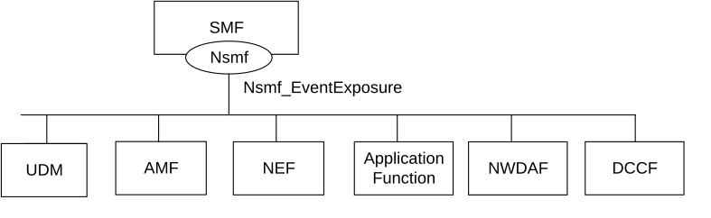
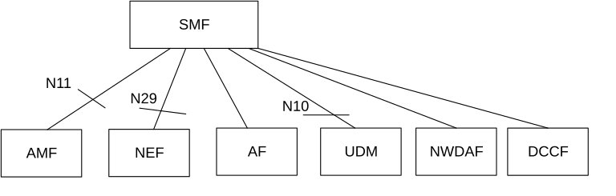

# 4.1 Service Description

## 4.1.1 Overview

The Session Management Event Exposure Service, as defined in 3GPP TS 23.502 \[3\] and 3GPP TS 23.503 \[6\], is provided by the Session Management Function (SMF).

This service:

\- allows NF service consumers to subscribe and unsubscribe for events on a PDU session; and

\- notifies recipient of notification(s) subscribed by NF service consumers with a corresponding subscription about observed events on the PDU session.

The types of observed events applicable for (H-)SMF (i.e. in non-roaming and LBO scenarios) include:

\- UP path change (e.g. addition and/or removal of PDU session anchor);

\- access type change;

\- RAT type change;

\- PLMN change;

\- PDU session release;

\- PDU session establishment;

\- Downlink data delivery status;

\- UE IP address/prefix change;

\- QFI allocation;

\- QoS monitoring;

\- SM congestion control experience for PDU Session;

\- Dispersion;

\- Satellite backhaul category change;

\- WLAN information for PDU Session;

\- Redundant transmission experience for PDU Session;

\- UPF events; and/or

\- Traffic Correlation.

The types of observed events applicable for V-SMF include:

> \- Downlink data delivery status;
>
> \- UP Path Change (for the HR-SBO scenario).

The types of observed events applicable for I-SMF include:

\- Downlink data delivery status;

\- UPF events.

## 4.1.2 Service Architecture

The 5G System Architecture is defined in 3GPP TS 23.501 \[2\]. The Policy and Charging related 5G architecture is also described in 3GPP TS 29.513 \[7\].

The Session Management Event Exposure Service (Nsmf_EventExposure) is part of the Nsmf service-based interface exhibited by the Session Management Function (SMF).

The known NF service consumers of the Nsmf_EventExposure service are:

\- Network Exposure Function (NEF),

\- Access and Mobility Management Function (AMF),

\- Application Function (AF),

\- Unified Data Management (UDM),

\- Network Data Analytics Function (NWDAF), and

\- Data Collection Coordination Function (DCCF).

The PCF accesses the Session Management Event Exposure Service at the SMF via the N7 Reference point.

NOTE: The PCF can implicitly subscribe on behalf of the AF or NEF to the UP_PATH_CH, TRAFFIC_CORRELATION event and/or the QOS_MON event by including the information on AF or NEF subscription within the PCC rule.

The AMF accesses the Session Management Event Exposure Service at the SMF via the N11 Reference point.

Figure 4.1.2-1: Reference Architecture for the Nsmf_EventExposure Service; SBI representation

Figure 4.1.2-2: Reference Architecture for the Nsmf_EventExposure Service: reference point representation

## 4.1.3 Network Functions

### 4.1.3.1 Session Management Function (SMF)

The Session Management function (SMF) provides:

\- Session Management e.g. Session establishment, modification and release;

\- UE IP address allocation & management;

\- Selection and control of UP function;

\- Termination of interfaces towards Policy control functions; and

\- Control part of policy enforcement and QoS.

### 4.1.3.2 NF Service Consumers

The Network Exposure Function (NEF);

\- provides means to securely expose the services and capabilities provided by 3GPP network functions to e.g. 3rd parties or internal exposure consumer NF.

The Access and Mobility Management function (AMF) provides:

\- Registration management;

\- Connection management;

\- Reachability management; and

\- Mobility Management.

The Application Function (AF)

\- interacts with the 3GPP Core Network to provide services.

The Unified Data Management (UDM).

\- has access to subscriber information, can determine the SMF serving a user based on that data, and can then subscribe to event notifications for a user (e.g. when triggered by the NEF).

The Network Data Analytics Function (NWDAF)

\- collects data based on event subscription provided by AMF, SMF, UPF, PCF, UDM, AF (directly or via NEF) and OAM;

\- retrieves information about NFs;

\- performs on demand provision of analytics to NF service consumers, as indicated in clause 6, 3GPP TS 23.288 \[21\].

The Data Collection Coordination Function (DCCF)

\- coordinates the collection and distribution of data and analytics.
