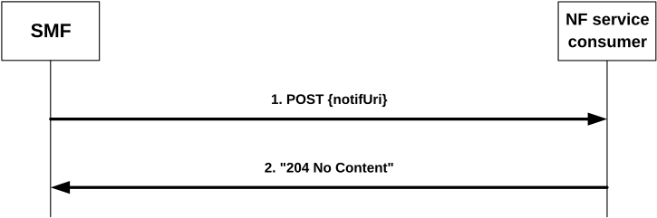

# 4.2.2 Nsmf_EventExposure_Notify Service Operation

## 4.2.2.1 General

The Nsmf_EventExposure_Notify service operation enables the SMF (i.e. (H-)SMF, V-SMF and/or I-SMF) to send notifications to recipient of notification(s) subscribed by NF service consumers upon the occurrence of a previously subscribed event on the related PDU session.

The following procedure using the Nsmf_EventExposure_Notify service operation is supported:

\- notification about subscribed events.

## 4.2.2.2 Notification about subscribed events

The present "notification about subscribed events" procedure is performed by the SMF when any of the subscribed events occur.

The following applies with respect to the detection of subscribed events:

\- If:

\- the SMF supports the "DownlinkDataDeliveryStatus" feature,

\- the event "DDDS" is subscribed,

\- the traffic descriptors of the downlink data source have been provided for that subscription, and

\- the SMF is informed that the UE corresponding to that subscription is unreachable,

\- if the data is buffered at the UPF, then the SMF shall interact with the UPF to notify that the UPF buffers the downlink packets. The SMF shall include the traffic descriptor of the subscriptions in the PDR with a higher priority if the PCC is not applied to the PDU session or derive the PDR from the PCC rule received from the PCF as defined in clause 4.2.4.27 of 3GPP TS 29.512 \[14\] if the PCC is applied to the PDU session and request the UPF to report when there are corresponding buffered downlink packets or discarded packets in the UPF as defined in clause 5.28.1 of 3GPP TS 29.244 \[23\]. When receiving the report from the UPF, the SMF shall determine whether that subscribed event with delivery status "DISCARDED" or "BUFFERED" occurred. The SMF shall determine that subscribed event with delivery status "TRANSMITTED" occurred by the fact that the related PDU session becomes ACTIVE.

\- if the data is buffered at the SMF, the SMF shall determine whether that subscribed event occurred by comparing the downlink packets with the traffic descriptors received in the corresponding event subscription. If the SMF decides to buffer the packets, the subscribed event with delivery status "BUFFERED" occurred. If the SMF decides to discard the packets, the subscribed event with delivery status "DISCARDED" occurred. The SMF shall determine that subscribed event with delivery status "TRANSMITTED" occurred by the fact that the related PDU session becomes ACTIVE.

Figure 4.2.2.2-1 illustrates the notification about subscribed events.

Figure 4.2.2.2-1: Notification about subscribed events

If the SMF observes PDU Session related event(s) for which an NF service consumer has subscribed, the SMF shall send an HTTP POST request with "{notifUri}", as previously provided by the NF service consumer within the corresponding subscription, as URI and NsmfEventExposureNotification data structure as request body that shall include:

\- Notification correlation ID provided by the NF service consumer during the subscription, or as provided by the PCF for implicit subscription of UP path change and/or traffic correlation as defined in clause 4.2.6.2.6.2 of 3GPP TS 29.512 \[14\], or as provided by the PCF for implicit subscription of QoS Monitoring as defined in clause 4.2.3.25 of 3GPP TS 29.512 \[14\], as "notifId" attribute, or as provided by the V-NEF for implicit subscription of UP path change as defined in clause 4.4.2.4.2 of 3GPP TS 29.591 \[28\], as "upPathChgNotifCorreId" attribute within "eventNotifications" attribute; and

\- information about the observed event(s) within the "eventNotifs" attribute that shall contain for each observed event an "EventNotification" data structure that shall include:

1\. the Event Trigger as "event" attribute;

2\. for a UP path change notification:

a\) type of notification ("EARLY" or "LATE") as "dnaiChgType" attribute;

b\) source DNAI and/or target DNAI as "sourceDnai" attribute and "targetDnai" attribute if DNAI is changed, respectively (NOTE 3); and

c\) if the PDU Session type is IP, for the source DNAI IP address/prefix of the UE as "sourceUeIpv4Addr" attribute or "sourceUeIpv6Prefix" attribute; and

d\) if the PDU Session type is IP, for the target DNAI IP address/prefix of the UE as "targetUeIpv4Addr" attribute or "targetUeIpv6Prefix" attribute;

e\) if available (NOTE 3), for the source DNAI, N6 traffic routing information related to the UE as "sourceTraRouting" attribute;

f\) if available (NOTE 3), for the target DNAI, N6 traffic routing information related to the UE as "targetTraRouting" attribute;

g\) if the PDU Session type is Ethernet, the MAC address of the UE in the "ueMac" attribute;

h\) if the "CommonEASDNAI" feature is supported,

\- the candidate DNAI(s) for the PDU Session in "candidateDnais" attribute, optionally together with the indication of their prioritization within the "candDnaisPrioInd" attribute, if the "candDnaiInd" attribute was set to "true" in the PCC rule(s); or

\- the indication of EAS re-discovery in "easRediscoverInd" attribute if EAS re-discovery took place.

i\) if both the SMF and the NF service consumer support "ULBuffering" and/or "EASIPreplacement" features, these supported features within the "supportedFeatures" attribute.

NOTE 1: The SMF gets the knowledge of the feature supported by the NF service consumer as described in clause 5.8.

> j\) if the "EasRelocationEnh" feature is supported and the SMF determines that the target DNAI is supported by an AF different to the one that shall receive this notification, the identifier of the target AF that supports this DNAI in the "targetAfId" attribute.

k\) if the "HR-SBO" feature is supported and the SMF determines that the UE has moved to a serving PLMN in which local traffic offload is allowed, the identifier of this new serving PLMN within the "plmnId" attribute, as well as the DNN and S-SNSSAI of the HPLMN within the "dnn" and "snssai" attributes, respectively.

NOTE 2: The SMF can determine this by comparing the AF ID of the EAS Deployment Information entry that contains the old DNAI with the AF ID of the EAS Deployment Information entry that contains the target DNAI. These EAS Deployment Information entries are received via the Nnef_EASDeployment API defined in 3GPP TS 29.591 \[25\].

NOTE 3: UP path change notification, i.e. DNAI change notification and/or N6 traffic routing information change notification, can be the result of an implicit subscription of the PCF on behalf of the NEF/AF as part of setting PCC rule(s) via the Npcf_SMPolicyControl service (see clause 4.2.6.2.6.2 of 3GPP TS 29.512 \[14\]).

NOTE 4: If the DNAI is not changed while the N6 traffic routing information change, the source DNAI and target DNAI are not provided.

NOTE 5: The change from the UP path status where no DNAI applies to a status where a DNAI applies indicates the activation of the related AF request and therefore only the target DNAI and N6 traffic routing information is provided in the event notification; the change from the UP path status where a DNAI applies to a status where no DNAI applies indicates the de-activation of the related AF request and therefore only the source DNAI and N6 traffic routing information is provided in the event notification.

3\. for a UE IP address change:

a\) added new UE IP address or prefix as "adIpv4Addr" attribute or "adIpv6Prefix" attribute, respectively; and/or

b\) released UE IP address or prefix as "reIpv4Addr" attribute or "reIpv6Prefix" attribute, respectively;

4\. for an access type change:

a\) new access type as "accType" attribute;

5\. for a PLMN Change:

a\) new PLMN as "plmnId" attribute;

6\. for a PDU Session Release:

a\) ID of the released PDU session as "pduSeId" attribute;

b\) DNN of the released PDU session as "dnn" attribute, if the "PduSessionStatus" feature is supported;

c\) The type of the released PDU session as "pduSessType" attribute, if the "PduSessionStatus" feature is supported;

d\) UE IPv4 address as "ipv4Addr" attribute and/or IPv6 information (IPv6 prefix(es) or IPv6 address(es)) as "ipv6Prefixes" or "ipv6Addrs" attributes, if the released PDU session type is IP and the "PduSessionStatus" feature is supported; and

e\) S-NSSAI of the released PDU session as "snssai" attribute, if the "EneNA" feature is supported and "snssai" attribute is present in the subscribed "NsmfEventExposure" data type;

7\. the time at which the event was observed encoded as "timeStamp" attribute;

8\. the SUPI as the "supi" attribute if the subscription applies to a group of UE(s) or any UE. If the "WlanPerformanceExt_AIML " feature is supported, the "supi" attribute may also be included for a single UE when the subscription applies to the "WLAN_INFO" event;

9\. if available, the GPSI as the "gpsi" attribute if the subscription applies to a group of UE(s) or any UE;

10\. for a Downlink Data Delivery Status, if the "DownlinkDataDeliveryStatus" feature is supported:

a\) the downlink data delivery status as "dddStatus" attribute;

b\) the downlink data descriptors impacted by the downlink data delivery status change within the "dddTraDescriptor" attribute; and

c\) for downlink data delivery status "BUFFERED". the estimated maximum waiting time as "maxWaitTime" attribute;

11\. for a Communication Failure, if the "CommunicationFailure" feature is supported:

a\) the detailed communication failure information (e.g. 5G SM cause) as "commFailure" attribute; and

12\. for QoS Monitoring event, if the "QoSMonitoring" feature is supported:

a\) the uplink packet delays within the "ulDelays" attribute; and/or

b\) the downlink packet delays within the "dlDelays" attribute; and/or

c\) the round trip packet delays within the "rtDelays" attribute; or

NOTE 6: The UPF reports one UL, DL and/or round-trip packet delay measurement for each periodic and/or event-triggered report as described in 3GPP TS 29.244 \[23\]. i.e, the SMF can include only one element within the "ulDelays", "dlDelays", and/or "rtDelays" array(s), each one with the received report from the UPF for the UL, DL and/or round trip delay(s).

d\) if the feature "PacketDelayFailureReport" is supported, the packet delay measurement failure indicator within the "pdmf" attribute; and/or

e\) if the feature "EnQoSMon" is supported, UL and/or DL congestion information within the "ulCongInfo" attribute and "dlCongInfo" attribute; and/or

f\) if the feature "EnQoSMon" is supported, UL and/or DL data rate measurement within the "ulDataRate" attribute and/or "dlDataRate" attribute.

NOTE 7: The SMF gets the knowledge of the NF service consumer support of "QoSMonitoring", "PacketDelayFailureReport" and "EnQoSMon" features as described in 3GPP TS 29.512 \[14\].

NOTE 8: QoS Monitoring notification can be the result of an implicit subscription of the PCF on behalf of the NEF/AF as part of setting PCC rule(s) via the Npcf_SMPolicyControl service (see clause 4.2.3.25 of 3GPP TS 29.512 \[14\]).

13\. for a PDU Session Establishment, if the "PduSessionStatus" feature is supported:

a\) ID of the established PDU session as "pduSeId" attribute;

b\) DNN of the established PDU session as "dnn" attribute;

c\) The type of the established PDU session as "pduSessType" attribute;

d\) UE IPv4 address as "ipv4Addr" attribute and/or IPv6 information (IPv6 prefix(es) or IPv6 address(es)) as "ipv6Prefixes" or "ipv6Addrs" attributes if available at PDU session establishment; and

e\) S-NSSAI of the established PDU session as "snssai" attribute, if the "EneNA" feature is supported and "snssai" attribute is present in the subscribed "NsmfEventExposure" data type;

14\. for a QFI allocation, if the "QfiAllocation" or feature is supported:

a\) QFI of the allocated QoS Flow ID for the application as "qfi" attribute or, if the "EnQfiAllocation" feature is also supported, the 5QI of the allocated QoS Flow ID for the application as "5qi" attribute;

b\) DNN of the allocated PDU session as "dnn" attribute;

c\) Slice of the allocated PDU session as "snssai" attribute;

d\) The description of the application traffic as "appId", "fDescs" or "ethfDescs" attribute; and

e\) ID of the allocated PDU session as "pduSeId" attribute if the subscription was for a UE, a group of UEs, or any UE, and not for a specific PDU Session;

f\) To obtain the PDU Session information, if the "PduSessionInfo" feature is supported:

i\) the information about the UE access type provided as "accessType" attribute;

ii\) the information about the PDU Session Type in the "pduSessType" attribute and/or the SSC mode in the "sscMode" attribute associated with the application provided as "appId" attribute; and/or

iii\) the information about the PDU Session associated list of access types as "pduAccTypes" attribute, if the "MultipleAccessTypes" feature is also supported.

15\. for an RAT type change event, if the "EneNA" feature is supported:

a\) new RAT type as "ratType" attribute;

16\. for a SM congestion control experience for PDU Session, if the "SMCCE" feature is supported:

a\) DNN of the PDU session as "dnn" attribute if DNN based SMCC is applied

or Slice of the allocated PDU session as "snssai" attribute if S-NSSAI based SMCC is applied;

b\) Time window representing a start time and a stop time of the data collection period as "timeWindow" attribute;

c\) The information of the SM NAS requests from UE as "smNasFromUe" attribute; and

d\) The information of the SM NAS messages from SMF with backoff timer as "smNasFromSmf" attribute;

17\. for transactions dispersion collection, if the Dispersion feature is supported:

a\) The transactions dispersion information collected as "transacInfos" attribute; and

b\) The UE IP address as "ueIpAddr" attribute if it is available and requested in the subscription;

18\. for redundant transmission experience of PDU Session, if the "RedundantTransmissionExp" feature is supported:

a\) DNN associated with URLLC service for the PDU session as "dnn" attribute; and

b\) UP with redundant transmission setup as "upRedTrans" attribute;

19\. for WLAN information on PDU Session, if the "WlanPerformance" feature is supported:

a\) SSID or BSSID that the PDU session is related to as "ssId" or "bssId" attribute; and

b\) start time or end time of the PDU Session for WLAN as "startWlan" or "endWlan" attribute;

20\. for obtaining the UPF information, if the "ServiceExperience" and/or "DnPerformance" feature is supported:

a\) the information of the UPF serving the UE provided as "upfInfo" attribute.

21\. for obtaining the User Plane status information, if the "UeCommunication" feature is supported:

a\) the information about the User Plane status provided as "pduSessInfos" attribute.

22\. for a satellite backhaul category change, if the "EnSatBackhaulCategoryChg" feature is supported:

a\) satellite backhaul category as "satBackhaulCat" attribute.

23\. for traffic correlation, if the "CommonEASDNAI" feature is supported:

a\) the traffic correlation information in the "trafCorreInfo" attribute, if the "notifUri" attribute, "notifCorrId" attribute and "tfcCorrId" attribute are provided in the PCC rule, and the common EAS is not provided in the PCC rule or the SMF decides to trigger EAS discovery for the set of UE(s).

NOTE 9: Traffic correlation notification can be the result of an implicit subscription of the PCF on behalf of the NEF as part of setting PCC rule(s) via the Npcf_SMPolicyControl service (see clause 4.2.6.2.6.2 of 3GPP TS 29.512 \[14\]).

\- an URI for further AF acknowledgement in the "ackUri" attribute if the SMF determines to wait for the AF acknowledgement before activating the new UP path associated with the new DNAI.

NOTE 10: Based on the indication of AF acknowledgment to be expected in the PCC rules received from the PCF and local configuration, the SMF may determine to wait for the AF acknowledgement before activating the new UP path associated with the new DNAI.

Upon the reception of an HTTP POST request with "{notifUri}" as URI and an NsmfEventExposureNotification data structure as request body, the notified NF shall send an HTTP "204 No Content" response for a successful processing.

If errors occur when processing the HTTP POST request, the notified NF shall send the HTTP error response as specified in clause 5.7.

If the feature "ES3XX" is not supported and,

\- if the notified NF is not able to handle the Notification but another unknown NF could possibly handle the notification, it shall reply with an HTTP "404 Not found" error response.

NOTE 11: An AMF as NF service consumer and/or notified NF can change.

\- if the SMF becomes aware that a new NF service consumer is requiring notifications (e.g. via the "404 Not found" response, or via Namf_Communication service AMFStatusChange Notifications, see 3GPP TS 29.518 \[13\], or via link level failures or via the Nnrf_NFDiscovery Service (using the service name and GUAMI obtained during the creation of the subscription) to discover the other AMFs within the AMF set) specified in 3GPP TS 29.510 \[12\]), and the SMF knows alternate or backup IPv4 Address(es), IPv6 Address(es) or FQDN(s) where to send Notifications (e.g. via "altNotifIpv4Addrs", "altNotifIpv6Addrs" or "altNotifFqdns" attributes received when the subscription was created), the SMF shall exchange the authority part of the Notification URI with one of those addresses and shall use that URI in any subsequent communication. If the SMF received a "404 Not found" response, the SMF should resend the failed notification to that URI.

If the feature "ES3XX" is supported, and the notified NF determines the received HTTP POST request needs to be redirected, the NF service consumer shall send an HTTP redirect response as specified in clause 6.10.9 of 3GPP TS 29.500 \[4\] and,

\- if the SMF receives a "307 Temporary Redirect" response, the SMF shall resend the failed event notification request using the received URI in the Location header field as Notification URI. Subsequent event notifications, triggered after the failed one, shall be sent to the Notification URI provided by the NF service consumer during the corresponding subscription creation/update; or

\- if the SMF receives a "308 Permanent Redirect" response, the SMF shall resend the failed event notification request and send the subsequent event notification using the received URI in the Location header field as Notification URI.

If the SMF in the VPLMN needs to send an event notification to the NEF in the HPLMN, it may normalize the event based on roaming agreements when required before provisioning the event report to the NEF of the HPLMN.
