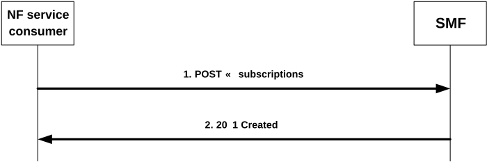
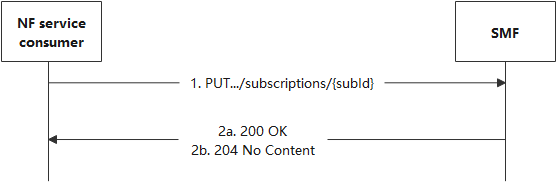

# 4.2.3 Nsmf_EventExposure_Subscribe Service Operation

## 4.2.3.1 General

This service operation is used by an NF service consumer to subscribe to event notifications on a specific PDU Session, or for all PDU Sessions of one UE, group of UE(s) or any UE, or to modify an existing subscription.

The following procedures using the Nsmf_EventExposure_Subscribe service operation are supported:

\- creating a new subscription;

\- modifying an existing subscription.

## 4.2.3.2 Creating a new subscription

Figure 4.2.3.2-1 illustrates the creation of a subscription.

Figure 4.2.3.2-1: Creation of a subscription

To subscribe to event notifications, the NF service consumer shall send an HTTP POST request with: "{apiRoot}/nsmf-event-exposure/v1/subscriptions" as Resource URI and the NsmfEventExposure data structure as request body that shall include:

\- if the subscription applies to events related to a single PDU session for a UE, the PDU Session ID of that PDU session as "pduSeId" attribute and the UE identification as "supi" or "gpsi" attribute;

\- if the subscription applies to events not related to a single PDU session, the Network Function instance identity if "UPEAS" feature is supported and the "eventSubs" attribute contains an entry with the "event" set to the value "UPF_EVENT", and identification of UEs to which the subscription applies via:

a\) identification of a single UE by SUPI as "supi" attribute or GPSI as "gpsi" attribute;

b\) identification of a group of UE(s) via a "groupId" attribute; or

c\) identification of any UE via the "anyUeInd" attribute set to true;

NOTE 1: The identification of any UE does not apply for local breakout roaming scenarios where the SMF is located in the VPLMN and the NF service consumer is located in the HPLMN.

\- an URI where to receive the requested notifications as "notifUri" attribute;

\- a Notification Correlation Identifier provided by the NF service consumer for the requested notifications as "notifId" attribute; and

\- if the NF service consumer is an AMF, the GUAMI encoded as "guami" attribute:

\- a description of the subscribed events as "eventSubs" attribute that for each event shall include:

a\) an event identifier as "event" attribute; and

b\) for event "UP_PATH_CH", whether the subscription is for early, late, or early and late notifications of UP path reconfiguration in the "dnaiChgType" attribute;

c\) for event "DDDS", the traffic descriptor(s) of the downlink data source in the "dddTraDescriptors" attribute;

and that may include:

a\) for event "DDDS", the subscribed delivery statuses in the "dddStati" attribute;

b\) for event "QFI_ALLOC" or "DISPERSION", the application identifiers in the "appIds" attribute;

c\) for event "SMCC_EXP", the data collection target period in the "targetPeriod" attribute;

d\) for event "DISPERSION", the UE IP Address in the "ueIpAddr" attribute, the indication of transaction dispersion collection in the "transacDispInd" attribute and the requested transaction metrics in the "transacMetrics" attribute;

e\) for event "WLAN_INFO", the data collection target period in the "targetPeriod" attribute;

f\) for event "RED_TRANS_EXP", the data collection target period in the "targetPeriod" attribute;

g\) for event "UPF_EVENT", the UPF event exposure information in the "upfEvents" attribute; and/or

h\) for event "QOS_MON", the Application Identifier in the "appIds" of the application for which the QoS flows are to be monitored and an indication within the "defQosSupp" attribute to inform whether the NF service consumer supports to receive QoS Flow performance information for the QoS Flow associated with the default QoS rule if there are no measurements available for the provided Application Identifier included within the "appIds" attribute.

NOTE 2: Explicit subscription to "UPF_EVENT" and "QOS_MON" events as described in this clause implies the direct notification from the UPF as specified in 3GPP TS 29.564 \[26\].

The NsmfEventExposure data structure as request body may also include:

\- if the NF service consumer is an AMF:

> a\) the name of a service produced by the AMF that expects to receive the notifications about subscribed events encoded as "serviceName" attribute;

b\) Alternate or backup IPv4 Address(es) where to send Notifications encoded as "altNotifIpv4Addrs" attribute;

c\) Alternate or backup IPv6 Address(es) where to send Notifications encoded as "altNotifIpv6Addrs" attribute;

d\) Alternate or backup FQDN(s) where to send Notifications encoded as "altNotifFqdns" attribute;

\- a Data Network Name as "dnn" attribute;

\- a single Network Slice Selection Assistance Information as "snssai" attribute;

\- an identification of network area by "networkArea" attribute, if the feature AreaFilter or the feature UPEAS is supported and the "anyUeInd" attribute is provided and set to true;

NOTE 3: Care needs to be taken with regards to load and major signalling caused when requesting Any UE. This could be achieved via utilization of some event filters (e.g. Area of Interest), a specific DNN, S-NSSAI or sampling ratio as part of Event Reporting Information.

\- a Data Network Identifier as "dnai" attribute, if the feature UPEAS is supported;

\- the SSID that the PDU session is related to as "ssid" attribute, if the feature UPEAS is supported;

\- the BSSID that the PDU session is related to as "bssid" attribute, if the feature UPEAS is supported;

\- the UPF identifier as "upfId" attribute, if the feature UPEAS is supported;

\- immediate reporting flag as "ImmeRep" attribute;

\- event notification method (periodic, one time, on event detection) as "notifMethod" attribute;

\- maximum Number of Reports as "maxReportNbr" attribute;

\- monitoring Duration as "expiry" attribute;

\- repetition Period for periodic reporting as "repPeriod" attribute;

\- sampling ratio as "sampRatio" attribute;

\- partitioning criteria for partitioning the UEs before performing sampling as "partitionCriteria" attribute if the EneNA feature is supported; and/or

\- group reporting guard time as "grpRepTime" attribute;

> \- a notification flag as "notifFlag" attribute if the EneNA feature is supported; and/or

\- notification muting exception instructions within the "notifFlagInstruct" attribute, if the EnhDataMgmt feature is supported and the "notifFlag" attribute is provided and set to "DEACTIVATE".

NOTE 4: For the "PDU_SES_EST" event subscription, the "ImmeRep" attribute needs to be included to enable the SMF to report the current available "PDU_SES_EST" event information for the subscribed PDU Session which is already established.

Upon the reception of an HTTP POST request with: "{apiRoot}/nsmf-event-exposure/v1/subscriptions" as Resource URI and NsmfEventExposure data structure as request body, the SMF shall:

\- create a new subscription;

\- assign a subscription correlation ID;

\- select an expiry time that is equal to or less than the expiry time potentially received in the request;

\- store the subscription;

\- if the feature "UPEAS" is supported, and if the NF service consumer subscribed to "QOS_MON" event, the SMF shall check if there is an active PCC rule that includes a Data Collection Application Identifier as described in 3GPP TS 29.512 \[14\] that matches the Application Identifier received within "appIds" attribute. If there is an active PCC rule, the SMF shall allow the NF service consumer to receive QoS monitoring reports enabled by that PCC rule. If no PCC rule is identified and the "defQosSupp" attribute was received and set to true, the SMF may instruct the UPF to perform QoS monitoring for the QoS Flow associated to the default QoS rule as described in 3GPP TS 29.244 \[23\]. If no PCC rule is identified and the "defQosSupp" attribute was received and set to false or not received, the SMF may, based on local configuration, reject the request by sending the NO_ACTIVE_PCC_RULE error described in clause 5.7 or include the "qosMonPending" indication set to true in the response to inform the NF service consumer that the reporting will be activated when the measurements are enabled by a PCC rule;

\- if the feature "UPEAS" is supported and the "upfEvents" attribute is provided together with the "networkArea" attribute in the EventSubscription data type, the SMF shall subscribe to the UPF for the respective UPF events as described in 3GPP TS 29.564 \[26\] only when the UE is located in the indicated area. When the UE leaves the indicated area, the SMF shall unsubscribe those events from the UPF as described in 3GPP TS 29.564 \[26\].

NOTE 5: To know when a UE enters or leaves the indicated area, the SMF can subscribe to the respective AMF Event Exposure event.

> NOTE 6: The reporting can be activated when a new PCC rule is installed or an existing one is modified with QoS monitoring information that includes the Data Collection Application Identifier related to the subscription. In this case the SMF will act as if the new subscription is received from the NF service consumer.

\- send an HTTP "201 Created" response with NsmfEventExposure data structure as response body and a Location header field containing the URI of the created individual subscription resource, i.e. "{apiRoot}/nsmf-event-exposure/v1/subscriptions/{subId}";

\- if the feature "ERIR" is not supported, and if the "ImmeRep" attribute is included and set to true in the request, the SMF shall immediately notify the recipient of notification(s) subscribed in the "notifUri" attribute of the current available value(s) using the Nsmf_EventExposure_Notify service operation, as defined in clause 4.2.2.1;

\- if the feature "ERIR" is supported, and if the "ImmeRep" attribute is included and set to true, the SMF may immediately notify the NF service consumer with the current available value(s) for the subscribed event(s) within the HTTP "201 Created" response as shown in figure 4.2.3.2-1, step 2. The "NsmfEventExposure" data type in the response may include the corresponding event(s) notification within the "eventNotifs" attribute.

\- if the sampling ratio attribute, as "sampRatio", is included in the subscription without a "partitionCriteria" attribute, the SMF shall select a random subset of UEs among the target UEs according to the sampling ratio and only report the event(s) related to the selected subset of UEs. If the "partitionCriteria" attribute is additionally included, then the SMF shall first partition the UEs according to the value of the "partitionCriteria" attribute and then select a random subset of UEs from each partition according to the sampling ratio and only report the event(s) related to the selected subsets of UEs;

\- when the group reporting guard time attribute, as "grpRepTime", is included in the subscription, the SMF shall accumulate all the event reports for the target UEs until the group reporting guard time expires. Then the SMF shall notify the NF service consumer using the Nsmf_EventExposure_Notify service operation, as described in clause 4.2.2.2; and

\- if the "notifFlag" attribute is included and set to "DEACTIVATE" in the request, the SMF shall mute the event notification and store the available events until the NF service consumer requests to retrieve them by setting the "notifFlag" attribute to "RETRIEVAL" or until a muting exception occurs (e.g. full buffer). When a muting exception occurs, the SMF may consider the contents of the "notifFlagInstruct" attribute (if provided) and/or local configuration to determine its actions. If the EnhDataMgmt feature is supported and the SMF accepts the muting instructions provided in the "notifFlag" and/or the "notifFlagInstruct" attributes, it may indicate the applied muting notification settings within the "mutingSetting" attribute in the response. If the SMF does not accept the muting instructions provided in the "notifFlag" and/or the "notifFlagInstruct" attributes, it shall send an HTTP "403 Forbidden" error response including the "cause" attribute set to "MUTING_INSTR_NOT_ACCEPTED".

If the SMF received an GUAMI, the SMF may subscribe to GUAMI changes using the AMFStatusChange service operation of the Namf_Communication service specified in 3GPP TS 29.518 \[13\], and it may use the Nnrf_NFDiscovery Service specified in 3GPP TS 29.510 \[12\] (using the obtained GUAMI and possibly service name) to query the other AMFs within the AMF set.

If errors occur when processing the HTTP POST request, the SMF shall send an HTTP error response as specified in clause 5.7.

## 4.2.3.3 Modifying an existing subscription

Figure 4.2.3.3-1 illustrates the modification of an existing subscription.

Figure 4.2.3.3-1: Modification of an existing subscription

To modify an existing subscription to event notifications, the NF service consumer shall send an HTTP PUT request with: "{apiRoot}/nsmf-event-exposure/v1/subscriptions/{subId}" as Resource URI, where "{subId}" is the subscription correlation ID of the existing subscription, and NsmfEventExposure data structure as request body as described in clause 4.2.3.2.

NOTE 1: An alternate NF service consumer than the one that requested the generation of the subscription resource can send the PUT. For instance, an AMF as NF service consumer can change.

NOTE 2: The "notifUri" attribute within the NsmfEventExposure data structure can be modified to request that subsequent notifications are sent to a new NF service consumer.

When the "notifFlag" attribute is included and set to "DEACTIVATE" in the request, the SMF shall mute the event notification and store the available events until the NF service consumer requests to retrieve them by setting the "notifFlag" attribute to "RETRIEVAL" or until a muting exception occurs (e.g. full buffer). When a muting exception occurs, the SMF may consider the contents of the "notifFlagInstruct" attribute (if provided) and/or local configuration to determine its actions; if the "notifFlag" attribute is set to "RETRIEVAL" in the request, the SMF shall send the stored events to the NF service consumer, mute the event notification again and store available events; if the "notifFlag" attribute is set to "ACTIVATE" and the event notifications are muted (due to a previously received "DECATIVATE" value), the SMF shall unmute the event notification, i.e. start sending again notifications for available events. If the EnhDataMgmt feature is supported and the SMF accepts the muting instructions provided in the "notifFlag" and/or the "notifFlagInstruct" attributes, it may indicate the applied muting notification settings within the "mutingSetting" attribute in the response. If the SMF does not accept the muting instructions provided in the "notifFlag" and/or the "notifFlagInstruct" attributes, it shall send an HTTP "403 Forbidden" error response including the "cause" attribute set to "MUTING_INSTR_NOT_ACCEPTED".

When the "ImmeRep" attribute set to true is included in the subscription and the subscribed event(s) are available:

\- if the feature "ERIR" is not supported, the SMF shall immediately notify the in the "notifUri" attribute in the "notifUri" attribute with the current available value(s) for the subscribed event(s) using the Nsmf_EventExposure_Notify service operation, as described in clause 4.2.2.1.

\- if the feature "ERIR" is supported, the SMF may immediately notify the NF service consumer with the current available value(s) for the subscribed event(s) within the HTTP "200 OK" response as shown in figure 4.2.3.3-1, step 2a. The "NsmfEventExposure" data type may include the corresponding event(s) notification within the "eventNotifs" attribute.

NOTE 3: Only the newly added event(s) needs to be reported during the subscription update.

NOTE 4: For the "PDU_SES_EST" event subscription, the "ImmeRep" attribute needs to be included to enable the SMF to report the current available "PDU_SES_EST" event information for the subscribed PDU Session which is already established.

If the "sampRatio" attribute is included in the request without a "partitionCriteria" attribute, the SMF shall select a random subset of UEs among the target UEs according to the sampling ratio and only report the event(s) related to the selected subset of UEs. If the "partitionCriteria" attribute is additionally included, then the SMF shall first partition the UEs according to the value of the "partitionCriteria" attribute and then select a random subset of UEs from each partition according to the sampling ratio and only report the event(s) related to the selected subsets of UEs.

When the "grpRepTime" attribute is included in the request, the SMF shall accumulate all the event reports for the target UEs until the group reporting guard time expires. Then the SMF shall notify the NF service consumer using the Nsmf_EventExposure_Notify service operation, as described in clause 4.2.2.2.

When the "expiry" attribute is included in the request, the SMF shall select an expiry time that is equal to or less than the expiry time received in the request.

Upon the reception of an HTTP PUT request with: "{apiRoot}/nsmf-event-exposure/v1/subscriptions/{subId}" as Resource URI and NsmfEventExposure data structure as request body, if the received HTTP request is successfully processed and accepted, the SMF shall:

\- update the concerned subscription; and

\- send an HTTP "200 OK" response with a response body containing a representation of the updated subscription in the NsmfEventExposure data structure or send a HTTP "204 No Content".

If errors occur when processing the HTTP PUT request, the SMF shall send an HTTP error response as specified in clause 5.7.

If the feature "ES3XX" is supported, and the SMF determines the received HTTP PUT request needs to be redirected, the SMF shall send an HTTP redirect response as specified in clause 6.10.9 of 3GPP TS 29.500 \[4\].
