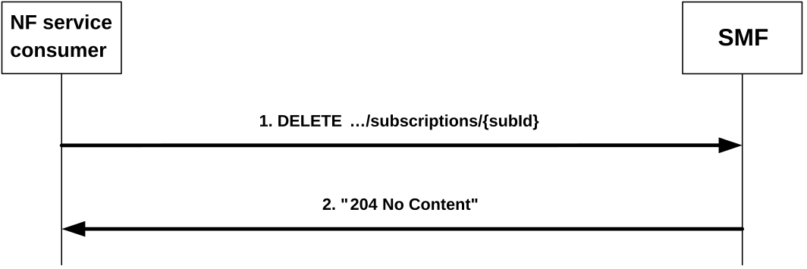

# 4.2.4 Nsmf_EventExposure_UnSubscribe Service Operation

## 4.2.4.1 General

This service operation is used by an NF service consumer to unsubscribe from event notifications.

The following procedure using the Nsmf_EventExposure_UnSubscribe service operation is supported:

\- unsubscription from event notifications.

## 4.2.4.2 Unsubscription from event notifications

Figure 4.2.4.2-1 illustrates the unsubscription from event notifications.

Figure 4.2.4.2-1: Unsubscription from event notifications

To unsubscribe from event notifications, the NF service consumer shall send an HTTP DELETE request with: "{apiRoot}/nsmf-event-exposure/v1/subscriptions/{subId}" as Resource URI, where "{subId}" is the subscription correlation ID of the existing subscription that is to be deleted.

Upon the reception of the HTTP DELETE request with: "{apiRoot}/nsmf-event-exposure/v1/subscriptions/{subId}" as Resource URI, if the received HTTP request is successfully processed and accepted, the SMF shall:

\- remove the corresponding subscription; and

\- send an HTTP "204 No Content" response.

If errors occur when processing the HTTP DELETE request, the SMF shall send an HTTP error response as specified in clause 5.7.

If the feature "ES3XX" is supported, and the SMF determines the received HTTP DELETE request needs to be redirected, the SMF shall send an HTTP redirect response as specified in clause 6.10.9 of 3GPP TS 29.500 \[4\].
