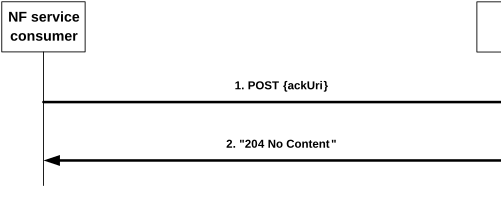

# 4.2.5 Nsmf_EventExposure_AppRelocationInfo Service Operation

## 4.2.5.1 General

The Nsmf_EventExposure_AppRelocationInfo service operation enables the NF service consumer to acknowledge the notification of subscribed events on the related PDU session from the SMF.

The following procedure using the Nsmf_EventExposure_AppRelocationInfo service operation is supported:

\- acknowledgement of notification about subscribed events.

## 4.2.5.2 Acknowledgement of Notification about subscribed events

Figure 4.2.5.2-1 illustrates the acknowledgement of notification about subscribed events.

Figure 4.2.5.2-1: Acknowledgement of Notification about subscribed events

In order to acknowledge the SMF of the application relocation information after the handling of a notification about UP path change event, an NF service consumer shall send an HTTP POST request to the callback URI "{ackUri}" as previously provided by the SMF in an attribute within the NsmfEventExposureNotification data during UP path change notification procedure as defined in clause 4.2.2.2.

The request body contains the AckOfNotify data structure that shall include:

\- Notification correlation ID provided by the SMF during UP path change notification, as "notifId" attribute;

\- an identifier of UE (i.e. SUPI or GPSI), if available and the subscription does not applies to a group of UE(s) or any UE; and

\- information about the AF acknowledgement within the "ackResult" attribute that shall contain result status of the application relocation as "afStatus" attribute. If the "afStatus" attribute sets to "SUCCESS", the N6 traffic routing information associated to the target DNAI may be included as "trafficRoute" attribute and, if the "ULBuffering" feature is supported, an indication that buffering of uplink traffic to the target DNAI is needed may be included as "upBuffInd" attribute and, if the feature "EASIPreplacement" is supported, EAS IP replacement information may be included as "easIpReplaceInfos" attribute. If the application relocation is not completed on time, the "afStatus" attribute shall set to the corresponding failure cause.

NOTE The NF service consumer gets the knowledge of the support of "ULBuffering" and/or "EASIPreplacement" negotiated features as part of the notification of the subscribed events as described in clause 4.2.2.2.

Upon the reception of an HTTP POST request with AckOfNotify data structure as request body, the SMF shall send an HTTP "204 No Content" response for a succesfull processing.

If errors occur when processing the HTTP POST request, the SMF shall send an HTTP error response as specified in clause 5.7.

If the feature "ES3XX" is supported, and the SMF determines the received HTTP POST request needs to be redirected, the SMF shall send an HTTP redirect response as specified in clause 6.10.9 of 3GPP TS 29.500 \[4\].
