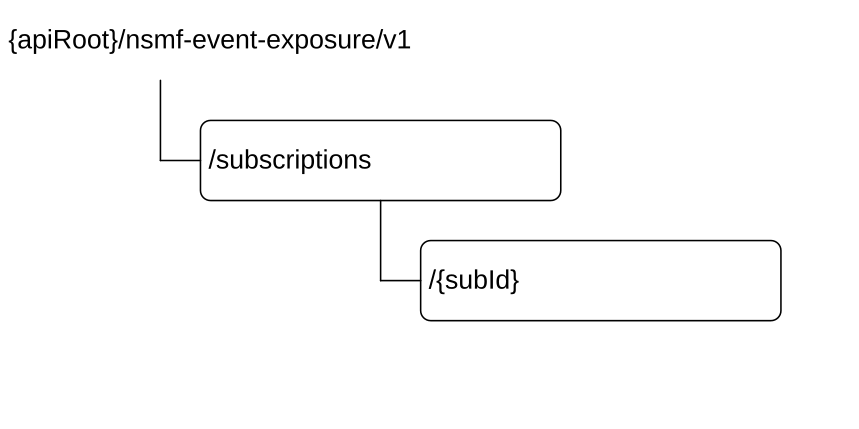

# 5.3 Resources

## 5.3.1 Resource Structure

This clause describes the structure for the Resource URIs and the resources and methods used for the service.

Figure 5.3.1-1 depicts the resource URIs structure for the Nsmf_EventExposure API.

Figure 5.3.1-1: Resource URI structure of the Nsmf_EventExposure API

Table 5.3.1-1 provides an overview of the resources and applicable HTTP methods.

Table 5.3.1-1: Resources and methods overview

|                                          |                        |                                 |                                                                                                  |
|------------------------------------------|------------------------|---------------------------------|--------------------------------------------------------------------------------------------------|
| Resource name                            | Resource URI           | HTTP method or custom operation | Description                                                                                      |
| SMF Notification Subscriptions           | /subscriptions         | POST                            | Create a new Individual SMF Notification Subscription resource.                                  |
| Individual SMF Notification Subscription | /subscriptions/{subId} | GET                             | Read an Individual SMF Notification Subscription resource.                                       |
|                                          |                        | PUT                             | Modify an existing Individual SMF Notification Subscription resource.                            |
|                                          |                        | DELETE                          | Delete an Individual SMF Notification Subscription resource and cancel the related subscription. |

## 5.3.2 Resource: SMF Notification Subscriptions

### 5.3.2.1 Description

The SMF Notification Subscriptions resource represents the collection of subscriptions to the SMF event exposure service at a given SMF.

### 5.3.2.2 Resource definition

Resource URI: {apiRoot}/nsmf-event-exposure/v1/subscriptions

This resource shall support the resource URI variables defined in table 5.3.2.2-1.

Table 5.3.2.2-1: Resource URI variables for this resource

|         |           |                |
|---------|-----------|----------------|
| Name    | Data type | Definition     |
| apiRoot | string    | See clause 5.1 |

### 5.3.2.3 Resource Standard Methods

#### 5.3.2.3.1 POST

This method shall support the URI query parameters specified in table 5.3.2.3.1-1.

Table 5.3.2.3.1-1: URI query parameters supported by the POST method on this resource

|      |           |     |             |             |
|------|-----------|-----|-------------|-------------|
| Name | Data type | P   | Cardinality | Description |
| n/a  |           |     |             |             |

This method shall support the request data structures specified in table 5.3.2.3.1-2 and the response data structures and response codes specified in table 5.3.2.3.1-3.

Table 5.3.2.3.1-2: Data structures supported by the POST Request Body on this resource

|                   |     |             |                                                                 |
|-------------------|-----|-------------|-----------------------------------------------------------------|
| Data type         | P   | Cardinality | Description                                                     |
| NsmfEventExposure | M   | 1           | Create a new Individual SMF Notification Subscription resource. |

Table 5.3.2.3.1-3: Data structures supported by the POST Response Body on this resource

<table>
<colgroup>
<col style="width: 20%" />
<col style="width: 3%" />
<col style="width: 12%" />
<col style="width: 13%" />
<col style="width: 50%" />
</colgroup>
<tbody>
<tr class="odd">
<td>Data type</td>
<td>P</td>
<td>Cardinality</td>
<td>Response codes</td>
<td>Description</td>
</tr>
<tr class="even">
<td>NsmfEventExposure</td>
<td>M</td>
<td>1</td>
<td>201 Created</td>
<td>The creation of an Individual SMF Notification Subscription resource is confirmed and a representation of that resource is returned.</td>
</tr>
<tr class="odd">
<td>ProblemDetails</td>
<td>O</td>
<td>0..1</td>
<td>403 Forbidden</td>
<td>(NOTE 2)</td>
</tr>
<tr class="even">
<td colspan="5">
NOTE 1: The mandatory HTTP error status codes for the POST method listed in table 5.2.7.1-1 of 3GPP TS 29.500 [4] also apply.

NOTE 2: Failure cases are described in clause 5.7.
</td>
</tr>
</tbody>
</table>

Table 5.3.2.3.1-4: Headers supported by the 201 Response Code on this resource

|          |           |     |             |                                                                                                                                    |
|----------|-----------|-----|-------------|------------------------------------------------------------------------------------------------------------------------------------|
| Name     | Data type | P   | Cardinality | Description                                                                                                                        |
| Location | string    | M   | 1           | Contains the URI of the newly created resource, according to the structure: {apiRoot}/nsmf-event-exposure/v1/subscriptions/{subId} |

### 5.3.2.4 Resource Custom Operations

None.

## 5.3.3 Resource: Individual SMF Notification Subscription

### 5.3.3.1 Description

The SMF Notification Subscriptions resource represents a single subscription to the SMF event exposure service.

### 5.3.3.2 Resource definition

Resource URI: {apiRoot}/nsmf-event-exposure/v1/subscriptions/{subId}

This resource shall support the resource URI variables defined in table 5.3.3.2-1.

Table 5.3.3.2-1: Resource URI variables for this resource

|         |           |                                                                                                                         |
|---------|-----------|-------------------------------------------------------------------------------------------------------------------------|
| Name    | Data type | Definition                                                                                                              |
| apiRoot | string    | See clause 5.1                                                                                                          |
| subId   | string    | Identifies a subscription to the SMF event exposure service formatted as defined for the SubId type in table 5.6.3.2-1. |

### 5.3.3.3 Resource Standard Methods

#### 5.3.3.3.1 GET

This method shall support the URI query parameters specified in table 5.3.3.3.1-1.

Table 5.3.3.3.1-1: URI query parameters supported by the GET method on this resource

|      |           |     |             |             |
|------|-----------|-----|-------------|-------------|
| Name | Data type | P   | Cardinality | Description |
| n/a  |           |     |             |             |

This method shall support the request data structures specified in table 5.3.3.3.1-2 and the response data structures and response codes specified in table 5.3.3.3.1-3.

Table 5.3.3.3.1-2: Data structures supported by the GET Request Body on this resource

|           |     |             |             |
|-----------|-----|-------------|-------------|
| Data type | P   | Cardinality | Description |
| n/a       |     |             |             |

Table 5.3.3.3.1-3: Data structures supported by the GET Response Body on this resource

<table>
<colgroup>
<col style="width: 20%" />
<col style="width: 3%" />
<col style="width: 12%" />
<col style="width: 14%" />
<col style="width: 48%" />
</colgroup>
<tbody>
<tr class="odd">
<td>Data type</td>
<td>P</td>
<td>Cardinality</td>
<td>Response codes</td>
<td>Description</td>
</tr>
<tr class="even">
<td>NsmfEventExposure</td>
<td>M</td>
<td>1</td>
<td>200 OK</td>
<td>A representation of the SMF Notification Subscription matching the subId is returned.</td>
</tr>
<tr class="odd">
<td>RedirectResponse</td>
<td>O</td>
<td>0..1</td>
<td>307 Temporary Redirect</td>
<td>
Temporary redirection, during Individual SMF Notification Subscription retrieval.

Applicable if the feature "ES3XX" is supported.

(NOTE 2)
</td>
</tr>
<tr class="even">
<td>RedirectResponse</td>
<td>O</td>
<td>0..1</td>
<td>308 Permanent Redirect</td>
<td>
Permanent redirection, during Individual SMF Notification Subscription retrieval.

Applicable if the feature "ES3XX" is supported.

(NOTE 2)
</td>
</tr>
<tr class="odd">
<td colspan="5">
NOTE 1: The mandatory HTTP error status codes for the GET method listed in table 5.2.7.1-1 of 3GPP TS 29.500 [4] also apply.

NOTE 2: The RedirectResponse data structure may be provided by an SCP (refer to clause 6.10.9.1 of 3GPP TS 29.500 [4]).
</td>
</tr>
</tbody>
</table>

Table 5.3.3.3.1-4: Headers supported by the 307 Response Code on this resource

<table>
<colgroup>
<col style="width: 16%" />
<col style="width: 14%" />
<col style="width: 4%" />
<col style="width: 11%" />
<col style="width: 52%" />
</colgroup>
<tbody>
<tr class="odd">
<td>Name</td>
<td>Data type</td>
<td>P</td>
<td>Cardinality</td>
<td>Description</td>
</tr>
<tr class="even">
<td>Location</td>
<td>string</td>
<td>M</td>
<td>1</td>
<td>
Contains an alternative URI of the resource located in an alternative SMF (service) instance towards which the request is redirected.

For the case where the request is redirected to the same target via a different SCP, refer to clause 6.10.9.1 of 3GPP TS 29.500 [4].
</td>
</tr>
<tr class="odd">
<td>3gpp-Sbi-Target-Nf-Id</td>
<td>string</td>
<td>O</td>
<td>0..1</td>
<td>Identifier of the target SMF (service) instance towards which the request is redirected</td>
</tr>
</tbody>
</table>

Table 5.3.3.3.1-5: Headers supported by the 308 Response Code on this resource

<table>
<colgroup>
<col style="width: 16%" />
<col style="width: 14%" />
<col style="width: 4%" />
<col style="width: 11%" />
<col style="width: 52%" />
</colgroup>
<tbody>
<tr class="odd">
<td>Name</td>
<td>Data type</td>
<td>P</td>
<td>Cardinality</td>
<td>Description</td>
</tr>
<tr class="even">
<td>Location</td>
<td>string</td>
<td>M</td>
<td>1</td>
<td>
Contains an alternative URI of the resource located in an alternative SMF (service) instance towards which the request is redirected.

For the case where the request is redirected to the same target via a different SCP, refer to clause 6.10.9.1 of 3GPP TS 29.500 [4].
</td>
</tr>
<tr class="odd">
<td>3gpp-Sbi-Target-Nf-Id</td>
<td>string</td>
<td>O</td>
<td>0..1</td>
<td>Identifier of the target SMF (service) instance towards which the request is redirected</td>
</tr>
</tbody>
</table>

#### 5.3.3.3.2 PUT

This method shall support the URI query parameters specified in table 5.3.3.3.2-1.

Table 5.3.3.3.2-1: URI query parameters supported by the PUT method on this resource

|      |           |     |             |             |
|------|-----------|-----|-------------|-------------|
| Name | Data type | P   | Cardinality | Description |
| n/a  |           |     |             |             |

This method shall support the request data structures specified in table 5.3.3.3.2-2 and the response data structures and response codes specified in table 5.3.3.3.2-3.

Table 5.3.3.3.2-2: Data structures supported by the PUT Request Body on this resource

|                   |     |             |                                                                                                                                                   |
|-------------------|-----|-------------|---------------------------------------------------------------------------------------------------------------------------------------------------|
| Data type         | P   | Cardinality | Description                                                                                                                                       |
| NsmfEventExposure | M   | 1           | Modify the existing Individual SMF Notification Subscription resource matching the subId according to the representation in the NsmfEventExposure |

Table 5.3.3.3.2-3: Data structures supported by the PUT Response Body on this resource

<table>
<colgroup>
<col style="width: 20%" />
<col style="width: 3%" />
<col style="width: 12%" />
<col style="width: 15%" />
<col style="width: 47%" />
</colgroup>
<tbody>
<tr class="odd">
<td>Data type</td>
<td>P</td>
<td>Cardinality</td>
<td>Response codes</td>
<td>Description</td>
</tr>
<tr class="even">
<td>NsmfEventExposure</td>
<td>M</td>
<td>1</td>
<td>200 OK</td>
<td>Successful case: The Individual SMF Notification Subscription resource matching the subId was modified and a representation is returned.</td>
</tr>
<tr class="odd">
<td>n/a</td>
<td></td>
<td></td>
<td>204 No Content</td>
<td>Successful case: The Individual SMF Notification Subscription resource matching the subId was modified.</td>
</tr>
<tr class="even">
<td>RedirectResponse</td>
<td>O</td>
<td>0..1</td>
<td>307 Temporary Redirect</td>
<td>
Temporary redirection, during Individual SMF Notification Subscription modification.

Applicable if the feature "ES3XX" is supported.

(NOTE 3)
</td>
</tr>
<tr class="odd">
<td>RedirectResponse</td>
<td>O</td>
<td>0..1</td>
<td>308 Permanent Redirect</td>
<td>
Permanent redirection, during Individual SMF Notification Subscription modification.

Applicable if the feature "ES3XX" is supported.

(NOTE 3)
</td>
</tr>
<tr class="even">
<td>ProblemDetails</td>
<td>O</td>
<td>0..1</td>
<td>403 Forbidden</td>
<td>(NOTE 2)</td>
</tr>
<tr class="odd">
<td colspan="5">
NOTE 1: The mandatory HTTP error status codes for the PUT method listed in table 5.2.7.1-1 of 3GPP TS 29.500 [4] also apply.

NOTE 2: Failure cases are described in clause 5.7.

NOTE 3: The RedirectResponse data structure may be provided by an SCP (refer to clause 6.10.9.1 of 3GPP TS 29.500 [4]).
</td>
</tr>
</tbody>
</table>

Table 5.3.3.3.2-4: Headers supported by the 307 Response Code on this resource

<table>
<colgroup>
<col style="width: 16%" />
<col style="width: 14%" />
<col style="width: 4%" />
<col style="width: 11%" />
<col style="width: 52%" />
</colgroup>
<tbody>
<tr class="odd">
<td>Name</td>
<td>Data type</td>
<td>P</td>
<td>Cardinality</td>
<td>Description</td>
</tr>
<tr class="even">
<td>Location</td>
<td>string</td>
<td>M</td>
<td>1</td>
<td>
Contains an alternative URI of the resource located in an alternative SMF (service) instance towards which the request is redirected.

For the case where the request is redirected to the same target via a different SCP, refer to clause 6.10.9.1 of 3GPP TS 29.500 [4].
</td>
</tr>
<tr class="odd">
<td>3gpp-Sbi-Target-Nf-Id</td>
<td>string</td>
<td>O</td>
<td>0..1</td>
<td>Identifier of the target SMF (service) instance towards which the request is redirected</td>
</tr>
</tbody>
</table>

Table 5.3.3.3.2-5: Headers supported by the 308 Response Code on this resource

<table>
<colgroup>
<col style="width: 16%" />
<col style="width: 14%" />
<col style="width: 4%" />
<col style="width: 11%" />
<col style="width: 52%" />
</colgroup>
<tbody>
<tr class="odd">
<td>Name</td>
<td>Data type</td>
<td>P</td>
<td>Cardinality</td>
<td>Description</td>
</tr>
<tr class="even">
<td>Location</td>
<td>string</td>
<td>M</td>
<td>1</td>
<td>
Contains an alternative URI of the resource located in an alternative SMF (service) instance towards which the request is redirected.

For the case where the request is redirected to the same target via a different SCP, refer to clause 6.10.9.1 of 3GPP TS 29.500 [4].
</td>
</tr>
<tr class="odd">
<td>3gpp-Sbi-Target-Nf-Id</td>
<td>string</td>
<td>O</td>
<td>0..1</td>
<td>Identifier of the target SMF (service) instance towards which the request is redirected</td>
</tr>
</tbody>
</table>

#### 5.3.3.3.3 DELETE

This method shall support the URI query parameters specified in table 5.3.3.3.3-1.

Table 5.3.3.3.3-1: URI query parameters supported by the DELETE method on this resource

|      |           |     |             |             |
|------|-----------|-----|-------------|-------------|
| Name | Data type | P   | Cardinality | Description |
| n/a  |           |     |             |             |

This method shall support the request data structures specified in table 5.3.3.3.3-2 and the response data structures and response codes specified in table 5.3.3.3.3-3.

Table 5.3.3.3.3-2: Data structures supported by the DELETE Request Body on this resource

|           |     |             |             |
|-----------|-----|-------------|-------------|
| Data type | P   | Cardinality | Description |
| n/a       |     |             |             |

Table 5.3.3.3.3-3: Data structures supported by the DELETE Response Body on this resource

<table>
<colgroup>
<col style="width: 16%" />
<col style="width: 4%" />
<col style="width: 12%" />
<col style="width: 15%" />
<col style="width: 50%" />
</colgroup>
<tbody>
<tr class="odd">
<td>Data type</td>
<td>P</td>
<td>Cardinality</td>
<td>Response codes</td>
<td>Description</td>
</tr>
<tr class="even">
<td>n/a</td>
<td></td>
<td></td>
<td>204 No Content</td>
<td>Successful case: The Individual SMF Notification Subscription resource matching the subId was deleted.</td>
</tr>
<tr class="odd">
<td>RedirectResponse</td>
<td>O</td>
<td>0..1</td>
<td>307 Temporary Redirect</td>
<td>
Temporary redirection, during Individual SMF Notification Subscription deletion.

Applicable if the feature "ES3XX" is supported.

(NOTE 2)
</td>
</tr>
<tr class="even">
<td>RedirectResponse</td>
<td>O</td>
<td>0..1</td>
<td>308 Permanent Redirect</td>
<td>
Permanent redirection, during Individual SMF Notification Subscription deletion.

Applicable if the feature "ES3XX" is supported.

(NOTE 2)
</td>
</tr>
<tr class="odd">
<td colspan="5">
NOTE 1: The manadatory HTTP error status code for the DELETE method listed in table 5.2.7.1-1 of 3GPP TS 29.500 [4] also apply.

NOTE 2: The RedirectResponse data structure may be provided by an SCP (refer to clause 6.10.9.1 of 3GPP TS 29.500 [4]).
</td>
</tr>
</tbody>
</table>

Table 5.3.3.3.3-4: Headers supported by the 307 Response Code on this resource

<table>
<colgroup>
<col style="width: 16%" />
<col style="width: 14%" />
<col style="width: 4%" />
<col style="width: 11%" />
<col style="width: 52%" />
</colgroup>
<tbody>
<tr class="odd">
<td>Name</td>
<td>Data type</td>
<td>P</td>
<td>Cardinality</td>
<td>Description</td>
</tr>
<tr class="even">
<td>Location</td>
<td>string</td>
<td>M</td>
<td>1</td>
<td>
Contains an alternative URI of the resource located in an alternative SMF (service) instance towards which the request is redirected.

For the case where the request is redirected to the same target via a different SCP, refer to clause 6.10.9.1 of 3GPP TS 29.500 [4].
</td>
</tr>
<tr class="odd">
<td>3gpp-Sbi-Target-Nf-Id</td>
<td>string</td>
<td>O</td>
<td>0..1</td>
<td>Identifier of the target SMF (service) instance towards which the request is redirected</td>
</tr>
</tbody>
</table>

Table 5.3.3.3.3-5: Headers supported by the 308 Response Code on this resource

<table>
<colgroup>
<col style="width: 16%" />
<col style="width: 14%" />
<col style="width: 4%" />
<col style="width: 11%" />
<col style="width: 52%" />
</colgroup>
<tbody>
<tr class="odd">
<td>Name</td>
<td>Data type</td>
<td>P</td>
<td>Cardinality</td>
<td>Description</td>
</tr>
<tr class="even">
<td>Location</td>
<td>string</td>
<td>M</td>
<td>1</td>
<td>
Contains an alternative URI of the resource located in an alternative SMF (service) instance towards which the request is redirected.

For the case where the request is redirected to the same target via a different SCP, refer to clause 6.10.9.1 of 3GPP TS 29.500 [4].
</td>
</tr>
<tr class="odd">
<td>3gpp-Sbi-Target-Nf-Id</td>
<td>string</td>
<td>O</td>
<td>0..1</td>
<td>Identifier of the target SMF (service) instance towards which the request is redirected</td>
</tr>
</tbody>
</table>

### 5.3.3.4 Resource Custom Operations

None.
