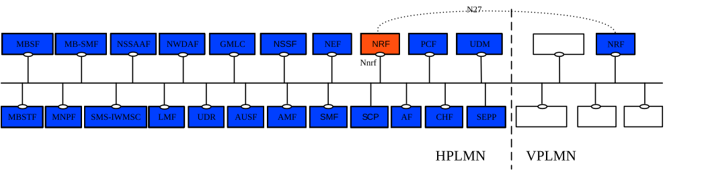

# 4 Overview

The Network Function (NF) Repository Function (NRF) is the network entity in the 5G Core Network (5GC) supporting the following functionality:

\- Maintains the NF profile of available NF instances and their supported services;

\- Maintains the SCP profile of available SCP instances;

\- Maintains the SEPP profile of available SEPP instances;

\- Allows other NF or SCP instances to subscribe to, and get notified about, the registration in NRF of new NF instances of a given type or of SEPP instances. It also allows SCP instances to subscribe to, and get notified about, the registration in NRF of new SCP instances;

\- Supports service discovery function. It receives NF Discovery Requests from NF or SCP instances, and provides the information of the available NF instances fulfilling certain criteria (e.g., supporting a given service);

\- Support SCP discovery function. It receives NF Discovery Requests for SCP profiles from other SCP instances, and provides the information of the available SCP instances fulfilling certain criteria (e.g., serving a given NF set);

\- Support SEPP discovery function. It receives NF Discovery Requests for SEPP profiles from other NF or SCP instances, and provides the information of the available SEPP instances fulfilling certain criteria (e.g. supporting connectivity with a remote PLMN).

Figures 4-1 shows the reference architecture for the 5GC, with focus on the NRF:

Figure 4-1: 5G System architecture

Figure 4-1 illustrates PLMN level scenarios, but this architecture is also applicable to the SNPN scenarios, as explained below.

For the sake of clarity, the NRF is never depicted in reference point representation figures, given that the NRF interacts with every other NF in the 5GC. As an exception, in the roaming case, the reference point between the vNRF and the hNRF is named as N27. The reference point name of N27 is used only for representation purposes, but its functionality is included in the services offered by the Nnrf Service-Based Interface.

In the case of SNPN, the NRF provides services e.g. in the following scenarios:

\- For a SNPN for which roaming is not supported (see 3GPP TS 23.501 \[2\], clause 5.30.2.0);

\- For the case of UE access to SNPN using credentials from Credentials Holder (see 3GPP TS 23.501 \[2\], clause 5.30.2.9);

\- For the case of Onboarding of UEs for SNPNs (see 3GPP TS 23.501 \[2\], clause 5.30.2.10).
