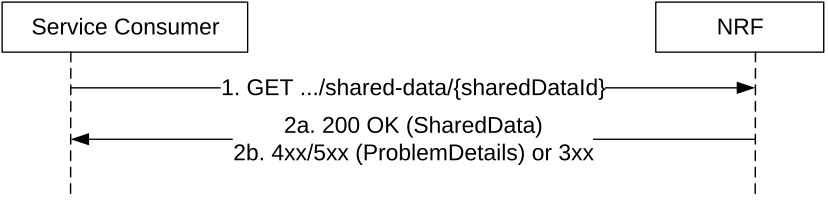

# 5.2.2.10 SharedDataRetrieval

This service operation retrieves Shared Data, by sending a HTTP GET request to the resource URI representing the "Shared Data" resource.

In deployments where shared data are locally configured at a higher level NRF by means of OAM this service operation shall be used by lower level NRFs to retrieve unknown shared data from the higher level NRF.

This service operation shall be used by Service Consumers having discovered/retrieved service profiles containing a single unknown shared data ID.

Figure 5.2.2.10-1: Shared Data Retrieval

1\. The Service Consumer shall send an HTTP GET request to the resource URI "shared-data/{sharedDataId}" document resource, where the URI parameter sharedDataId identifies the requested Shared Data.

2a. On success, "200 OK" shall be returned with the requested Shared Data in response body.

2b. On failure, the NRF shall return "4xx/5xx" response and the response body may contain a ProblemDetails object describing the detailed information of the failure.  
In the case of redirection, the NRF shall return 3xx status code, which shall contain a Location header with an URI pointing to the endpoint of another NRF service instance.
