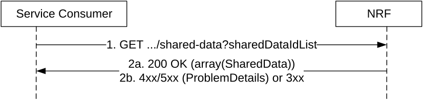

# 5.2.2.11 SharedDataListRetrieval

This service operation retrieves a list of Shared Data, by sending a HTTP GET request to the resource URI representing the "Shared Data Store" resource.

In deployments where shared data are locally configured at a higher level NRF by means of OAM this service operation shall be used by lower level NRFs to retrieve unknown shared data from the higher level NRF.

This service operation shall be used by Service Consumers having discovered/retrieved service profiles containing multiple unknown shared data IDs.

Figure 5.2.2.11-1: Shared Data List Retrieval

1\. The Service Consumer shall send an HTTP GET request to the resource URI "shared-data" store resource, where the query parameter sharedDataIdList identifies the requested Shared Data.

2a. On success, "200 OK" shall be returned with the requested Shared Data in response body. If only a subset of the requested Shared Data is available (locally stored or could be retrieved from a higher level NRF), the NRF shall still return "200 OK" with the available and retrieved subset of the requested Shared Data in the response body.

2b. On failure, the NRF shall return "4xx/5xx" response and the response body may contain a ProblemDetails object describing the detailed information of the failure.  
In the case of redirection, the NRF shall return 3xx status code, which shall contain a Location header with an URI pointing to the endpoint of another NRF service instance.
