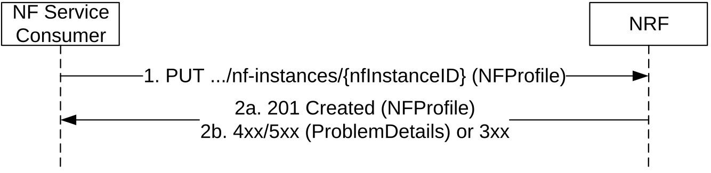
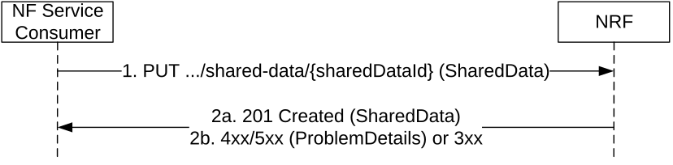

# 5.2.2.2 NFRegister

## 5.2.2.2.1 General

This service operation is used:

\- to register an NF in the NRF by providing the NF profile of the requesting NF to the NRF, and the NRF marks the requesting NF as available to be discovered by other NFs;

\- to register services associated to an existing NF Instance;

\- to register NRF information in another NRF, and this information is used for forwarding or redirecting service discovery request.

If the "Shared-Data-Registration" feature is supported, this service operation is also used in deployments where shared data are not locally configured at the NRF:

\- to provide shared data to the NRF.

## 5.2.2.2.2 NF (other than NRF) registration to NRF

Figure 5.2.2.2.2-1: NF Instance Registration

1\. The NF Service Consumer shall send a PUT request to the resource URI representing the NF Instance. The URI is determined by the NF Instance. The variable {nfInstanceID} represents an identifier, provided by the NF Service Consumer that shall be globally unique inside the PLMN of the NRF where the NF is being registered. The format of the NF Instance ID shall be a Universally Unique Identifier (UUID) version 4, as described in IETF RFC 4122 \[18\].

The UUIDs in URIs, HTTP request content and HTTP response content should be formatted using lower-case hexadecimal digits; if the NF Service Consumer sends a request where the UUIDs are formatted with upper-case hexadecimal letters, the NRF shall handle it as if the request had been formatted with lower-case characters.

EXAMPLE: UUID version 4: "4947a69a-f61b-4bc1-b9da-47c9c5d14b64"

The content of the PUT request shall contain a representation of the NF Instance to be created.

2a. On success, "201 Created" shall be returned, the content of the PUT response shall contain the representation of the created resource and the "Location" header shall contain the URI of the created resource. Additionally, the NRF returns a "heart-beat timer" containing the number of seconds expected between two consecutive heart-beat messages from an NF Instance to the NRF (see clause 5.2.2.3.2). The representation of the created resource may be a complete NF Profile or a NF Profile just including the mandatory attributes of the NF Profile and the attributes which the NRF added or changed (see Annex B).

2b. On failure or redirection:

\- If the registration of the NF instance fails at the NRF due to errors in the encoding of the NFProfile JSON object, the NRF shall return "400 Bad Request" status code with the ProblemDetails IE providing details of the error.

\- If the registration of the NF instance fails at the NRF due to unknown Shared Data IDs received in the NFProfile, the NRF shall return "400 Bad Request" status code with the ProblemDetails IE providing details of the error.  
The Application Error SHARED_DATA_ID_UNKNOWN shall be used by NRFs that are deployed without shared data being locally configured by means of OAM. In this case the unknown shared data IDs shall be conveyed together with the ProblemDetails IE to the NF service consumer. The NF service consumer may then register the unknown shared data at the NRF and retry registering.  
The Application Error SHARED_DATA_NOT_CONFIGURED shall be used by NRFs that are deployed with local configuration of shared data by means of OAM. The NF service consumer may retry registering without making use of shared data IDs in the NF Profile, or the registration is unsuccessful due to network misconfiguration.

\- If the registration of the NF instance fails at the NRF due to NRF internal errors, the NRF shall return "500 Internal Server Error" status code with the ProblemDetails IE providing details of the error.

\- In the case of redirection, the NRF shall return 3xx status code, which shall contain a Location header with an URI pointing to the endpoint of another NRF service instance.

The NRF shall allow the registration of a Network Function instance with any of the NF types described in clause 6.1.6.3.3, and it shall also allow registration of Network Function instances with custom NF types (e.g., NF type values not defined by 3GPP, or NF type values not defined by this API version).

NOTE 1: When registering a custom NF in NRF, it is recommended to use a NF type name that prevents collisions with other custom NF type names, or with NF types defined in the future by 3GPP. E.g., prefixing the custom NF type name with the string "CUSTOM\_".

During the registration of a Network Function instance with a custom NF type, the NF instance may provide NF-specific data (in the "customInfo" attribute), that shall be stored by the NRF as part of the NF profile of the NF instance.

The NRF shall accept the registration of NF Instances containing Vendor-Specific attributes (see 3GPP TS 29.500 \[4\], clause 6.6.3), and therefore, it shall accept NF Profiles containing attributes whose type may be unknown to the NRF, and those attributes shall be stored as part of the NF's profile data in NRF.

Before an NF Instance registers its NF Profile in NRF, the NF Instance should check the capabilities of the NRF by issuing an OPTIONS request to the "nf-instances" resource (see clause 6.1.3.2.3.2), unless the NF Instance already sent a Bootstrapping Request to the NRF and received the nrfFeatures attribute in the response. The NRF may indicate in the response capabilities such as the support of receiving compressed content in the HTTP PUT request used for registration of the NF Profile, or support of specific attributes of the NF Profile.

NOTE 2: A Rel-16 NF needs to register the list of NF Service Instances in the "nfServices" array attribute towards an NRF not supporting the Service-Map feature (i.e. a Rel-15 NRF).

## 5.2.2.2.3 NRF registration to another NRF

The procedure specified in clause 5.2.2.2.2 applies. Additionally:

a\) the registering NRF shall set the nfType to "NRF" in the nfProfile;

b\) the registering NRF shall set the nfService to contain "nnrf-disc", "nnrf-nfm" and optionally "nnrf-oauth2" in the nfProfile;

c\) the registering NRF may include nrfInfo which contains the information of e.g. udrInfo, udmInfo, ausfInfo, amfInfo, smfInfo, upfInfo, pcfInfo, bsfInfo, nefInfo, chfInfo, pcscfInfo, lmfInfo, gmlcInfo, aanfInfo, nfInfo and nsacfInfo in the nfProfile locally configured in the NRF or the NRF received during registration of other NFs, this means the registering NRF is able to provide service for discovery of NFs subject to that information;

d\) if the NRF receives an NF registration with the nfType set to "NRF", the NRF shall use the information contained in the nfProfile to target the registering NRF when forwarding or redirecting NF service discovery request.

## 5.2.2.2.4 Shared Data registration to NRF

Support of this service operation is not required in deployments where shared data are locally configured at the NRF.

Figure 5.2.2.2.4-1: Shared Data Registration

1\. If the feature "Shared-Data-Registration" is supported, the NF Service Consumer shall send a PUT request to the resource URI representing the Shared Data. The variable {sharedDataId} represents an identifier, provided by the NF Service Consumer that shall be globally unique inside the PLMN of the NRF where the NF is being registered. The format of the sharedDataId shall be a Universally Unique Identifier (UUID) version 4, as described in IETF RFC 4122 \[18\].

The UUIDs in URIs, HTTP request content and HTTP response content should be formatted using lower-case hexadecimal digits; if the NF Service Consumer sends a request where the UUIDs are formatted with upper-case hexadecimal letters, the NRF shall handle it as if the request had been formatted with lower-case characters.

EXAMPLE: UUID version 4: "4947a69a-f61b-4bc1-b9da-47c9c5d14b64"

The content of the PUT request shall contain a representation of the SharedData to be created.

2a. On success, "201 Created" shall be returned, the content of the PUT response shall contain the representation of the created resource and the "Location" header shall contain the URI of the created resource.

2b. On failure or redirection:

\- If the registration of the Shared Data fails at the NRF due to errors in the encoding of the SharedData JSON object, the NRF shall return "400 Bad Request" status code with the ProblemDetails IE providing details of the error.

\- If the Shared Data is not authorized with write access to the requesting NF (e.g. the Shared Data is shared to one specific NF Set while the requesting NF is not in that NF Set), the NRF shall return "403 Forbidden " status code with the ProblemDetails IE providing details of the error.

\- If the registration of the Shared Data fails at the NRF due to NRF internal errors, the NRF shall return "500 Internal Server Error" status code with the ProblemDetails IE providing details of the error.

\- In the case of redirection, the NRF shall return 3xx status code, which shall contain a Location header with an URI pointing to the endpoint of another NRF service instance.
