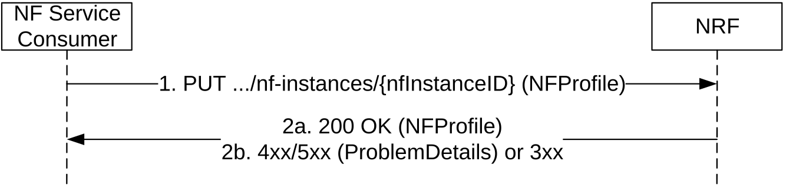
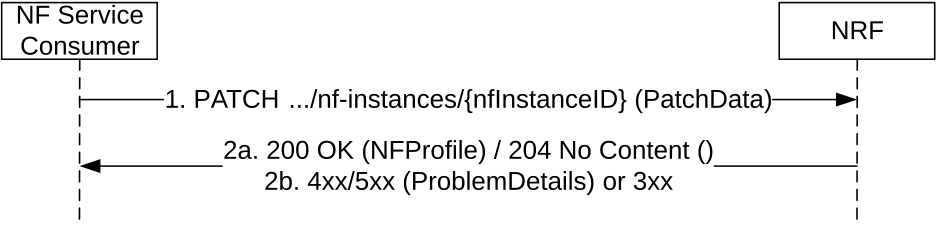
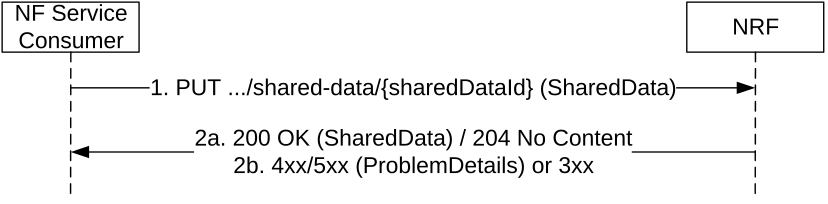
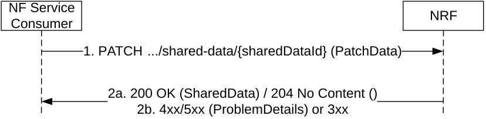
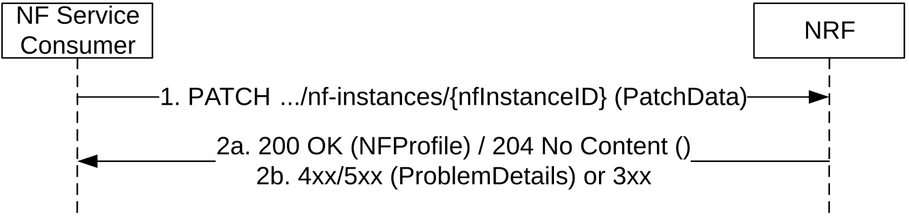

# 5.2.2.3 NFUpdate

## 5.2.2.3.1 General

This service operation updates the profile of a Network Function previously registered in the NRF by providing the updated NF profile of the requesting NF to the NRF. The update operation may apply to the whole profile of the NF (complete replacement of the existing profile by a new profile), or it may apply only to a subset of the parameters of the profile (including adding/deleting/replacing services to the NF profile).

If the feature "Shared-Data-Registration" is supported, this service operation may be used to update Shared Data previously created in the NRF by providing the updated shared data to the NRF. The update operation may apply to the whole shared data (complete replacement), or it may apply only to a subset of parameters of the shared data.

## 5.2.2.3.1A NF Profile Complete replacement

To perform a complete replacement of the NF Profile of a given NF Instance, the NF Service Consumer shall issue an HTTP PUT request, as shown in Figure 5.2.2.3.1A-1:

Figure 5.2.2.3.1A-1: NF Profile Complete Replacement

1\. The NF Service Consumer shall send a PUT request to the resource URI representing the NF Instance. The content of the PUT request shall contain a representation of the NF Instance to be completely replaced in the NRF.

2a. On success, "200 OK" shall be returned, the content of the PUT response shall contain the representation of the replaced resource. The representation of the replaced resource may be a complete NF Profile or a NF Profile just including the mandatory attributes of the NF Profile and the attributes which the NRF added or changed (see Annex B).

2b. On failure or redirection:

\- If the update of the NF instance fails at the NRF due to errors in the encoding of the NFProfile JSON object, the NRF shall return "400 Bad Request" status code with the ProblemDetails IE providing details of the error.

\- If the update of the NF instance fails at the NRF due to NRF internal errors, the NRF shall return "500 Internal Server Error" status code with the ProblemDetails IE providing details of the error.

\- In the case of redirection, the NRF shall return 3xx status code, which shall contain a Location header with an URI pointing to the endpoint of another NRF service instance.

## 5.2.2.3.1B NF Profile Partial Update

To perform a partial update of the NF Profile of a given NF Instance, the NF Service Consumer shall issue an HTTP PATCH request, as shown in Figure 5.2.2.3.1B-2. This partial update shall be used to add/delete/replace individual parameters of the NF Instance, and also to add/delete/replace any of the services (and their parameters) offered by the NF Instance.

Figure 5.2.2.3.1B-2: NF Profile Partial Update

1\. The NF Service Consumer shall send a PATCH request to the resource URI representing the NF Instance. The content of the PATCH request shall contain the list of operations (add/delete/replace) to be applied to the NF Profile of the NF Instance; these operations may be directed to individual parameters of the NF Profile or to the list of services (and their parameters) offered by the NF Instances. In order to leave the NF Profile in a consistent state, all the operations specified by the PATCH request body shall be executed atomically.

The NF Service Consumer should include a "If-Match" HTTP header carrying the latest entity-tag received from NRF for the NF profile to which the PATCH document shall be applied.

2a. On success, if all update operations are accepted by the NRF, "204 No Content" should be returned; the NRF may instead return "200 OK" with the content of the PATCH response containing the representation of the replaced resource. The representation of the replaced resource may be a complete NF Profile or a NF Profile just including the mandatory attributes of the NF Profile and the attributes which the NRF added or changed (see Annex B).

2b. On failure or redirection:

\- If the NF Instance, identified by the "nfInstanceID", is not found in the list of registered NF Instances in the NRF's database, the NRF shall return "404 Not Found" status code with the ProblemDetails IE providing details of the error.

\- In the case of redirection, the NRF shall return 3xx status code, which shall contain a Location header with an URI pointing to the endpoint of another NRF service instance.

\- If "If-Match" header is received with an entity tag different from the entity-tag in NRF for NF profile of the target NF instance, the NRF shall return "412 Precondition Failed" status code with the ProblemDetails IE providing details of the error.

\- If no precondition was defined in the request and another confliction has been detected (e.g. to change value of a non-existing IE), the NRF shall return "409 Conflicting" status code with the ProblemDetails IE providing details of the error.

The NRF shall allow updating Vendor-Specific attributes (see 3GPP TS 29.500 \[4\], clause 6.6.3) that may exist in the NF Profile of a registered NF Instance.

## 5.2.2.3.1C Shared Data Complete replacement

Support of this service operation is not required in deployments where shared data are locally configured at the NRF.

Complete replacement of shared data is triggered by means of OA&M configuration actions. This action must be performed in a consistent way, i.e. at all NF Service Consumers that share the shared data. In addition, OA&M must ensure that only one NF Service Consumer conveys the complete replacement towards the NRF.

To perform a complete replacement of the Shared Data, the NF Service Consumer shall issue an HTTP PUT request, as shown in Figure 5.2.2.3.1C-1.

Figure 5.2.2.3.1C-1: Shared Data Complete Replacement

1\. The NF Service Consumer shall send a PUT request to the resource URI representing the Shared Data. The content of the PUT request shall contain a representation of the Shared Data to be completely replaced in the NRF.

2a. On success, either "200 OK" shall be returned, the content of the PUT response shall contain the representation of the replaced resource, or "204 No Content" shall be returned.

2b. On failure or redirection:

\- If the update of the Shared Data fails at the NRF due to errors in the encoding of the SharedData JSON object, the NRF shall return "400 Bad Request" status code with the ProblemDetails IE providing details of the error.

\- If the Shared Data is not authorized with write access to the requesting NF (e.g. the Shared Data is shared to one specific NF Set while the requesting NF is not in that NF Set), the NRF shall return "403 Forbidden " status code with the ProblemDetails IE providing details of the error.

\- If the update of the Shared Data fails at the NRF due to NRF internal errors, the NRF shall return "500 Internal Server Error" status code with the ProblemDetails IE providing details of the error.

\- In the case of redirection, the NRF shall return 3xx status code, which shall contain a Location header with an URI pointing to the endpoint of another NRF service instance.

## 5.2.2.3.1D Shared data Partial Update

Support of this service operation is not required in deployments where shared data are locally configured at the NRF.

Partial update of shared data is triggered by means of OA&M configuration actions. This action must be performed in a consistent way, i.e. at all NF Service Consumers that share the shared data. In addition, OA&M must ensure that only one NF Service Consumer conveys the partial update towards the NRF.

To perform a partial update of the Shared Data, the NF Service Consumer shall issue an HTTP PATCH request, as shown in Figure 5.2.2.3.1D-1. This partial update shall be used to add/delete/replace individual parameters of the Shared Data.

Figure 5.2.2.3.1D-1: Shared Data Partial Update

1\. The NF Service Consumer shall send a PATCH request to the resource URI representing the Shared Data. The content of the PATCH request shall contain the list of operations (add/delete/replace) to be applied to the Shared Data; these operations may be directed to individual parameters of the Shared Data. In order to leave the Shared Data in a consistent state, all the operations specified by the PATCH request body shall be executed atomically.

The NF Service Consumer should include a "If-Match" HTTP header carrying the latest entity-tag received from NRF for the Shared Data to which the PATCH document shall be applied.

2a. On success, if all update operations are accepted by the NRF, "204 No Content" should be returned; the NRF may instead return "200 OK" with the content of the PATCH response containing the representation of the replaced resource.

2b. On failure or redirection:

\- If the Shared Data, identified by the "sharedDataId", is not found in the NRF's database, the NRF shall return "404 Not Found" status code with the ProblemDetails IE providing details of the error.

\- If the Shared Data is not authorized with write access to the requesting NF (e.g. the Shared Data is shared to one specific NF Set while the requesting NF is not in that NF Set), the NRF shall return "403 Forbidden " status code with the ProblemDetails IE providing details of the error.

\- In the case of redirection, the NRF shall return 3xx status code, which shall contain a Location header with an URI pointing to the endpoint of another NRF service instance.

\- If "If-Match" header is received with an entity tag different from the entity-tag in NRF for NF profile of the target NF instance, the NRF shall return "412 Precondition Failed" status code with the ProblemDetails IE providing details of the error.

\- If no precondition was defined in the request and another confliction has been detected (e.g. to change value of a non-existing IE), the NRF shall return "409 Conflicting" status code with the ProblemDetails IE providing details of the error.

## 5.2.2.3.2 NF Heart-Beat

Each NF that has previously registered in NRF shall contact the NRF periodically (heart-beat), by invoking the NFUpdate service operation, in order to show that the NF is still operative.

The time interval at which the NRF shall be contacted is deployment-specific, and it is returned by the NRF to the NF Service Consumer as a result of a successful registration.

When the NRF detects that a given NF has not updated its profile for a configurable amount of time (longer than the heart-beat interval), the NRF changes the status of the NF to SUSPENDED and considers that the NF and its services can no longer be discovered by other NFs via the NFDiscovery service. The NRF notifies NFs subscribed to receiving notifications of changes of the NF Profile that the NF status has been changed to SUSPENDED.

If the NRF modifies the heart-beat interval value of a given NF instance currently registered (e.g. as a result of an OA&M operation), it shall return the new value to the registered NF in the response of the next periodic heart-beat interaction received from that NF and, until then, the NRF shall apply the heart-beat check procedure according to the original interval value.

Figure 5.2.2.3.2-1: NF Heart-Beat

1\. The NF Service Consumer shall send a PATCH request to the resource URI representing the NF Instance. The content of the PATCH request shall contain a "replace" operation on the "nfStatus" attribute of the NF Profile of the NF Instance, and set it to the value "REGISTERED" or "UNDISCOVERABLE".

In addition, the NF Service Consumer may also provide the load information of the NF, and/or the load information of the NF associated NF services. The provision of such load information may be limited by this NF via appropriate configuration (e.g. granularity threshold, load exceeds/falls below a certain threshold) in order to avoid notifying minor load changes.

The NF Service Consumer shall not include "If-Match" HTTP header in the Heart-Beat request if the request is not modifying any attribute in the NF profile.

2a. On success, the NRF should return "204 No Content"; the NRF may also answer with "200 OK" along with the full NF Profile, e.g. in cases where the NRF determines that the NF Profile has changed significantly since the last heart-beat, and wants to send the new profile to the NF Service Consumer (note that this alternative has bigger signalling overhead).

The NRF shall not generate a new entity tag for the NF profile in Heart-Beat operation if no attribute is modified.

2b. On failure or redirection:

\- If the NF Instance, identified by the "nfInstanceID", is not found in the list of registered NF Instances in the NRF's database, the NRF shall return "404 Not Found" status code with the ProblemDetails IE providing details of the error.

\- In the case of redirection, the NRF shall return 3xx status code, which shall contain a Location header with an URI pointing to the endpoint of another NRF service instance.

EXAMPLE:

PATCH .../nf-instances/4947a69a-f61b-4bc1-b9da-47c9c5d14b64

Content-Type: application/json-patch+json

\[

{ "op": "replace", "path": "/nfStatus", "value": "REGISTERED" },

{ "op": "replace", "path": "/load", "value": 50 }

\]

HTTP/2 204 No Content

Content-Location: .../nf-instances/4947a69a-f61b-4bc1-b9da-47c9c5d14b64
