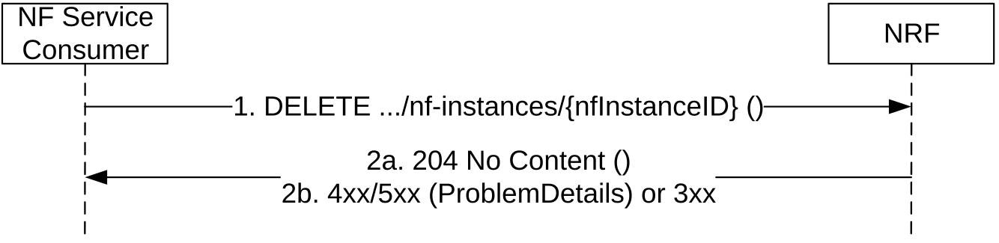
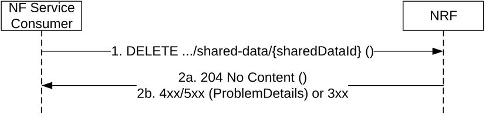

# 5.2.2.4 NFDeregister

## 5.2.2.4.1 General

This service operation removes the profile of a Network Function previously registered in the NRF.

If the "Shared-Data" feature is supported, this service operation removes the shared data previously registered in the NRF.

## 5.2.2.4.2 NF Instance Deregistration

It is executed by deleting a given resource identified by a "NF Instance ID". The operation is invoked by issuing a DELETE request on the URI representing the specific NF Instance.

Figure 5.2.2.4.2-1: NF Instance Deregistration

1\. The NF Service Consumer shall send a DELETE request to the resource URI representing the NF Instance. The request body shall be empty.

2a. On success, "204 No Content" shall be returned. The response body shall be empty.

2b. On failure or redirection:

\- If the NF Instance, identified by the "nfInstanceID", is not found in the list of registered NF Instances in the NRF's database, the NRF shall return "404 Not Found" status code with the ProblemDetails IE providing details of the error.

\- In the case of redirection, the NRF shall return 3xx status code, which shall contain a Location header with an URI pointing to the endpoint of another NRF service instance.

## 5.2.2.4.3 Shared Data Deregistration

Support of this service operation is not required in deployments where shared data are locally configured at the NRF.

It is executed by deleting a given resource identified by a "sharedDataId". The operation is invoked by issuing a DELETE request on the URI representing the specific Shared Data.

Figure 5.2.2.4.3-1: Shared Data Deregistration

1\. The NF Service Consumer shall send a DELETE request to the resource URI representing the Shared Data. The request body shall be empty.

2a. On success, "204 No Content" shall be returned. The response body shall be empty.

2b. On failure or redirection:

\- If the Shared Data, identified by the "sharedDataId", is not found in the NRF's database, the NRF shall return "404 Not Found" status code with the ProblemDetails IE providing details of the error.

\- If the Shared Data is not authorized with write access to the requesting NF (e.g. the Shared Data is shared to one specific NF Set while the requesting NF is not in that NF Set), the NRF shall return "403 Forbidden " status code with the ProblemDetails IE providing details of the error.

\- In the case of redirection, the NRF shall return 3xx status code, which shall contain a Location header with an URI pointing to the endpoint of another NRF service instance.
