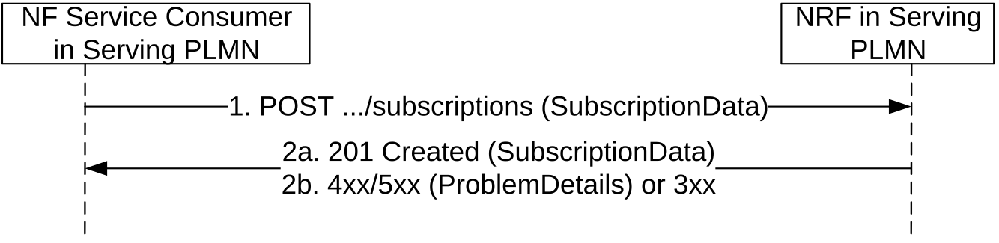
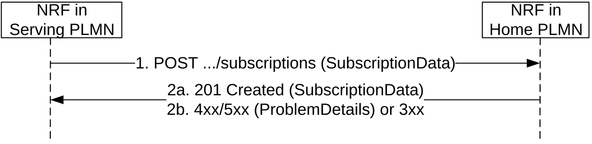
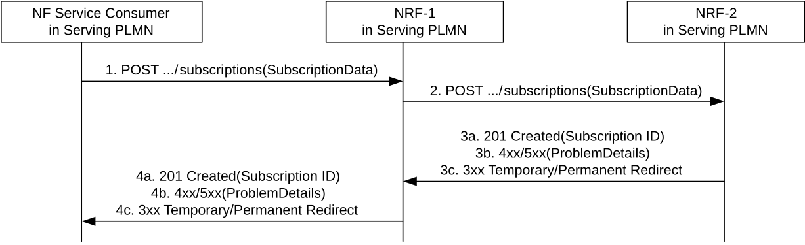
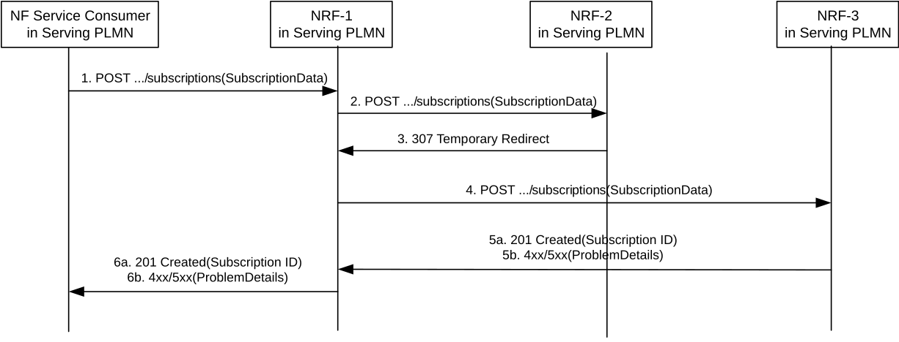
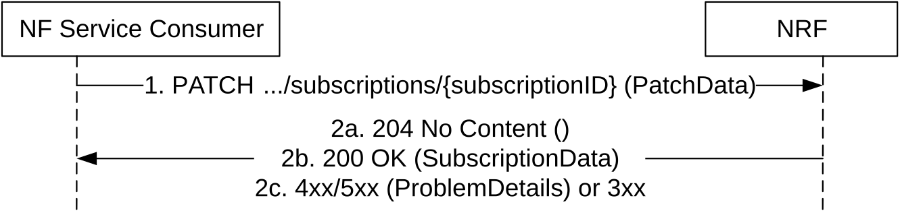
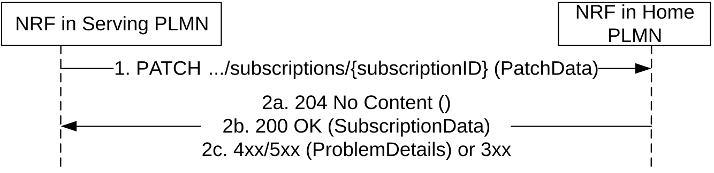

# 5.2.2.5 NFStatusSubscribe

## 5.2.2.5.1 General

This service operation is used to:

\- create a subscription so an NF Service Consumer can request to be notified when NF Instances of a given set, following certain filter criteria are registered/deregistered in NRF or when their profile is modified;

\- create a subscription to a specific NF Instance so an NF Service Consumer can request to be notified when the profile of such NF Instance is modified or when the NF Instance is deregistered from NRF.

If the "Shared-Data-Retrieval" feature is supported, this service operation may also be used to create or update subscription to the shared NF profile changes in the NRF.

## 5.2.2.5.2 Subscription to NF Instances in the same PLMN

The subscription to notifications on NF Instances is executed creating a new individual resource under the collection resource "subscriptions". The operation is invoked by issuing a POST request on the URI representing the "subscriptions" resource.

Figure 5.2.2.5.2-1: Subscription to NF Instances in the same PLMN

> 1\. The NF Service Consumer shall send a POST request to the resource URI representing the "subscriptions" collection resource. The custom HTTP header "3gpp-Sbi-Notif-Accepted-Encoding", as defined in 3GPP TS 29.500 \[4\] clause 5.2.3.3.6, may be included to indicate the content-encodings supported by the NF Service Consumer receiving the notification.
>
> The request body shall include the data indicating the type of notifications that the NF Service Consumer is interested in receiving; it also contains a callback URI, where the NF Service Consumer shall be prepared to receive the actual notification from the NRF (see NFStatusNotify operation in 5.2.2.6) and it may contain a validity time, suggested by the NF Service Consumer, representing the time span during which the subscription is desired to be kept active. When the NF Service Consumer creates multiple subscriptions in the NRF, it should use distinct callback URIs for each subscription.
>
> The subscription request may also include additional parameters indicating the list of attributes (including Vendor-Specific attributes, see 3GPP TS 29.500 \[4\], clause 6.6.3) in the NF Profile to be monitored (or to be excluded from monitoring), in order to determine whether a notification from NRF should be sent, or not, when any of those attributes is changed in the profile.
>
> The NF Service Consumer may request the creation of a subscription to a specific NF Instance, or to a set of NF Instances, where the set is determined according to different criteria specified in the request body, in the "subscrCond" attribute of the "SubscriptionData" object type (see clause 6.1.6.2.16).
>
> The subscription shall be authorized, or rejected, by the NRF by checking the relevant input attributes (e.g. reqNfType, reqNfFqdn, reqSnssais, reqPerPlmnSnssais, reqPlmnList, reqSnpnList, etc.) in the subscription request body (along with the contents of any optional Oauth2 access token provided in the API request) against the list of authorization attributes in the NF Profile of the target NF Instance to be monitored.
>
> An SCP may request a subscription to the complete profile of NF Instances (including, e.g. the authorization attributes of the target NF Instances to be monitored). Upon receiving such a request, the NRF shall verify that the requesting entity is authorized to subscribe to the complete profile of NF instances, based on local policies or the receipt of an Oauth2 access token granting such permission. If the requesting entity is not authorized to do so, the NRF shall reject the request or handle it as a subscription request without access to the complete profile.
>
> When the subscription request is for a set of NFs, the authorization attributes of the NF Instances in the set may differ, resulting in positive authorization of the subscription for only a part of the NF Instances in the set; in that case, the subscription to the set of NFs may be accepted by the NRF, but the NF Instances in the set that are not authorized for the NF Service Consumer that requested the subscription, shall not result in triggering any notification event from the NRF to the NF Service Consumer.

2a. On success, "201 Created" shall be returned. The response shall contain the data related to the created subscription, including the validity time, as determined by the NRF, after which the subscription becomes invalid. Once the subscription expires, if the NF Service Consumer wants to keep receiving status notifications, it shall create a new subscription in the NRF.

2b. On failure or redirection:

\- If the creation of the subscription fails at the NRF due to errors in the SubscriptionData JSON object in the request body, the NRF shall return "400 Bad Request" status code with the ProblemDetails IE providing details of the error. E.g., the NRF may verify that the input attributes (e.g. reqNfType) in the subscription request match with the corresponding ones in, e.g. the public key certificate of the NF service consumer received during TLS initial handshake procedure (see 3GPP TS 33.310 \[50\]). If the verification is unsuccessful, the request shall be rejected with "400 Bad Request" status code and the "cause" attribute set to "INVALID_CLIENT".

\- If the creation of the subscription fails at the NRF due to NRF internal errors, the NRF shall return "500 Internal Server Error" status code with the ProblemDetails IE providing details of the error.

\- In the case of redirection, the NRF shall return 3xx status code, which shall contain a Location header with an URI pointing to the endpoint of another NRF service instance.

## 5.2.2.5.3 Subscription to NF Instances in a different PLMN

The subscription to notifications on NF Instances in a different PLMN is done by creating a resource under the collection resource "subscriptions", in the NRF of the Home PLMN.

For that, step 1 in clause 5.2.2.5.2 is executed (send a POST request to the NRF in the Serving PLMN); this request shall include the identity of the PLMN of the home NRF in the SubscriptionData parameter in the request body.

If the NRF in Serving PLMN knows that Oauth2-based authorization is required for accessing the NFManagement service of the NRF in Home PLMN, e.g. by learning this during an earlier Bootstrapping procedure or local configuration, and if the request received at the NRF in Serving PLMN does not include an access token, the NRF in Serving PLMN may reject the request with a 401 Unauthorized as specified in clause 6.7.3 of 3GPP TS 29.500 \[4\].

Then, steps 1-2 in Figure 5.2.2.5.3-1 are executed, between the NRF in the Serving PLMN and the NRF in the Home PLMN. In this step, the PLMN ID may be present in the SubscriptionData parameter. The NRF in the Home PLMN returns a subscriptionID identifying the created subscription.

Finally, step 2 in clause 5.2.2.5.2 is executed; a new subscriptionID shall be generated by the NRF in the Serving PLMN as indicated in step 2 of Figure 5.2.2.5.3-1, and shall be sent to the NF Service Consumer in the Serving PLMN.

Figure 5.2.2.5.3-1: Subscription to NF Instances in a different PLMN

> 1\. The NRF in Serving PLMN shall send a POST request to the resource URI in the NRF in Home PLMN representing the "subscriptions" collection resource. The request body shall include the SubscriptionData as received by the NRF in Serving PLMN from the NF Service Consumer in the Serving PLMN (see 5.2.2.5.2), containing the data about the type of notifications that the NF Service Consumer is interested in receiving and the callback URI where the NF Service Consumer shall be prepared to receive the notifications from the NRF (see NFStatusNotify operation in 5.2.2.6).

2a. On success, "201 Created" shall be returned. If the subscription is created in a different NRF in the HPLMN than the NRF in the HPLMN that receives the subscription request, the latter should include information in the subscriptionID (after the first 5 or 6 digits and "-") such as to be able to forward the subsequent subscription modification or deletion request it may receive from the NRF in the serving PLMN towards the NRF in the HPLMN holding the subscription. The information to be included in the subscriptionID is left to implementation.

If the Home NRF is located in a PLMN:

The NRF in Serving PLMN should not keep state for this created subscription and shall send to the NF Service Consumer in Serving PLMN (step 2 in 5.2.2.5.2) a subscriptionID that shall consist on the following structure: \<MCC\>+\<MNC\>+"-"+\<OriginalSubscriptionID\>

If the Home NRF is located in an SNPN:

\<MCC\>+\<MNC\>+"-"+"x3Lf57A"+":nid="+\<NID\>+":"+\<OriginalSubscriptionID\>

NOTE: The fixed 7-character string "x3Lf57A" is used to prevent accidental collisions with subscription IDs generated according to earlier versions of this specification, where the subscription ID could only contain MCC and MNC values; this mechanism is commonly known as "magic cookie".

EXAMPLE 1: If the NRF in a Home PLMN (where MCC = 123, and MNC=456) creates a subscription with value "subs987654", the subscriptionID that the NRF in Serving PLMN would send to the NF Service Consumer in Serving PLMN is: "123456-subs987654"

EXAMPLE 2: If the NRF in an SNPN (where MCC = 321, MNC = 654 and NID = 023f245ac42) creates a subscription with value "subs987654", the subscriptionID that the NRF in Serving PLMN would send to the NF Service Consumer in Serving PLMN is:  
"321654-x3Lf57A:nid=023f245ac42:subs987654".

The URI in the Location header that the NRF in Serving PLMN returns to the NF Service Consumer in Serving PLMN shall contain a \<subscriptionId\> modified as described above and, if it is as an absolute URI, an apiRoot pointing to the address of the NRF in Serving PLMN. The subscriptionId attribute in the message body that the NRF in Serving PLMN returns to the NF Service Consumer in Serving PLMN shall also contain a \<subscriptionId\> modified as described above.

2b. On failure or redirection:

\- If the creation of the subscription fails at the NRF due to errors in the SubscriptionData JSON object in the request body, the NRF shall return "400 Bad Request" status code with the ProblemDetails IE providing details of the error.

\- If the creation of the subscription fails at the NRF due to NRF internal errors, the NRF shall return "500 Internal Server Error" status code with the ProblemDetails IE providing details of the error.

\- In the case of redirection, the NRF shall return 3xx status code, which shall contain a Location header with an URI pointing to the endpoint of another NRF service instance.

## 5.2.2.5.4 Subscription to NF Instances with intermediate forwarding NRF

When multiple NRFs are deployed in one PLMN, an NF Instance can subscribe to changes of NF Instances registered in an NRF to which it is not directly interacting. The subscription message is forwarded by an intermediate NRF to which the subscribing NF instance is directly interacting.

For that, step 1 in clause 5.2.2.5.2 is executed (send a POST request to the NRF-1 in the Serving PLMN); this request shall include the SubscriptionData parameter in the request body.

Then, steps 1-4 in Figure 5.2.2.5.4-1 are executed between NF Service Consumer in Serving PLMN, NRF-1 in Serving PLMN and NRF-2 in Serving PLMN. In thest steps, NRF-1 sends the subscription request to a pre-configured NRF-2. NRF-2 requests corresponding NRF (e.g. the NF Service Producer registered NRF) and returns a subscriptionID identifying the created subscription and this subscriptionID is sent to the NF Service Consumer via NRF-1.

Finally, step 2 in clause 5.2.2.5.2 is executed; the subscriptionID shall be sent to the NF Service Consumer.

Figure 5.2.2.5.4-1: Subscription with intermediate forwarding NRF

1\. NRF-1 receives a subscription request and sends the subscription request to a pre-configured NRF-2. This may for example include cases where NRF-1 does not have sufficient information as determined by the operator policy to fulfill the request locally.

2\. Upon receiving a subscription request, based on the SubscriptionData contained in the subscription request (e.g.NF type) and locally stored information (see clause 5.2.2.2.3), NRF-2 shall identify the next hop NRF and forward the subscription request to that NRF (i.e. NF Service Producer registered NRF).

3a. On success, "201 Created" shall be returned by NRF-2.

3b. On failure, i.e. if the creation of the subscription fails, the NRF-2 shall return "4XX/5XX" response.

3c. In the case of redirection, the NRF shall return 3xx status code, which shall contain a Location header with an URI pointing to the endpoint of another NRF service instance.

4a. NRF-1 forwards the success response to NF Service Consumer. The content of the POST response shall contain the representation describing the status of the request and the "Location" header shall be present and shall contain the URI of the created resource. The authority and/or deployment-specific string of the apiRoot of the created resource URI may differ from the authority and/or deployment-specific string of the apiRoot of the request URI received in the POST request.

4b. On failure, NRF-1 forwards the error response to NF Service Consumer.

4c. In the case of redirection, the NRF shall return 3xx status code, which shall contain a Location header with an URI pointing to the endpoint of another NRF service instance.

## 5.2.2.5.5 Subscription to NF Instances with intermediate redirecting NRF

When multiple NRFs are deployed in one PLMN, an NF Instance can subscribe to changes of NF Instances registered in another NRF. The subscription message is redirected by a third NRF.

For that, step 1 in clause 5.2.2.5.2 is executed (send a POST request to the NRF-1 in the Serving PLMN); this request shall include the SubscriptionData parameter in the request body.

Then, steps 2-5 in Figure 5.2.2.5.5-1 are executed between NRF-1, NRF-2 and NRF-3.

Finally, step 2 in clause 5.2.2.5.2 is executed; the subscriptionID shall be sent to the NF Service Consumer.

Figure 5.2.2.5.5-1: Subscription to NF Instances with intermediate redirecting NRF

1\. NF Service Consumer send a subscription request to NRF-1.

2\. NRF-1 receives a subscription request but does not have the information to fulfil the request. Then NRF-1 sends the subscription request to a pre-configured NRF-2.

3\. Upon receiving a subscription request, based on the SubscriptionData contained in the subscription request (e.g.NF type) and locally stored information (see clause 5.2.2.2.3), NRF-2 shall identify the next hop NRF, and redirect the subscription request by returning HTTP 307 Temporary Redirect response.

The 307 Temporary Redirect response shall contain a Location header field, the host part of the URI in the Location header field represents NRF-3.

4\. Upon receiving 307 Temporary Redirect response, NRF-1 sends the subscription request to NRF-3 by using the URI contained in the Location header field of the 307 Temporary Redirect response.

5a. On success, "201 Created" shall be returned by NRF-3.

5b. On failure, if the creation of the subscription fails at the NRF-3, the NRF-3 shall return "4XX/5XX" response.

6a. On success, "201 Created" shall be forwarded to NF Service Consumer via NRF-1. The content of the POST response shall contain the representation describing the status of the request and the "Location" header shall be present and shall contain the URI of the created resource. The authority and/or deployment-specific string of the apiRoot of the created resource URI may differ from the authority and/or deployment-specific string of the apiRoot of the request URI received in the POST request.

6b. On failure, if the creation of the subscription fails, "4XX/5XX" shall be forwarded to NF Service Consumer via NRF-1.

## 5.2.2.5.6 Update of Subscription to NF Instances

The subscription to notifications on NF Instances may be updated to refresh the validity time, when this time is about to expire. The NF Service Consumer may request a new validity time to the NRF, and the NRF shall answer with the new assigned validity time, if the operation is successful.

This operation is executed by updating the resource identified by "subscriptionID". It is invoked by issuing an HTTP PATCH request on the URI representing the individual resource received in the Location header field of the "201 Created" response received during a successful subscription (see clause 5.2.2.5).

Figure 5.2.2.5.6-1: Subscription to NF Instances in the same PLMN

1\. The NF Service Consumer shall send a PATCH request to the resource URI identifying the individual subscription resource. The content of the PATCH request shall contain a "replace" operation on the "validityTime" attribute of the SubscriptionData structure and shall contain a new suggested value for it; no other attribute of the resource shall be updated as part of this operation.

2a. On success, if the NRF accepts the extension of the lifetime of the subscription, and it accepts the requested value for the "validityTime" attribute, a response with status code "204 No Content" shall be returned.

2b. On success, if the NRF accepts the extension of the lifetime of the subscription, but it assigns a validity time different than the value suggested by the NF Service Consumer, a "200 OK" response code shall be returned. The response shall contain the new resource representation of the "subscription" resource, which includes the new validity time, as determined by the NRF, after which the subscription becomes invalid.

2c. On failure or redirection:

\- If the update of the subscription fails at the NRF due to errors in the JSON Patch object in the request body, the NRF shall return "400 Bad Request" status code with the ProblemDetails IE providing details of the error.

\- If the update of the subscription fails at the NRF due to NRF internal errors, the NRF shall return "500 Internal Server Error" status code with the ProblemDetails IE providing details of the error.

\- In the case of redirection, the NRF shall return 3xx status code, which shall contain a Location header with an URI pointing to the endpoint of another NRF service instance.

EXAMPLE:

PATCH .../subscriptions/2a58bf47

Content-Type: application/json-patch+json

\[

{ "op": "replace", "path": "/validityTime", "value": "2018-12-30T23:20:50Z" },

\]

HTTP/2 204 No Content

## 5.2.2.5.7 Update of Subscription to NF Instances in a different PLMN

The update of subscription in a different PLMN is done by updating a subscription resource identified by a "subscriptionID".

For that, step 1 in clause 5.2.2.5.6 is executed (send a PATCH request to the NRF in the Serving PLMN); this request shall include the identity of the PLMN or SNPN of the home NRF (MCC/MNC/NID values) as a component values of the susbcriptionID.

Then, steps 1-2 in Figure 5.2.2.5.7-1 are executed, between the NRF in the Serving PLMN and the NRF in the Home PLMN. In this step, the subscriptionID sent to the NRF in the Home PLMN shall not contain the identity of the PLMN (i.e., it shall be the same subscriptionID value as originally generated by the NRF in the Home PLMN). The NRF in the Home PLMN returns a status code with the result of the operation.

If the subscription was created in a different NRF in the HPLMN than the NRF in the HPLMN that receives the subscription update request, the latter shall forward the request received from the NRF in the serving PLMN towards the NRF in the HPLMN holding the subscription, using the information included in the subscriptionID (see clause 5.2.2.5.3). The subscriptionID value in the request forwarded to the NRF in the HPLMN holding the subscription shall contain the same value as originally generated by the latter.

Finally, step 2 in clause 5.2.2.5.7-2 is executed; a status code is returned to the NF Service Consumer in Serving PLMN in accordance to the result received from NRF in the Home PLMN.

Figure 5.2.2.5.7-1: Update of Subscription to NF Instances in a different PLMN

1\. The NRF in Serving PLMN shall send a PATCH request to the resource URI representing the individual subscription. The content of the PATCH request shall contain a "replace" operation on the "validityTime" attribute of the SubscriptionData structure and shall contain a new suggested value for it;

2a. On success, if the NRF in the Home PLMN accepts the extension of the lifetime of the subscription, and it accepts the requested value for the "validityTime" attribute, a response with status code "204 No Content" shall be returned.

2b. On success, if the NRF in the Home PLMN accepts the extension of the lifetime of the subscription, but it assigns a validity time different than the value suggested by the NF Service Consumer, a "200 OK" response code shall be returned. The response shall contain the new resource representation of the "subscription" resource, which includes the new validity time, as determined by the NRF in the Home PLMN, after which the subscription becomes invalid.

2c. On failure or redirection:

\- If the update of the subscription fails at the NRF due to errors in the JSON Patch object in the request body, the NRF shall return "400 Bad Request" status code with the ProblemDetails IE providing details of the error.

\- If the update of the subscription fails at the NRF due to NRF internal errors, the NRF shall return "500 Internal Server Error" status code with the ProblemDetails IE providing details of the error.

\- In the case of redirection, the NRF shall return 3xx status code, which shall contain a Location header with an URI pointing to the endpoint of another NRF service instance.
