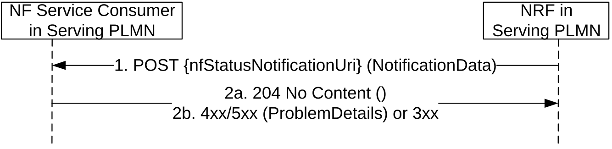
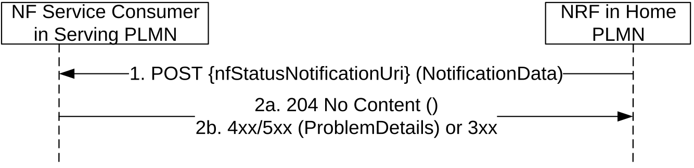
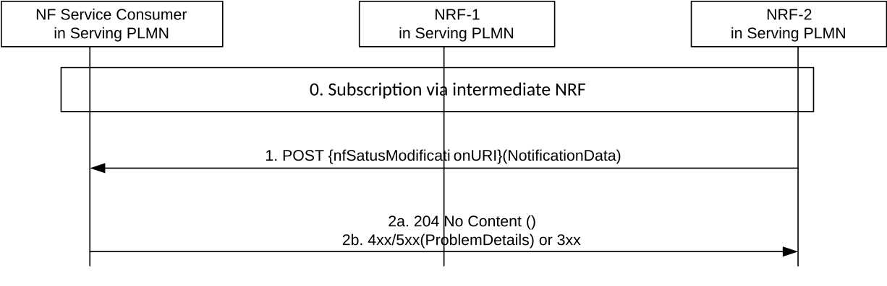

# 5.2.2.6 NFStatusNotify

## 5.2.2.6.1 General

This service operation notifies each NF Service Consumer that was previously subscribed to receiving notifications of registration/deregistration of NF Instances, or notifications of changes of the NF profile of a given NF Instance. The notification is sent to a callback URI that each NF Service Consumer provided during the subscription (see NFStatusSubscribe operation in 5.2.2.5).

If the "Shared-Data-Retrieval" feature is supported, this service operation may also be used to notify the shared data changes in the NRF.

## 5.2.2.6.2 Notification from NRF in the same PLMN

The operation is invoked by issuing a POST request to each callback URI of the different subscribed NF Instances.

Figure 5.2.2.6.2-1: Notification from NRF in the same PLMN

1\. The NRF shall send a POST request to the callback URI.

For notifications of newly registered NF Instances, the request body shall include the data associated to the newly registered NF, and its services, according to the criteria indicated by the NF Service Consumer during the subscription operation. These data shall contain the nfInstanceURI of the NF Instance, an indication of the event being notified ("registration"), and the new profile data (including, among others, the services offered by the NF Instance).

For notifications of changes of the profile of a NF Instance, the request body shall include the NFInstanceID of the NF Instance whose profile was changed, an indication of the event being notified ("profile change"), and the new profile data.

For notifications of deregistration of the NF Instance from NRF, the request body shall include the NFInstanceID of the deregistered NF Instance, and an indication of the event being notified ("deregistration").

NOTE: When the NF Instance changes its NFStatus, the NRF notifies subscribing entities with an "NF_PROFILE_CHANGED" event, except if the new NFStatus changes to "CANARY_RELEASE" and the subscribing entity does not support the "Canary-Release" feature (see clause 6.1.9); in such case, the NRF notifies the subscribing entities with an "NF_DEREGISTERED" event (see clause 6.1.6.3.6).

When an NF Instance is newly registered in NRF, the NRF notifies subscribing entities with an "NF_REGISTERED" event, except if such NF instance newly registers with status "CANARY_RELEASE" and the subscribing entity does not support the "Canary-Release" feature; in such case, the NRF does not send an "NF_REGISTERED" event to the subscribing entity.

When an NF Service Instance changes its NFServiceStatus to "CANARY_RELEASE", and the subscribing entity does not support the "Canary-Release" feature, the NRF sends a notification with an "NF_PROFILE_CHANGED" event that removes such NF Service Instance from the NF profile, so the subscribing entity can remove such instance from the list of available service instances of the corresponding NF producer.

When an NF Service Consumer subscribes to a set of NFs (using the different subscription conditions specified in clause 6.1.6.2.35), a change in the profile of the monitored NF Instance may result in such NF becoming a part of the NF set, or stops becoming a part of it (e.g., an NF Service Consumer subscribing to all NFs offering a given NF Service, and then, a certain NF Instance changes its profile by adding or removing an NF Service of its NF Profile); in such case, the NRF shall use the "NF_PROFILE_CHANGED" event type in the notification. Similarly, a change of the status (i.e. the "nfStatus" attribute of the NF Profile) shall result into the NRF to send notifications to subscribing NFs with event type set to "NF_PROFILE_CHANGED".

When an NF Service Consumer subscribes to a set of NFs, using the subscription conditions specified in clause 6.1.6.2.35, in case of a change of profile(s) of NFs potentially related to those subscription conditions, the NRF shall send notification to subscribing NF Service Consumer(s) to those NFs no longer matching the subscription conditions, and to subscribing NF Service Consumer(s) to NFs that start matching the subscription conditions. In that case, the NRF indicates in the notification data whether the notification is due to the NF Instance to newly start or stop matching the subscription condition (i.e. based on the presence of the "conditionEvent" attribute of the NotificationData).

The notification of changes of the profile may be done by the NRF either by sending the entire new NF Profile, or by indicating a number of "delta" changes (see clause 6.1.6.2.17) from an existing NF Profile that might have been previously received by the NF Service Consumer during an NFDiscovery search operation (see clause 5.3.2.2). If the NF Service Consumer receives "delta" changes related to an NF Service Instance (other than adding a new NF Service Instance) that had not been previously discovered, those changes shall be ignored by the NF Service Consumer, but any other "delta" changes related to NF Service Instances previously discovered or adding a new NF Service Instance shall be applied.

Change of authorization attributes (allowedNfTypes, allowedNfDomains, allowedNssais, allowedPlmns etc) shall trigger a "NF_PROFILE_CHANGED" notification from NRF, if the change of the NF Profile results in that the NF Instance starts or stops being authorized to be accessed by an NF having subscribed to be notified about NF profile changes. In this case, the NRF indicates in the notification data whether the notification is due to the NF Instance to newly start or stop matching the subscription condition (i.e. based on the presence of the "conditionEvent" attribute of the NotificationData). Otherwise change of authorization attributes shall not trigger notification.

The notifications of new registrations, or updates of existing registrations, shall not include the content (or the changes) of the authorization attributes ("allowedXXX" atributes) of the target NF profile being monitored, unless the subscribing entity explicitly requested so, in the "completeProfileSubscription" attribute in the subscription request message, and the NRF authorized such a request.

2a. On success, "204 No content" shall be returned by the NF Service Consumer.

2b. On failure or redirection:

\- If the NF Service Consumer does not consider the "nfStatusNotificationUri" as a valid notification URI (e.g., because the URI does not belong to any of the existing subscriptions created by the NF Service Consumer in the NRF), the NF Service Consumer shall return "404 Not Found" status code with the ProblemDetails IE providing details of the error.

\- In the case of redirection, the NF service consumer shall return 3xx status code, which shall contain a Location header with an URI pointing to the endpoint of another NF service consumer endpoint.

## 5.2.2.6.3 Notification from NRF in a different PLMN

The operation is invoked by issuing a POST request to each callback URI of the different subscribed NF Instances.

Figure 5.2.2.6.3-1: Notification from NRF in a different PLMN

Steps 1 and 2 are identical to steps 1 and 2 in Figure 5.2.2.6.2-1.

It should be noted that the POST request shall be sent directly from the NRF in Home PLMN to the NF Service Consumer in Serving PLMN, without involvement of the NRF in Serving PLMN.

## 5.2.2.6.4 Notification for subscription via intermediate NRF

Figure 5.2.2.6.4-1: Notification for subscription via intermediate NRF

Step 0 is the NF Service Consumer creates a subscription to NRF-2 via intermediate NRF.

Steps 1 and 2 are identical to steps 1 and 2 in Figure 5.2.2.6.2-1.

The POST request shall be sent directly from NRF-2 to the NF Service Consumer without involvement of NRF-1.
