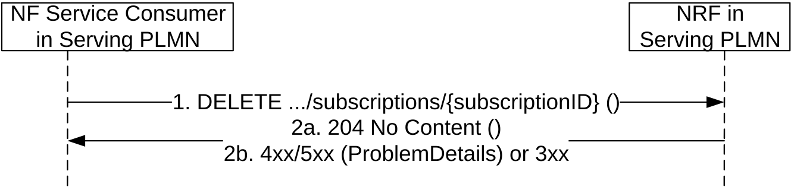
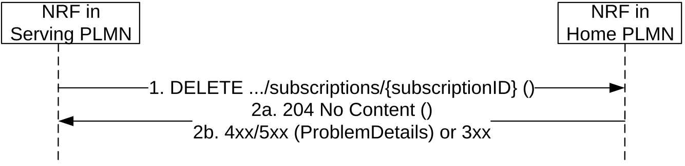

# 5.2.2.7 NFStatusUnSubscribe

## 5.2.2.7.1 General

This service operation removes an existing subscription to notifications.

If the "Shared-Data-retrieval" feature is supported, this service operation may also be used to remove and existing subscription to the shared data changes in the NRF.

## 5.2.2.7.2 Subscription removal in the same PLMN

It is executed by deleting a given resource identified by a "subscriptionID". The operation is invoked by issuing a DELETE request on the URI representing the specific subscription received in the Location header field of the "201 Created" response received during a successful subscription (see clause 5.2.2.5).

Figure 5.2.2.7.2-1: Subscription removal in the same PLMN

1\. The NF Service Consumer shall send a DELETE request to the resource URI representing the individual subscription. The request body shall be empty.

2a. On success, "204 No Content" shall be returned. The response body shall be empty.

2b. On failure or redirection:

\- If the subscription, identified by the "subscriptionID", is not found in the list of active subscriptions in the NRF's database, the NRF shall return "404 Not Found" status code with the ProblemDetails IE providing details of the error.

\- In the case of redirection, the NRF shall return 3xx status code, which shall contain a Location header with an URI pointing to the endpoint of another NRF service instance.

## 5.2.2.7.3 Subscription removal in a different PLMN

The subscription removal in a different PLMN is done by deleting a resource identified by a "subscriptionID", in the NRF of the Home PLMN.

For that, step 1 in clause 5.2.2.7.2 is executed (send a DELETE request to the NRF in the Serving PLMN); this request shall include the identity of the PLMN or SNPN of the home NRF (MCC/MNC/NID values) as component values of the subscriptionID (see clause 5.2.2.5.3).

Then, steps 1-2 in Figure 5.2.2.7.3-1 are executed, between the NRF in the Serving PLMN and the NRF in the Home PLMN. In this step, the subscriptionID sent to the NRF in the Home PLMN shall not contain the identity of the PLMN (i.e., it shall be the same subscriptionID value as originally generated by the NRF in the Home PLMN). The NRF in the Home PLMN returns a status code with the result of the operation.

If the subscription was created in a different NRF in the HPLMN than the NRF in the HPLMN that receives the subscription delete request, the latter shall forward the request received from the NRF in the serving PLMN towards the NRF in the HPLMN holding the subscription, using the information included in the subscriptionID (see clause 5.2.2.5.3). The subscriptionID value in the request forwarded to the NRF in the HPLMN holding the subscription shall contain the same value as originally generated by the latter.

Finally, step 2 in clause 5.2.2.7.2 is executed; a status code is returned from the NRF in serving PLMN to the NF Service Consumer in Serving PLMN in accordance to the result received from NRF in Home PLMN.

Figure 5.2.2.7.3-1: Subscription removal in a different PLMN

1\. The NF Service Consumer shall send a DELETE request to the resource URI representing the individual subscription. The request body shall be empty.

2a. On success, "204 No Content" shall be returned. The response body shall be empty.

2b. On failure or redirection:

\- If the subscription, identified by the "subscriptionID", is not found in the list of active subscriptions in the NRF's database, the NRF shall return "404 Not Found" status code with the ProblemDetails IE providing details of the error.

\- In the case of redirection, the NRF shall return 3xx status code, which shall contain a Location header with an URI pointing to the endpoint of another NRF service instance.
