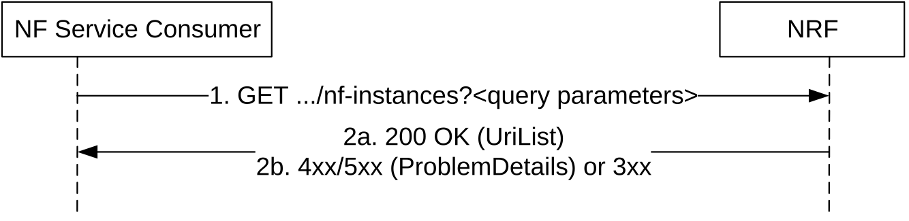

# 5.2.2.8 NFListRetrieval

## 5.2.2.8.1 General

This service operation allows the retrieval of a list of NF Instances that are currently registered in NRF. The operation may apply to the whole set of registered NF instances or only to a subset of the NF instances, based on a given NF type and/or maximum number of NF instances to be returned.

Figure 5.2.2.8.1-1: NF instance list retrieval

1\. The NF Service Consumer shall send an HTTP GET request to the resource URI "nf-instances" collection resource. The optional input filter criteria (e.g. "nf-type") and pagination parameters for the retrieval request may be included in query parameters.

2a. On success, "200 OK" shall be returned. The response body shall contain the URI (conforming to the resource URI structure as described in clause 5.2.2.9.1) of each registered NF in the NRF that satisfy the retrieval filter criteria (e.g., all NF instances of the same NF type), or an empty list if there are no NFs to return in the query result (e.g., because there are no registered NFs in the NRF, or because there are no matching NFs of the type specified in the "nf-type" query parameter, currently registered in the NRF). The total count of items satisfying the filter criteria (e.g. "nf-type") should be returned in the response.

2b. On failure or redirection:

\- If the NF Service Consumer is not allowed to retrieve the registered NF instances, the NRF shall return "403 Forbidden" status code.

\- If the NF Instance list retrieval fails at the NRF due to errors in the input data in the URI query parameters, the NRF shall return "400 Bad Request" status code with the ProblemDetails IE providing details of the error.

\- If the discovery request fails at the NRF due to NRF internal errors, the NRF shall return "500 Internal Server Error" status code with the ProblemDetails IE providing details of the error.

\- In the case of redirection, the NRF shall return 3xx status code, which shall contain a Location header with an URI pointing to the endpoint of another NRF service instance.
