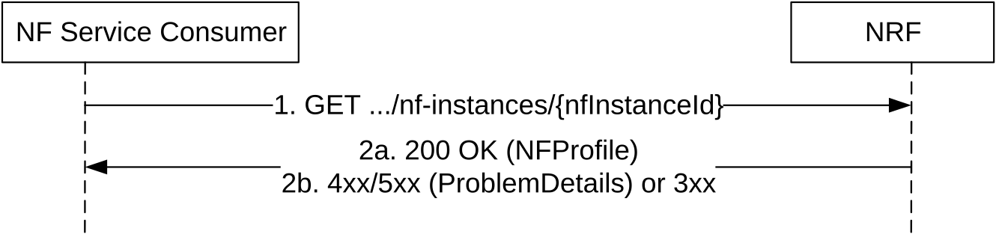

# 5.2.2.9 NFProfileRetrieval

## 5.2.2.9.1 General

This service operation allows the retrieval of the NF profile of a given NF instance currently registered in NRF.

Figure 5.2.2.9.1-1: NF profile retrieval

1\. The NF Service Consumer shall send an HTTP GET request to the resource URI "nf-instances/{nfInstanceId}".

2a. On success, "200 OK" shall be returned. The response body shall contain the NF profile of the NF instance identified in the request.

2b. On failure or redirection:

\- If the NF Service Consumer is not allowed to retrieve the NF profile of this specific registered NF instance, the NRF shall return "403 Forbidden" status code.

\- If the NF Profile retrieval fails at the NRF due to NRF internal errors, the NRF shall return "500 Internal Server Error" status code with the ProblemDetails IE providing details of the error.

\- In the case of redirection, the NRF shall return 3xx status code, which shall contain a Location header with an URI pointing to the endpoint of another NRF service instance.
