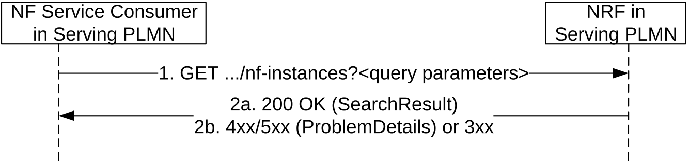
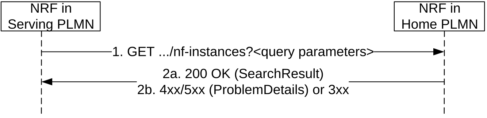
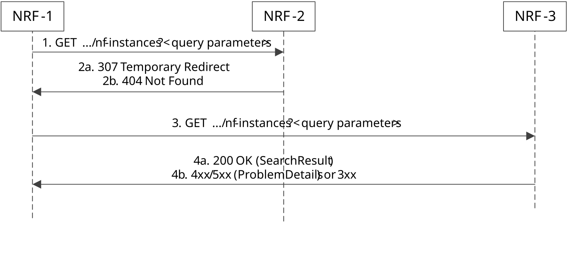
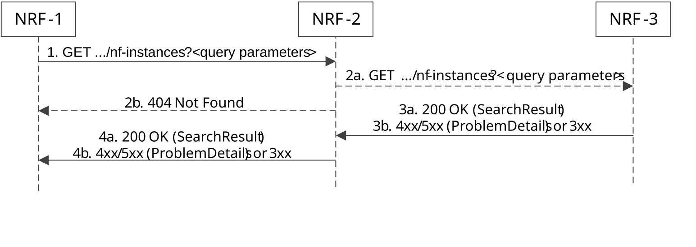
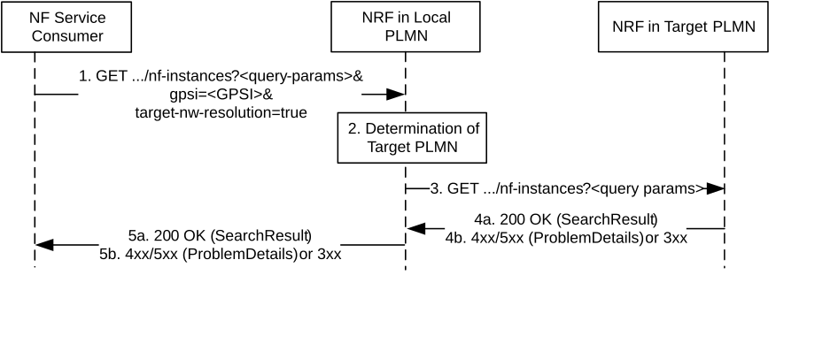

# 5.3.2.2 NFDiscover

## 5.3.2.2.1 General

This service operation discovers the set of NF Instances (and their associated NF Service Instances), represented by their NF Profile, that are currently registered in NRF and satisfy a number of input query parameters.

Before a service consumer invokes this service operation, it shall consider if it is possible to reuse the results from a previous searching (service discovery).

The service consumer should reuse the previous result if input query parameters in the new service discovery request are the same as used for the previous search and the validity period of the result is not expired.

The service consumer may consider reusing the previous result if the attributes as required for the new query consist of the query attributes from the previous query and additional query attributes. In such case, when the results of a previous query are reused, the service consumer need consider that the previous results will possibly include NF profiles that the new query would not; hence, the service consumer has to complete the filtering itself against the additional filter attributes in the new internal query.

Otherwise, if the query parameters in the new service discovery are different and don't consist of the previous query attributes and additional ones (i.e. the new query parameters, in general, don't have any relationship with those of the previous search), the reuse of cached profiles may still be done.

In these two last cases (i.e. where the query parameters of the new query are not identical to the previous query), re-using data from cached profiles may possibly yield to different results than if a new discovery was performed, and thus may be subject to operator's policy.

NOTE: Certain types of query attributes affect the contents of the NF Profiles returned in the discovery responses (e.g., "preferred-location" typically affects the setting of the "priority" attribute inside the NF Profiles returned by NRF); reusing the results from a previous query, when the new query involves any of such parameters, may not be feasible.

If an SCP receives complete NF profiles (including, e.g. the authorization attributes) from the NRF (see clauses 5.3.2.2.2 and 5.2.2.5.2), the SCP may use these cached profiles to serve new service requests received from NFs with different requester's information (e.g. different NF type, domain, S-NSSAI), but if it does so, the SCP shall check the authorization parameters of the complete profiles to ascertain that the requesting NFs are authorized to access the related NF services.

The NF Service Consumer should avoid to send multiple NF discovery requests with the same query parameters to NRF simultaneously.

## 5.3.2.2.2 Service Discovery in the same PLMN

This service operation is executed by querying the "nf-instances" resource. The request is sent to an NRF in the same PLMN of the NF Service Consumer.

Figure 5.3.2.2.2-1: Service Discovery Request in the same PLMN

1\. The NF Service Consumer shall send an HTTP GET request to the resource URI "nf-instances" collection resource. The input filter criteria for the discovery request shall be included in query parameters.  
  
An SCP may request to discover the complete profile of NF instances (including, e.g. the authorization attributes) matching the query parameters. Upon receiving such a request, the NRF shall verify that the requesting entity is authorized to discover the complete profile of NF instances, based on local policies or the receipt of an access token granting such permission. If the requesting entity is not authorized to do so, the NRF shall reject the request or handle it as a service discovery request without access to the complete profile.

When certain query parameters in the discovery request are not supported by the NRF, the NRF shall ignore the unsupported query parameters and continue processing the request with the rest of the query parameters.

2a. On success, "200 OK" shall be returned. The response body shall contain a validity period, during which the search result can be cached by the NF Service Consumer, and an array of NF Profile objects, and/or a map of NFInstanceInfo objects of NF instances (if the NF service consumer indicated support of the Enh-NF-Discovery feature in the request) that satisfy the search filter criteria (e.g., all NF Instances offering a certain NF Service name in REGISTERED status, or empty array in case search filter criteria do not match a NF Instance in REGISTERED status). In the latter case, the response may include the noProfileMatchInfo attribute to provide the specific reason for not finding any NF instance that can match the search filter criteria.

NOTE: In indirect communication with delegated discovery scenarios the SCPs can cache the noProfileMatchInfo to optimize subsequent NF discovery procedures.

If the NRF has ignored certain unsupported query parameter(s) when processing the discovery request, the NRF may additionally include the indication of ignored unsupported query parameters in the search result. The NF consumer may use the indication to identify whether the NF candidates in the search result are all usable for the service logic, i.e. all query parameter related to the key service logic are not ignored.

2b. On failure or redirection:

\- If the NF Service Consumer is not allowed to discover the NF services for the requested NF type provided in the query parameters, the NRF shall return "403 Forbidden" response.

\- If the discovery request fails at the NRF due to errors in the input data in the URI query parameters, the NRF shall return "400 Bad Request" status code with the ProblemDetails IE providing details of the error. E.g., the NRF may verify that the input attributes (e.g. requester-nf-type) in the discovery request match with the corresponding ones in, e.g. the public key certificate of the NF service consumer received during TLS initial handshake procedure (see 3GPP TS 33.310 \[50\]). If the verification is unsuccessful, the request shall be rejected with "400 Bad Request" status code and the "cause" attribute set to "INVALID_CLIENT".

\- If the discovery request fails at the NRF due to NRF internal errors, the NRF shall return "500 Internal Server Error" status code with the ProblemDetails IE providing details of the error.

\- In the case of redirection, the NRF shall return 3xx status code, which shall contain a Location header with an URI pointing to the endpoint of another NRF service instance.

The NF Profile objects returned in a successful result shall contain generic data of each NF Instance, applicable to any NF type, and it may also contain NF-specific data, for those NF Instances belonging to a specific type (e.g., the attribute "udrInfo" is typically present in the NF Profile when the type of the NF Instance takes the value "UDR"). In addition, the attribute "customInfo", may be present in the NF Profile for those NF Instances with custom NF types.

For those NF Instances, the "customInfo" attribute shall be returned by NRF, if available, as part of the NF Profiles returned in the discovery response.

The NRF shall also include, in the returned NF Profile objects, the Vendor-Specific attributes (see 3GPP TS 29.500 \[4\], clause 6.6.3) that may have been provided by the registered NF Instances.

If the response includes a map of NFInstanceInfo objects of NF instances, the NF Service Consumer may retrieve the NF profiles by issuing service discovery requests with the target-nf-instance-id parameter identifying the target NF Instance ID, or with the target-nf-instance-id-list parameter identifying a list of target NF Instance IDs held by the same NRF; the service discovery request shall also include the nrf-disc-uri parameter set to the API URI of the Nnrf_NFDiscovery service of the NRF holding the NF profile(s), if the nrfDiscApiUri attribute was received in the NFInstanceInfo object and if the service discovery request is addressed to a different NRF than the NRF holding the NF profile(s).

## 5.3.2.2.3 Service Discovery in a different PLMN

The service discovery in a different PLMN is done by querying the "nf-instances" resource in the NRF of the Home PLMN.

For that, step 1 in clause 5.3.2.2.2 is executed (send a GET request to the NRF in the Serving PLMN); this request shall include the identity of the PLMN of the home NRF in a query parameter of the URI.

If the NRF in Serving PLMN knows that Oauth2-based authorization is required for accessing the NF Discovery service of the NRF in Home PLMN, e.g. by learning this during an earlier Bootstrapping procedure or local configuration, and if the request received at the NRF in Serving PLMN does not include an access token, the NRF in Serving PLMN may reject the request with a 401 Unauthorized as specified in clause 6.7.3 of 3GPP TS 29.500 \[4\].

Then, steps 1-2 in Figure 5.3.2.2.3-1 are executed, between the NRF in the Serving PLMN and the NRF in the Home PLMN. In this step, the presence of the PLMN ID of the Home NRF in the query parameter of the URI is not required. The NRF in the Home PLMN returns a status code with the result of the operation. The NRF in the Serving PLMN shall be configured with:

\- a telescopic FQDN (see 3GPP TS 23.003 \[12\] and 3GPP TS 29.500 \[4\]) of the NRF in the Home PLMN, if TLS protection between the NRF and the SEPP in the serving PLMN relies on using telescopic FQDN; or

NOTE: This is required for the NRF in the serving PLMN to route the NF discovery request to the NRF in the HPLMN through a SEPP in the serving PLMN and the SEPP to terminate the TLS connection with a wildcard certificate.

\- with the SEPP FQDN (or the FQDN of the SCP if the communication between the NRF and the SEPP goes through an SCP), if TLS protection between the NRF and the SEPP in the serving PLMN relies on using the 3gpp-Sbi-Target-apiRoot header.

See clause 6.1.4.3 of 3GPP TS 29.500 \[4\].

Finally, step 2 in clause 5.3.2.2.2 is executed; a status code is returned to the NF Service Consumer in Serving PLMN in accordance to the result received from NRF in Home PLMN.

Figure 5.3.2.2.3-1: Service Discovery in a different PLMN

Steps 1 and 2 are similar to steps 1 and 2 in Figure 5.3.2.2.2-1, where the originator of the service invocation is the NRF in Serving PLMN, and the recipient of the service invocation is the NRF in the Home PLMN.

As most NF Service Consumers in Serving PLMN do not need the entire data in the NF profile of the NF producer, the NRF in the home PLMN, based on operator policies, may simplify the NF discovery response by not including the entire data which is not directly relevant to the NF discovery request (e.g. returning a subset of supiRanges, or not inlcuding taiList).

If the NRF in the home PLMN has ignored certain unsupported query parameter(s) when processing the discovery request, the NRF may additionally include the indication of ignored unsupported query parameters in the search result. If the indication of ignored unsupported query parameters is supported by the NRF in the serving PLMN, it should forward the received indication of ignored unsupported query parameters to the NF service consumer.

## 5.3.2.2.4 Service Discovery with intermediate redirecting NRF

When multiple NRFs are deployed in one PLMN, one NRF may query the "nf-instances" resource in a different NRF so as to fulfil the service discovery request from a NF service consumer. The query between these two NRFs is redirected by a third NRF.

Figure 5.3.2.2.4-1: Service Discovery with intermediate redirecting NRF

1\. NRF-1 receives a service discovery request but does not have the information to fulfil the request. Then NRF-1 sends the service discovery request to a pre-configured NRF-2.

2a. Upon receiving a service discovery request, based on the information contained in the service discovery request (e.g. the "supi" query parameter in the URI) and locally stored information NRF-2 shall identify the next hop NRF (see clause 5.2.2.2.3), and redirect the service discovery request by returning HTTP 307 Temporary Redirect response. The locally stored information in NRF-2 may:

a\) be preconfigured; or

b\) registered by other NRFs (see clause 5.2.2.2.3).

The 307 Temporary Redirect response shall contain a Location header field, the host part of the URI in the Location header field represents NRF-3.

2b. if NRF-2 does not have enough information to redirect the service discovery request, then it responds with 404 Not Found, and the rest of the steps are omitted.

3\. Upon receiving 307 Temporary Redirect response, NRF-1 sends the service discovery request to NRF-3 by using the URI contained in the Location header field of the 307 Temporary Redirect response.

4a. Upon success, NRF-3 returns the search result.

4b. On failure or redirection:

\- If the NF Service Consumer is not allowed to discover the NF services for the requested NF type provided in the query parameters, the NRF shall return "403 Forbidden" response.

\- If the discovery request fails at the NRF due to errors in the input data in the URI query parameters, the NRF shall return "400 Bad Request" status code with the ProblemDetails IE providing details of the error.

\- If the discovery request fails at the NRF due to NRF internal errors, the NRF shall return "500 Internal Server Error" status code with the ProblemDetails IE providing details of the error.

\- In the case of redirection, the NRF shall return 3xx status code, which shall contain a Location header with an URI pointing to the endpoint of another NRF service instance.

## 5.3.2.2.5 Service Discovery with intermediate forwarding NRF

When multiple NRFs are deployed in one PLMN, one NRF may query the "nf-instances" resource in a different NRF so as to fulfil the service discovery request from a NF service consumer. The query between these two NRFs is forwarded by a third NRF.

Figure 5.3.2.2.5-1: Service Discovery with intermediate forwarding NRF

1\. NRF-1 receives a service discovery request and sends the service discovery request to a pre-configured NRF-2. This may for example include cases where NRF-1 does not have sufficient information as determined by the operator policy to fulfill the request locally.

2a. Upon receiving a service discovery request, based on the information contained in the service discovery request (e.g. the "supi" query parameter in the URI) and locally stored information, NRF-2 shall identify the next hop NRF (see clause 5.2.2.2.3), and forward the service discovery request to that NRF (i.e. NRF-3 in this example) similarly to steps 1 and 2 in Figure 5.3.2.2.2-1 where the originator of the service invocation is NRF-2 and the recipient of the service invocation is NRF-3. The locally stored information in NRF-2 may:

a\) be preconfigured; or

b\) registered by other NRFs (see clause 5.2.2.2.3).

2b. if NRF-2 does not have enough information to forward the service discovery request, then it responds with 404 Not Found, and the rest of the steps are omitted.

3a. Upon success, NRF-3 returns the search result.

3b. On failure or redirection:

\- If the NF Service Consumer is not allowed to discover the NF services for the requested NF type provided in the query parameters, the NRF shall return "403 Forbidden" response.

\- If the discovery request fails at the NRF due to errors in the input data in the URI query parameters, the NRF shall return "400 Bad Request" status code with the ProblemDetails IE providing details of the error.

\- If the discovery request fails at the NRF due to NRF internal errors, the NRF shall return "500 Internal Server Error" status code with the ProblemDetails IE providing details of the error.

\- In the case of redirection, the NRF shall return 3xx status code, which shall contain a Location header with an URI pointing to the endpoint of another NRF service instance.

4a. NRF-2 forwards the success response to NRF-1.

4b. On failure or redirection:

\- NRF-2 forwards the error response to NRF-1.

\- In the case of redirection, the NRF shall return 3xx status code, which shall contain a Location header with an URI pointing to the endpoint of another NRF service instance.

NOTE: It is not assumed that there can only be two NRF hierarchies, i.e. the NRF-3 can go on to forward the service discovery request to another NRF.

## 5.3.2.2.6 Service Discovery with resolution of the target PLMN

This service discovery is done by querying the "nf-instances" resource in the NRF of the target PLMN, similar to the "Service Discovery in a different PLMN", as described in clause 5.3.2.2.3.

The main difference compared with clause 5.3.2.2.3 is that the identity of the target PLMN is not explicitly provided by the NF Service Consumer.

NOTE: This can happen, e.g., when the identity of the UE involved in the service discovery is not based on IMSI, but on GPSI (MSISDN) and, therefore, the MNC/MCC of the target PLMN cannot be derived from the UE identity. It should also be noted that, in these scenarios, the MSISDN may be subject to Mobile Number Portability.

Figure 5.3.2.2.6-1: Service Discovery with resolution of the target PLMN

1\. The NF Service Consumer (e.g. an SMS-GMSC) sends a GET request to the NRF in the Local PLMN (i.e., the same PLMN where the NF Service Consumer is located); given that the identity of the target PLMN is not known to the NF Service Consumer, this request shall include as query parameters the identity of the target UE for which NF Service Producers need to be discovered (i.e., the "gpsi" query parameter) and also a parameter indicating that the resolution of the target PLMN must be performed (i.e., "target-nw-resolution" set to true).

2\. The NRF in the Local PLMN determines the identity of the Target PLMN, as described in 3GPP TS 23.540 \[48\], and determines the URI of the Nnrf_NFDiscovery service of the NRF in the Target PLMN.

3\. This step is similar to step 1 in Figure 5.3.2.2.3-1, for "Service Discovery in a different PLMN", with the only difference that the "Serving/Home" PLMNs in clause 5.3.2.2.3 are replaced by "Local/Target" PLMNs in the present clause.

4\. Steps 4a, 4b are similar to steps 2a, 2b in Figure 5.3.2.2.3-1.

5\. Steps 5a, 5b are similar to steps 2a, 2b in Figure 5.3.2.2.2-1.
