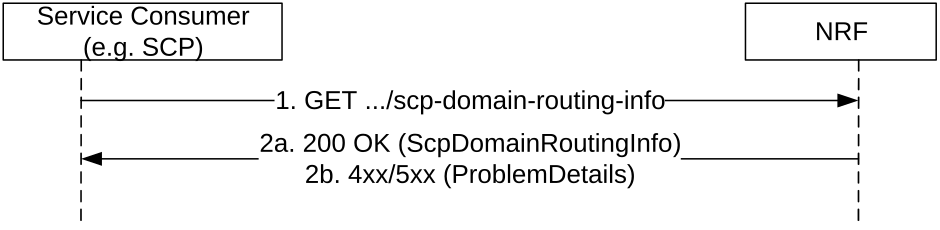
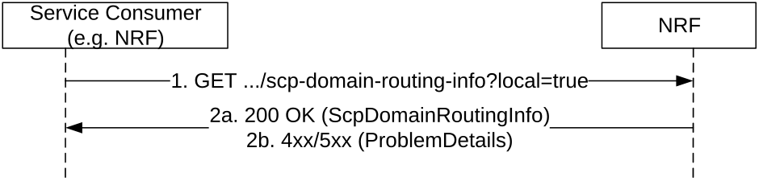

# 5.3.2.3 SCPDomainRoutingInfoGet

This service operation retrieves the SCP domain routing information, by sending a HTTP GET request to the resource URI representing the "SCP Domain Routing Information" resource.

Figure 5.3.2.3-1: SCP Domain Routing Information Get

1\. The Service Consumer (i.e. SCP) shall send an HTTP GET request to the resource URI "scp-domain-routing-info" document resource.

2a. On success, "200 OK" shall be returned with SCP Domain Routing Information in response body. SCP Domain Routing Information with empty map indicates that no SCP domain is registered in the network.

2b. On failure, the NRF shall return "4xx/5xx" response and the response body may contain a ProblemDetails object describing the detailed information of the failure.

When SCPs are registered to multiple NRFs in the network, any NRF providing SCP domain routing information for the whole network shall retrieve the local SCP domain routing information in other NRF(s) and perform aggregation. This service operation retrieves the local SCP domain routing information, e.g. by another NRF, by sending a HTTP GET request to the resource URI representing the "SCP Domain Routing Information" resource with "local" query parameter set to value "true".

Figure 5.3.2.3-2: Local SCP Domain Routing Information Get

1\. The Service Consumer (i.e. SCP) shall send an HTTP GET request to the resource URI "scp-domain-routing-info" document resource with "local" query parameter set to value "true".

2a. On success, "200 OK" shall be returned with local SCP Domain Routing Information in response body. SCP Domain Routing Information with empty map indicates that no SCP domain is registered in the producer NRF.

2b. On failure, the NRF shall return "4xx/5xx" response and the response body may contain a ProblemDetails object describing the detailed information of the failure.

NOTE: In deployments where all SCPs in the network can be managed by the same NRF, i.e. all SCPs register to and discover each other with the same NRF, the NRF managing the SCPs can generate the SCP Domain Routing Information accordingly without involvement of other NRFs.
