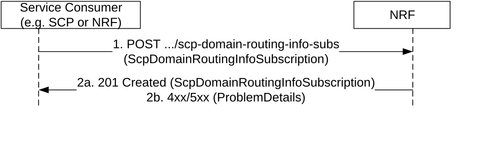

# 5.3.2.4 SCPDomainRoutingInfoSubscribe

This service operation is used to create a subscription to get notification when SCP Domain Routing Information is changed, e.g. due to a SCP has registered or updated or deregistered in the network, or to get notification when local SCP Domain Routing Information is changed, e.g. due to a SCP has registered or updated or deregistered in the producer NRF. The operation is invoked by issuing a POST request to the resource URI representing the "SCP Domain Routing Info Subscriptions" collection resource.

Figure 5.3.2.4-1: Subscription to SCP Domain Routing Information change

> 1\. The Service Consumer (i.e. SCP) shall send a POST request to the URI representing the "SCP Domain Routing Info Subscriptions" collection resource. The request body shall contain the callback URI on the Service Consumer to receive the notifications.
>
> To create a subscription for changes of local SCP Domain Routing Information, the request body shall contain the "localInd" with value "true".

2a. On success, "201 Created" shall be returned with "Location" header containing the resource URI to the newly created subscription resource. The response shall contain the data related to the created subscription, including the validity time, as determined by the NRF, after which the subscription becomes invalid. Once the subscription expires, if the Service Consumer wants to keep receiving notifications, it shall create a new subscription in the NRF.

2b. On failure, the NRF shall return "4xx/5xx" response and the response body may contain a ProblemDetails object describing the detailed information of the failure.
