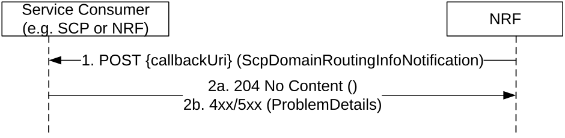

# 5.3.2.5 SCPDomainRoutingInfoNotify

This service operation notifies each subscriber for (local) SCP Domain Routing Information change. The notification is sent to a callback URI that Service Consumer provided during the subscription (see SCPDomainRoutingInfoSubscribe operation in clause 5.3.2.4). The operation is invoked by sending a POST request to the callback URI.

Figure 5.3.2.5-1: Notification of SCP Domain Routing Info Change

1\. The NRF shall send a POST request to the callback URI. The request body shall contain the updated SCP Domain Routing Information. The request body shall contain the "localInd" IE with value "true" if the notification is for a change of local SCP Domain Routing Information. SCP Domain Routing Information with empty map indicates that no SCP domain is registered in the network (or in the producer NRF for local SCP Domain Routing Information) after the change.

2a. On success, "204 No content" shall be returned by the NF Service Consumer.

2b. On failure, the NRF shall return "4xx/5xx" response and the response body may contain a ProblemDetails object describing the detailed information of the failure.
