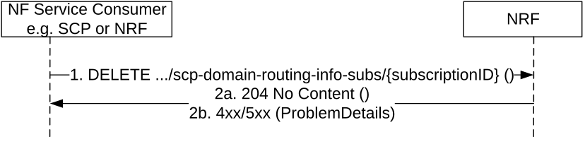

# 5.3.2.6 SCPDomainRoutingInfoUnSubscribe

This service operation removes an existing subscription to SCP (local) Domain Information Change. The operation is invoked by issuing a DELETE request on the resource URI representing the "Individual SCP Domain Routing Info Subscription", which was received in the Location header field of the "201 Created" response received during a successful subscription (see clause 5.3.2.4).

Figure 5.3.2.6-1: Unsubscribe to SCP Domain Routing Information Change

1\. The Service Consumer (e.g. SCP or NRF) shall send a DELETE request to the resource URI representing the individual subscription. The request body shall be empty.

2a. On success, "204 No Content" shall be returned. The response body shall be empty.

2b. On failure, the NRF shall return "4xx/5xx" response and the response body may contain a ProblemDetails object describing the detailed information of the failure.
