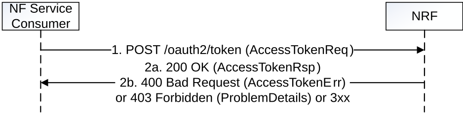
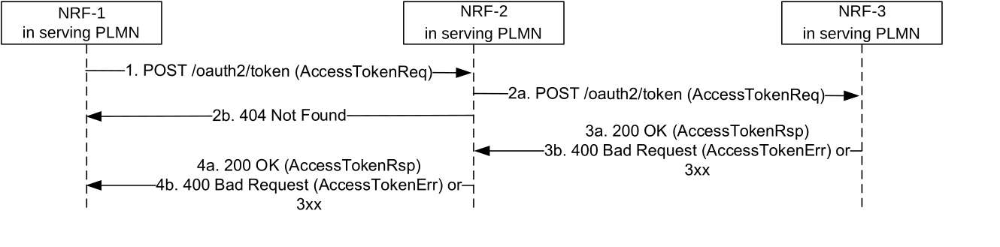
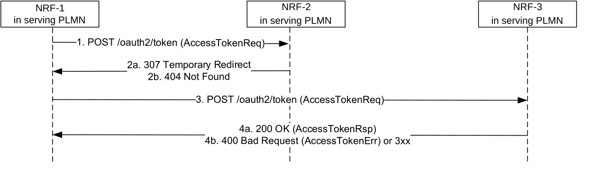

# 5.4 Nnrf_AccessToken Service

## 5.4.1 Service Description

The NRF offers an Nnrf_AccessToken service (used for OAuth2 authorization, see IETF RFC 6749 \[16\]), following the "Client Credentials" authorization grant, as specified in 3GPP TS 33.501 \[15\]. It exposes a "Token Endpoint" where the Access Token Request service can be requested by NF Service Consumers.

## 5.4.2 Service Operations

### 5.4.2.1 Introduction

The services operations defined for the Nnrf_AccessToken service are as follows:

\- Access Token Request (i.e. Nnrf_AccessToken_Get)

### 5.4.2.2 Get (Access Token Request)

#### 5.4.2.2.1 General

This service operation is used by an NF Service Consumer to request an OAuth 2.0 access token from the authorization server (NRF).

Figure 5.4.2.2.1-1: Access Token Request

1\. The NF Service Consumer shall send a POST request to the "Token Endpoint", as described in IETF RFC 6749 \[16\], clause 3.2. The "Token Endpoint" URI shall be:

{nrfApiRoot}/oauth2/token

>   
> where {nrfApiRoot} represents the concatenation of the "scheme" and "authority" components of the NRF, as defined in IETF RFC 3986 \[17\].  
>   
> The OAuth 2.0 Access Token Request included in the body of the HTTP POST request shall contain:

\- An OAuth 2.0 grant type set to "client_credentials";

\- The "scope" parameter indicating the names of the NF Services that the NF Service Consumer is trying to access (i.e., the expected NF service names);

\- The NF Instance Id of the the NF Service Consumer requesting the OAuth 2.0 access token;

\- NF type of the NF Service Consumer, if this is an access token request not for a specific NF Service Producer;

\- NF type of the expected NF Service Producer, if this is an access token request not for a specific NF Service Producer;

\- The NF Instance Id of the expected NF Service Producer, if this is an access token request for a specific NF Service Producer;

\- Home and Serving PLMN IDs, if this is an access token request for use in roaming scenarios (see clause 13.4.1.2 of 3GPP TS 33.501 \[15\]).

> The request may additionally contain:

\- the NF Set ID of the expected NF service producer instances, if this is an access token request not for a specific NF Service Producer.

\- the NF Instance Id of the source NF (the NF that requests data), if this is an access token request from the DCCF as NF Service Consumer request data from NF Service Producers on behalf of the source NF.

>   
> The NF Service Consumer shall use TLS for mutual authentication with the NRF in order to access this endpoint, if the PLMN uses protection at the transport layer. Otherwise, the NF Service Consumer shall use NDS or physical security to mutually authenticate with the NRF as specified in clause 13.3.1 of 3GPP TS 33.501 \[15\].
>
> The NRF may verify that the input attributes (e.g. NF type) in the access token request match with the corresponding ones in the public key certificate of the NF service consumer. If the verification is successful, other authorization check shall be performed, otherwise, the request shall be rejected immediately with "400 Bad Request" status code, and "error" attribute set to "invalid_client".

2a. On success, "200 OK" shall be returned, the content of the POST response shall contain the requested access token and the token type set to value "Bearer". The response in addition:

\- should contain the expiration time for the token as indicated in IETF RFC 6749 \[16\] unless the expiration time of the token is made available by other means (e.g. deployment-specific documentation); and

\- shall contain the NF service name(s) of the requested NF service producer(s), if it is different from the scope included in the access token request (see IETF RFC 6749 \[16\]).

> The access token shall be a JSON Web Token (JWT) as specified in IETF RFC 7519 \[25\]. The access token returned by the NRF shall include the claims encoded as a JSON object as specified in clause 6.3.5.2.4 and then digitally signed using JWS as specified in IETF RFC 7515 \[24\] and in clause 13.4.1 of 3GPP TS 33.501 \[15\].

The digitally signed access token shall be converted to the JWS Compact Serialization encoding as a string as specified in clause 7.1 of IETF RFC 7515 \[24\].

2b. On failure or redirection:

\- If the access token request fails at the NRF, the NRF shall return "400 Bad Request" status code, including in the response content a JSON object that provides details about the specific error that occurred.

\- In the case of redirection, the NRF shall return 3xx status code, which shall contain a Location header with an URI pointing to the endpoint of another NRF service instance.

\- If based on operator policy the required information used to authorize the access token request, e.g. requesterSnssaiList, is not included, the NRF may return "403 Forbidden" status code with the ProblemDetails IE indicating that the missing information shall be provided.

#### 5.4.2.2.2 Access Token request with intermediate forwarding NRF

When multiple NRFs are deployed in one PLMN, one NRF may request an OAuth2 access token to a different NRF so as to fulfil the Access Token Request from a NF service consumer. The acces token request between these two NRFs is forwarded by a third NRF in this case.

For this, step 1 in clause 5.4.2.2.1 is executed (send a POST request to NRF-1 in the Serving PLMN); this request shall include the OAuth 2.0 Access Token Request in the request body.

Then, steps 1-4 in Figure 5.4.2.2.2-1 hereinafter are executed between NRF-1in Serving PLMN, NRF-2 in Serving PLMN and NRF-3 in Serving PLMN.

Finally, step 2 in clause 5.4.2.2.1 is executed, the Access Token Response containing the requested access token, the token type and additional attributes shall be sent to the NF Service Consumer.

Figure 5.4.2.2.2-1: Access Token Request with intermediate forwarding NRF

1\. NRF-1 receives an Access token request but does not have the information to fulfil the request. Then NRF-1 sends the Access token request to a pre-configured NRF-2.

2a. Upon reception of the Access token request and based on the information contained in the Acces token request and locally stored information, NRF-2 shall identify the next hop NRF (see clause 5.2.2.2.3), and forward the Access token request to that NRF (i.e. NRF-3 in this example) by replacing the originator of the service invocation with NRF-2, and the recipient of the service invocation with NRF-3. The locally stored information in NRF-2 may:

a\) be preconfigured; or

b\) registered by other NRFs (see clause 5.2.2.2.3).

2b. if NRF-2 does not have enough information to forward the Access token request, then it responds with 404 Not Found, and the rest of the steps are omitted.

3a. Upon success, NRF-3 shall return a "200 OK" status code, including in the response content the Access token response containing the requested access token, the token type and additional attributes.

3b. Upon failure, NRF-3 shall return "400 Bad Request" status code, including in the response content a JSON object that provides details about the specific error(s) that occurred.

4a. NRF-2 forwards the success response to NRF-1.

4b. On failure or redirection:

\- NRF-2 forwards the error response to NRF-2.

\- In the case of redirection, the NRF shall return 3xx status code, which shall contain a Location header with an URI pointing to the endpoint of another NRF service instance.

NOTE: It is not assumed that there can only be two NRF hierarchies, i.e. the NRF-3 can go on and forward the Access token request request to another NRF.

#### 5.4.2.2.3 Access Token request with intermediate redirecting NRF

When multiple NRFs are deployed in one PLMN, one NRF may request an OAuth2 access token to a different NRF so as to fulfil the Access Token Request from a NF service consumer. The acces token request between these two NRFs is redirected by a third NRF in this case.

For this, step 1 in clause 5.4.2.2.1 is executed (send a POST request to NRF-1 in the Serving PLMN); this request shall include the OAuth 2.0 Access Token Request in the request body

Then, steps 1-4 in Figure 5.4.2.2.3-1 hereinafter are executed between NRF-1in Serving PLMN, NRF-2 in Serving PLMN and NRF-3 in Serving PLMN.

Finally, step 2 in clause 5.4.2.2.1 is executed, the Access token response containing the requested access token, the token type and additional attributes shall be sent to the NF Service Consumer.

Figure 5.4.2.2.3-1: Access Token Request with intermediate redirecting NRF

1\. NRF-1 receives an Access token request but does not have the information to fulfil the request. Then NRF-1 sends the Access token request to a pre-configured NRF-2.

2a. Upon reception of the Access token request and based on the information contained in the Access token request and locally stored information, NRF-2 shall identify the next hop NRF (see clause 5.2.2.2.3), and redirect the Access token request by returning HTTP "307 Temporary Redirect" response. The locally stored information in NRF-2 may:

a\) be preconfigured; or

b\) registered by other NRFs (see clause 5.2.2.2.3).

The "307 Temporary Redirect" response shall contain a Location header field, the host part of the URI in the Location header field represents NRF-3.

2b. if NRF-2 does not have enough information to forward the Access token request, then it responds with "404 Not Found", and the rest of the steps are omitted.

3\. Upon reception of "307 Temporary Redirect" response, NRF-1 sends the Acces token request to NRF-3 by using the URI contained in the Location header field of the "307 Temporary Redirect" response.

4a. Upon success, NRF-3shall return a "200 OK" status code including in the response content the Access token response containing the requested access token, the token type and additional attributes.

4b. On failure or redirection:

\- Upon failure, the NRF-3 shall return "400 Bad Request" status code, including in the response content a JSON object that provides details about the specific error(s) that occurred.

\- In the case of redirection, the NRF shall return 3xx status code, which shall contain a Location header with an URI pointing to the endpoint of another NRF service instance.
