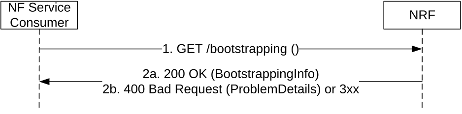

# 5.5 Nnrf_Bootstrapping Service

## 5.5.1 Service Description

The NRF offers a Nnrf_Bootstrapping service to let NF Service Consumers of the NRF know about the services endpoints it supports, the NRF Instance ID and NRF Set ID if the NRF is part of an NRF set, by using a version-independent URI endpoint that does not need to be discovered by using a Discovery service.

This service shall be used in inter-PLMN scenarios where the NRF in a PLMN-A needs to invoke services from an NRF in PLMN-B, when there is no pre-configured information indicating the version of the services deployed in PLMN-B.

This service may also be used in intra-PLMN scenarios, to avoid configuring statically in the different NFs information about the service versions deployed in the NRF to be used by those NFs.

## 5.5.2 Service Operations

### 5.5.2.1 Introduction

The services operations defined for the Nnrf_Bootstrapping service are as follows:

\- Nnrf_Bootstrapping_Get

### 5.5.2.2 Get

#### 5.5.2.2.1 General

This service operation is used by an NF Service Consumer to request bootstrapping information from the NRF.

Figure 5.5.2.2.1-1: Bootstrapping Request

1\. The NF Service Consumer shall send a GET request to the "Bootstrapping Endpoint".

The "Bootstrapping Endpoint" URI shall be constructed as:

{nrfApiRoot}/bootstrapping

> where {nrfApiRoot} represents the concatenation of the "scheme" and "authority" components of the NRF, as defined in IETF RFC 3986 \[17\]; see also the definition of NRF FQDN and NRF URI in 3GPP TS 23.003 \[12\], clause 28.3.2.3.

2a. On success, "200 OK" shall be returned, the content of the GET response shall contain the requested bootstrapping information.

EXAMPLE:

GET https://nrf.example.com/bootstrapping

Accept: application/3gppHal+json

HTTP/2 200 OK

Content-Type: application/3gppHal+json

{

"status": "OPERATIVE",

"\_links": {

"self": {

"href": "https://nrf.example.com/bootstrapping"

},

"manage": {

"href": "https://nrf.example.com/nnrf-nfm/v1/nf-instances"

},

"subscribe": {

"href": "https://nrf.example.com/nnrf-nfm/v1/subscriptions"

},

"discover": {

"href": "https://nrf.example.com/nnrf-disc/v1/nf-instances"

},

"authorize": {

"href": "https://nrf.example.com/oauth2/token"

}

},

"nrfFeatures": {

"nnrf-nfm": "1",

"nnrf-disc": "D",

"nnrf-oauth2": "0"

},

"oauth2Required": {

"nnrf-nfm": true,

"nnrf-disc": false

},

"nrfSetId": "set12.nrfset.5gc.mnc012.mcc345",

"nrfInstanceId": "4947a69a-f61b-4bc1-b9da-47c9c5d14b67"

}

2b. On failure or redirection:

\- Upon failure, the NRF shall return "400 Bad Request" status code, including in the response content a JSON object that provides details about the specific error(s) that occurred.

\- In the case of redirection, the NRF shall return 3xx status code, which shall contain a Location header with an URI pointing to the endpoint of another NRF service instance.
