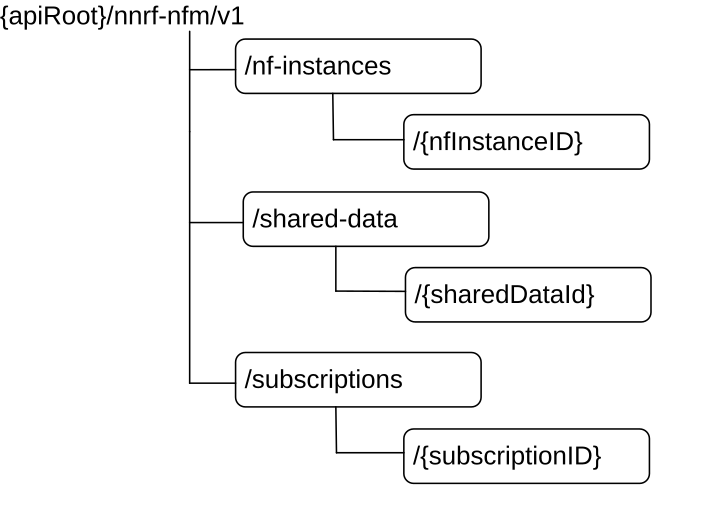

# 6.1.3.1 Overview

The structure of the Resource URIs of the NFManagement service is shown in figure 6.1.3.1-1.

Figure 6.1.3.1-1: Resource URI structure of the NFManagement API

Table 6.1.3.1-1 provides an overview of the resources and applicable HTTP methods.

Table 6.1.3.1-1: Resources and methods overview

<table>
<colgroup>
<col style="width: 16%" />
<col style="width: 42%" />
<col style="width: 10%" />
<col style="width: 30%" />
</colgroup>
<thead>
<tr class="header">
<th>Resource name</th>
<th>Resource URI</th>
<th>HTTP method or custom operation</th>
<th>Description</th>
</tr>
</thead>
<tbody>
<tr class="odd">
<td rowspan="2">
nf-instances

(Store)
</td>
<td rowspan="2">/nf-instances</td>
<td>GET</td>
<td>Read a collection of NF Instances.</td>
</tr>
<tr class="even">
<td>OPTIONS</td>
<td>Discover the communication options supported by the NRF for this resource.</td>
</tr>
<tr class="odd">
<td rowspan="4">
nf-instance

(Document)
</td>
<td rowspan="4">/nf-instances/{nfInstanceID}</td>
<td>GET</td>
<td>Read the profile of a given NF Instance.</td>
</tr>
<tr class="even">
<td>PUT</td>
<td>Register in NRF a new NF Instance, or replace the profile of an existing NF Instance, by providing an NF profile.</td>
</tr>
<tr class="odd">
<td>PATCH</td>
<td>Modify the NF profile of an existing NF Instance.</td>
</tr>
<tr class="even">
<td>DELETE</td>
<td>Deregister from NRF a given NF Instance.</td>
</tr>
<tr class="odd">
<td>
shared-data-store

(Store)
</td>
<td>/shared-data</td>
<td>GET</td>
<td>Read a collection of Shared Data</td>
</tr>
<tr class="even">
<td rowspan="4">
Shared-data

(Document)
</td>
<td rowspan="4">/shared-data/{sharedDataId}</td>
<td>GET</td>
<td>Read Shared Data</td>
</tr>
<tr class="odd">
<td>PUT</td>
<td>Register in NRF new Shared Data, or replace the Shared Data, by providing Shared Data</td>
</tr>
<tr class="even">
<td>PATCH</td>
<td>Modify existing Shared Data</td>
</tr>
<tr class="odd">
<td>DELETE</td>
<td>Delete Shared Data from the NRF</td>
</tr>
<tr class="even">
<td>
subscriptions

(Collection)
</td>
<td>/subscriptions</td>
<td>POST</td>
<td>
Creates a new subscription in NRF to newly registered NF Instances.

Or, if the "Shared-Data-Retrieval" feature is supported, creates a new subscription in NRF to shared data change notifications.
</td>
</tr>
<tr class="odd">
<td rowspan="2">
subscription

(Document)
</td>
<td rowspan="2">/subscriptions/{subscriptionID}</td>
<td>PATCH</td>
<td>
Updates an existing subscription in NRF.

Or, if the "Shared-Data-Retrieval" feature is supported, updates an existing subscription in NRF to shared data change notifications.
</td>
</tr>
<tr class="even">
<td>DELETE</td>
<td>
Deletes an existing subscription from NRF.

Or, if the "Shared-Data-Retrieval" feature is supported, deletes an existing subscription in NRF to shared data change notifications.
</td>
</tr>
<tr class="odd">
<td>Notification Callback</td>
<td>{nfStatusNotificationUri}</td>
<td>POST</td>
<td>
Notify about newly created NF Instances, or about changes of the profile of a given NF Instance.

Or, if the "Shared-Data-Retrieval" feature is supported, notify about shared data changes.
</td>
</tr>
</tbody>
</table>
