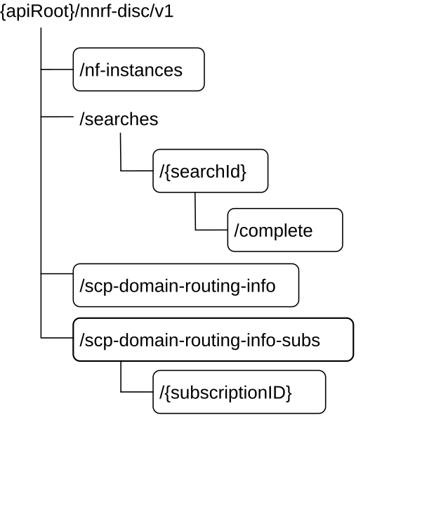

# 6.2.3.1 Overview

The structure of the Resource URIs of the NFDiscovery service is shown in figure 6.2.3.1-1.

Figure 6.2.3.1-1: Resource URI structure of the NFDiscovery API

Table 6.2.3.1-1 provides an overview of the resources and applicable HTTP methods.

Table 6.2.3.1-1: Resources and methods overview

<table>
<colgroup>
<col style="width: 16%" />
<col style="width: 42%" />
<col style="width: 10%" />
<col style="width: 30%" />
</colgroup>
<thead>
<tr class="header">
<th>Resource name</th>
<th>Resource URI</th>
<th>HTTP method or custom operation</th>
<th>Description</th>
</tr>
</thead>
<tbody>
<tr class="odd">
<td>
nf-instances

(Store)
</td>
<td>/nf-instances</td>
<td>GET</td>
<td>Retrieve a collection of NF Instances according to certain filter criteria.</td>
</tr>
<tr class="even">
<td>Stored Search (Document)</td>
<td>/searches/{searchId}</td>
<td>GET</td>
<td>Retrieve a collection of NF Instances, previously stored by NRF as a consequence of a prior search result.</td>
</tr>
<tr class="odd">
<td>Complete Stored Search (Document)</td>
<td>/searches/{searchId}/complete</td>
<td>GET</td>
<td>Retrieve a collection of NF Instances, previously stored by NRF as a consequence of a prior search result, without applying any client restriction on the number of instances (e.g. "limit" or "max-payload-size" query parameters).</td>
</tr>
<tr class="even">
<td>SCP Domain Routing Information (Document)</td>
<td>/scp-domain-routing-info</td>
<td>GET</td>
<td>Retrieve the SCP Domain Routing Information.</td>
</tr>
<tr class="odd">
<td>
SCP Domain Routing Info Subscriptions

(Collection)
</td>
<td>/scp-domain-routing-info-subs</td>
<td>POST</td>
<td>Subscribe to SCP Domain Routing Information change.</td>
</tr>
<tr class="even">
<td>
Individual SCP Domain Routing Info Subscription

(Document)
</td>
<td>/scp-domain-routing-info-subs/{subscriptionID}</td>
<td>DELETE</td>
<td>Unsubscribe to SCP Domain Routing Information change.</td>
</tr>
</tbody>
</table>
